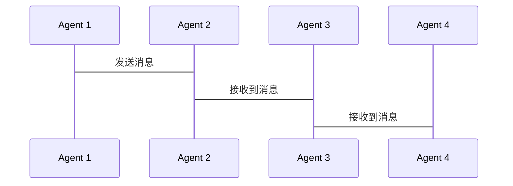

                 


# 多智能体系统在全球供应链风险分析中的角色

> 关键词：多智能体系统、供应链风险分析、全球供应链、人工智能、分布式计算、协作优化

> 摘要：本文探讨多智能体系统在全球供应链风险分析中的角色，分析其在供应链管理中的优势和应用，详细介绍多智能体系统的架构、算法、通信机制及其在供应链风险评估中的具体应用，通过实际案例展示其在优化供应链风险管理中的巨大潜力。

---

# 第一部分: 多智能体系统概述

## 第1章: 多智能体系统基础

### 1.1 多智能体系统的基本概念

#### 1.1.1 多智能体系统的定义
多智能体系统（Multi-Agent System, MAS）是由多个智能体（Agent）组成的分布式系统，每个智能体都是一个能够感知环境、自主决策、协作完成任务的实体。多智能体系统的核心在于智能体之间的协作与通信，通过分布式计算实现复杂的任务目标。

#### 1.1.2 多智能体系统的特征
- **自主性**：每个智能体能够自主决策。
- **反应性**：智能体能够实时感知环境并做出反应。
- **协作性**：多个智能体通过协作完成共同目标。
- **分布性**：智能体分布在不同的地理位置或计算节点上。

#### 1.1.3 多智能体系统的分类
- **简单反射型智能体**：基于当前感知做出反应，不依赖历史信息。
- **基于模型的反射型智能体**：结合内部模型和外部环境信息进行决策。
- **目标驱动型智能体**：根据目标驱动行为，具有明确的目标导向性。
- **效用驱动型智能体**：通过最大化效用来决策。

### 1.2 多智能体系统的优势

#### 1.2.1 分布式计算的优势
- **容错性**：分布式计算能够容忍部分节点的故障。
- **可扩展性**：通过增加智能体数量，系统能够扩展处理能力。
- **灵活性**：分布式架构能够适应不同的任务需求。

#### 1.2.2 多智能体系统的协作机制
- **协作协议**：定义智能体之间的通信和协作规则。
- **协作规则**：规范智能体在协作过程中的行为。
- **协作优化**：通过优化协作机制提高系统的整体效率。

#### 1.2.3 多智能体系统的灵活性
- **任务分配**：智能体可以根据任务需求动态分配角色和任务。
- **环境适应**：系统能够适应不同的环境变化。

### 1.3 多智能体系统在供应链中的应用

#### 1.3.1 供应链管理中的多智能体系统
供应链管理涉及多个环节，包括采购、生产、物流、库存管理等。多智能体系统可以通过智能体协作优化这些环节，提高供应链的整体效率。

#### 1.3.2 多智能体系统在风险分析中的作用
供应链风险分析是供应链管理的重要组成部分，多智能体系统可以通过实时监控和智能体协作，快速识别和应对供应链中的各种风险。

#### 1.3.3 多智能体系统与全球供应链的关系
全球供应链涉及多个地理位置和不同的参与者，多智能体系统通过分布式计算和协作机制，能够有效管理全球供应链的复杂性。

---

## 第2章: 供应链风险分析基础

### 2.1 供应链风险的定义与分类

#### 2.1.1 供应链风险的定义
供应链风险是指在供应链的各个环节中可能出现的不确定性，这些不确定性可能影响供应链的正常运作，导致成本增加、交货延迟等问题。

#### 2.1.2 供应链风险的分类
供应链风险可以分为以下几类：
- **供给风险**：供应商无法按时交付原材料。
- **需求风险**：市场需求波动导致库存积压或缺货。
- **物流风险**：物流中断或运输延迟。
- **价格风险**：原材料价格波动影响成本。
- **政治风险**：政治动荡或贸易政策变化影响供应链。

#### 2.1.3 供应链风险的影响
供应链风险可能导致以下问题：
- **成本增加**：库存积压或频繁调整导致成本上升。
- **交货延迟**：无法按时交付产品影响客户满意度。
- **声誉损失**：供应链中断可能导致企业声誉受损。

### 2.2 供应链风险的建模方法

#### 2.2.1 风险评估模型
风险评估模型用于量化供应链中的各种风险，通常包括以下步骤：
1. **风险识别**：识别可能影响供应链的风险因素。
2. **风险评估**：评估每个风险的发生概率和影响程度。
3. **风险排序**：根据风险的综合指标对风险进行排序。

#### 2.2.2 风险传播模型
风险传播模型用于分析风险在供应链中的传播路径，帮助确定哪些环节是风险的来源或敏感点。

#### 2.2.3 风险缓解模型
风险缓解模型用于制定应对风险的策略，包括风险规避、风险转移、风险减轻等。

### 2.3 供应链风险分析的挑战

#### 2.3.1 数据获取的挑战
供应链涉及多个参与者，数据分散且难以整合，增加了风险分析的难度。

#### 2.3.2 模型复杂性的挑战
供应链系统的复杂性使得建模和分析变得更加困难，需要考虑多个变量和非线性关系。

#### 2.3.3 实时响应的挑战
供应链风险往往具有突发性，需要系统能够实时响应，这对系统的实时性和响应能力提出了更高的要求。

---

## 第3章: 多智能体系统的架构与设计

### 3.1 多智能体系统的架构设计

#### 3.1.1 分层架构
分层架构将系统划分为多个层次，每个层次负责不同的功能。例如，感知层负责数据采集，决策层负责策略制定，执行层负责任务执行。

#### 3.1.2 分布式架构
分布式架构将智能体分布在不同的节点上，每个节点负责特定的任务，通过通信机制实现协作。

#### 3.1.3 协作式架构
协作式架构强调智能体之间的协作，通过共享信息和资源，共同完成任务目标。

### 3.2 多智能体系统的通信机制

#### 3.2.1 通信协议
通信协议定义了智能体之间的通信规则，包括消息格式、通信频率和错误处理机制。

#### 3.2.2 信息交换
信息交换是智能体协作的基础，通过信息共享实现任务的协调。

#### 3.2.3 事件驱动
事件驱动机制通过检测特定事件触发智能体的响应，提高系统的实时性和响应能力。

### 3.3 多智能体系统的协作策略

#### 3.3.1 协作协议
协作协议定义了智能体之间的协作规则，包括任务分配、资源分配和结果共享。

#### 3.3.2 协作规则
协作规则规范了智能体在协作过程中的行为，确保协作的顺利进行。

#### 3.3.3 协作优化
通过优化协作机制，提高系统的整体效率和响应能力。

---

## 第4章: 多智能体系统的算法与实现

### 4.1 多智能体系统的算法基础

#### 4.1.1 分布式计算算法
分布式计算算法用于在多个节点上并行处理任务，提高计算效率。

#### 4.1.2 协作算法
协作算法用于智能体之间的协作，例如任务分配、资源分配和结果共享。

#### 4.1.3 优化算法
优化算法用于优化系统性能，例如路径优化、资源分配优化等。

### 4.2 多智能体系统的实现步骤

#### 4.2.1 系统设计
系统设计包括需求分析、功能设计和架构设计。

#### 4.2.2 系统实现
系统实现包括编码实现、测试和调试。

#### 4.2.3 系统测试
系统测试包括功能测试、性能测试和安全性测试。

### 4.3 多智能体系统的数学模型

#### 4.3.1 系统模型
系统模型用于描述多智能体系统的整体结构和功能。

#### 4.3.2 算法模型
算法模型用于描述多智能体系统的具体算法实现。

#### 4.3.3 优化模型
优化模型用于优化多智能体系统的性能。

---

## 第5章: 多智能体系统在供应链风险分析中的具体应用

### 5.1 多智能体系统的通信机制在供应链中的应用

#### 5.1.1 供应链中的信息共享
通过多智能体系统的通信机制，实现供应链中各环节的信息共享，提高信息的透明度和实时性。

#### 5.1.2 供应链中的事件驱动
通过事件驱动机制，快速响应供应链中的突发事件，例如供应商延迟交货或市场需求突变。

### 5.2 多智能体系统的协作策略在供应链中的应用

#### 5.2.1 供应链中的任务分配
通过协作策略，智能体可以根据任务需求动态分配任务，提高任务执行效率。

#### 5.2.2 供应链中的资源分配
通过协作策略，智能体可以合理分配资源，避免资源浪费和冲突。

#### 5.2.3 供应链中的结果共享
通过协作策略，智能体可以共享任务结果，提高系统的整体效率。

### 5.3 多智能体系统的算法在供应链中的应用

#### 5.3.1 供应链中的路径优化
通过优化算法，实现供应链中的路径优化，降低物流成本。

#### 5.3.2 供应链中的库存优化
通过优化算法，实现供应链中的库存优化，减少库存积压和缺货风险。

#### 5.3.3 供应链中的需求预测
通过协作算法，实现供应链中的需求预测，提高供应链的响应能力。

---

## 第6章: 项目实战

### 6.1 项目背景与目标

#### 6.1.1 项目背景
本项目旨在通过多智能体系统优化全球供应链的风险分析和管理，提高供应链的抗风险能力和运营效率。

#### 6.1.2 项目目标
- **实现多智能体系统的通信机制**：通过通信机制实现智能体之间的信息共享和协作。
- **实现多智能体系统的协作策略**：通过协作策略优化供应链中的任务分配和资源分配。
- **实现多智能体系统的优化算法**：通过优化算法实现供应链中的路径优化和库存优化。

### 6.2 项目环境配置

#### 6.2.1 系统需求
- **操作系统**：Linux/Windows/MacOS
- **编程语言**：Python
- **开发工具**：PyCharm/VSCode
- **依赖库**：numpy, pandas, matplotlib, networkx

#### 6.2.2 环境安装
```bash
pip install numpy pandas matplotlib networkx
```

### 6.3 项目核心代码实现

#### 6.3.1 多智能体系统的通信机制
```python
class Agent:
    def __init__(self, id):
        self.id = id
        self.neighbors = {}
        
    def send_message(self, message, recipient):
        # 消息传递到目标智能体
        recipient.receive_message(message)
        
    def receive_message(self, message):
        # 处理接收到的消息
        print(f"Agent {self.id} received message: {message}")
```

#### 6.3.2 多智能体系统的协作策略
```python
class CollaborativeStrategy:
    def __init__(self, agents):
        self.agents = agents
        
    def distribute_task(self, task):
        # 任务分配到不同的智能体
        for agent in self.agents:
            agent.receive_task(task)
            
    def optimize_resource(self, resources):
        # 资源优化分配
        for agent in self.agents:
            agent.allocate_resource(resources)
```

#### 6.3.3 多智能体系统的优化算法
```python
import networkx as nx

class OptimizationAlgorithm:
    def __init__(self, graph):
        self.graph = graph
        
    def optimize_path(self, start, end):
        # 使用Dijkstra算法优化路径
        shortest_path = nx.shortest_path(self.graph, start, end)
        return shortest_path
```

### 6.4 项目系统设计与实现

#### 6.4.1 系统设计


#### 6.4.2 系统实现


---

## 第7章: 总结与展望

### 7.1 总结
多智能体系统在全球供应链风险分析中的角色不可忽视，通过分布式计算和协作机制，多智能体系统能够有效优化供应链的管理效率和抗风险能力。

### 7.2 展望
未来，随着人工智能和大数据技术的不断发展，多智能体系统在全球供应链中的应用将更加广泛和深入，为供应链的风险分析和优化提供更多可能性。

---

作者：AI天才研究院/AI Genius Institute & 禅与计算机程序设计艺术 /Zen And The Art of Computer Programming

