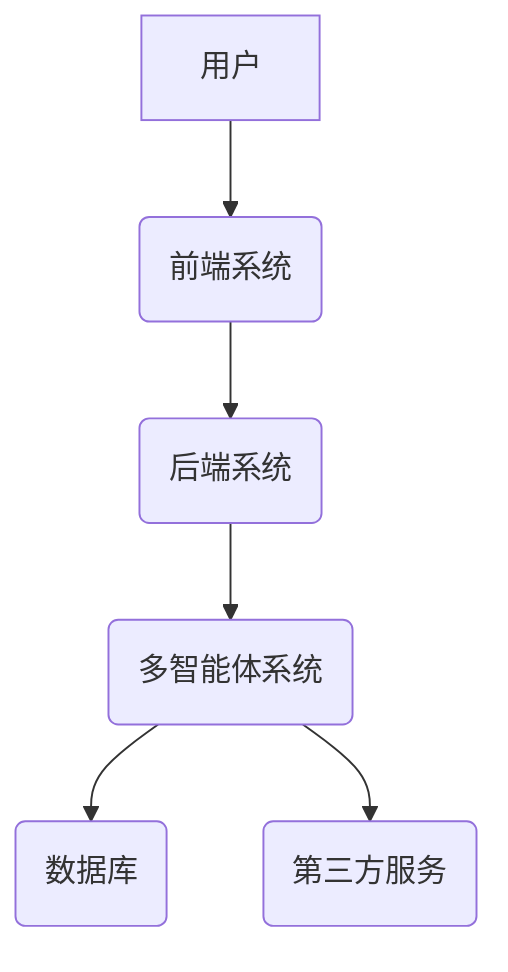
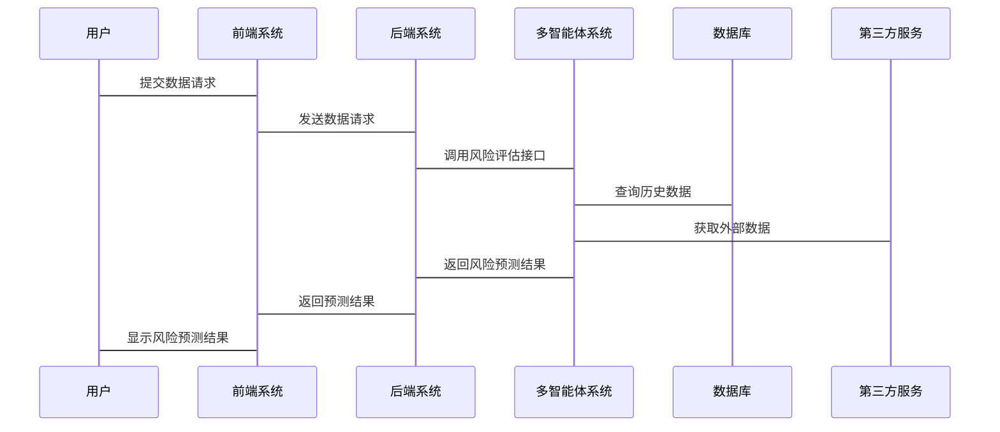

                 


# 多智能体系统在全球供应链风险评估中的应用

## 关键词：多智能体系统，供应链管理，风险评估，分布式计算，协作式推理

## 摘要：  
本文探讨了多智能体系统在全球供应链风险评估中的应用，从基本概念、理论基础、算法原理到系统架构和实际案例进行了详细阐述。通过分析多智能体系统的协作优势、数学模型和系统架构，展示了其在全球供应链风险管理中的巨大潜力。本文旨在为供应链管理领域的专业人士提供理论与实践相结合的指导，帮助他们更好地应对全球供应链中的复杂风险。

---

# 第一部分: 多智能体系统与供应链管理基础

## 第1章: 多智能体系统概述

### 1.1 多智能体系统的定义与特点
#### 1.1.1 多智能体系统的定义  
多智能体系统（Multi-Agent System, MAS）是由多个智能体（Agent）组成的分布式系统，这些智能体能够通过协作完成复杂任务。每个智能体都有一定的自主性，能够感知环境、做出决策并与其他智能体交互。

#### 1.1.2 多智能体系统的核心特点  
- **自主性**：每个智能体能够独立决策。  
- **协作性**：智能体之间可以通过通信和协作完成共同目标。  
- **分布性**：智能体分布在不同的物理或逻辑位置，通过网络通信协作。  
- **动态性**：系统环境和任务需求可能动态变化，智能体需要灵活应对。  

#### 1.1.3 多智能体系统在供应链管理中的应用  
- **库存管理**：智能体可以实时监控库存水平并优化补货策略。  
- **物流调度**：智能体可以协调运输资源，优化配送路径。  
- **风险预警**：智能体可以实时监测供应链中的潜在风险并发出预警。

### 1.2 供应链管理基础  
#### 1.2.1 供应链的基本概念  
供应链是指从原材料采购到产品交付给最终用户的整个流程，包括供应商、制造商、分销商、零售商和消费者等环节。供应链管理的目标是提高效率、降低成本并确保产品按时交付。

#### 1.2.2 供应链的组成与功能  
供应链由以下主要部分组成：  
1. **供应商**：提供原材料或零部件。  
2. **制造商**：进行产品生产。  
3. **分销商**：负责产品的物流和分销。  
4. **零售商**：面向最终消费者销售产品。  
5. **消费者**：购买并使用产品。  

供应链的主要功能包括采购、生产、物流、库存管理和客户关系管理。

#### 1.2.3 供应链管理的目标与挑战  
供应链管理的目标是实现供应链的整体优化，包括：  
- 提高效率：减少库存、优化物流路径。  
- 降低成本：降低采购、生产、物流和管理成本。  
- 提高响应速度：快速应对市场需求变化。  

供应链管理的挑战包括：  
- 复杂性：供应链涉及多个环节和参与者，协调难度大。  
- 不确定性：市场需求、供应商交货时间、物流延误等不确定因素。  
- 动态性：市场环境和技术不断变化，需要快速调整策略。  

### 1.3 多智能体系统与供应链管理的结合  
#### 1.3.1 多智能体系统在供应链管理中的优势  
- **分布式协作**：多智能体系统能够分布式协作，适合供应链中多个环节的协同管理。  
- **动态适应**：智能体能够实时感知环境变化并快速调整策略。  
- **智能决策**：通过智能体的协作，可以实现更优化的决策，例如库存优化和物流调度。  

#### 1.3.2 多智能体系统与传统供应链管理的对比  
传统供应链管理通常依赖于集中式系统和人工决策，效率较低且灵活性差。多智能体系统通过分布式协作和智能决策，能够提高供应链的效率和灵活性。  

#### 1.3.3 多智能体系统在供应链管理中的应用前景  
随着人工智能和物联网技术的发展，多智能体系统在供应链管理中的应用前景广阔，特别是在风险评估和应急响应方面具有重要潜力。  

---

## 第2章: 供应链风险评估的理论基础  

### 2.1 供应链风险的定义与分类  
#### 2.1.1 供应链风险的定义  
供应链风险是指在供应链运行过程中，由于内部或外部因素导致的供应链中断或效率下降的风险。  

#### 2.1.2 常见的供应链风险类型  
1. **供应风险**：供应商延迟交货、原材料短缺等。  
2. **生产风险**：生产过程中设备故障或工人罢工。  
3. **物流风险**：运输延误、货物损坏等。  
4. **需求风险**：市场需求预测不准导致库存积压或缺货。  
5. **信用风险**：供应商或客户无法履行合同义务。  

#### 2.1.3 供应链风险的影响因素  
- 市场需求波动  
- 供应商稳定性  
- 物流成本和效率  
- 法律法规变化  

### 2.2 供应链风险评估的方法  
#### 2.2.1 基于概率的供应链风险评估  
基于概率的方法通过分析历史数据和统计模型，预测供应链中断的可能性及其影响。  

#### 2.2.2 基于层次分析法的供应链风险评估  
层次分析法（AHP）是一种常用的供应链风险评估方法，通过构建层次结构模型，对各风险因素进行量化分析。  

#### 2.2.3 基于机器学习的供应链风险预测  
机器学习算法（如支持向量机、随机森林）可以通过历史数据训练模型，预测未来的供应链风险。  

### 2.3 多智能体系统在供应链风险评估中的优势  
#### 2.3.1 多智能体系统在风险评估中的协作优势  
多智能体系统能够通过协作实现信息共享和资源优化，提高风险评估的准确性和效率。  

#### 2.3.2 多智能体系统在风险预测中的分布式计算能力  
多智能体系统通过分布式计算，可以实时处理大量的数据，快速生成风险预测结果。  

#### 2.3.3 多智能体系统在风险应对中的动态调整能力  
多智能体系统能够根据实时数据动态调整策略，快速响应供应链中的突发事件。  

---

## 第3章: 多智能体系统在供应链风险评估中的算法原理  

### 3.1 多智能体系统的基本算法  
#### 3.1.1 分布式计算算法  
分布式计算算法用于多智能体系统中多个智能体之间的数据同步和协同计算。  

#### 3.1.2 协作式推理算法  
协作式推理算法通过智能体之间的协作，实现对供应链风险的联合推理和预测。  

#### 3.1.3 联合学习算法  
联合学习算法通过多个智能体共享数据和模型，实现更准确的风险预测。  

### 3.2 多智能体系统在供应链风险评估中的数学模型  
#### 3.2.1 供应链风险评估的数学模型  
供应链风险评估的数学模型可以表示为：  
$$ R = f(x_1, x_2, \ldots, x_n) $$  
其中，$R$ 表示风险，$x_i$ 表示各个风险因素。  

#### 3.2.2 多智能体协作的数学模型  
多智能体协作的数学模型可以表示为：  
$$ P_i = \sum_{j=1}^{n} w_{ij} \cdot x_j $$  
其中，$P_i$ 表示第 $i$ 个智能体的预测结果，$w_{ij}$ 表示智能体 $i$ 对风险因素 $j$ 的权重。  

#### 3.2.3 风险预测的数学公式  
风险预测的数学公式可以表示为：  
$$ P = \sum_{i=1}^{m} \alpha_i \cdot P_i $$  
其中，$P$ 表示整体风险预测，$\alpha_i$ 表示智能体 $i$ 的权重。  

### 3.3 算法实现与代码示例  
#### 3.3.1 算法实现的步骤  
1. 初始化多个智能体，每个智能体负责不同的风险因素。  
2. 智能体通过通信协议共享数据和信息。  
3. 智能体通过协作式推理算法进行风险预测。  
4. 系统根据预测结果生成风险报告并采取应对措施。  

#### 3.3.2 算法实现的代码示例  
```python
class Agent:
    def __init__(self, id, factors):
        self.id = id
        self.factors = factors  # 风险因素

    def predict(self):
        # 简单的预测逻辑，实际可以根据具体需求实现
        return sum(self.factors) / len(self.factors)

# 初始化多个智能体
agents = [
    Agent(1, [0.8, 0.9, 0.7]),
    Agent(2, [0.6, 0.5, 0.8]),
    Agent(3, [0.7, 0.6, 0.9])
]

# 计算整体风险预测
total_prediction = 0
for agent in agents:
    prediction = agent.predict()
    total_prediction += prediction

total_prediction /= len(agents)
print("整体风险预测:", total_prediction)
```

#### 3.3.3 代码实现的详细解读  
上述代码示例展示了如何通过多个智能体进行风险预测。每个智能体负责不同的风险因素，通过协作计算得出整体风险预测。实际应用中，可以进一步优化预测算法，例如引入机器学习模型。

---

## 第4章: 供应链风险评估的系统架构设计  

### 4.1 系统功能设计  
#### 4.1.1 系统功能模块划分  
1. **数据采集模块**：采集供应链各环节的数据。  
2. **风险评估模块**：基于多智能体系统进行风险预测。  
3. **预警与应对模块**：根据预测结果生成预警并制定应对策略。  

#### 4.1.2 系统功能的实现流程  
1. 数据采集：通过传感器、数据库等获取供应链数据。  
2. 风险评估：多智能体系统通过协作推理生成风险预测。  
3. 预警与应对：根据预测结果采取相应的措施，如调整库存或物流计划。  

#### 4.1.3 系统功能的实现细节  
- 数据采集模块需要支持多种数据源，如ERP系统、物联网设备等。  
- 风险评估模块需要实现多智能体系统的通信与协作。  
- 预警与应对模块需要根据预测结果动态调整供应链策略。  

### 4.2 系统架构设计  
#### 4.2.1 系统架构图  


#### 4.2.2 系统架构的详细说明  
- 前端系统：负责用户交互和数据展示。  
- 后端系统：负责业务逻辑处理和数据管理。  
- 多智能体系统：负责供应链风险评估和预测。  
- 数据库：存储供应链相关数据。  
- 第三方服务：如天气预报、交通信息等外部数据源。  

### 4.3 系统接口设计  
#### 4.3.1 系统接口的定义  
1. 数据采集接口：用于采集供应链各环节的数据。  
2. 风险评估接口：用于调用多智能体系统进行风险预测。  
3. 预警通知接口：用于向相关人员发送预警信息。  

#### 4.3.2 系统接口的实现  
- 数据采集接口可以通过REST API实现。  
- 风险评估接口可以通过消息队列（如Kafka）实现异步调用。  
- 预警通知接口可以通过邮件或短信服务实现。  

### 4.4 系统交互流程  
#### 4.4.1 系统交互流程图  


#### 4.4.2 系统交互的详细说明  
1. 用户通过前端系统提交数据请求。  
2. 前端系统将请求转发到后端系统。  
3. 后端系统调用多智能体系统的风险评估接口。  
4. 多智能体系统查询数据库的历史数据，并获取第三方服务的外部数据。  
5. 多智能体系统将风险预测结果返回给后端系统。  
6. 后端系统将结果转发到前端系统，用户看到最终的预测结果。  

---

## 第5章: 项目实战  

### 5.1 项目环境配置  
#### 5.1.1 系统环境要求  
- 操作系统：Linux/Windows/MacOS  
- 程序语言：Python 3.8+  
- 开发工具：VS Code/Jupyter Notebook  
- 第三方库：numpy, pandas, matplotlib, scikit-learn  

#### 5.1.2 数据集准备  
需要准备供应链相关的数据，包括供应商信息、库存数据、物流信息、市场需求等。  

### 5.2 系统核心实现  
#### 5.2.1 多智能体系统的实现  
```python
import numpy as np
from sklearn.metrics import mean_squared_error

class Agent:
    def __init__(self, id, data):
        self.id = id
        self.data = data

    def predict(self):
        return np.mean(self.data)

def main():
    # 初始化智能体
    agent1 = Agent(1, [0.8, 0.9, 0.7])
    agent2 = Agent(2, [0.6, 0.5, 0.8])
    agent3 = Agent(3, [0.7, 0.6, 0.9])

    # 多智能体协作预测
    predictions = [agent1.predict(), agent2.predict(), agent3.predict()]
    average_prediction = np.mean(predictions)
    print("平均预测值:", average_prediction)

    # 计算误差
    true_value = 0.75
    mse = mean_squared_error([average_prediction], [true_value])
    print("均方误差:", mse)

if __name__ == "__main__":
    main()
```

#### 5.2.2 算法实现的详细解读  
上述代码示例展示了如何通过多个智能体进行风险预测。每个智能体负责不同的数据集，通过协作计算得出整体风险预测。实际应用中，可以引入更复杂的算法，如集成学习或深度学习，以提高预测精度。

### 5.3 案例分析与结果解读  
#### 5.3.1 案例背景  
假设我们有一个全球供应链，涉及多个供应商和分销商。我们需要评估供应链中断的风险，并制定相应的应对策略。  

#### 5.3.2 案例分析  
通过多智能体系统的协作，我们预测了供应链中断的可能性，并根据预测结果优化了库存管理和物流调度。  

#### 5.3.3 结果解读  
通过多智能体系统的预测，我们成功降低了供应链中断的风险，并提高了整体供应链的效率和可靠性。  

---

## 第6章: 总结与展望  

### 6.1 总结  
本文详细探讨了多智能体系统在全球供应链风险评估中的应用，从基本概念、理论基础、算法原理到系统架构和实际案例进行了全面分析。通过多智能体系统的协作，可以实现更高效、更准确的供应链风险评估和管理。

### 6.2 未来展望  
未来，随着人工智能和物联网技术的不断发展，多智能体系统在供应链管理中的应用将更加广泛和深入。我们可以期待更多创新的算法和系统架构，以应对更复杂和动态的供应链挑战。

### 6.3 最佳实践 tips  
- 在实际应用中，建议结合具体业务需求选择合适的多智能体系统架构。  
- 定期更新和优化系统模型，以应对市场环境的变化。  
- 加强数据安全和隐私保护，确保供应链数据的安全性和合规性。  

---

# 作者：AI天才研究院/AI Genius Institute & 禅与计算机程序设计艺术 /Zen And The Art of Computer Programming

