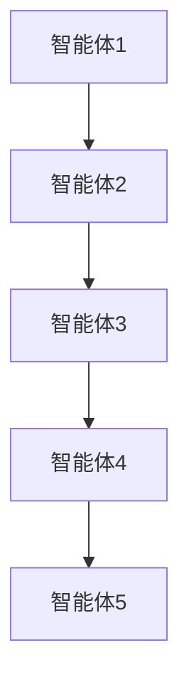
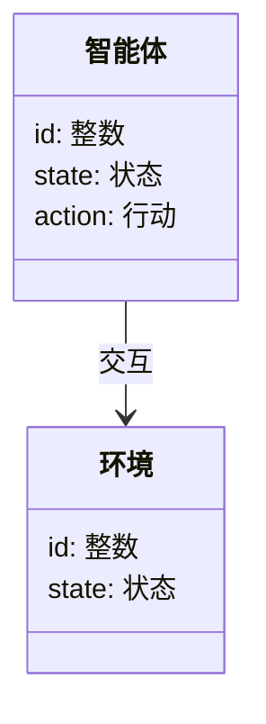
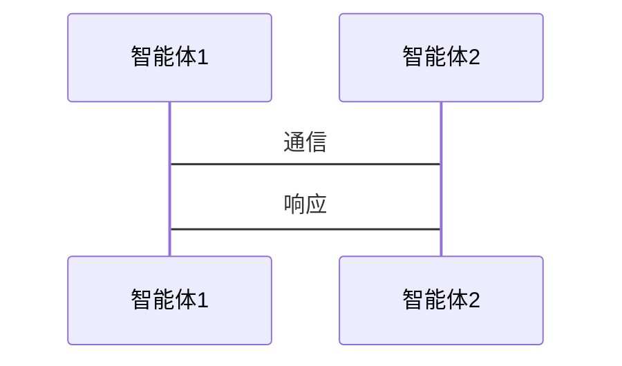

                 


# 多智能体系统在全球监管环境分析中的角色

**关键词**：多智能体系统、全球监管环境分析、智能体、监管分析、分布式计算、协调机制、数学模型

**摘要**：本文探讨多智能体系统在全球监管环境分析中的关键作用。通过介绍多智能体系统的基本概念、算法原理和系统架构，结合实际案例分析，深入剖析其在监管环境分析中的优势与挑战。文章旨在帮助读者理解如何利用多智能体系统提升监管效率和准确性。

---

# 第1章: 多智能体系统与全球监管环境分析概述

## 1.1 多智能体系统的基本概念

### 1.1.1 智能体的定义与分类

智能体（Agent）是指具有自主性、反应性和协作性的实体，能够感知环境并采取行动以实现目标。根据智能体的智能水平，可以分为反应式智能体和认知式智能体。反应式智能体基于当前感知做出反应，而认知式智能体具备推理和规划能力。

| 智能体类型 | 定义 | 特性 |
|------------|------|------|
| 反应式智能体 | 基于当前感知做出反应 | 实时响应、简单决策 |
| 认知式智能体 | 具备推理和规划能力 | 复杂决策、长期目标 |

### 1.1.2 多智能体系统的定义与特点

多智能体系统（MAS）由多个智能体组成，通过协同工作完成复杂任务。其特点包括分布式性、协作性和动态性。分布式性指智能体独立运行，协作性指智能体之间通过通信和协调实现共同目标，动态性指系统能够适应环境变化。

### 1.1.3 全球监管环境分析的背景与意义

全球监管环境涉及金融、法律、安全等多个领域，监管对象复杂且动态变化。传统的监管方法难以应对跨领域、多主体的复杂问题，而多智能体系统通过分布式计算和协作机制，能够高效处理这些复杂问题。

## 1.2 多智能体系统在监管环境分析中的应用

### 1.2.1 监管环境分析的核心问题

监管环境分析的核心问题包括实时监控、风险评估、跨领域协同和隐私保护。实时监控需要快速响应，风险评估需要准确预测，跨领域协同需要不同部门的合作，隐私保护则需要在共享数据的同时确保安全性。

### 1.2.2 多智能体系统在监管环境分析中的优势

多智能体系统的优势在于其分布式计算和协作机制。分布式计算能够并行处理大量数据，协作机制能够协调不同智能体的任务，从而提高监管效率和准确性。

### 1.2.3 全球化监管环境的复杂性与挑战

全球化监管环境的复杂性主要体现在监管规则的多样性和动态变化上。不同国家和地区的监管规则差异较大，且随着经济全球化的发展，监管规则也在不断变化。这给监管环境分析带来了巨大挑战。

---

# 第2章: 多智能体系统的核心概念与原理

## 2.1 智能体的定义与属性

### 2.1.1 智能体的定义

智能体是能够感知环境并采取行动以实现目标的实体。智能体可以是软件程序、机器人或其他具备智能特性的实体。

### 2.1.2 智能体的属性

智能体具有以下属性：
- **自主性**：智能体能够自主决策。
- **反应性**：智能体能够实时响应环境变化。
- **协作性**：智能体能够与其他智能体协作。

### 2.1.3 智能体的分类

智能体可以根据智能水平分为反应式智能体和认知式智能体。反应式智能体基于当前感知做出反应，而认知式智能体具备推理和规划能力。

## 2.2 多智能体系统的基本原理

### 2.2.1 多智能体系统的组成要素

多智能体系统由以下要素组成：
- 智能体：系统的主体。
- 环境：智能体所处的环境。
- 通信机制：智能体之间的通信方式。
- 协调机制：智能体之间的协作方式。

### 2.2.2 智能体之间的交互机制

智能体之间的交互机制包括通信和协调。通信是智能体之间交换信息的方式，协调是智能体之间达成一致的方式。

### 2.2.3 多智能体系统的动态性与复杂性

多智能体系统的动态性与复杂性主要体现在智能体的自主性和环境的不确定性上。智能体的自主性使其能够在没有中央控制的情况下自主决策，环境的不确定性则要求智能体具备适应性。

---

# 第3章: 多智能体系统在监管环境分析中的应用

## 3.1 监管环境分析的核心问题

### 3.1.1 监管目标的多样性

监管目标的多样性是指监管对象涉及多个领域，监管目标也各不相同。例如，金融监管的目标是防范金融风险，法律监管的目标是确保法律合规。

### 3.1.2 监管对象的复杂性

监管对象的复杂性主要体现在监管对象的数量和类型上。例如，金融市场的监管对象包括银行、证券公司、保险公司等金融机构。

### 3.1.3 监管规则的动态性

监管规则的动态性是指监管规则会随着时间和环境的变化而变化。例如，金融危机爆发后，监管机构可能会出台新的监管规则。

## 3.2 多智能体系统在监管环境分析中的具体应用

### 3.2.1 实时监控与风险评估

多智能体系统可以通过实时监控和风险评估来预防和应对监管环境中的风险。例如，金融监管中的实时监控可以帮助监管机构及时发现和处理金融市场的异常波动。

### 3.2.2 跨领域协同监管

多智能体系统可以通过跨领域协同监管来提高监管效率。例如，金融、法律和安全领域的智能体可以协同工作，共同应对跨国金融犯罪。

### 3.2.3 数据共享与隐私保护

多智能体系统可以通过数据共享与隐私保护来实现监管信息的共享。例如，不同监管机构的智能体可以在共享监管信息的同时，确保数据的安全性和隐私性。

## 3.3 典型案例分析

### 3.3.1 案例背景介绍

以金融监管为例，金融市场的复杂性和不确定性使得传统的监管方法难以应对。多智能体系统可以通过实时监控和风险评估来预防和应对金融市场的风险。

### 3.3.2 案例分析与解读

在金融监管中，智能体可以实时监控市场数据，识别异常交易，并及时通知监管机构。此外，智能体还可以通过分析历史数据，预测未来的市场趋势，从而帮助监管机构制定更加科学的监管策略。

---

# 第4章: 多智能体系统的算法原理与数学模型

## 4.1 分布式计算与智能体协调

### 4.1.1 分布式计算的基本原理

分布式计算是指在多个计算节点上进行计算的一种方式。多智能体系统中的分布式计算可以通过并行计算和分布式算法来实现。

### 4.1.2 智能体之间的协调机制

智能体之间的协调机制包括一致性算法和分布式共识算法。一致性算法用于确保系统中的智能体状态一致，分布式共识算法用于在分布式系统中达成共识。

### 4.1.3 算法流程图

以下是一个简单的分布式计算流程图：



## 4.2 协调机制与数学模型

### 4.2.1 协调机制的数学模型

协调机制可以通过数学模型来描述。例如，一致性算法可以通过以下公式来表示：

$$ x_i = x_j $$

其中，\( x_i \) 和 \( x_j \) 分别表示智能体i和智能体j的状态。

### 4.2.2 分布式共识算法

分布式共识算法是多智能体系统中的重要算法之一。例如，Paxos算法和Raft算法是常用的分布式共识算法。

---

# 第5章: 多智能体系统的系统架构设计

## 5.1 系统功能设计

### 5.1.1 领域模型设计

领域模型设计是多智能体系统设计的重要部分。领域模型可以通过类图来表示。以下是一个简单的类图：



### 5.1.2 系统架构设计

系统架构设计可以通过架构图来表示。以下是一个简单的架构图：


### 5.1.3 系统接口设计

系统接口设计可以通过序列图来表示。以下是一个简单的序列图：



## 5.2 系统实现与优化

### 5.2.1 系统实现

多智能体系统的实现可以通过分布式计算和通信机制来实现。例如，可以使用消息队列来实现智能体之间的通信。

### 5.2.2 系统优化

系统优化可以通过负载均衡和容错机制来实现。负载均衡可以提高系统的性能，容错机制可以提高系统的可靠性。

---

# 第6章: 多智能体系统的项目实战

## 6.1 项目背景与目标

### 6.1.1 项目背景

以金融监管为例，金融市场的复杂性和不确定性使得传统的监管方法难以应对。多智能体系统可以通过实时监控和风险评估来预防和应对金融市场的风险。

### 6.1.2 项目目标

项目目标是通过多智能体系统实现金融市场的实时监控和风险评估。

## 6.2 项目实现

### 6.2.1 环境安装

项目实现需要安装以下环境：
- Python 3.8+
- 分布式计算框架（如Dask）
- 通信库（如ZeroMQ）

### 6.2.2 核心代码实现

以下是核心代码实现：

```python
import zmq

context = zmq.Context()
socket = context.socket(zmq.PUB)
socket.bind("tcp://*:5555")

while True:
    message = input("请输入消息：")
    socket.send_string(message)
```

### 6.2.3 系统功能实现

系统功能实现包括实时监控、风险评估和数据共享。

## 6.3 项目总结

### 6.3.1 项目成果

项目成果是实现了一个基于多智能体系统的金融监管系统，能够实时监控金融市场数据并进行风险评估。

### 6.3.2 经验总结

通过本项目，我们学会了如何设计和实现多智能体系统，以及如何在实际应用中解决问题。

---

# 第7章: 总结与展望

## 7.1 多智能体系统在监管环境分析中的总结

### 7.1.1 多智能体系统的优势

多智能体系统的优势在于其分布式计算和协作机制，能够高效处理复杂问题。

### 7.1.2 监管环境分析的未来展望

未来，随着人工智能和大数据技术的发展，多智能体系统在监管环境分析中的应用将更加广泛和深入。

## 7.2 最佳实践与注意事项

### 7.2.1 最佳实践

- 选择合适的分布式计算框架。
- 确保智能体之间的通信安全。
- 定期更新和优化系统。

### 7.2.2 注意事项

- 注意系统的可扩展性。
- 确保系统的容错性。
- 定期进行系统维护。

---

**作者：AI天才研究院/AI Genius Institute & 禅与计算机程序设计艺术 /Zen And The Art of Computer Programming**

---

这篇文章详细探讨了多智能体系统在全球监管环境分析中的角色，从基本概念到具体应用，再到算法原理和系统架构设计，最后通过项目实战和总结展望，全面阐述了多智能体系统在监管环境分析中的优势和挑战。希望这篇文章能够为读者提供有价值的信息和启发。

