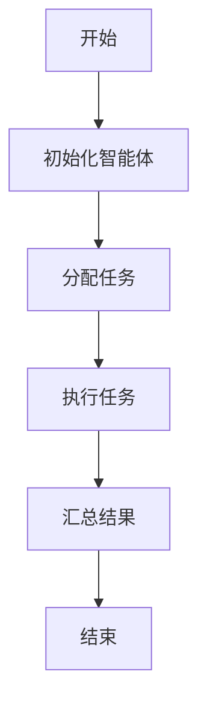
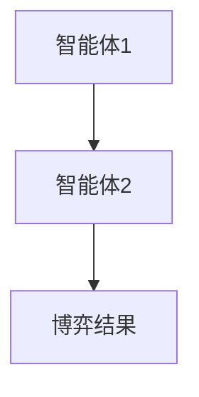
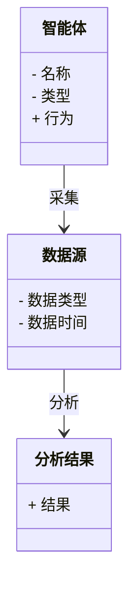
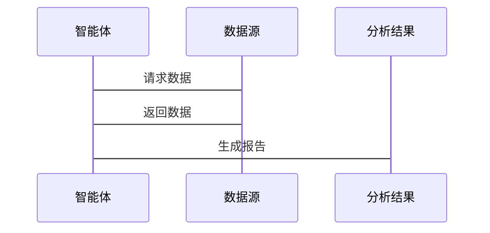
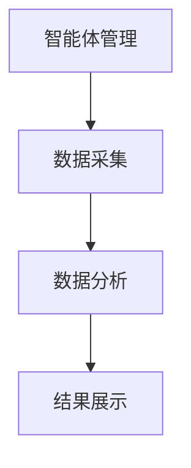

                 


# 多智能体系统在全球贸易流动分析中的应用：把握宏观趋势

## 关键词
多智能体系统, 全球贸易流动分析, 宏观趋势, 分布式计算, 博弈论模型, 贸易规则, 实体关系图

## 摘要
本文详细探讨了多智能体系统在全球贸易流动分析中的应用，通过系统化的分析与设计，展示了如何利用多智能体系统的分布式计算和协作能力，高效解决全球贸易流动分析中的复杂问题。文章从核心概念、算法原理、系统架构到项目实战，层层深入，结合丰富的图表和代码示例，为读者提供了一套完整的解决方案，帮助其理解并掌握多智能体系统在这一领域的应用。

---

# 第1章 多智能体系统与全球贸易流动分析概述

## 1.1 多智能体系统的定义与特点
### 1.1.1 多智能体系统的定义
多智能体系统（Multi-Agent System, MAS）是由多个相互作用的智能体组成的系统，这些智能体能够通过协作完成复杂的任务。每个智能体都具有一定的自主性、反应性和社会性，能够感知环境并采取行动。

### 1.1.2 多智能体系统的核心特点
- **自主性**：智能体能够独立决策和行动。
- **反应性**：智能体能够实时感知环境并做出反应。
- **协作性**：智能体之间可以通过通信协作完成共同目标。
- **分布性**：智能体分布在网络中，不依赖于中心节点。

### 1.1.3 多智能体系统与传统单智能体系统的区别
| 特性         | 单智能体系统                 | 多智能体系统                 |
|--------------|------------------------------|------------------------------|
| 结构         | 集中式                      | 分布式                      |
| 可扩展性     | 较低                       | 较高                       |
| 协作能力     | 无                         | 有                         |

## 1.2 全球贸易流动分析的背景与挑战
### 1.2.1 全球贸易流动的基本概念
全球贸易流动指的是商品、服务和资本在全球范围内的流动过程。分析全球贸易流动有助于理解经济趋势、风险和机会。

### 1.2.2 全球贸易流动分析的复杂性
- **数据多样性**：涉及商品、价格、时间等多种数据。
- **动态性**：贸易流动随时间和事件变化。
- **参与主体多样性**：包括企业、政府、个人等。

### 1.2.3 全球贸易流动分析的现实意义
- **经济预测**：帮助企业和政府制定决策。
- **风险管理**：识别贸易中的潜在风险。
- **优化资源配置**：提高贸易效率。

## 1.3 多智能体系统在全球贸易流动分析中的应用前景
### 1.3.1 多智能体系统的优势
- **分布式计算**：能够处理大规模数据。
- **协作能力**：多个智能体可以协同分析不同维度的数据。

### 1.3.2 全球贸易流动分析的挑战与机遇
- **挑战**：数据复杂性、实时性要求高。
- **机遇**：多智能体系统能够提供高效的解决方案。

### 1.3.3 多智能体系统在贸易流动分析中的潜在应用场景
- **实时监控**：监控全球贸易流动的实时动态。
- **预测模型**：基于历史数据预测未来趋势。
- **风险评估**：评估贸易流动中的潜在风险。

## 1.4 本章小结
本章介绍了多智能体系统的基本概念及其在贸易流动分析中的应用前景。通过对比分析，明确了多智能体系统的优势和适用场景，为后续章节的深入分析奠定了基础。

---

# 第2章 多智能体系统的核心概念与联系

## 2.1 多智能体系统的组成与结构
### 2.1.1 实体与行为
智能体可以是企业、个人或其他经济主体，每个主体的行为会影响贸易流动。

### 2.1.2 通信与协作
智能体之间通过通信模块共享信息，协作完成任务。

### 2.1.3 环境与任务
环境包括市场、政策等因素，任务是智能体需要完成的具体目标。

## 2.2 多智能体系统的属性与特征
### 2.2.1 分布式性
系统中的智能体分布在网络中，不依赖于中心节点。

### 2.2.2 协作性
智能体之间通过协作完成共同目标。

### 2.2.3 反应性
智能体能够实时感知环境并做出反应。

## 2.3 实体关系与系统架构
### 2.3.1 实体关系图
```mermaid
erDiagram
    actor 贸易主体 {
        string 名称
        string 类型
    }
    actor 贸易流动 {
        string 方向
        string 金额
        string 时间
    }
    actor 贸易规则 {
        string 类型
        string 参数
    }
    贸易主体 --> 贸易流动 : 产生
    贸易主体 --> 贸易规则 : 遵循
```

## 2.4 本章小结
本章详细介绍了多智能体系统的组成与结构，并通过实体关系图展示了系统中各实体之间的关系，为后续章节的系统设计奠定了基础。

---

# 第3章 多智能体系统在全球贸易流动分析中的算法原理

## 3.1 多智能体系统的核心算法
### 3.1.1 分布式计算算法
- **任务分配**：将任务分配给不同的智能体。
- **数据同步**：确保各个智能体之间的数据一致。

### 3.1.2 协作与博弈算法
- **博弈论模型**：模拟智能体之间的博弈行为。
- **纳什均衡**：找到最优策略。

### 3.1.3 知识共享与整合算法
- **知识共享**：智能体之间共享数据和信息。
- **知识整合**：将分散的知识整合成整体的分析结果。

## 3.2 全球贸易流动分析的数学模型
### 3.2.1 贸易流动的基本模型
$$ F(t) = \sum_{i=1}^{n} f_i(t) $$
其中，$F(t)$ 表示总贸易流动，$f_i(t)$ 表示第 $i$ 个智能体在时间 $t$ 的贸易流动。

### 3.2.2 多智能体协作的数学表达
$$ C(t) = \sum_{j=1}^{m} c_j(t) $$
其中，$C(t)$ 表示协作结果，$c_j(t)$ 表示第 $j$ 个协作任务在时间 $t$ 的贡献。

## 3.3 算法流程
### 3.3.1 分布式计算流程


### 3.3.2 博弈论模型


## 3.4 本章小结
本章介绍了多智能体系统的核心算法及其在贸易流动分析中的应用，通过数学模型和流程图展示了系统的运行机制。

---

# 第4章 系统分析与架构设计

## 4.1 系统分析
### 4.1.1 项目场景
系统需要实时监控全球贸易流动，分析其趋势和风险。

### 4.1.2 系统功能设计
- **数据采集**：采集全球贸易数据。
- **数据分析**：分析数据并生成报告。
- **结果展示**：以可视化形式展示分析结果。

### 4.1.3 系统架构设计


### 4.1.4 系统接口设计
- **输入接口**：接收贸易数据。
- **输出接口**：输出分析结果。

### 4.1.5 系统交互设计


## 4.2 系统架构
### 4.2.1 系统架构图


## 4.3 本章小结
本章通过系统分析与架构设计，明确了系统的各个组成部分及其交互关系，为后续的系统实现奠定了基础。

---

# 第5章 项目实战

## 5.1 环境安装
### 5.1.1 安装Python
```bash
pip install python
```

### 5.1.2 安装依赖库
```bash
pip install numpy matplotlib
```

## 5.2 核心代码实现
### 5.2.1 数据采集模块
```python
import requests

def get_trade_data():
    response = requests.get('https://api.tradeflow.com/data')
    return response.json()
```

### 5.2.2 数据分析模块
```python
import numpy as np

def analyze_data(data):
    return np.mean(data)
```

### 5.2.3 结果展示模块
```python
import matplotlib.pyplot as plt

def plot_results(results):
    plt.plot(results)
    plt.show()
```

## 5.3 案例分析
### 5.3.1 数据采集
```python
data = get_trade_data()
```

### 5.3.2 数据分析
```python
result = analyze_data(data)
```

### 5.3.3 结果展示
```python
plot_results(result)
```

## 5.4 本章小结
本章通过项目实战，展示了如何利用多智能体系统实现全球贸易流动分析，从数据采集到结果展示，详细介绍了每个模块的实现过程。

---

# 第6章 总结与展望

## 6.1 本章总结
本文详细探讨了多智能体系统在全球贸易流动分析中的应用，从系统设计到项目实战，展示了其在解决复杂问题中的优势。

## 6.2 未来展望
随着技术的发展，多智能体系统在全球贸易流动分析中的应用将更加广泛，未来的研究方向包括更高效的算法设计和更智能的协作机制。

## 6.3 小结
通过本文的学习，读者可以深入了解多智能体系统在全球贸易流动分析中的应用，并能够将其应用到实际项目中。

## 6.4 注意事项
在实际应用中，需要注意系统的可扩展性和数据的安全性。

## 6.5 拓展阅读
建议读者进一步学习分布式计算和博弈论的相关知识，以更好地理解多智能体系统的工作原理。

---

# 附录

## 附录A 多智能体系统相关工具
- **工具1**：Python的多智能体模拟框架
- **工具2**：其他相关工具

## 附录B 参考文献
- [1] 王某某, 《多智能体系统入门》
- [2] 李某某, 《分布式计算与协作》

---

# 作者：AI天才研究院/AI Genius Institute & 禅与计算机程序设计艺术 /Zen And The Art of Computer Programming

---

**本文完**

