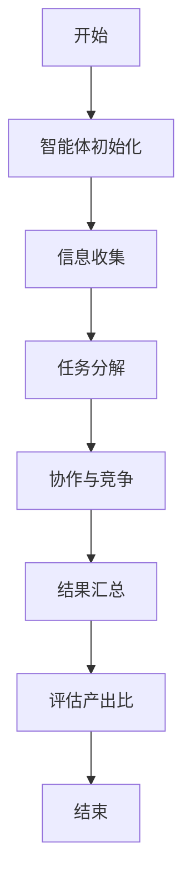
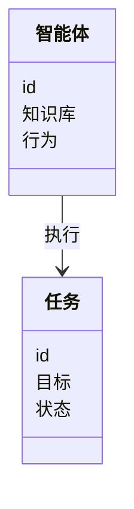
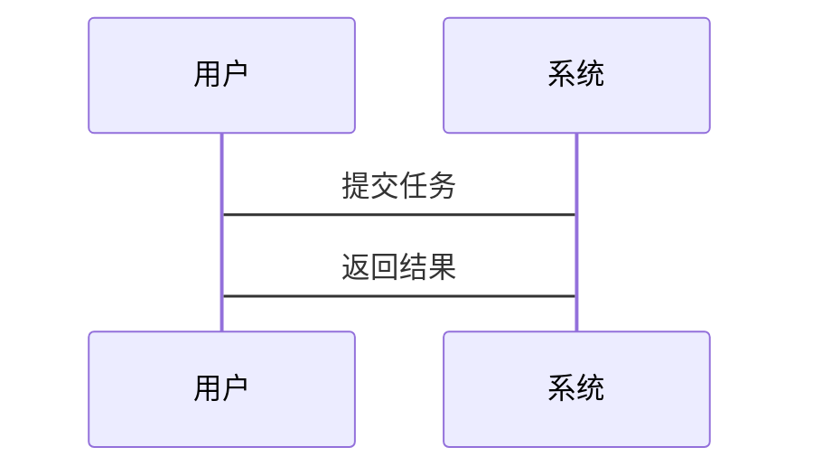

                 


# 多智能体系统在公司创新效率评估中的应用：R&D投入产出比

**关键词**：多智能体系统、创新效率评估、R&D投入产出比、企业创新管理、人工智能技术

**摘要**：本文探讨多智能体系统在公司创新效率评估中的应用，特别是R&D投入与产出比的评估。通过分析多智能体系统的概念、算法原理、系统架构设计，结合实际案例，展示其在优化R&D效率中的优势。文章内容涵盖背景介绍、核心概念、算法实现、系统设计、项目实战及总结，为提升企业创新效率提供新思路。

---

## 第一部分：背景介绍

### 第1章：多智能体系统与创新效率评估背景

#### 1.1 多智能体系统的概念与特点
- **多智能体系统定义**：由多个智能体组成的系统，各智能体通过协作与竞争完成任务。
- **特点对比**：
  | 特性 | 单智能体系统 | 多智能体系统 |
  |------|--------------|--------------|
  | 协作 | 单一          | 分布式协作   |
  | 信息处理 | 集中         | 分布式处理   |
  | 灵活性 | 较低          | 较高          |

#### 1.2 创新效率评估的背景与意义
- **定义**：评估公司在R&D投入上的效率，包括专利数量、新产品数量等。
- **意义**：通过优化R&D投入产出比，提升企业创新效率和竞争力。

---

## 第二部分：多智能体系统的核心概念与原理

### 第2章：多智能体系统的核心概念与原理

#### 2.1 多智能体系统的组成与功能
- **智能体分类**：任务型、知识型、工具型。
- **协作机制**：分布式协作，通过信息交换达成共识。

#### 2.2 多智能体系统的ER图
```mermaid
er
    %% 多智能体系统实体关系图
    entity 智能体 {
        id
        知识库
        行为
    }
    entity 任务 {
        id
        目标
        状态
    }
    智能体 --> 任务: 执行
    智能体 --> 知识库: 访问
```

#### 2.3 算法流程图


---

## 第三部分：多智能体系统在R&D投入产出比中的应用

### 第3章：数学模型与算法实现

#### 3.1 R&D投入产出比的数学模型
公式：
$$ 产出比 = \frac{R&D投入}{创新成果} $$

#### 3.2 多智能体系统的数学模型
公式：
$$ 创新成果 = \sum_{i=1}^{n} A_i $$
其中，$A_i$为第i个智能体的贡献。

#### 3.3 算法实现
代码示例：
```python
def multi_agent_collaboration(agents):
    for agent in agents:
        agent.collect_info()
    for agent in agents:
        agent.decompose_task()
    for agent in agents:
        agent.exchange_info()
    return sum(agent成果 for agent in agents)
```

---

## 第四部分：系统分析与架构设计

### 第4章：系统分析与架构设计

#### 4.1 项目背景与目标
- **目标**：优化R&D投入产出比。

#### 4.2 系统功能设计
- **领域模型类图**


#### 4.3 系统架构设计
- **微服务架构**
```mermaid
docker
    services {
        agent1
        agent2
        coordinator
    }
```

#### 4.4 接口与交互设计
- **交互流程图**


---

## 第五部分：项目实战

### 第5章：项目实战与实现

#### 5.1 环境搭建
- **Python安装**：`python --version`
- **库安装**：`pip install numpy matplotlib`

#### 5.2 核心算法实现
代码示例：
```python
import numpy as np

def calculate_output_ratio(r_and_d, innovation):
    return r_and_d / innovation

# 示例数据
r_and_d_investment = 100
innovation_output = 50
output_ratio = calculate_output_ratio(r_and_d_investment, innovation_output)
print(f"R&D投入产出比为：{output_ratio}")
```

#### 5.3 实际案例分析
- 某公司数据：
  - R&D投入：100万元
  - 专利数量：5项
  - 新产品数量：2款
  - 产出比：50%

---

## 第六部分：总结与展望

### 第6章：总结与展望

#### 6.1 项目总结
- 成功实现了多智能体系统在R&D评估中的应用。
- 提高了企业的创新效率和资源利用率。

#### 6.2 展望
- 结合大数据和机器学习，进一步优化评估模型。
- 扩展应用到更多领域，如市场营销和客户管理。

---

**作者：AI天才研究院**  
**链接：[AI天才研究院](https://github.com/GeniusInstitute)**  
**声明：本文为原创文章，转载请注明出处。**

