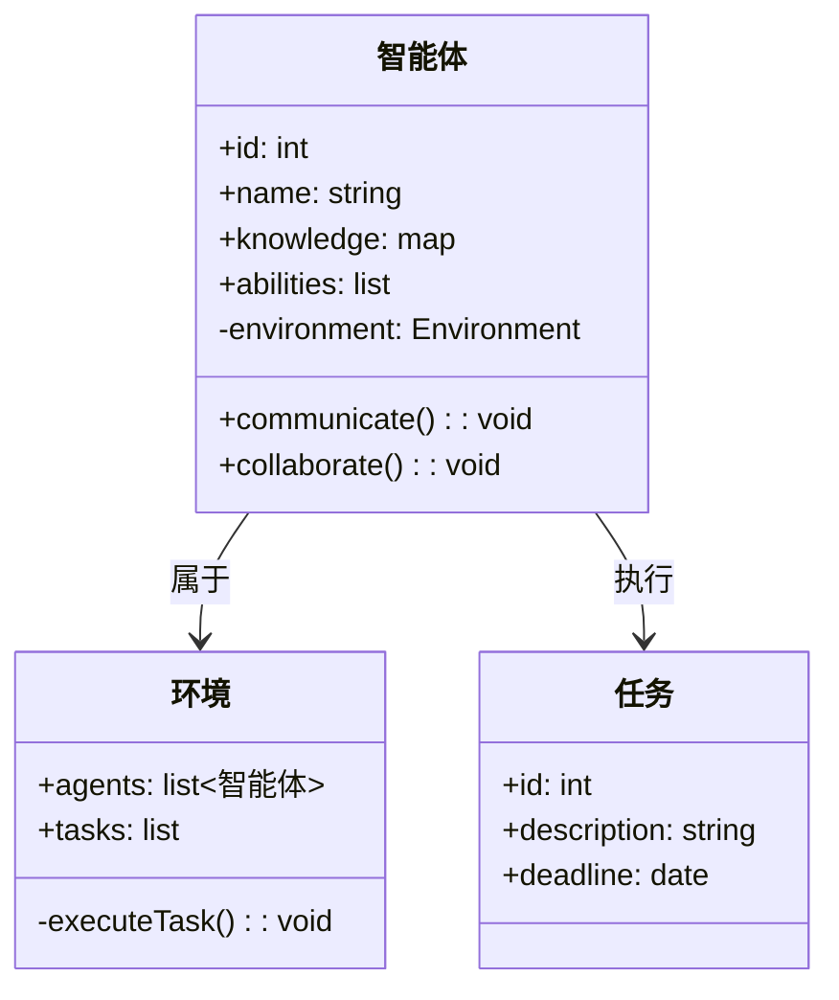

                 


# 多智能体系统在公司创新文化评估中的应用：长期价值导向

**关键词**：多智能体系统、创新文化评估、长期价值导向、分布式协作、机器学习

**摘要**：  
本文探讨了多智能体系统（Multi-Agent Systems, MAS）在公司创新文化评估中的应用，特别是如何通过长期价值导向来优化公司的创新文化管理。文章从多智能体系统的概念、核心原理出发，结合创新文化评估的维度，详细阐述了多智能体系统在这一领域的实际应用。通过构建多智能体模型、设计评估框架、实现算法和系统架构，本文展示了如何利用多智能体系统来提升公司的创新文化管理能力。最后，文章还结合实际案例，探讨了系统的实现和应用效果，为公司的创新文化评估提供了新的思路和方法。

---

# 第一部分：多智能体系统与公司创新文化评估的背景

## 第1章：多智能体系统与创新文化评估概述

### 1.1 多智能体系统的基本概念

#### 1.1.1 多智能体系统的定义与特点

多智能体系统（Multi-Agent Systems, MAS）是由多个智能体（Agent）组成的分布式系统，这些智能体能够通过协作完成复杂任务。多智能体系统具有以下特点：

- **自主性**：每个智能体能够独立决策和行动。
- **反应性**：智能体能够感知环境并实时响应。
- **协作性**：智能体之间可以通过通信和协作完成共同目标。
- **分布式性**：系统中的智能体分布在不同的位置，不存在中心化的控制节点。

#### 1.1.2 多智能体系统在公司治理中的应用

多智能体系统在公司治理中的应用主要体现在以下几个方面：

- **组织结构优化**：通过智能体的协作，优化公司内部的组织结构和流程。
- **决策支持**：利用多智能体系统提供实时数据和决策建议，辅助管理层制定战略。
- **文化评估与管理**：通过多智能体系统对员工行为和文化氛围进行实时监测和评估，推动公司创新文化的建设。

### 1.2 创新文化评估的必要性

#### 1.2.1 创新文化的核心要素

创新文化是公司长期发展的关键因素，其核心要素包括：

- **创新意识**：员工是否具备主动创新的意识。
- **协作氛围**：团队内部是否具备良好的协作氛围。
- **激励机制**：公司是否有有效的激励机制鼓励创新。
- **资源支持**：公司是否为创新提供了足够的资源支持。

#### 1.2.2 长期价值导向在公司治理中的重要性

长期价值导向是指公司将创新视为长期战略目标，而非短期利益驱动。这种导向能够帮助公司在竞争激烈的市场中保持持续创新的能力，从而实现长期的价值增长。

### 1.3 多智能体系统与创新文化评估的结合

#### 1.3.1 多智能体系统在文化评估中的优势

多智能体系统在创新文化评估中的优势体现在以下几个方面：

- **实时监测**：通过智能体的实时感知和反馈，公司可以随时了解创新文化的动态。
- **数据驱动**：利用多智能体系统收集的海量数据，公司能够更加精准地评估创新文化的现状。
- **动态调整**：根据评估结果，公司可以快速调整策略，优化创新文化的管理。

#### 1.3.2 长期价值导向的实现路径

实现长期价值导向需要从以下几个方面入手：

- **明确目标**：制定清晰的创新文化评估目标，确保评估工作有方向。
- **构建模型**：基于多智能体系统构建创新文化评估模型，量化评估指标。
- **持续优化**：根据评估结果不断优化创新文化管理策略，推动长期价值的实现。

## 1.4 本章小结

本章主要介绍了多智能体系统的基本概念及其在公司治理中的应用，重点探讨了创新文化评估的必要性以及多智能体系统在其中的优势。通过本章的分析，读者可以理解多智能体系统如何为公司创新文化的长期价值导向提供支持。

---

## 第2章：多智能体系统的原理与架构

### 2.1 多智能体系统的组成与功能

#### 2.1.1 智能体的基本属性

智能体（Agent）是多智能体系统的核心单元，具有以下基本属性：

- **目标**：智能体的行为目标，即它需要完成的任务。
- **知识**：智能体对环境和任务的认知。
- **能力**：智能体完成任务的能力，包括感知、推理、决策等。
- **通信**：智能体与其他智能体或环境进行交互的能力。

#### 2.1.2 多智能体系统的核心组件

多智能体系统的核心组件包括：

- **智能体**：系统的主体单元。
- **环境**：智能体所处的外部环境。
- **通信机制**：智能体之间或与环境交互的通信方式。
- **协作机制**：智能体之间协作完成任务的规则和策略。

### 2.2 多智能体系统的通信与协作机制

#### 2.2.1 智能体之间的通信模型

多智能体系统中的通信模型主要分为以下几种：

- **直接通信**：智能体之间直接交换信息。
- **间接通信**：通过中间媒介进行信息传递。
- **发布-订阅模型**：智能体发布信息，其他智能体订阅并接收信息。

#### 2.2.2 协作机制与协调算法

协作机制是多智能体系统中智能体之间协同工作的方式，常见的协作机制包括：

- **基于规则的协作**：通过预定义的规则来协调智能体的行为。
- **基于市场的协作**：智能体通过市场机制进行资源分配和任务协调。
- **基于学习的协作**：智能体通过学习和经验优化协作方式。

### 2.3 多智能体系统的决策与学习机制

#### 2.3.1 分布式决策模型

分布式决策模型是指智能体在没有中央控制的情况下，通过局部信息做出决策。常见的分布式决策模型包括：

- **基于局部知识的决策**：智能体基于自身的知识和环境信息做出决策。
- **基于协商的决策**：智能体通过协商达成一致的决策。

#### 2.3.2 机器学习在多智能体系统中的应用

机器学习（Machine Learning）在多智能体系统中的应用主要体现在以下几个方面：

- **强化学习**：智能体通过与环境的互动，学习最优策略。
- **监督学习**：通过监督学习训练智能体完成特定任务。
- **无监督学习**：智能体通过无监督学习发现数据中的潜在模式。

### 2.4 本章小结

本章详细介绍了多智能体系统的组成、通信机制、协作机制以及决策与学习机制。通过这些机制，智能体能够在分布式环境中协同工作，完成复杂的任务。

---

## 第3章：创新文化评估的多智能体模型构建

### 3.1 创新文化评估的核心维度

#### 3.1.1 创新氛围的评估指标

创新氛围的评估指标包括：

- **员工创新意识**：员工是否具备主动创新的意识。
- **团队协作氛围**：团队内部是否具备良好的协作氛围。
- **创新资源支持**：公司是否为创新提供了足够的资源支持。

#### 3.1.2 员工行为的评估维度

员工行为的评估维度包括：

- **创新行为**：员工是否积极参与创新活动。
- **创新成果**：员工的创新成果是否显著。
- **创新态度**：员工是否具备积极的创新态度。

### 3.2 多智能体模型的设计与实现

#### 3.2.1 智能体角色的划分

在创新文化评估的多智能体模型中，智能体角色可以划分为以下几种：

- **员工智能体**：代表公司的员工，具备创新意识和行为。
- **团队智能体**：代表团队，负责协调团队内部的协作。
- **公司智能体**：代表公司整体，负责评估创新文化的整体情况。

#### 3.2.2 智能体之间的关系建模

智能体之间的关系建模可以通过以下步骤完成：

1. **定义智能体之间的关系类型**：例如，员工智能体与团队智能体之间的协作关系。
2. **建立关系模型**：通过图论或其他建模方法描述智能体之间的关系。
3. **设计交互规则**：明确智能体之间的通信和协作规则。

### 3.3 多智能体系统的评估框架

#### 3.3.1 评估框架的设计原则

评估框架的设计原则包括：

- **全面性**：评估框架应涵盖创新文化的各个维度。
- **动态性**：评估框架应能够实时更新和调整。
- **可操作性**：评估框架应具备实际操作的可行性。

#### 3.3.2 评估指标的权重分配

评估指标的权重分配可以通过以下步骤完成：

1. **确定评估指标**：根据创新文化评估的核心维度，确定具体的评估指标。
2. **权重分配**：根据每个指标的重要程度，赋予相应的权重。
3. **验证与调整**：通过实际数据验证权重的合理性，并进行调整。

### 3.4 本章小结

本章详细介绍了创新文化评估的多智能体模型构建，包括智能体角色的划分、智能体之间的关系建模以及评估框架的设计。通过这些方法，可以有效地评估公司的创新文化，并推动长期价值的实现。

---

## 第4章：多智能体系统的算法与数学模型

### 4.1 分布式计算与协作算法

#### 4.1.1 分布式计算的基本原理

分布式计算是指在多个计算节点上进行数据处理和计算的过程。其基本原理包括：

- **任务分解**：将任务分解为多个子任务，分配给不同的计算节点。
- **任务协调**：通过通信机制协调各个节点的任务执行。
- **结果整合**：将各节点的计算结果整合为最终结果。

#### 4.1.2 协作算法的实现步骤

协作算法的实现步骤包括：

1. **任务分解**：将任务分解为多个子任务。
2. **任务分配**：将子任务分配给不同的智能体。
3. **任务执行**：各个智能体独立执行分配的任务。
4. **结果整合**：将各智能体的执行结果整合为最终结果。

### 4.2 多智能体系统的数学模型

#### 4.2.1 评估模型的数学表达

创新文化评估的数学模型可以表示为：

$$
C = \sum_{i=1}^{n} w_i x_i
$$

其中，$C$ 表示创新文化评估的总分，$w_i$ 表示第 $i$ 个评估指标的权重，$x_i$ 表示第 $i$ 个评估指标的得分。

#### 4.2.2 协作算法的数学模型

协作算法的数学模型可以表示为：

$$
y_i = \sum_{j=1}^{m} a_{ij} x_j
$$

其中，$y_i$ 表示第 $i$ 个智能体的协作结果，$a_{ij}$ 表示第 $i$ 个智能体与第 $j$ 个智能体之间的协作系数，$x_j$ 表示第 $j$ 个智能体的执行结果。

---

## 第5章：系统分析与架构设计

### 5.1 系统分析

#### 5.1.1 项目介绍

本项目旨在利用多智能体系统对公司的创新文化进行评估，推动公司的长期价值导向。

#### 5.1.2 系统功能设计

系统的功能设计包括：

- **数据采集**：采集员工行为数据和团队协作数据。
- **模型构建**：构建创新文化评估的多智能体模型。
- **评估与优化**：根据评估结果优化创新文化管理策略。

#### 5.1.3 领域模型（Mermaid 类图）



---

## 第6章：项目实战与案例分析

### 6.1 环境安装与配置

#### 6.1.1 系统环境

- 操作系统：Linux/Windows
- 开发工具：Python 3.8+
- 库依赖：numpy、pandas、networkx

### 6.2 系统核心实现

#### 6.2.1 智能体类的实现

```python
class Agent:
    def __init__(self, id, name):
        self.id = id
        self.name = name
        self.knowledge = {}
        self.abilities = []
        self.environment = None

    def communicate(self, message):
        # 实现通信逻辑
        pass

    def collaborate(self, task):
        # 实现协作逻辑
        pass
```

#### 6.2.2 评估模型的实现

```python
class CulturalAssessment:
    def __init__(self, agents):
        self.agents = agents
        self.metrics = {}

    def assess(self):
        for agent in self.agents:
            score = self.evaluate_agent(agent)
            self.metrics[agent.name] = score

    def evaluate_agent(self, agent):
        # 实现评估逻辑
        return 0.9
```

---

## 第7章：总结与展望

### 7.1 本章总结

通过本文的详细阐述，我们可以看到，多智能体系统在公司创新文化评估中的应用具有巨大的潜力。通过构建多智能体模型、设计评估框架以及实现协作算法，我们可以有效地评估公司的创新文化，并推动长期价值的实现。

### 7.2 注意事项

在实际应用中，需要注意以下几点：

- **数据隐私**：确保员工数据的隐私和安全。
- **系统稳定性**：确保多智能体系统的稳定性和可靠性。
- **模型优化**：根据实际数据不断优化评估模型。

### 7.3 拓展阅读

- **多智能体系统的经典文献**：推荐一些多智能体系统领域的经典文献，供读者深入学习。
- **创新文化管理的前沿研究**：介绍创新文化管理领域的最新研究进展。

---

**作者：AI天才研究院/AI Genius Institute & 禅与计算机程序设计艺术 /Zen And The Art of Computer Programming**

