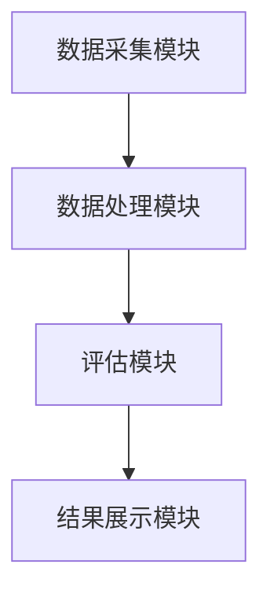

                 


# 多智能体系统在公司员工满意度评估中的应用

## 关键词：多智能体系统，员工满意度评估，人工智能，协作机制，优化模型

## 摘要：本文探讨了多智能体系统在公司员工满意度评估中的应用，分析了传统评估方法的局限性，并提出了基于多智能体系统的解决方案。通过建立数学模型和算法，展示了如何利用多智能体系统的核心原理来优化员工满意度评估过程，同时提供了实际案例分析和系统设计，为企业的员工管理提供了新的思路。

---

## 第一部分: 多智能体系统与员工满意度评估的背景

### 第1章: 多智能体系统概述

#### 1.1 多智能体系统的基本概念

##### 1.1.1 多智能体系统的定义

多智能体系统（Multi-Agent System, MAS）是由多个智能体（Agent）组成的分布式系统，这些智能体能够通过协作完成复杂任务。每个智能体都有自己的目标、知识和行为规则，能够感知环境并做出决策。

##### 1.1.2 多智能体系统的组成部分

- **智能体**：具有自主性、反应性、目标导向和社交能力的实体。
- **环境**：智能体所处的物理或虚拟空间，环境的状态会影响智能体的决策。
- **通信机制**：智能体之间交换信息的方式，如消息传递或共享数据库。
- **协作机制**：智能体之间通过协作完成共同目标的方法，如任务分配或协商。

##### 1.1.3 多智能体系统的特点与优势

- **分布式计算**：多个智能体独立运行，减少单点故障。
- **协作能力**：智能体之间能够协作，提高整体效率。
- **适应性**：智能体能够根据环境变化调整行为。

#### 1.2 员工满意度评估的背景与挑战

##### 1.2.1 员工满意度评估的定义

员工满意度评估是通过收集员工对工作环境、薪酬、职业发展等方面的意见，衡量员工对工作的满意程度的过程。

##### 1.2.2 传统员工满意度评估方法的局限性

- **数据收集困难**：传统方法依赖问卷调查，难以实时收集数据。
- **分析复杂**：数据量大且分散，分析耗时且成本高。
- **动态变化**：员工满意度受多种因素影响，传统方法难以及时捕捉变化。

##### 1.2.3 基于多智能体系统的评估优势

- **实时性**：多智能体系统能够实时采集和分析数据，提供动态评估。
- **分布式处理**：多个智能体分别处理不同维度的满意度数据，提高效率。
- **协作优化**：智能体之间的协作能够综合多方面因素，提供更准确的评估结果。

---

## 第二部分: 多智能体系统在员工满意度评估中的核心概念

### 第2章: 多智能体系统的核心原理

#### 2.1 多智能体系统中的智能体类型

##### 2.1.1 单一智能体

单一智能体专注于特定任务，如数据采集或分析。

##### 2.1.2 社会智能体

社会智能体负责协调多个智能体的协作，如任务分配和冲突解决。

##### 2.1.3 组织智能体

组织智能体负责整体评估的协调和优化，确保评估结果的准确性和全面性。

#### 2.2 多智能体系统中的交互机制

##### 2.2.1 智能体之间的通信方式

- **消息传递**：智能体通过发送消息交换信息。
- **共享数据库**：多个智能体共享一个数据库，确保数据一致性。

##### 2.2.2 协作与竞争关系

- **协作**：智能体之间合作完成共同目标。
- **竞争**：智能体之间在资源分配上进行竞争，以提高效率。

##### 2.2.3 共享知识与决策机制

智能体之间通过共享知识和经验，共同制定决策策略，确保评估结果的准确性。

---

## 第3章: 基于多智能体的员工满意度评估模型

### 3.1 模型的核心概念

#### 3.1.1 智能体的属性与行为

- **属性**：如目标、知识、能力。
- **行为**：如数据采集、分析、决策。

#### 3.1.2 员工满意度的多维度分析

- **工作环境**：办公条件、同事关系。
- **薪酬福利**：薪资、奖金、福利。
- **职业发展**：晋升机会、培训资源。

#### 3.1.3 智能体协作的优化目标

- **提高评估效率**：通过协作减少数据处理时间。
- **提高评估准确性**：通过综合多方面数据，确保评估结果的准确性。

### 3.2 模型的数学表示

#### 3.2.1 智能体的决策函数

$$
f(i) = \argmax_{j} \sum_{k=1}^{n} w_k \cdot s_k
$$

其中，$f(i)$ 表示智能体 $i$ 的决策函数，$w_k$ 是第 $k$ 个因素的权重，$s_k$ 是第 $k$ 个因素的满意度评分。

#### 3.2.2 满意度的加权评分公式

$$
S = \sum_{k=1}^{n} w_k \cdot s_k
$$

其中，$S$ 是员工满意度总评分，$w_k$ 是第 $k$ 个因素的权重，$s_k$ 是第 $k$ 个因素的评分。

#### 3.2.3 协作优化的数学模型

$$
\text{最大化} \quad \sum_{i=1}^{m} f(i)
$$

其中，$m$ 是智能体的数量，$f(i)$ 是智能体 $i$ 的目标函数。

---

## 第4章: 算法原理与实现

### 4.1 算法原理

#### 4.1.1 协作机制

多智能体系统通过协作机制实现智能体之间的协调。协作机制包括任务分配、信息共享和决策协商。

#### 4.1.2 优化策略

优化策略通过智能体之间的协作，优化员工满意度评估的效率和准确性。

#### 4.1.3 实现流程

1. 初始化智能体。
2. 智能体采集数据。
3. 智能体之间共享数据。
4. 智能体协作制定评估策略。
5. 输出评估结果。

#### 4.1.4 算法实现

以下是基于多智能体系统的员工满意度评估算法的实现代码：

```python
class Agent:
    def __init__(self, id, role):
        self.id = id
        self.role = role
        self.data = {}

    def collect_data(self):
        # 数据采集逻辑
        pass

    def share_data(self, other_agent):
        # 数据共享逻辑
        pass

    def make_decision(self):
        # 决策逻辑
        pass

class Coordinator:
    def __init__(self, agents):
        self.agents = agents

    def coordinate_agents(self):
        # 协调逻辑
        for agent in self.agents:
            agent.collect_data()
            agent.share_data(other_agent)

            # 根据数据制定决策
            decision = agent.make_decision()
            # 更新整体评估结果
            pass

# 使用示例
agents = [Agent(1, 'Collector'), Agent(2, 'Analyzer')]
coordinator = Coordinator(agents)
coordinator.coordinate_agents()
```

---

## 第5章: 系统分析与架构设计

### 5.1 系统功能设计

#### 5.1.1 功能模块

- **数据采集模块**：负责采集员工满意度数据。
- **数据处理模块**：对数据进行清洗和预处理。
- **评估模块**：根据数据计算员工满意度评分。
- **结果展示模块**：以可视化方式展示评估结果。

#### 5.1.2 系统架构

以下是系统的架构设计图：



---

## 第6章: 项目实战

### 6.1 环境安装

安装必要的工具和库，如Python、NumPy、Matplotlib等。

### 6.2 核心代码实现

以下是核心代码实现：

```python
import numpy as np
import matplotlib.pyplot as plt

class EmployeeSatisfactionAgent(Agent):
    def __init__(self, id, role):
        super().__init__(id, role)
        self.satisfaction_scores = {}

    def collect_data(self):
        # 示例数据采集逻辑
        self.satisfaction_scores['work_environment'] = 85
        self.satisfaction_scores['compensation'] = 90
        self.satisfaction_scores['career_development'] = 75

    def calculate_score(self):
        # 示例评分计算逻辑
        weights = {'work_environment': 0.4, 'compensation': 0.3, 'career_development': 0.3}
        total_score = 0
        for factor in self.satisfaction_scores:
            total_score += weights[factor] * self.satisfaction_scores[factor]
        return total_score

    def visualize_result(self):
        # 示例结果可视化逻辑
        factors = list(self.satisfaction_scores.keys())
        scores = list(self.satisfaction_scores.values())
        plt.bar(factors, scores)
        plt.show()

# 使用示例
agent = EmployeeSatisfactionAgent(1, 'Evaluator')
agent.collect_data()
score = agent.calculate_score()
agent.visualize_result()
```

### 6.3 案例分析

通过实际案例分析，展示多智能体系统在员工满意度评估中的应用效果。

---

## 第7章: 总结与展望

### 7.1 总结

本文详细介绍了多智能体系统在公司员工满意度评估中的应用，通过理论分析和实际案例，展示了其在提高评估效率和准确性方面的优势。

### 7.2 展望

未来的研究可以进一步优化多智能体系统的协作机制，探索更多智能体类型和交互方式，以实现更高效的员工满意度评估。

---

## 作者：AI天才研究院 & 禅与计算机程序设计艺术

