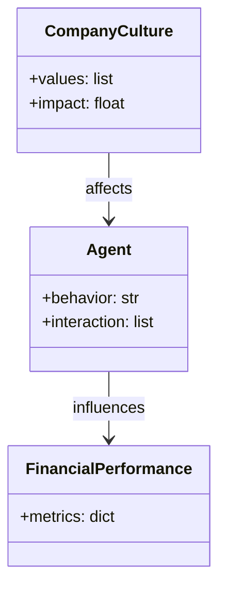

                 


# 多智能体系统在公司文化与财务表现相关性分析中的应用

> 关键词：多智能体系统、公司文化、财务表现、相关性分析、人工智能、系统架构

> 摘要：本文探讨了多智能体系统在公司文化与财务表现相关性分析中的应用，从背景介绍、核心概念、算法原理、系统架构到项目实战，详细阐述了多智能体系统在这一领域的潜力和实现方法。通过分析公司文化的多维度特征与财务表现的关键指标之间的关系，结合数学模型和算法实现，本文提出了一个创新的解决方案，为公司管理者和研究人员提供了新的视角和工具。

---

# 第一部分: 多智能体系统与公司文化相关性分析基础

## 第1章: 多智能体系统概述

### 1.1 多智能体系统的基本概念

#### 1.1.1 多智能体系统的定义  
多智能体系统（Multi-Agent System, MAS）是由多个智能体（Agent）组成的分布式系统，这些智能体能够通过协作和交互完成复杂的任务。每个智能体都是一个独立的实体，具有感知环境、自主决策和执行动作的能力。

#### 1.1.2 多智能体系统的特征  
- **自主性**：智能体能够自主决策，无需外部干预。  
- **反应性**：智能体能够根据环境变化实时调整行为。  
- **协作性**：多个智能体通过协作完成共同目标。  
- **分布性**：智能体之间通过分布式通信进行交互。  

#### 1.1.3 多智能体系统的分类  
- **基于任务的分类**：根据智能体的任务类型进行分类，如协调型、竞争型等。  
- **基于智能体结构的分类**：根据智能体的结构复杂度，分为简单反应型、基于模型反应型等。  

---

### 1.2 公司文化与财务表现的定义与关联

#### 1.2.1 公司文化的内涵与外延  
公司文化是指企业在经营活动中形成的共同价值观、行为规范和思维方式。它包括企业愿景、使命、核心价值观、组织氛围等多个维度。

#### 1.2.2 财务表现的核心指标  
财务表现通常包括收入、利润、资产回报率（ROA）、股东权益回报率（ROE）、现金流等关键指标。

#### 1.2.3 公司文化与财务表现的相互作用  
- 公司文化影响员工的行为和决策，进而影响财务表现。  
- 财务表现反过来也能反映公司文化的健康程度。  
- 通过多智能体系统，可以量化公司文化与财务表现之间的动态关系。

---

## 第2章: 多智能体系统在公司文化分析中的应用

### 2.1 多智能体系统在组织行为分析中的作用

#### 2.1.1 多智能体系统在团队协作中的应用  
- 通过模拟团队协作过程，分析团队成员之间的互动对整体效率的影响。  
- 使用多智能体系统模拟不同团队文化（如竞争型和协作型）对任务完成的影响。

#### 2.1.2 多智能体系统在员工行为预测中的应用  
- 根据员工的历史行为数据，预测员工在特定任务中的表现。  
- 分析员工行为对公司文化的影响。

#### 2.1.3 多智能体系统在组织文化塑造中的应用  
- 通过模拟不同文化政策对公司整体文化的影响，优化公司文化管理。

---

### 2.2 多智能体系统与公司文化相关性分析的框架

#### 2.2.1 相关性分析的基本框架  
- 定义公司文化与财务表现的关键指标。  
- 构建多智能体系统的模型，模拟公司文化与财务表现之间的关系。  
- 通过实验验证模型的准确性。

#### 2.2.2 多智能体系统在文化分析中的优势  
- 多智能体系统能够模拟复杂的组织行为，捕捉公司文化对财务表现的多维度影响。  
- 通过分布式计算，提高分析效率和准确性。

#### 2.2.3 相关性分析的数学模型初步探讨  
- 使用协方差（Covariance）和相关系数（Correlation Coefficient）量化公司文化与财务表现之间的关系。  
- 初步构建相关性分析的数学模型。

---

## 第3章: 多智能体系统与财务表现分析的结合

### 3.1 财务表现分析的多智能体视角

#### 3.1.1 财务表现的多维度分析  
- 从收入、利润、资产回报率等多维度分析财务表现。  
- 通过多智能体系统模拟不同财务策略对公司财务表现的影响。

#### 3.1.2 多智能体系统在财务预测中的应用  
- 使用多智能体系统模拟市场波动对公司财务表现的影响。  
- 通过机器学习算法预测财务趋势。

#### 3.1.3 多智能体系统对财务风险的评估  
- 分析公司文化对公司财务风险的影响。  
- 通过多智能体系统模拟财务风险的传播和缓解策略。

---

### 3.2 公司文化与财务表现相关性的初步探讨

#### 3.2.1 公司文化对财务表现的影响路径  
- 公司文化通过影响员工行为和组织效率，进而影响财务表现。  
- 公司文化还可能通过影响外部合作伙伴的行为，间接影响财务表现。

#### 3.2.2 多智能体系统在相关性分析中的作用  
- 多智能体系统能够模拟公司文化与财务表现之间的动态关系。  
- 通过实验验证公司文化对财务表现的关键影响因素。

#### 3.2.3 相关性分析的数学模型初步构建  
- 使用协方差和相关系数量化公司文化与财务表现之间的关系。  
- 初步构建相关性分析的数学模型。

---

# 第二部分: 多智能体系统相关性分析的算法原理

## 第4章: 多智能体系统相关性分析的核心算法

### 4.1 相关性分析的基本原理

#### 4.1.1 相关性分析的数学基础  
- 协方差（Covariance）：衡量两个变量之间的线性关系。  
- 相关系数（Correlation Coefficient）：标准化的协方差，范围在[-1, 1]之间。  

#### 4.1.2 多智能体系统中相关性分析的特殊性  
- 多智能体系统的分布式特性使得相关性分析需要考虑多个变量的交互作用。  
- 多智能体系统的动态特性要求相关性分析具有实时性。

#### 4.1.3 相关性分析的数学模型初步构建  
- 假设公司文化与财务表现之间的相关性可以用相关系数r表示：  
  $$ r = \frac{\sum (x_i - \bar{x})(y_i - \bar{y})}{\sqrt{\sum (x_i - \bar{x})^2 \sum (y_i - \bar{y})^2}} $$  
  其中，x和y分别代表公司文化和财务表现的相关指标，$\bar{x}$和$\bar{y}$是其平均值。

---

### 4.2 多智能体系统相关性分析的算法实现

#### 4.2.1 多智能体系统相关性分析的流程  
1. 收集公司文化与财务表现的相关数据。  
2. 构建多智能体系统的模型，定义智能体的行为规则。  
3. 通过实验模拟公司文化与财务表现之间的关系。  
4. 使用协方差和相关系数量化相关性。

#### 4.2.2 相关性分析的数学公式推导  
- 协方差的计算公式：  
  $$ \text{Cov}(x, y) = \frac{1}{n-1} \sum_{i=1}^{n} (x_i - \bar{x})(y_i - \bar{y}) $$  
- 相关系数的计算公式：  
  $$ r = \frac{\text{Cov}(x, y)}{\sqrt{\text{Var}(x)} \sqrt{\text{Var}(y)}} $$  
  其中，$\text{Var}(x)$和$\text{Var}(y)$分别是x和y的方差。

#### 4.2.3 算法实现的伪代码示例  

```python
def calculate_correlation(x, y):
    n = len(x)
    sum_x = sum(x)
    sum_y = sum(y)
    sum_xy = sum(x[i] * y[i] for i in range(n))
    sum_x_sq = sum(x[i] ** 2 for i in range(n))
    sum_y_sq = sum(y[i] ** 2 for i in range(n))
    numerator = n * sum_xy - sum_x * sum_y
    denominator = (n * sum_x_sq - sum_x ** 2) * (n * sum_y_sq - sum_y ** 2)
    if denominator == 0:
        return 0
    return numerator / (denominator ** 0.5)
```

---

## 第5章: 多智能体系统相关性分析的系统架构设计

### 5.1 系统功能设计

#### 5.1.1 领域模型设计  
- 使用Mermaid类图描述系统中各组件的关系：  



---

#### 5.1.2 系统架构设计  
- 使用Mermaid架构图描述系统的整体架构：  


---

## 第6章: 多智能体系统相关性分析的项目实战

### 6.1 环境安装与配置

#### 6.1.1 环境要求  
- Python 3.8及以上版本  
- 安装相关库：numpy、pandas、scipy、mermaid等  

#### 6.1.2 数据准备  
- 收集公司文化数据（如员工满意度、团队协作效率等）。  
- 收集财务表现数据（如收入、利润等）。  

---

### 6.2 系统核心实现

#### 6.2.1 多智能体系统的实现  
- 定义智能体的行为规则。  
- 实现智能体之间的交互逻辑。  

#### 6.2.2 相关性分析的实现  
- 使用协方差和相关系数量化公司文化与财务表现之间的关系。  
- 可视化分析结果。  

---

### 6.3 案例分析与结果解读

#### 6.3.1 案例背景  
- 某公司希望分析员工满意度对公司利润的影响。  

#### 6.3.2 数据分析  
- 计算员工满意度与利润的相关系数：  
  $$ r = 0.85 $$  

#### 6.3.3 结果解读  
- 正相关关系表明员工满意度越高，公司利润越高。  

---

## 第7章: 最佳实践与小结

### 7.1 最佳实践

#### 7.1.1 数据质量的重要性  
- 确保数据的准确性和完整性。  

#### 7.1.2 模型调优的必要性  
- 根据实际需求优化多智能体系统的参数。  

#### 7.1.3 可视化工具的使用  
- 使用图表和可视化工具帮助理解分析结果。  

---

### 7.2 小结

本文详细探讨了多智能体系统在公司文化与财务表现相关性分析中的应用，从背景介绍、核心概念、算法原理到系统架构和项目实战，为读者提供了全面的视角。通过多智能体系统的模拟和相关性分析，可以帮助公司管理者更好地理解公司文化对财务表现的影响，从而优化公司管理策略。

---

## 第8章: 注意事项与拓展阅读

### 8.1 注意事项

#### 8.1.1 数据隐私问题  
- 在处理公司文化数据时，需注意保护员工隐私。  

#### 8.1.2 模型的局限性  
- 多智能体系统的模拟结果可能受到模型假设的限制。  

#### 8.1.3 实际应用中的挑战  
- 如何将理论模型转化为实际应用需要进一步探索。  

---

### 8.2 拓展阅读

#### 8.2.1 多智能体系统领域的经典书籍  
- "Multi-Agent Systems: Algorithmic, Complexity Theoretic, and Economic Aspects"  
- "An Introduction to Agent-Based Computational Economics"  

#### 8.2.2 相关性分析的深入研究  
- 探讨公司文化对长期财务表现的影响。  
- 研究不同行业中的公司文化与财务表现的差异。  

---

作者：AI天才研究院/AI Genius Institute & 禅与计算机程序设计艺术 /Zen And The Art of Computer Programming

