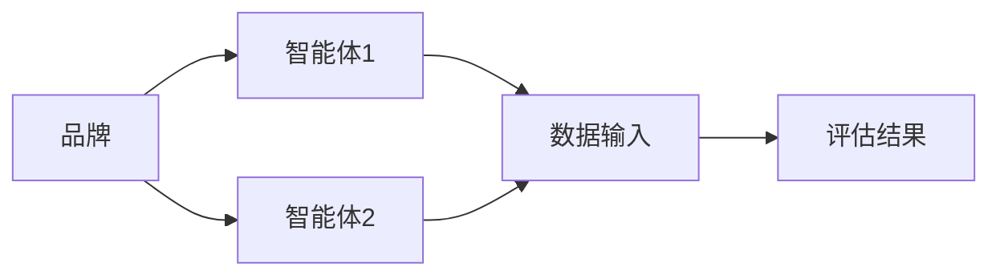
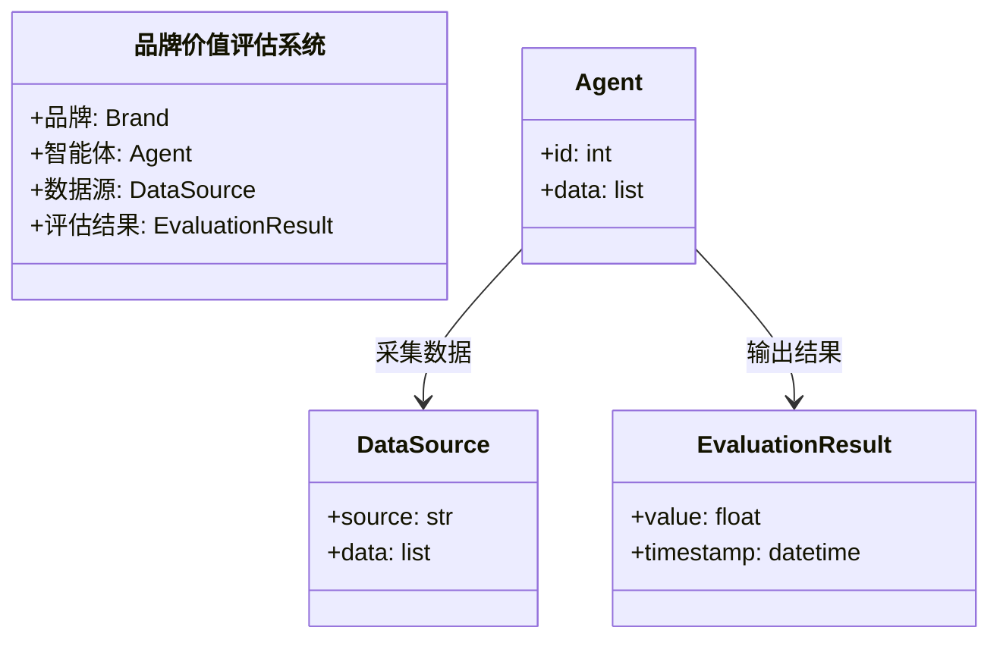
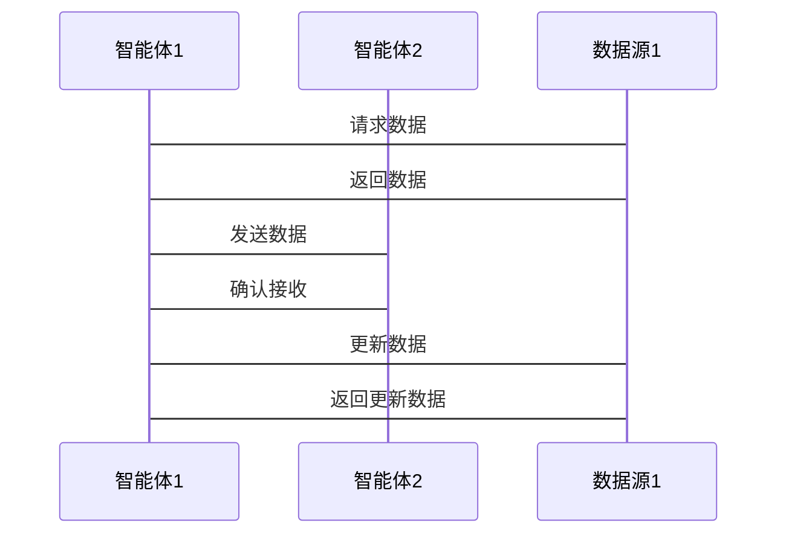

                 


# 多智能体系统在品牌价值动态评估中的应用

## 关键词：多智能体系统、品牌价值、动态评估、算法原理、系统架构

## 摘要：  
随着市场竞争的加剧，品牌价值的动态评估变得至关重要。传统方法依赖于单一数据源和静态分析，难以捕捉品牌价值的实时变化。本文探讨多智能体系统（MAS）在品牌价值动态评估中的应用，通过实时数据捕捉和多维度分析，实现对品牌价值的精准评估。文章详细介绍了MAS的核心原理、算法实现、系统架构，并通过实际案例展示了MAS在品牌价值动态评估中的优势和效果。

---

## 第一部分: 多智能体系统与品牌价值动态评估概述

### 第1章: 多智能体系统与品牌价值动态评估的背景介绍

#### 1.1 问题背景
- **品牌价值评估的传统方法与局限性**  
  品牌价值是企业核心竞争力的重要指标，传统评估方法依赖于财务数据和静态分析，难以反映品牌在市场环境中的动态变化。例如，舆情变化、市场竞争、消费者行为等因素都会影响品牌价值，但传统方法难以实时捕捉这些变化。

- **多智能体系统在动态评估中的优势**  
  多智能体系统（MAS）通过分布式的智能体协作，能够实时分析多源数据，捕捉品牌价值的动态变化。MAS的去中心化特性使其能够同时处理来自社交媒体、市场数据、消费者行为等多种信息源，提供更精准的评估结果。

- **当前品牌价值动态评估的挑战与需求**  
  当前品牌价值评估的挑战主要在于数据的多样性和动态性。品牌价值的变化可能由多个因素驱动，例如产品创新、市场竞争、消费者情绪等。MAS能够通过多智能体的协作，实现对这些复杂因素的综合分析，满足品牌价值动态评估的需求。

#### 1.2 问题描述
- **品牌价值动态评估的核心问题**  
  品牌价值的动态评估需要考虑多个因素，例如品牌知名度、消费者忠诚度、市场影响力等。这些因素可能受到外部环境（如市场趋势）和内部因素（如产品策略）的影响。MAS能够通过多智能体的协作，实时分析这些因素的变化，提供动态的评估结果。

- **多智能体系统在品牌价值评估中的应用场景**  
  MAS在品牌价值评估中的应用场景包括：实时舆情分析、竞争对手分析、消费者行为预测等。通过MAS，品牌管理者可以实时了解品牌在市场中的动态变化，制定更有效的品牌策略。

- **问题解决的必要性与可行性分析**  
  品牌价值的动态评估对于企业制定品牌战略至关重要。MAS通过多智能体的协作，能够提供实时、动态的评估结果，帮助企业更好地应对市场变化。MAS的可行性在于其分布式的架构能够处理多源异构数据，并通过智能体的协作实现复杂的分析任务。

#### 1.3 问题的边界与外延
- **问题的边界**  
  品牌价值动态评估的核心问题是如何捕捉品牌价值的动态变化。MAS的应用主要集中在实时数据处理和多智能体协作方面。  
- **问题的外延**  
  除了品牌价值评估，MAS还可以应用于其他领域，例如金融市场的实时分析、供应链优化等。本文主要关注MAS在品牌价值评估中的应用。

- **核心概念与核心要素的组成**  
  在品牌价值动态评估中，MAS的核心要素包括智能体、通信机制、协作规则等。智能体负责采集和处理数据，通信机制实现智能体之间的信息共享，协作规则确保智能体的协同工作。

#### 1.4 本章小结
本章介绍了品牌价值动态评估的背景、问题描述以及MAS的应用优势。通过分析，我们明确了MAS在品牌价值评估中的必要性和可行性。

---

## 第2章: 多智能体系统的核心概念与联系

### 2.1 多智能体系统的基本原理
- **多智能体系统的定义与特点**  
  多智能体系统是由多个智能体组成的分布式系统，智能体能够通过协作完成复杂任务。MAS的特点包括去中心化、协作性、反应性和适应性。

- **多智能体系统的核心要素**  
  MAS的核心要素包括智能体、环境、通信机制、协作规则等。智能体负责感知环境并采取行动，通信机制实现智能体之间的信息共享，协作规则确保智能体的协同工作。

- **多智能体系统与传统单体智能系统的区别**  
  与传统单体智能系统相比，MAS具有去中心化和协作性两大特点。MAS通过多智能体的协作实现复杂任务，而传统系统依赖于单一中心节点。

### 2.2 多智能体系统与品牌价值评估的关联
- **品牌价值评估的关键指标与动态变化**  
  品牌价值的关键指标包括品牌知名度、品牌忠诚度、品牌影响力等。这些指标可能受到市场环境、消费者行为等因素的影响，具有动态变化的特点。

- **多智能体系统如何捕捉品牌价值的动态变化**  
  MAS通过分布式的智能体协作，能够实时分析多源数据，捕捉品牌价值的动态变化。例如，智能体可以从社交媒体、市场数据等多种信息源采集数据，通过协作实现品牌价值的动态评估。

- **多智能体系统在品牌价值评估中的角色与功能**  
  在品牌价值评估中，MAS的主要角色是数据采集者、分析者和决策者。智能体负责采集数据，分析数据，提供评估结果。

### 2.3 多智能体系统的属性特征对比
- **属性列表与特征对比表**  
  下表展示了MAS与传统品牌价值评估方法的对比：

| 属性                | 多智能体系统（MAS）                     | 传统品牌价值评估方法                  |
|---------------------|---------------------------------------|---------------------------------------|
| 数据来源            | 多源异构数据                            | 单一数据源                            |
| 处理方式            | 分布式协作处理                          | 集中式处理                            |
| 实时性              | 高实时性                                | 低实时性                              |
| 灵活性              | 高灵活性                                | 低灵活性                              |
| 可扩展性            | 高可扩展性                              | 低可扩展性                            |

- **ER实体关系图的Mermaid流程图**  
  下图展示了MAS在品牌价值评估中的实体关系：



### 2.4 本章小结
本章详细介绍了MAS的核心概念与品牌价值评估的关联，通过对比分析，明确了MAS在品牌价值动态评估中的优势。

---

## 第3章: 多智能体系统在品牌价值动态评估中的算法原理

### 3.1 算法原理概述
- **多智能体系统的核心算法**  
  MAS的核心算法包括分布式计算、协作算法和自适应算法。分布式计算确保智能体能够并行处理数据，协作算法实现智能体之间的信息共享，自适应算法使智能体能够根据环境变化调整行为。

- **算法的基本流程与步骤**  
  品牌价值动态评估的算法流程如下：
  1. 数据采集：智能体从多源数据中采集品牌相关的数据，例如社交媒体数据、市场数据等。
  2. 数据处理：智能体对采集到的数据进行清洗、特征提取等预处理。
  3. 数据分析：智能体通过协作算法对数据进行分析，计算品牌价值的关键指标。
  4. 评估结果输出：智能体将评估结果输出，供品牌管理者参考。

- **算法的输入输出与中间变量**  
  - 输入：多源异构数据、品牌相关参数。
  - 输出：品牌价值的动态评估结果。
  - 中间变量：智能体之间的通信数据、协作结果。

### 3.2 算法的数学模型与公式
- **品牌价值评估的数学模型**  
  品牌价值评估的数学模型可以表示为：
  $$ V(t) = \sum_{i=1}^{n} w_i \cdot f_i(t) $$
  其中，\( V(t) \) 表示品牌价值在时间 \( t \) 的评估值，\( w_i \) 是第 \( i \) 个特征的权重，\( f_i(t) \) 是第 \( i \) 个特征在时间 \( t \) 的值。

- **多智能体系统协作的数学表达**  
  多智能体系统协作的数学表达可以表示为：
  $$ S(t+1) = \text{Merge}(S(t), A(t)) $$
  其中，\( S(t) \) 表示时间 \( t \) 的系统状态，\( A(t) \) 表示时间 \( t \) 的智能体协作结果，Merge 表示系统状态的合并操作。

- **具体算法的详细推导与举例说明**  
  以品牌知名度评估为例，假设我们有三个智能体分别负责收集社交媒体数据、市场数据和消费者行为数据。每个智能体对数据进行分析，计算品牌知名度的得分，然后通过协作算法将这些得分合并，得到最终的品牌知名度评估结果。

### 3.3 算法实现的Python代码示例
- **环境安装与配置**  
  需要安装的Python库包括：numpy、pandas、networkx、matplotlib。

- **Python代码实现**  
  下面是一个简单的MAS算法实现示例：

```python
import numpy as np
import pandas as pd
import networkx as nx
import matplotlib.pyplot as plt

# 定义智能体类
class Agent:
    def __init__(self, id):
        self.id = id
        self.data = []
    
    def collect_data(self, source):
        # 从数据源采集数据
        self.data.append(source)
    
    def process_data(self):
        # 对数据进行处理
        return np.mean(self.data)
    
    def send_data(self, receiver, data):
        # 向其他智能体发送数据
        receiver.data.append(data)

# 初始化智能体
agent1 = Agent(1)
agent2 = Agent(2)
agent3 = Agent(3)

# 数据源
data_source1 = 0.8
data_source2 = 0.9
data_source3 = 0.7

# 智能体协作
agent1.collect_data(data_source1)
agent2.collect_data(data_source2)
agent3.collect_data(data_source3)

# 智能体1向智能体2发送数据
agent1.send_data(agent2, agent1.process_data())
# 智能体2向智能体3发送数据
agent2.send_data(agent3, agent2.process_data())

# 计算最终评估结果
result = (agent1.process_data() + agent2.process_data() + agent3.process_data()) / 3
print("品牌价值评估结果:", result)
```

### 3.4 本章小结
本章详细介绍了MAS在品牌价值动态评估中的算法原理，包括核心算法、数学模型和具体实现。

---

## 第4章: 多智能体系统的系统分析与架构设计

### 4.1 问题场景介绍
- **品牌价值动态评估的典型场景**  
  品牌价值的动态评估需要考虑多个因素，例如品牌知名度、消费者忠诚度、市场影响力等。这些因素可能受到市场环境、消费者行为等因素的影响，具有动态变化的特点。

### 4.2 系统功能设计
- **领域模型的Mermaid类图**  
  下图展示了品牌价值评估的领域模型：



- **系统架构设计的Mermaid架构图**  
  下图展示了系统的整体架构：


- **系统接口设计和交互序列图**  
  下图展示了系统接口的交互序列：



### 4.3 本章小结
本章详细介绍了MAS在品牌价值动态评估中的系统架构设计，包括领域模型、系统架构和接口设计。

---

## 第5章: 项目实战——品牌价值动态评估系统实现

### 5.1 环境安装与配置
- **Python环境安装**  
  需要安装的Python库包括：numpy、pandas、networkx、matplotlib。

### 5.2 系统核心实现
- **MAS算法实现**  
  下面是一个MAS算法的实现示例：

```python
import numpy as np
import pandas as pd
import networkx as nx
import matplotlib.pyplot as plt

class Agent:
    def __init__(self, id):
        self.id = id
        self.data = []
    
    def collect_data(self, source):
        self.data.append(source)
    
    def process_data(self):
        return np.mean(self.data)
    
    def send_data(self, receiver, data):
        receiver.data.append(data)

agent1 = Agent(1)
agent2 = Agent(2)
agent3 = Agent(3)

data_source1 = 0.8
data_source2 = 0.9
data_source3 = 0.7

agent1.collect_data(data_source1)
agent2.collect_data(data_source2)
agent3.collect_data(data_source3)

agent1.send_data(agent2, agent1.process_data())
agent2.send_data(agent3, agent2.process_data())

result = (agent1.process_data() + agent2.process_data() + agent3.process_data()) / 3
print("品牌价值评估结果:", result)
```

### 5.3 代码应用解读与分析
- **代码解读**  
  该代码实现了三个智能体，分别从不同的数据源采集数据，通过协作算法计算品牌价值的动态评估结果。

- **代码分析**  
  代码中的Agent类定义了智能体的行为，包括数据采集、数据处理和数据发送。通过协作算法，智能体之间实现了数据共享，最终计算出品牌价值的动态评估结果。

### 5.4 实际案例分析
- **案例背景**  
  某品牌希望通过MAS实现品牌价值的动态评估，实时分析社交媒体数据、市场数据和消费者行为数据。

- **案例分析与详细讲解**  
  通过MAS的实现，品牌可以实时分析多源数据，捕捉品牌价值的动态变化，制定更有效的品牌策略。

### 5.5 本章小结
本章通过实际案例展示了MAS在品牌价值动态评估中的应用，详细讲解了系统的实现和代码的运行过程。

---

## 第6章: 最佳实践与总结

### 6.1 小结
MAS在品牌价值动态评估中的应用具有重要意义。通过MAS，品牌管理者可以实时分析多源数据，捕捉品牌价值的动态变化，制定更有效的品牌策略。

### 6.2 注意事项
- **数据隐私与安全**  
  在MAS实现中，需要注意数据隐私和安全问题，确保数据的合法性和安全性。
- **智能体协作的效率**  
  在MAS设计中，需要考虑智能体协作的效率，避免因协作延迟影响评估结果的实时性。
- **系统的可扩展性**  
  在MAS设计中，需要考虑系统的可扩展性，确保系统能够适应数据规模的扩大和智能体数量的增加。

### 6.3 拓展阅读
- **多智能体系统的相关书籍**  
  推荐阅读《Multi-Agent Systems: Algorithm and Applications》。
- **品牌价值评估的最新研究**  
  可以参考相关学术论文，了解品牌价值评估的最新研究进展。

### 6.4 本章小结
本章总结了MAS在品牌价值动态评估中的应用，提出了MAS设计和实现中的注意事项，并推荐了相关的拓展阅读资料。

---

## 结语
多智能体系统在品牌价值动态评估中的应用为品牌管理者提供了全新的思路。通过MAS，品牌管理者可以实时分析多源数据，捕捉品牌价值的动态变化，制定更有效的品牌策略。未来，随着人工智能和多智能体技术的不断发展，MAS在品牌价值评估中的应用将更加广泛和深入。

---

## 作者：AI天才研究院/AI Genius Institute & 禅与计算机程序设计艺术 /Zen And The Art of Computer Programming

