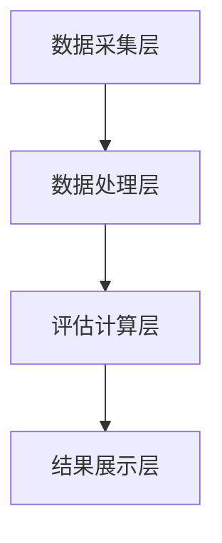
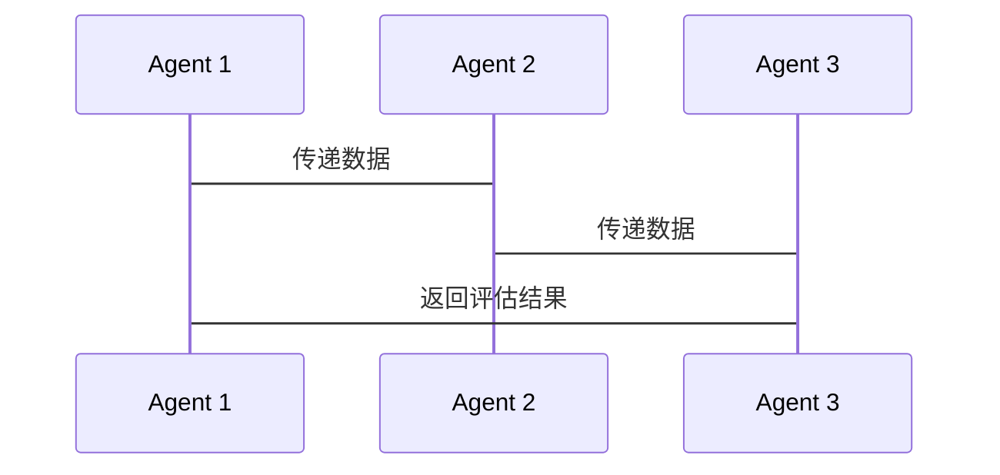
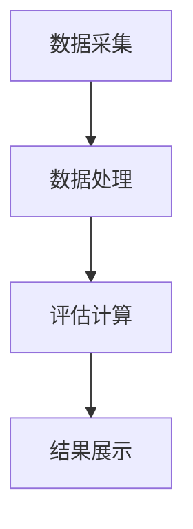

                 


# 多智能体系统在品牌忠诚度动态评估中的应用

> 关键词：多智能体系统、品牌忠诚度、动态评估、人工智能、系统架构、算法实现、实时反馈

> 摘要：本文探讨了多智能体系统（MAS）在品牌忠诚度动态评估中的应用。通过分析MAS的基本原理、品牌忠诚度的动态特性，结合算法实现和系统架构设计，展示了如何利用MAS实时评估客户忠诚度，为企业制定精准营销策略提供支持。

---

## 第1章: 多智能体系统概述

### 1.1 多智能体系统的基本概念

#### 1.1.1 多智能体系统的定义
多智能体系统（Multi-Agent System, MAS）是由多个智能体组成的分布式系统，这些智能体能够自主决策、协作完成任务。智能体具备感知环境、推理、规划和执行的能力。

#### 1.1.2 多智能体系统的特点
- **自主性**：每个智能体独立运作，具备决策能力。
- **协作性**：智能体之间通过通信协作，共同完成复杂任务。
- **分布式计算**：系统不依赖于单点控制，任务分布在多个智能体中。

#### 1.1.3 多智能体系统的核心要素
- **智能体**：具备感知、推理、规划和执行能力的实体。
- **通信协议**：智能体之间交互的规则和语言。
- **协作机制**：确保智能体有效合作的方法和策略。

### 1.2 品牌忠诚度的定义与影响因素

#### 1.2.1 品牌忠诚度的定义
品牌忠诚度是指消费者对特定品牌产品的偏好程度，通常表现为持续购买同一品牌产品或服务的行为。

#### 1.2.2 品牌忠诚度的影响因素
- **产品质量**：产品的性能和可靠性直接影响消费者的忠诚度。
- **服务质量**：售前咨询、售后服务等影响消费者的购买决策。
- **品牌认知度**：消费者对品牌的认知和记忆程度。
- **价格因素**：价格优惠与否会影响消费者的购买行为。

#### 1.2.3 品牌忠诚度的动态特性
品牌忠诚度并非固定不变，会受到市场环境、消费者行为变化的影响，表现出动态特性。

### 1.3 动态评估的必要性与挑战

#### 1.3.1 动态评估的必要性
- **实时反馈**：动态评估能够实时捕捉消费者行为变化，帮助企业及时调整营销策略。
- **精准决策**：通过动态评估，企业可以更精准地识别高忠诚度客户，制定个性化服务策略。

#### 1.3.2 动态评估的主要挑战
- **数据复杂性**：消费者行为数据来源多样，处理复杂。
- **实时性要求高**：动态评估需要快速响应，对系统性能提出更高要求。
- **模型更新**：动态评估模型需要不断更新以适应市场变化。

#### 1.3.3 多智能体系统在动态评估中的优势
- **分布式计算**：MAS能够高效处理大量数据，实时更新评估结果。
- **协作机制**：智能体之间的协作能够提高评估的准确性和实时性。

---

## 第2章: 多智能体系统的理论基础

### 2.1 分布式计算与协作机制

#### 2.1.1 分布式计算的基本原理
分布式计算通过将任务分解到多个节点并行处理，提高计算效率。MAS中的智能体相当于分布式计算中的节点。

#### 2.1.2 多智能体系统的协作机制
协作机制包括通信协议、任务分配和协调同步。智能体之间通过通信协议传递信息，任务分配确保每个智能体承担适当任务，协调同步保证协作的顺利进行。

#### 2.1.3 协作中的通信协议
通信协议定义了智能体之间交互的规则和格式，确保信息传递的准确性和高效性。

### 2.2 品牌忠诚度评估的数学模型

#### 2.2.1 品牌忠诚度的量化方法
品牌忠诚度可以通过消费者行为数据量化，例如购买频率、购买金额等指标。

#### 2.2.2 基于多智能体的动态评估模型
动态评估模型需要考虑消费者行为的实时变化，MAS中的多个智能体分别负责数据采集、特征提取和评估计算。

#### 2.2.3 动态评估模型的数学公式
$$ L(t) = \alpha \cdot Q(t) + (1-\alpha) \cdot L(t-1) $$
其中，$L(t)$表示时间$t$的忠诚度评估，$\alpha$为权重因子，$Q(t)$为实时行为指标，$L(t-1)$为上一时刻的忠诚度评估。

---

## 第3章: 多智能体系统的算法实现

### 3.1 基于MAS的动态评估算法

#### 3.1.1 算法流程
1. 数据采集：智能体实时采集消费者行为数据。
2. 数据处理：对采集的数据进行清洗和特征提取。
3. 动态评估：基于MAS的协作机制，计算品牌忠诚度。
4. 结果输出：将评估结果反馈给企业系统。

#### 3.1.2 算法实现代码
```python
class Agent:
    def __init__(self, id):
        self.id = id
        self.data = []

    def collect_data(self):
        # 模拟数据采集
        self.data.append(random.uniform(0, 1))

    def send_data(self, target_agent):
        target_agent.receive_data(self.data)

    def receive_data(self, data):
        self.data.extend(data)

# 初始化多智能体
agents = [Agent(i) for i in range(5)]

# 数据同步算法
def synchronize_agents(agents):
    master_agent = agents[0]
    for agent in agents[1:]:
        master_agent.receive_data(agent.data)
    for agent in agents:
        agent.data = master_agent.data.copy()

# 动态评估算法
def dynamic_assessment(agents):
    synchronize_agents(agents)
    # 计算忠诚度评估
    loyalty = sum(agent.data[-1] for agent in agents) / len(agents)
    return loyalty
```

---

## 第4章: 多智能体系统的系统架构与设计

### 4.1 系统架构设计

#### 4.1.1 系统架构图


#### 4.1.2 功能模块设计
- 数据采集层：负责实时采集消费者行为数据。
- 数据处理层：对数据进行清洗和特征提取。
- 评估计算层：基于MAS算法计算品牌忠诚度。
- 结果展示层：将评估结果以可视化形式展示。

### 4.2 系统接口设计

#### 4.2.1 数据采集接口
```python
def collect_behavior_data():
    # 接收实时数据
    return {'id': 123, 'action': 'purchase'}
```

#### 4.2.2 评估接口
```python
def assess Loyalty():
    # 调用动态评估算法
    return dynamic_assessment(agents)
```

### 4.3 系统交互设计

#### 4.3.1 交互流程图


---

## 第5章: 多智能体系统的项目实战

### 5.1 项目背景与需求分析

#### 5.1.1 项目背景
以某电商平台为例，实时评估客户的品牌忠诚度，帮助企业制定精准营销策略。

#### 5.1.2 需求分析
- 实时采集消费者行为数据。
- 基于MAS算法计算品牌忠诚度。
- 可视化展示评估结果。

### 5.2 系统实现

#### 5.2.1 环境安装
安装必要的库，如numpy、pandas、matplotlib等。

#### 5.2.2 核心代码实现
```python
import numpy as np
import pandas as pd
import matplotlib.pyplot as plt

class Agent:
    def __init__(self, id):
        self.id = id
        self.data = []

    def collect_data(self):
        # 模拟数据采集
        self.data.append(np.random.uniform(0, 1))

    def send_data(self, target_agent):
        target_agent.receive_data(self.data)

    def receive_data(self, data):
        self.data.extend(data)

# 初始化多智能体
agents = [Agent(i) for i in range(5)]

# 数据同步算法
def synchronize_agents(agents):
    master_agent = agents[0]
    for agent in agents[1:]:
        master_agent.receive_data(agent.data)
    for agent in agents:
        agent.data = master_agent.data.copy()

# 动态评估算法
def dynamic_assessment(agents):
    synchronize_agents(agents)
    # 计算忠诚度评估
    loyalty = sum(agent.data[-1] for agent in agents) / len(agents)
    return loyalty

# 评估结果可视化
def visualize_results(loyalty_scores):
    plt.plot(loyalty_scores, label='Brand Loyalty')
    plt.xlabel('Time')
    plt.ylabel('Loyalty Score')
    plt.legend()
    plt.show()
```

#### 5.2.3 项目实现步骤
1. 初始化多智能体。
2. 实时采集数据。
3. 同步数据。
4. 计算忠诚度评估。
5. 可视化结果。

### 5.3 案例分析与结果展示

#### 5.3.1 案例分析
通过模拟数据，展示MAS在品牌忠诚度评估中的应用效果。

#### 5.3.2 结果展示


---

## 第6章: 总结与展望

### 6.1 本章总结
本文详细探讨了多智能体系统在品牌忠诚度动态评估中的应用，从理论到实践，展示了MAS的优势和实际效果。

### 6.2 未来展望
未来的研究可以进一步优化MAS算法，探索更高效的数据处理方法，提升动态评估的准确性和实时性。

---

作者：AI天才研究院/AI Genius Institute & 禅与计算机程序设计艺术 /Zen And The Art of Computer Programming

