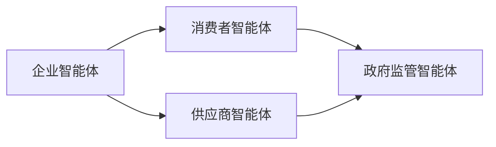
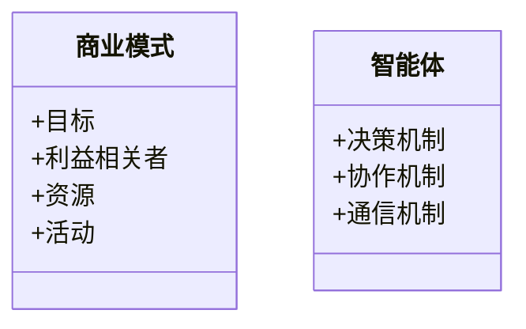
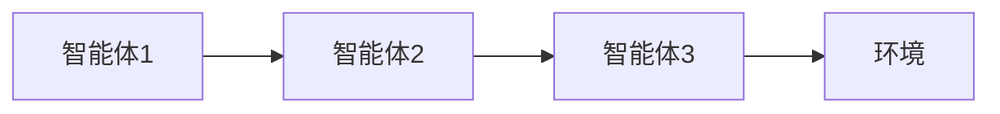
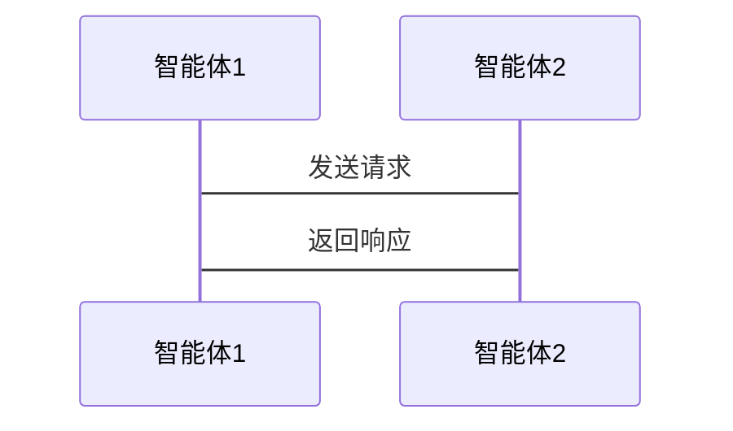

                 


# 多智能体系统在商业模式可持续性分析中的应用

> 关键词：多智能体系统、商业模式、可持续性分析、协同效应、博弈论、系统架构

> 摘要：本文探讨了多智能体系统在商业模式可持续性分析中的应用，分析了多智能体系统的核心概念、算法原理、系统架构，并通过实例展示了其在商业模式可持续性分析中的实际应用。文章最后总结了多智能体系统在商业模式可持续性分析中的优势与挑战，并提出了未来研究的方向。

---

## 第1章: 多智能体系统与商业模式概述

### 1.1 多智能体系统的定义与特点
多智能体系统（Multi-Agent System, MAS）是由多个智能体组成的分布式系统，这些智能体能够自主决策、协作和通信，以实现共同目标。多智能体系统的五大核心特点包括：

- **独立性**：每个智能体都有独立的目标和决策机制。
- **协作性**：智能体之间通过协作实现整体目标。
- **反应性**：智能体能够实时感知环境变化并做出响应。
- **分布性**：系统中的智能体分布在网络中，不存在中心控制节点。
- **动态性**：系统的环境和目标可能动态变化。

### 1.2 商业模式可持续性分析的定义与重要性
商业模式是指企业如何创造和传递价值并获取收益的方式。可持续性商业模式强调在追求经济利益的同时，兼顾社会和环境责任。商业模式可持续性分析的重要性体现在：

- **经济可持续性**：确保商业模式能够长期盈利。
- **社会可持续性**：满足社会需求，减少负面影响。
- **环境可持续性**：减少资源消耗和环境污染。

### 1.3 多智能体系统在商业模式可持续性分析中的应用前景
多智能体系统在商业模式可持续性分析中的应用前景广阔，尤其是在复杂系统的建模与优化方面。通过多智能体系统的协同与博弈，可以实现商业模式的动态优化和风险预测。然而，多智能体系统的复杂性和不确定性也带来了技术挑战，需要进一步研究和创新。

---

## 第2章: 多智能体系统的核心概念与联系

### 2.1 多智能体系统的实体关系图
在商业模式可持续性分析中，多智能体系统的实体关系图展示了系统中各个实体之间的关系。例如：



### 2.2 多智能体系统的核心概念属性对比
以下是多智能体系统中几个核心概念的属性对比：

| 概念 | 属性 | 描述 |
|------|------|------|
| 智能体 | 独立性 | 每个智能体都有独立的目标和决策机制 |
| 智能体 | 协作性 | 智能体之间通过协作实现整体目标 |
| 智能体 | 反应性 | 智能体能够实时感知环境变化并做出响应 |

### 2.3 多智能体系统的概念结构与核心要素组成
多智能体系统的概念结构包括以下几个核心要素：

- **智能体**：独立决策和行动的实体。
- **环境**：智能体所处的外部世界。
- **目标**：智能体追求的结果。
- **决策机制**：智能体做出决策的方式。
- **通信协议**：智能体之间的交互规则。

---

## 第3章: 多智能体系统的算法原理与数学模型

### 3.1 多智能体系统的算法原理
多智能体系统的算法原理主要涉及分布式计算、协作与通信机制以及博弈论。例如：

- **分布式计算**：通过分布式计算实现智能体之间的协作。
- **协作与通信机制**：智能体之间通过通信协议进行信息交换。
- **博弈论**：通过博弈论模型分析智能体之间的互动和决策。

### 3.2 多智能体系统的数学模型
以下是多智能体系统中协同效应的数学表达：

$$协同效应 = \sum_{i=1}^{n} \frac{1}{1 + e^{-x_i}}$$

其中，$x_i$ 表示第 $i$ 个智能体的贡献。

### 3.3 实例分析
- **案例1**：简单协作问题
  两个智能体通过协作实现共同目标，数学模型如下：
  $$协同效应 = \frac{1}{1 + e^{-x_1}} + \frac{1}{1 + e^{-x_2}}$$

- **案例2**：复杂博弈问题
  通过博弈论模型分析智能体之间的互动，数学模型如下：
  $$决策函数 = \max_{a} \sum_{i=1}^{n} u(a_i)$$

---

## 第4章: 多智能体系统的系统分析与架构设计

### 4.1 问题场景介绍
在商业模式可持续性分析中，多智能体系统可以帮助分析企业、消费者、供应商和政府监管等多方利益相关者的互动关系。例如：

- 企业智能体的目标是实现长期盈利。
- 消费者智能体的目标是获得满足的产品或服务。
- 供应商智能体的目标是提供高质量的产品或服务。
- 政府监管智能体的目标是确保商业模式的合规性。

### 4.2 系统功能设计
#### 4.2.1 领域模型设计
以下是商业模式可持续性分析的领域模型设计：



#### 4.2.2 系统架构设计
以下是多智能体系统的架构设计：



### 4.3 系统接口设计
#### 4.3.1 智能体间通信接口
智能体之间的通信接口需要定义交互协议和数据格式，例如：

- **通信协议**：HTTP REST API 或 WebSocket。
- **数据格式**：JSON 格式。

#### 4.3.2 系统交互序列图
以下是智能体之间的交互序列图：



---

## 第5章: 项目实战

### 5.1 环境安装
以下是安装多智能体系统的环境要求：

- **编程语言**：Python 3.8+
- **框架**：使用 Agent-framework 或者 Multi-Agent System 框架。
- **依赖库**：安装必要的依赖库，例如 `numpy`、`pandas`、`networkx` 等。

### 5.2 核心代码实现
以下是多智能体系统的核心代码实现：

```python
import numpy as np

class Agent:
    def __init__(self, id):
        self.id = id
        self.goal = None
        self.decision = None

    def set_goal(self, goal):
        self.goal = goal

    def make_decision(self, state):
        # 简单的决策逻辑，可以根据实际需求进行扩展
        if state == 'positive':
            self.decision = 'collaborate'
        else:
            self.decision = 'not collborate'

    def get_decision(self):
        return self.decision

# 示例用法
agent1 = Agent(1)
agent1.set_goal('maximize profit')
state = 'positive'
agent1.make_decision(state)
print(agent1.get_decision())  # 输出：'collaborate'
```

### 5.3 实际案例分析
以下是多智能体系统在商业模式可持续性分析中的实际案例：

- **案例1**：企业与消费者之间的互动
  企业智能体通过与消费者智能体的交互，优化产品和服务，提升客户满意度。

- **案例2**：企业与供应商之间的互动
  企业智能体与供应商智能体协作，优化供应链管理，降低成本。

---

## 第6章: 总结与展望

### 6.1 最佳实践 tips
- **模块化设计**：将系统模块化设计，便于维护和扩展。
- **通信协议选择**：选择合适的通信协议，确保智能体之间的高效交互。
- **测试与调试**：在实际应用中，注重系统的测试与调试，确保系统的稳定性和可靠性。

### 6.2 小结
多智能体系统在商业模式可持续性分析中的应用前景广阔，通过协同与博弈，可以实现系统的动态优化和风险预测。

### 6.3 注意事项
- **系统复杂性**：多智能体系统的复杂性可能带来维护和调试的挑战。
- **数据隐私**：在实际应用中，需要注意数据隐私和安全问题。

### 6.4 拓展阅读
- **推荐书籍**：《Multi-Agent Systems: Algorithmic, Complexity, and Synthesis》
- **推荐论文**：关于多智能体系统在经济和商业中的应用研究。

---

作者：AI天才研究院/AI Genius Institute & 禅与计算机程序设计艺术 /Zen And The Art of Computer Programming

---

以上就是《多智能体系统在商业模式可持续性分析中的应用》的完整目录和内容大纲。通过系统地分析多智能体系统的概念、算法原理、系统架构以及实际应用，本文为读者提供了全面的技术视角，帮助读者深入理解多智能体系统在商业模式可持续性分析中的应用价值和实现方法。

