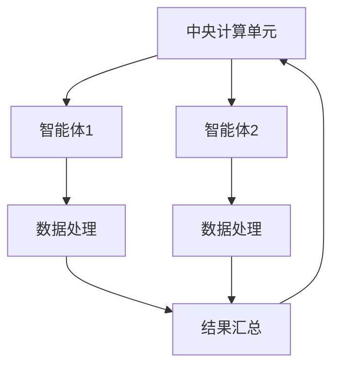
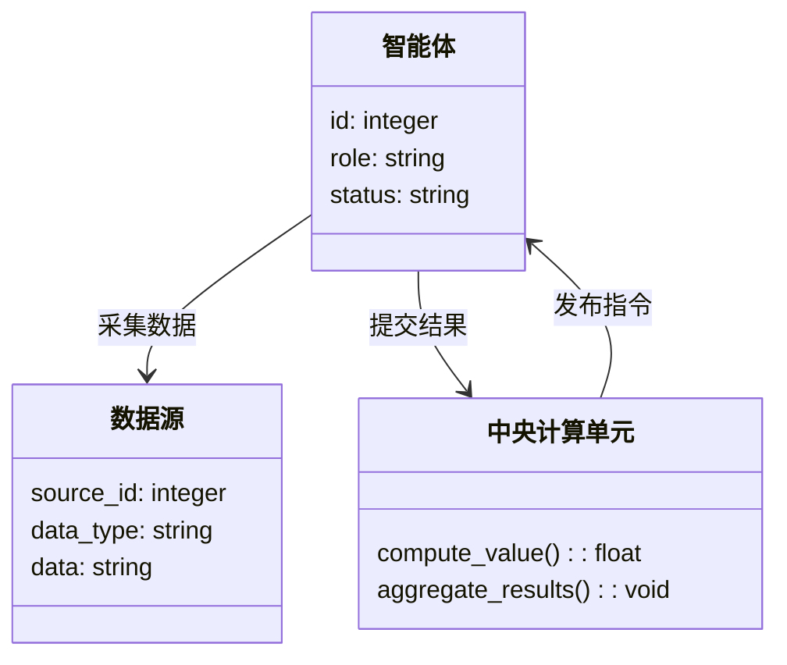
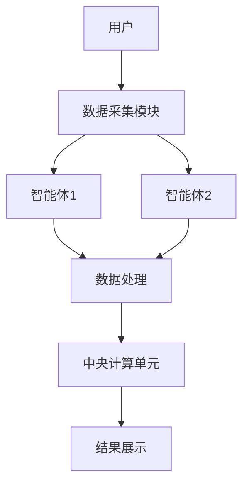
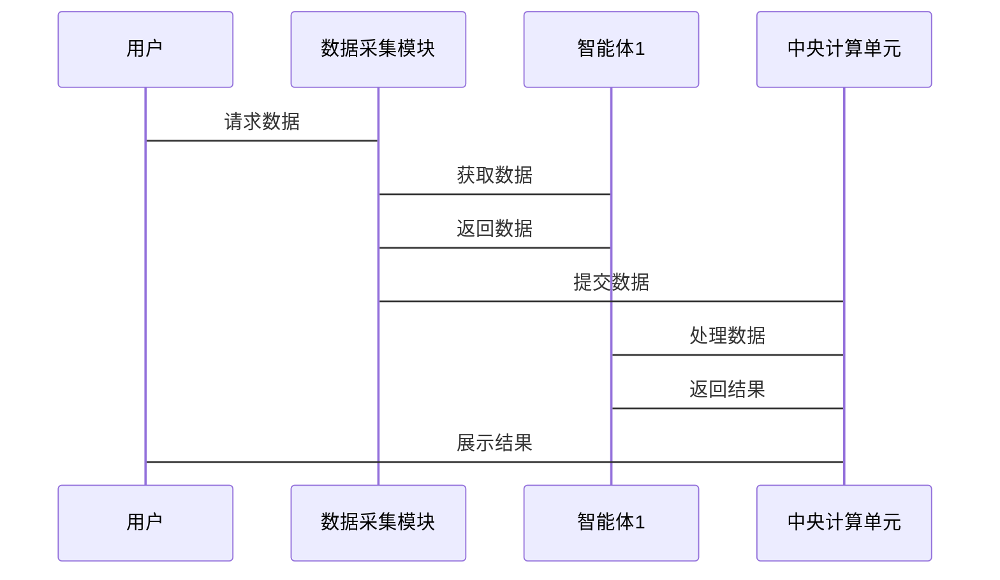

                 


# 多智能体系统在评估公司品牌权益价值中的应用

## 关键词：多智能体系统，品牌价值评估，分布式计算，协作算法，系统架构

## 摘要：  
本文探讨了多智能体系统（MAS）在评估公司品牌权益价值中的应用。通过分析MAS的基本原理、协作机制及其在品牌价值评估中的具体应用，结合算法原理和系统架构设计，本文提供了一种创新的解决方案。通过实际案例分析，展示了如何利用MAS提高品牌价值评估的效率和准确性，为企业的品牌管理提供了新的思路。

---

# 第三章：算法原理与数学模型

## 3.1 多智能体协作算法

### 3.1.1 分布式计算的基本原理
在多智能体系统中，分布式计算是实现协作的关键。每个智能体负责处理部分数据，并通过通信机制将结果汇总到中央计算单元。例如，使用分布式计算来分析社交媒体上的品牌情感时，每个智能体负责处理一部分数据，最终汇总得出整体情感评分。

### 3.1.2 协作算法的流程图



### 3.1.3 协作算法的数学模型

假设每个智能体计算的情感得分为$e_i$，其中$i$表示智能体的编号。中央计算单元将所有智能体的情感得分进行加权平均：

$$
E = \frac{\sum_{i=1}^{n} w_i e_i}{\sum_{i=1}^{n} w_i}
$$

其中，$w_i$是智能体$i$的权重。

---

## 3.2 品牌价值评估的数学模型

### 3.2.1 基于情感分析的计算公式

品牌情感得分为$E$，市场表现得分为$M$，品牌价值$V$的计算公式为：

$$
V = \alpha E + \beta M
$$

其中，$\alpha$和$\beta$是权重系数，$\alpha + \beta = 1$。

### 3.2.2 基于市场数据的计算

考虑市场数据，如销售额和市场占有率，可以使用回归分析模型来预测品牌价值：

$$
V = \beta_0 + \beta_1 S + \beta_2 M
$$

其中，$S$是销售额，$M$是市场占有率，$\beta_0$、$\beta_1$、$\beta_2$是回归系数。

---

# 第四章：系统分析与架构设计

## 4.1 系统分析

### 4.1.1 问题场景介绍
在品牌价值评估中，数据来源多样，包括社交媒体数据、市场数据和消费者反馈。传统的单一智能体难以高效处理这些数据，而多智能体系统可以分布式处理，提高效率。

### 4.1.2 项目介绍
本项目旨在开发一个多智能体系统，用于实时分析品牌数据并评估其价值。系统包括数据采集、处理和评估三个模块。

---

## 4.2 系统架构设计

### 4.2.1 系统功能设计（领域模型）



### 4.2.2 系统架构设计



---

## 4.3 系统接口设计

### 4.3.1 接口描述

- 数据采集模块接口：
  ```python
  class DataSource:
      def get_data(self):
          pass
  ```

- 智能体接口：
  ```python
  class Agent:
      def process_data(self, data):
          pass
  ```

---

## 4.4 交互设计



---

# 第五章：项目实战

## 5.1 环境配置

### 5.1.1 安装依赖

```bash
pip install python-multiagent
pip install numpy
pip install matplotlib
```

---

## 5.2 核心代码实现

### 5.2.1 数据采集模块

```python
class DataSource:
    def __init__(self):
        self.data = []
    
    def collect_data(self):
        # 模拟数据采集
        self.data.append("Positive")
        self.data.append("Negative")
        return self.data
```

---

## 5.2.2 智能体实现

```python
class Agent:
    def __init__(self, id):
        self.id = id
        self.data = []
    
    def process_data(self, data):
        # 模拟情感分析
        positive_count = sum(1 for d in data if d == "Positive")
        self.score = positive_count / len(data)
        return self.score
```

---

## 5.2.3 中央计算单元

```python
class CentralUnit:
    def __init__(self):
        self.agents = []
    
    def aggregate_results(self):
        total = 0
        for agent in self.agents:
            total += agent.process_data(agent.data)
        average = total / len(self.agents)
        return average
```

---

## 5.3 案例分析

### 5.3.1 数据采集

```python
data_source = DataSource()
data = data_source.collect_data()
```

---

## 5.3.2 系统运行

```python
central_unit = CentralUnit()
central_unit.agents.append(Agent(1))
central_unit.agents.append(Agent(2))
result = central_unit.aggregate_results()
print("品牌情感得分：", result)
```

---

## 5.4 项目小结

通过以上代码实现，我们可以看到多智能体系统在品牌价值评估中的高效性和可扩展性。每个智能体负责特定任务，中央计算单元进行汇总和分析，显著提高了评估效率。

---

# 第六章：总结与展望

## 6.1 总结

本文详细探讨了多智能体系统在品牌价值评估中的应用，从理论到实践，展示了如何利用MAS提高评估效率和准确性。通过实际案例分析，验证了该方法的有效性。

## 6.2 未来展望

未来，随着人工智能技术的发展，MAS在品牌价值评估中的应用将更加广泛。可以进一步研究动态协作机制、自适应算法以及多模态数据融合方法，以提高评估的精准度和实时性。

---

作者：AI天才研究院 & 禅与计算机程序设计艺术

