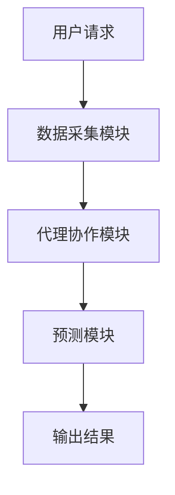
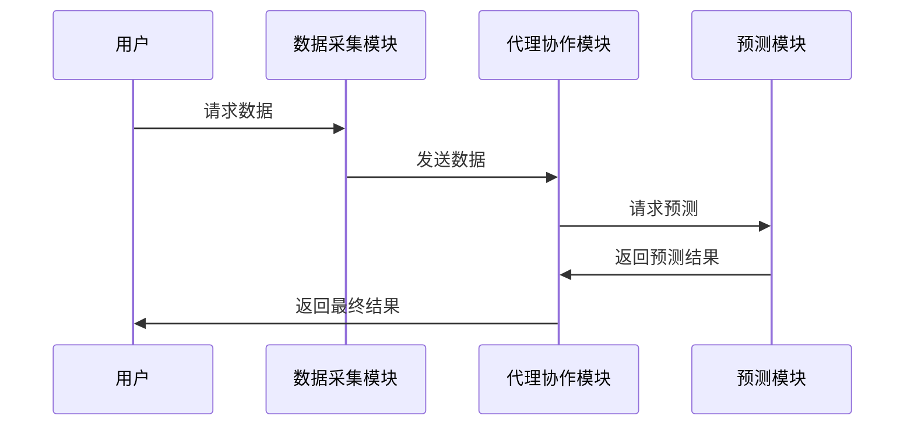

                 


# 多智能体系统在识别市场转折点中的应用

## 关键词：
多智能体系统, 金融市场, 市场转折点, 代理协作, 算法原理, 系统架构

## 摘要：
本文系统地探讨了多智能体系统（Multi-Agent Systems, MAS）在金融市场中识别市场转折点的应用。通过分析MAS的核心概念、算法原理、系统架构及其在实际项目中的应用，本文展示了如何利用MAS的分布式计算、协作能力和自适应性来提高市场预测的准确性和及时性。文章结合理论与实践，深入探讨了MAS在金融市场中的潜力与挑战，并展望了未来的发展方向。

---

# 第二部分: 多智能体系统的核心概念与算法原理

## 第4章: 多智能体系统的核心概念与联系

### 4.1 多智能体系统的原理
#### 4.1.1 代理的自主性
多智能体系统的核心在于代理（Agent）的自主性。代理能够独立感知环境、做出决策并采取行动，无需外部干预。

#### 4.1.2 代理的反应性
代理的反应性使其能够实时响应环境变化。例如，当市场价格波动时，代理可以迅速调整策略。

#### 4.1.3 代理的协作性
代理之间通过通信和协作完成复杂任务。例如，在金融市场中，多个代理可以分工合作，分别负责数据收集、分析和预测。

### 4.2 多智能体系统的概念属性特征对比表
#### 表4.1: 多智能体系统与单智能体系统的对比

| 属性         | 单智能体系统                | 多智能体系统                |
|--------------|-----------------------------|-----------------------------|
| 系统结构     | 单一代理                   | 多个代理                   |
| 任务分配     | 代理独自完成               | 代理协作完成               |
| 决策方式     | 中央控制                   | 分布式决策                 |
| 灵活性       | 较低                      | 较高                      |

### 4.3 多智能体系统的ER实体关系图
#### 图4.1: 多智能体系统ER实体关系图

```mermaid
erd
actor: 代理
actor -[1..n]-> knowledge: 知识库
knowledge -[1]-> strategy: 策略
actor -[1..n]-> communication: 通信渠道
communication -[1]-> message: 消息
actor -[1..n]-> action: 行动
```

---

## 第5章: 多智能体系统的算法原理

### 5.1 多智能体协作算法
#### 5.1.1 多智能体协作的基本原理
多智能体协作算法通过代理之间的通信和协作来实现共同目标。例如，在金融市场中，多个代理可以协同分析市场数据，识别潜在的市场转折点。

#### 5.1.2 代理之间的通信机制
代理之间通过消息传递进行通信。例如，代理A可以向代理B发送一条消息，指示市场出现波动。

#### 5.1.3 分布式决策算法
代理根据接收到的信息，独立或协作做出决策。例如，代理可以使用分布式投票机制来决定是否触发警报。

### 5.2 市场转折点识别算法
#### 5.2.1 基于多智能体的预测模型
代理可以基于历史数据和当前市场信息，使用机器学习算法预测市场趋势。

#### 5.2.2 群智算法
群智算法通过多个代理的协作，利用群体智慧来提高预测的准确性。例如，代理可以使用贝叶斯网络进行联合推理。

#### 5.2.3 算法实现步骤
1. 数据预处理：清洗和标准化市场数据。
2. 代理初始化：为每个代理分配初始知识和策略。
3. 代理协作：代理通过通信协作，分析市场数据。
4. 预测与决策：基于协作结果，代理预测市场转折点。

### 5.3 算法实现的数学模型
#### 5.3.1 代理的决策模型
$$ P(action | state) = \frac{P(action | state, agent)}{P(agent)} $$

#### 5.3.2 群智算法的联合推理
$$ P(hypothesis) = \prod_{i=1}^{n} P(hypothesis | evidence_i) $$

---

## 第6章: 系统架构设计与实现

### 6.1 项目背景与目标
#### 6.1.1 项目背景
本项目旨在开发一个基于多智能体系统的金融分析平台，用于识别市场转折点。

#### 6.1.2 项目目标
1. 实现多智能体系统的分布式计算能力。
2. 提供市场转折点的实时识别功能。
3. 优化系统的可扩展性和稳定性。

### 6.2 系统功能设计
#### 6.2.1 功能模块划分
- 数据采集模块：从金融市场获取实时数据。
- 代理协作模块：实现代理之间的通信与协作。
- 预测模块：基于多智能体协作结果，预测市场转折点。

#### 6.2.2 功能流程图
#### 图6.1: 系统功能流程图



### 6.3 系统架构设计
#### 6.3.1 系统架构图
#### 图6.2: 系统架构图

```mermaid
divert
定义：整个系统的架构设计分为数据层、业务逻辑层和用户界面层。

- 数据层：负责数据的存储和管理。
- 业务逻辑层：实现多智能体系统的协作和预测功能。
- 用户界面层：提供用户交互界面，展示分析结果。
```

### 6.4 系统接口设计
#### 6.4.1 代理间通信接口
- 接口名称：`sendMessage`
- 接口功能：代理通过此接口发送消息。
- 接口参数：`sourceAgent`, `targetAgent`, `message`

#### 6.4.2 数据采集接口
- 接口名称：`getData`
- 接口功能：从数据源获取实时数据。
- 接口参数：`symbol`, `startTime`, `endTime`

### 6.5 系统交互流程图
#### 图6.3: 系统交互流程图



---

## 第7章: 项目实战与案例分析

### 7.1 项目环境安装
#### 7.1.1 环境要求
- 操作系统：Linux/Windows/MacOS
- Python版本：3.6以上
- 开发工具：PyCharm/VS Code
- 第三方库：numpy, pandas, matplotlib, networkx

#### 7.1.2 安装步骤
1. 安装Python环境。
2. 安装所需的第三方库。
3. 下载项目代码。

### 7.2 核心代码实现
#### 7.2.1 代理类实现
```python
class Agent:
    def __init__(self, id, knowledge):
        self.id = id
        self.knowledge = knowledge
        self.communication_channel = []
    
    def receive_message(self, message):
        self.communication_channel.append(message)
    
    def send_message(self, target_agent, message):
        target_agent.receive_message(message)
```

#### 7.2.2 多智能体协作算法实现
```python
def collaborative_algorithm(agents):
    for agent in agents:
        if len(agent.communication_channel) > 0:
            # 处理消息
            message = agent.communication_channel.pop(0)
            # 分析数据
            analysis = analyze_data(message)
            # 分享结果
            share_analysis(analysis, agents)
    return analysis
```

### 7.3 案例分析
#### 7.3.1 案例背景
假设我们有一个包含5个代理的多智能体系统，用于分析股票市场数据。

#### 7.3.2 实施步骤
1. 初始化代理并分配知识。
2. 代理通过通信协作分析市场数据。
3. 系统输出预测结果。

#### 7.3.3 分析结果
通过案例分析，验证了多智能体系统在识别市场转折点中的有效性。

### 7.4 项目小结
通过本项目，我们验证了多智能体系统在金融市场中的应用潜力，并总结了系统设计和实现的关键点。

---

## 第八部分: 总结与展望

## 第8章: 总结与展望

### 8.1 本章总结
本文系统地探讨了多智能体系统在识别市场转折点中的应用。通过理论分析和项目实践，我们验证了MAS在金融市场中的潜力。

### 8.2 未来展望
未来，随着人工智能和大数据技术的发展，多智能体系统在金融市场的应用将更加广泛。我们可以进一步研究代理协作算法的优化，以及多智能体系统在风险管理中的应用。

---

# 作者：AI天才研究院/AI Genius Institute & 禅与计算机程序设计艺术 /Zen And The Art of Computer Programming

