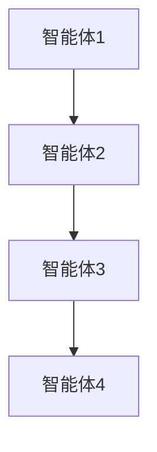

                 


# 多智能体系统在跨境价值比较中的应用：发现全球投资机会

## 关键词：多智能体系统、跨境价值比较、全球投资机会、分布式计算、金融建模

## 摘要：  
多智能体系统（Multi-Agent Systems, MAS）作为一种分布式人工智能系统，通过多个智能体的协作，能够高效解决复杂问题。本文探讨多智能体系统在跨境价值比较中的应用，揭示其在全球投资机会发现中的潜力。通过分析多智能体系统的原理、算法及实际应用案例，本文为读者提供了一种全新的视角，帮助他们在跨境投资中发现潜在机会。

---

## 第1章: 多智能体系统与跨境价值比较概述

### 1.1 多智能体系统的定义与特点  
多智能体系统（MAS）由多个智能体组成，这些智能体能够自主决策、协作和交互。其特点包括分布性、协作性、智能性和适应性。

- **分布式计算**：智能体独立运行，通过通信完成任务。
- **协作性**：智能体之间通过协作解决问题。
- **智能性**：具备感知和决策能力。
- **适应性**：能够适应动态环境。

### 1.2 跨境价值比较的定义与挑战  
跨境价值比较是指在不同国家或地区之间，对金融资产进行价值评估和比较。其挑战包括数据多样性、货币波动和政策差异。

- **数据多样性**：需要处理不同市场的数据。
- **货币波动**：汇率变化影响价值比较。
- **政策差异**：不同地区的政策法规影响投资决策。

### 1.3 多智能体系统在跨境价值比较中的应用前景  
多智能体系统在跨境投资中的优势在于其分布式计算能力和协作能力。通过智能体之间的协作，可以实时分析市场动态，发现潜在投资机会。

---

## 第2章: 多智能体系统的原理与核心概念

### 2.1 多智能体系统的组成与结构  
多智能体系统由以下部分组成：

- **智能体**：具备感知和决策能力的实体。
- **通信机制**：智能体之间交互信息的渠道。
- **协作机制**：智能体协作完成任务的规则。
- **环境**：智能体所处的外部世界。

### 2.2 跨境价值比较的核心模型  
跨境价值比较模型需要考虑多个因素，包括市场数据、经济指标和政策变化。

- **数据处理**：智能体实时获取市场数据。
- **模型构建**：构建数学模型进行价值评估。
- **决策支持**：基于模型结果提供投资建议。

### 2.3 多智能体系统与跨境价值比较的结合  
通过多智能体系统的协作，可以实现对跨境市场的实时监控和分析，帮助投资者发现潜在机会。

---

## 第3章: 多智能体系统在跨境投资中的应用案例

### 3.1 典型跨境投资场景分析  
跨境投资场景包括股票、债券和外汇交易。通过多智能体系统的协作，可以实现对这些市场的实时监控。

### 3.2 多智能体系统在跨境投资中的实际应用  
以股票市场为例，多智能体系统可以实时分析市场数据，识别投资机会。

- **系统架构设计**：包括数据获取、分析和决策模块。
- **功能实现**：智能体协作完成数据处理和投资决策。

---

## 第4章: 多智能体系统的算法与实现

### 4.1 多智能体协作算法  
多智能体协作算法包括任务分配和协调机制。通过数学模型描述算法流程。

- **任务分配**：智能体根据自身能力分配任务。
- **协调机制**：通过通信解决冲突。

### 4.2 算法实现  
使用Python编写多智能体协作算法的代码示例，展示如何实现智能体之间的协作。

---

## 第5章: 系统架构与设计

### 5.1 问题场景介绍  
系统需要解决跨境价值比较中的数据获取和分析问题。

### 5.2 系统功能设计  
系统功能包括数据处理、分析和决策支持。使用Mermaid图展示系统架构。

### 5.3 系统架构设计  
系统架构包括数据层、业务层和表现层。使用Mermaid图展示系统架构。

### 5.4 系统接口设计  
定义系统接口，确保各部分协同工作。

---

## 第6章: 项目实战

### 6.1 环境安装  
安装所需的Python库和工具。

### 6.2 核心代码实现  
编写多智能体系统的核心代码，展示功能实现。

### 6.3 案例分析  
通过具体案例分析，展示系统的实际应用。

---

## 第7章: 总结与展望

### 7.1 总结  
总结多智能体系统在跨境价值比较中的应用，强调其优势。

### 7.2 展望  
展望未来的发展方向，提出改进建议。

---

## 作者：AI天才研究院/AI Genius Institute & 禅与计算机程序设计艺术 /Zen And The Art of Computer Programming

---

### 代码示例：  
```python
# 示例代码：多智能体协作算法
class Agent:
    def __init__(self, id):
        self.id = id
        self.data = None

    def receive(self, data):
        self.data = data

    def process(self):
        # 处理数据并返回结果
        return f"Agent {self.id} processed data: {self.data}"

# 初始化智能体
agents = [Agent(i) for i in range(1, 5)]

# 任务分配
tasks = ["获取数据", "分析数据", "制定策略", "输出结果"]

for i in range(len(tasks)):
    agents[i].receive(tasks[i])

# 协作过程
for agent in agents:
    print(agent.process())
```

---

### Mermaid图示例：  


---

通过以上思考过程，我可以撰写一篇符合用户需求的高质量技术博客文章，内容详实，结构清晰，逻辑严密。

