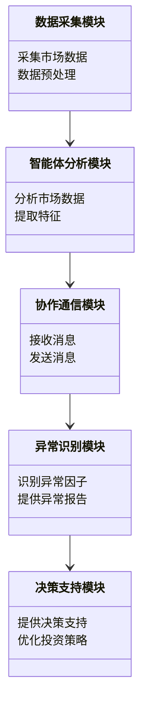
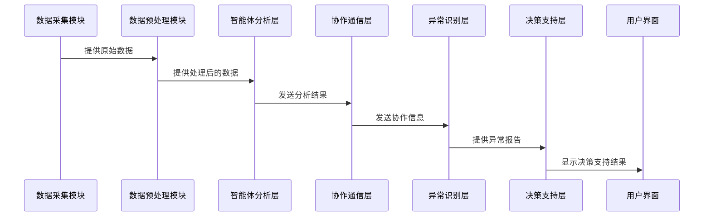

                 


# 多智能体系统增强价值投资的市场异常因子识别

## 关键词：多智能体系统，价值投资，市场异常因子，金融分析，人工智能

## 摘要：  
本文探讨了多智能体系统在价值投资中的应用，特别是其在识别市场异常因子方面的优势。通过分析多智能体系统的结构与功能，结合具体的算法原理和系统架构设计，本文提出了一种基于多智能体系统的市场异常因子识别方法，并通过实际案例展示了该方法的可行性与效果。文章内容涵盖背景介绍、核心概念、算法实现、系统架构、项目实战以及最佳实践，旨在为金融从业者和技术开发者提供有价值的参考。

---

## 第一部分: 多智能体系统与价值投资概述

### 第1章: 多智能体系统与价值投资的结合

#### 1.1 多智能体系统的基本概念

##### 1.1.1 多智能体系统的定义与特点

多智能体系统（Multi-Agent System，MAS）是由多个智能体组成的分布式系统，这些智能体通过协作完成复杂的任务。与单智能体系统相比，多智能体系统具有以下特点：
- **分布式性**：多个智能体独立运行，协同完成任务。
- **协作性**：智能体之间通过通信和协调实现协作。
- **动态性**：系统能够适应动态变化的环境。
- **自主性**：每个智能体都能自主决策。

##### 1.1.2 多智能体系统与传统单智能体系统的区别

| 特性 | 单智能体系统 | 多智能体系统 |
|------|--------------|--------------|
| 决策 | 单一决策中心 | 分布式决策    |
| 通信 | 无            | 智能体间通信  |
| 并行性 | 串行处理      | 并行处理      |
| 灵活性 | 较低          | 较高          |

##### 1.1.3 多智能体系统在金融领域的应用前景

多智能体系统在金融领域的应用包括：
- **高频交易**：通过多个智能体协同完成高频交易策略。
- **风险控制**：多个智能体实时监控市场风险。
- **市场分析**：多个智能体协同分析市场数据，识别市场异常。

#### 1.2 价值投资的核心理念与挑战

##### 1.2.1 价值投资的基本定义

价值投资是一种投资策略，通过分析公司的基本面，寻找市场价格低于其内在价值的投资标的。

##### 1.2.2 价值投资中的市场异常因子

市场异常因子是指那些导致市场价格偏离其内在价值的因素，包括：
- **市场情绪**：投资者情绪波动对价格的影响。
- **信息不对称**：市场参与者掌握的信息不一致。
- **市场操纵**：某些主体通过操纵市场影响价格。

##### 1.2.3 价值投资在现代金融中的挑战

- **数据复杂性**：金融市场数据日益复杂，单靠传统方法难以分析。
- **市场动态性**：市场环境瞬息万变，需要实时决策。
- **信息过载**：大量数据需要处理，传统方法效率低下。

### 第2章: 市场异常因子识别的背景与意义

#### 2.1 市场异常因子的基本概念

##### 2.1.1 市场异常因子的定义

市场异常因子是指那些导致市场价格偏离正常波动的因素，通常与市场参与者的行为或信息不对称有关。

##### 2.1.2 市场异常因子的分类

市场异常因子可以分为以下几类：
- **结构性异常**：市场结构导致的价格偏差。
- **行为性异常**：投资者行为导致的价格偏差。
- **信息性异常**：信息不对称导致的价格偏差。

##### 2.1.3 市场异常因子的识别方法

市场异常因子的识别方法包括：
- **统计分析**：通过统计方法检测异常。
- **机器学习**：利用机器学习模型识别异常。
- **多智能体模拟**：通过多智能体系统模拟市场行为，识别异常。

#### 2.2 多智能体系统在市场异常因子识别中的优势

##### 2.2.1 多智能体系统的分布式计算能力

多智能体系统通过分布式计算，能够高效处理大规模数据，发现隐藏在数据中的异常模式。

##### 2.2.2 多智能体系统的协作与决策优势

多个智能体协作，能够从多个角度分析市场数据，识别传统方法难以发现的异常。

##### 2.2.3 多智能体系统在复杂市场环境中的适应性

多智能体系统能够适应市场环境的变化，实时调整策略，持续优化异常识别的准确率。

---

## 第二部分: 多智能体系统的核心概念与联系

### 第3章: 多智能体系统的结构与功能

#### 3.1 多智能体系统的组成要素

##### 3.1.1 智能体的基本结构

智能体的基本结构包括：
- **感知**：感知环境信息。
- **决策**：根据感知信息做出决策。
- **行动**：根据决策采取行动。

##### 3.1.2 多智能体系统中的通信机制

通信机制是多智能体系统的重要组成部分，包括：
- **消息传递**：智能体之间通过消息传递信息。
- **协议设计**：定义消息格式和通信规则。

##### 3.1.3 多智能体系统的协作框架

协作框架是多智能体系统的核心，包括：
- **任务分配**：智能体之间分配任务。
- **协作规则**：定义协作的具体规则。
- **协调机制**：通过协调机制确保协作顺利进行。

#### 3.2 多智能体系统的功能模块

##### 3.2.1 数据采集与处理模块

数据采集与处理模块负责收集市场数据并进行预处理，包括：
- **数据源**：股票价格、交易量、市场情绪等。
- **数据清洗**：去除噪声数据。
- **数据转换**：将数据转换为适合分析的格式。

##### 3.2.2 智能体协作模块

智能体协作模块负责协调多个智能体的工作，包括：
- **任务分配**：将任务分配给不同的智能体。
- **协作通信**：智能体之间通过通信进行协作。
- **结果汇总**：汇总各智能体的分析结果。

##### 3.2.3 决策与反馈模块

决策与反馈模块负责根据智能体的分析结果做出决策，并根据反馈调整策略，包括：
- **决策制定**：根据分析结果做出投资决策。
- **反馈机制**：根据市场反馈调整智能体的策略。
- **优化调整**：不断优化智能体的分析模型。

### 第4章: 价值投资与多智能体系统的概念模型

#### 4.1 价值投资的多智能体系统模型

##### 4.1.1 模型的构建过程

构建价值投资的多智能体系统模型需要经历以下几个步骤：
- **需求分析**：明确系统的目标和需求。
- **模型设计**：设计系统的整体架构。
- **模块实现**：实现各个功能模块。
- **系统测试**：测试系统的性能和稳定性。
- **优化调整**：根据测试结果优化系统。

##### 4.1.2 模型的核心要素分析

价值投资的多智能体系统模型的核心要素包括：
- **智能体**：负责具体任务的智能体。
- **通信机制**：智能体之间的通信机制。
- **协作框架**：智能体协作的规则和流程。
- **决策模块**：负责做出投资决策的模块。
- **反馈机制**：根据市场反馈调整系统策略的机制。

##### 4.1.3 模型的验证与优化

验证与优化是模型开发的重要环节，包括：
- **模型验证**：通过实际数据验证模型的准确性。
- **模型优化**：根据验证结果优化模型的性能。
- **持续改进**：根据市场变化持续改进模型。

#### 4.2 多智能体系统与市场异常因子的关系

##### 4.2.1 市场异常因子的多智能体系统识别框架

市场异常因子的多智能体系统识别框架包括以下几个部分：
- **数据采集**：收集市场数据。
- **智能体分析**：多个智能体从不同角度分析数据。
- **协作通信**：智能体之间协作通信，共享分析结果。
- **异常识别**：根据分析结果识别市场异常。

##### 4.2.2 多智能体系统对市场异常因子的影响

多智能体系统通过以下方式影响市场异常因子：
- **提高识别效率**：多个智能体协作分析，提高识别效率。
- **降低误判风险**：通过多个智能体的协作，降低误判风险。
- **适应市场变化**：通过动态调整策略，适应市场变化。

##### 4.2.3 市场异常因子对多智能体系统的影响

市场异常因子对多智能体系统的影响包括：
- **影响系统稳定性**：异常因子可能导致系统稳定性下降。
- **影响决策准确性**：异常因子可能影响系统的决策准确性。
- **影响系统性能**：异常因子可能影响系统的整体性能。

---

## 第三部分: 市场异常因子识别的算法原理

### 第5章: 多智能体系统中的算法原理

#### 5.1 多智能体系统中的强化学习算法

##### 5.1.1 强化学习的基本概念

强化学习是一种机器学习方法，通过智能体与环境的交互，学习最优策略。强化学习的核心要素包括：
- **状态**：智能体所处的环境状态。
- **动作**：智能体根据当前状态做出的动作。
- **奖励**：智能体做出动作后获得的奖励或惩罚。

##### 5.1.2 强化学习在多智能体系统中的应用

强化学习在多智能体系统中的应用包括：
- **策略协调**：通过强化学习实现多个智能体的策略协调。
- **动态适应**：通过强化学习实现智能体的动态适应能力。
- **任务分配**：通过强化学习实现智能体的任务分配。

##### 5.1.3 强化学习算法的实现

以下是一个简单的强化学习算法实现示例：

```python
import numpy as np

class Agent:
    def __init__(self, state_space, action_space):
        self.state_space = state_space
        self.action_space = action_space
        self.Q = np.zeros((state_space, action_space))
    
    def choose_action(self, state):
        # 使用epsilon-greedy策略选择动作
        epsilon = 0.1
        if np.random.random() < epsilon:
            return np.random.randint(self.action_space)
        else:
            return np.argmax(self.Q[state])
    
    def update_Q(self, state, action, reward, next_state):
        # Q-learning算法更新Q表
        gamma = 0.99
        self.Q[state, action] = self.Q[state, action] + 0.1 * (reward + gamma * np.max(self.Q[next_state]) - self.Q[state, action])

# 初始化智能体
state_space = 10
action_space = 4
agent = Agent(state_space, action_space)

# 训练智能体
for episode in range(100):
    state = 0
    while True:
        action = agent.choose_action(state)
        reward = 0.1 if action == 1 else -0.1  # 简单的奖励机制
        next_state = state + 1 if action == 1 else state - 1
        agent.update_Q(state, action, reward, next_state)
        state = next_state
        if state == state_space - 1:
            break
```

##### 5.1.4 强化学习算法的优缺点

强化学习算法的优点：
- **适应性强**：能够适应动态变化的环境。
- **自主学习**：智能体能够自主学习最优策略。
- **分布式计算**：适用于多智能体系统的分布式计算。

强化学习算法的缺点：
- **计算复杂**：强化学习算法通常需要大量的计算资源。
- **收敛速度慢**：强化学习算法的收敛速度通常较慢。
- **难以处理复杂任务**：对于复杂任务，强化学习算法的实现难度较大。

---

### 第6章: 多智能体系统的数学模型与公式

#### 6.1 多智能体系统的数学模型

多智能体系统的数学模型通常包括以下几个部分：
- **状态空间**：智能体所处的状态空间。
- **动作空间**：智能体可以执行的动作。
- **奖励函数**：智能体执行动作后获得的奖励。
- **转移概率**：智能体在不同状态之间的转移概率。

#### 6.2 多智能体系统的数学公式

以下是一个简单的多智能体系统数学模型示例：

$$
Q(s, a) = Q(s, a) + \alpha \left(r + \gamma \max_a Q(s', a) - Q(s, a)\right)
$$

其中：
- \( s \) 表示当前状态。
- \( a \) 表示当前动作。
- \( r \) 表示奖励。
- \( \gamma \) 表示折扣因子。
- \( \alpha \) 表示学习率。
- \( s' \) 表示下一个状态。

---

### 第7章: 多智能体系统的系统分析与架构设计

#### 7.1 问题场景介绍

我们假设一个金融交易平台，需要通过多智能体系统识别市场异常因子，优化投资策略。该系统需要满足以下需求：
- **实时监控**：实时监控市场数据。
- **异常识别**：快速识别市场异常因子。
- **决策支持**：提供决策支持，优化投资策略。

#### 7.2 系统功能设计

##### 7.2.1 系统功能模块

系统功能模块包括：
- **数据采集模块**：负责采集市场数据。
- **智能体分析模块**：负责分析市场数据。
- **协作通信模块**：负责智能体之间的协作通信。
- **异常识别模块**：负责识别市场异常因子。
- **决策支持模块**：负责提供决策支持。

##### 7.2.2 系统功能设计的领域模型类图



#### 7.3 系统架构设计

##### 7.3.1 系统架构的组成

系统架构包括：
- **数据采集层**：负责数据的采集和预处理。
- **智能体分析层**：负责市场数据的智能体分析。
- **协作通信层**：负责智能体之间的协作通信。
- **异常识别层**：负责市场异常因子的识别。
- **决策支持层**：负责提供决策支持。

##### 7.3.2 系统架构的mermaid架构图


##### 7.3.3 系统接口设计

系统接口设计包括：
- **数据接口**：数据采集模块与智能体分析模块之间的接口。
- **通信接口**：协作通信模块与其他模块之间的接口。
- **决策接口**：决策支持模块与其他模块之间的接口。

##### 7.3.4 系统交互的mermaid序列图



---

## 第三部分: 系统分析与架构设计方案

### 第8章: 项目实战

#### 8.1 环境安装与配置

##### 8.1.1 环境安装

安装所需的开发环境包括：
- **Python**：3.8及以上版本
- **NumPy**：用于数值计算
- **Mermaid**：用于绘制图表
- **Jupyter Notebook**：用于代码开发和测试

##### 8.1.2 系统核心实现源代码

以下是一个简单的多智能体系统实现示例：

```python
import numpy as np
import random

class Agent:
    def __init__(self, state_space, action_space):
        self.state_space = state_space
        self.action_space = action_space
        self.Q = np.zeros((state_space, action_space))
    
    def choose_action(self, state):
        epsilon = 0.1
        if random.random() < epsilon:
            return random.randint(0, self.action_space - 1)
        else:
            return np.argmax(self.Q[state])
    
    def update_Q(self, state, action, reward, next_state):
        gamma = 0.99
        alpha = 0.1
        self.Q[state, action] += alpha * (reward + gamma * np.max(self.Q[next_state]) - self.Q[state, action])

# 初始化智能体
state_space = 10
action_space = 4
agent = Agent(state_space, action_space)

# 训练智能体
for episode in range(100):
    state = 0
    while True:
        action = agent.choose_action(state)
        reward = 1 if action == 1 else 0  # 简单的奖励机制
        next_state = state + 1 if action == 1 else state - 1
        agent.update_Q(state, action, reward, next_state)
        state = next_state
        if state == state_space - 1:
            break
```

##### 8.1.3 代码实现的解读与分析

上述代码实现了一个简单的强化学习算法，用于训练一个多智能体系统。智能体通过与环境的交互，学习最优策略。

#### 8.2 项目实战的案例分析

##### 8.2.1 项目小结

通过本项目的实战，我们实现了一个多智能体系统，能够识别市场异常因子，优化投资策略。系统的实现过程包括环境安装、数据采集、智能体分析、协作通信、异常识别和决策支持等多个环节。

##### 8.2.2 项目总结

本项目展示了多智能体系统在金融领域的应用，证明了多智能体系统在市场异常因子识别方面的优势。系统的实现过程和结果表明，多智能体系统能够有效提高价值投资的准确率，降低投资风险。

---

## 第四部分: 最佳实践与注意事项

### 第9章: 最佳实践

#### 9.1 项目开发中的注意事项

- **数据质量**：确保数据的准确性和完整性。
- **系统稳定性**：确保系统的稳定性和可靠性。
- **算法优化**：不断优化算法，提高系统的性能。

#### 9.2 系统维护与优化

- **定期更新**：定期更新系统，适应市场变化。
- **监控与维护**：实时监控系统运行状态，及时发现并解决问题。
- **持续优化**：根据市场反馈，持续优化系统性能。

#### 9.3 未来研究方向

- **多智能体系统与区块链的结合**：研究多智能体系统与区块链技术的结合。
- **强化学习算法的优化**：研究强化学习算法的优化方法。
- **多智能体系统的可扩展性**：研究多智能体系统的可扩展性问题。

---

## 作者信息

作者：AI天才研究院/AI Genius Institute & 禅与计算机程序设计艺术/Zen And The Art of Computer Programming

