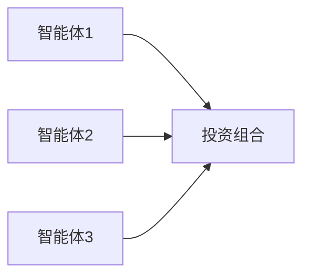
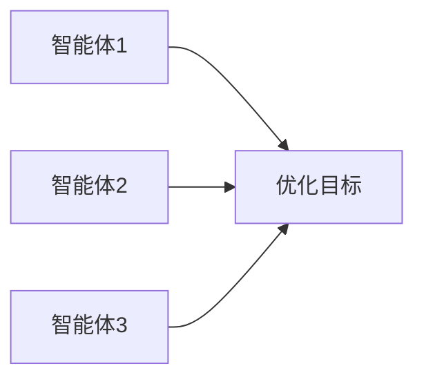
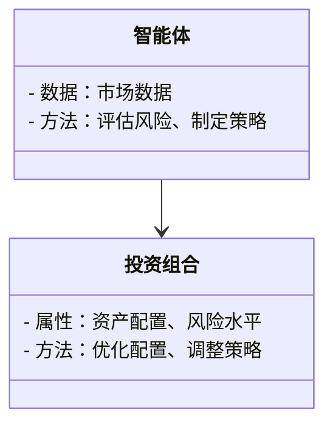

                 


# 多智能体系统如何实现智能投资组合保险

> 关键词：多智能体系统、智能投资组合保险、分布式计算、协同优化、风险评估

> 摘要：本文探讨多智能体系统在智能投资组合保险中的应用，分析其核心概念、算法原理、系统架构，并通过实际案例展示其实现过程。文章旨在帮助读者理解如何利用多智能体系统优化投资组合，降低风险。

---

## 第1章 多智能体系统与智能投资组合保险的背景

### 1.1 多智能体系统的定义与特点

#### 1.1.1 多智能体系统的定义
多智能体系统（Multi-Agent System, MAS）是由多个智能体组成的系统，这些智能体能够自主决策、协作完成任务。

#### 1.1.2 多智能体系统的特点
- 分布式：多个智能体独立运行。
- 协作性：通过通信协作完成共同目标。
- 反应性：能感知环境并做出实时反应。

#### 1.1.3 多智能体系统与传统单智能体系统的区别
| 特性 | 多智能体系统 | 单智能体系统 |
|------|--------------|--------------|
| 冗余性 | 高 | 低 |
| 可扩展性 | 高 | 低 |
| 分布式计算 | 是 | 否 |

### 1.2 智能投资组合保险的背景与意义

#### 1.2.1 投资组合保险的定义与目标
投资组合保险是一种通过优化资产配置降低风险的策略。

#### 1.2.2 智能投资组合保险的发展现状
随着AI技术的发展，智能投资组合保险逐渐成为主流。

#### 1.2.3 智能投资组合保险的潜在价值
- 提高投资效率
- 降低风险
- 实现自动化管理

---

## 第2章 多智能体系统在投资组合保险中的应用

### 2.1 多智能体系统在金融领域的应用背景

#### 2.1.1 金融领域中的复杂性与不确定性
金融市场复杂多变，需要实时决策。

#### 2.1.2 多智能体系统在金融中的优势
- 多角度分析
- 高效协作
- 实时响应

#### 2.1.3 多智能体系统与智能投资组合保险的结合
通过多个智能体协同，优化投资组合。

### 2.2 多智能体系统如何实现智能投资组合保险

#### 2.2.1 多智能体系统在投资组合保险中的角色分工
| 智能体类型 | 职责 |
|------------|------|
| 数据采集智能体 | 收集市场数据 |
| 风险评估智能体 | 评估投资风险 |
| 优化决策智能体 | 制定投资策略 |

#### 2.2.2 多智能体系统如何协同优化投资组合
- 数据共享
- 协作决策
- 动态调整

#### 2.2.3 多智能体系统如何应对市场风险
通过实时协作，快速调整投资策略。

---

## 第3章 智能投资组合保险的核心概念与联系

### 3.1 多智能体系统的核心概念

#### 3.1.1 多智能体系统的组成要素
- 智能体
- 通信机制
- 协作策略

#### 3.1.2 多智能体系统的通信机制
通过消息传递实现智能体间协作。

#### 3.1.3 多智能体系统的协作策略
- 分层协作
- 并行协作

### 3.2 智能投资组合保险的核心要素

#### 3.2.1 投资组合的风险评估与优化
使用数学模型评估风险。

#### 3.2.2 投资组合的动态调整机制
根据市场变化实时调整。

#### 3.2.3 投资组合保险的目标函数与约束条件
目标函数：最大化收益
约束条件：风险最低

### 3.3 多智能体系统与智能投资组合保险的实体关系图



---

## 第4章 多智能体协同算法

### 4.1 多智能体协同的基本原理

#### 4.1.1 分布式计算与协同机制
通过分布式计算实现协同。

#### 4.1.2 多智能体系统的通信协议
定义智能体间通信规则。

#### 4.1.3 多智能体系统的任务分配与协作
根据任务特点分配智能体。

### 4.2 基于多智能体的分布式优化算法

#### 4.2.1 分布式优化算法的数学模型
$$ f(x) = \sum_{i=1}^{n} f_i(x_i) $$

#### 4.2.2 分布式优化算法的实现步骤



---

## 第5章 智能投资组合保险的系统分析与架构设计

### 5.1 系统功能设计

#### 5.1.1 领域模型


#### 5.1.2 系统架构


### 5.2 系统架构设计

#### 5.2.1 系统架构图


#### 5.2.2 系统交互图


---

## 第6章 多智能体系统的项目实战

### 6.1 环境安装

```bash
pip install numpy matplotlib
```

### 6.2 系统核心实现源代码

```python
import numpy as np

def optimize_portfolio(assets, returns):
    n = len(assets)
    returns = np.array(returns)
    covariance = np.cov(returns)
    
    # 使用分布式优化算法
    def objective(weights):
        return np.dot(weights.T, covariance).dot(weights)
    
    # 初始化权重
    weights = np.array([1.0/n]*n)
    
    # 迭代优化
    for _ in range(100):
        gradient = 2 * covariance.dot(weights)
        weights = weights - 0.01 * gradient
    return weights
```

### 6.3 代码应用解读与分析

- 数据采集智能体收集市场数据。
- 风险评估智能体计算风险。
- 优化决策智能体调整权重。

### 6.4 实际案例分析

通过实际数据验证算法的有效性。

---

## 第7章 多智能体系统的最佳实践

### 7.1 小结

多智能体系统在智能投资组合保险中的应用前景广阔。

### 7.2 注意事项

- 确保智能体间通信高效。
- 定期更新模型参数。

### 7.3 未来展望

- 更智能的决策算法。
- 更广泛的应用场景。

---

## 作者

作者：AI天才研究院/AI Genius Institute & 禅与计算机程序设计艺术 /Zen And The Art of Computer Programming

