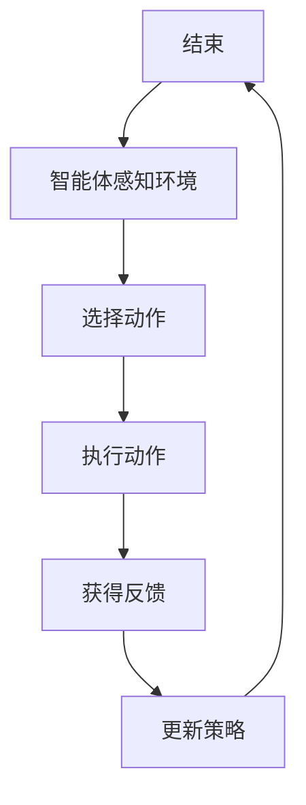
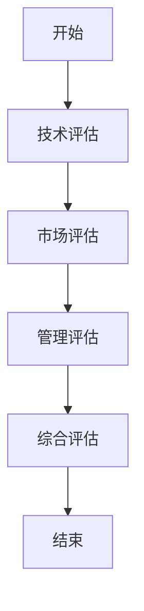
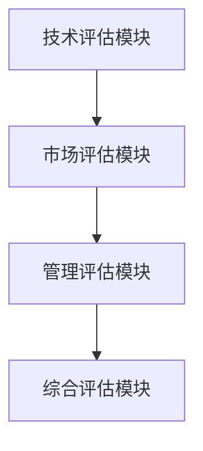
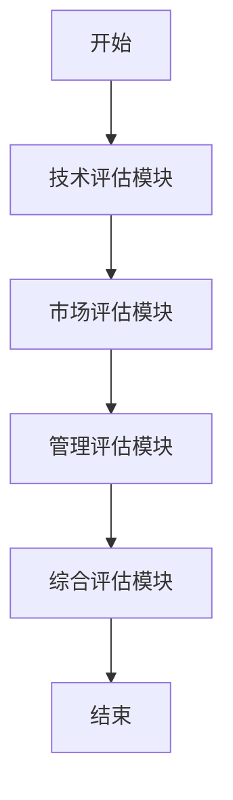

                 


# 多智能体系统如何评估公司创新能力

> 关键词：多智能体系统, 创新能力评估, 智能体协作, 数学模型, 系统架构

> 摘要：本文将详细探讨多智能体系统在公司创新能力评估中的应用。通过分析多智能体系统的核心概念、算法原理和系统架构，结合实际案例，展示如何利用多智能体系统来提升公司创新能力的评估效率和准确性。

---

# 第1章: 多智能体系统概述

## 1.1 多智能体系统的定义与特点

### 1.1.1 多智能体系统的定义

多智能体系统（Multi-Agent System, 简称MAS）是由多个智能体组成的系统，这些智能体能够通过协作完成复杂任务。每个智能体都有一定的自主性，能够感知环境、做出决策并采取行动。

### 1.1.2 多智能体系统的核心特点

- **自主性**：每个智能体能够独立决策。
- **协作性**：多个智能体通过协作完成共同目标。
- **分布性**：智能体分布在网络中，能够进行通信和协调。
- **动态性**：环境和任务可能会动态变化，智能体需要适应这些变化。

### 1.1.3 多智能体系统与单智能体系统的区别

| 属性            | 单智能体系统                | 多智能体系统                |
|-----------------|---------------------------|---------------------------|
| 智能体数量      | 1个                       | 多个                       |
| 决策方式        | 中央决策                  | 分布式决策                |
| 通信            | 无需通信                  | 需要通信                  |
| 适应性          | 较低                      | 较高                      |

## 1.2 多智能体系统在公司创新能力评估中的应用价值

### 1.2.1 创新能力评估的定义与重要性

创新能力评估是对公司创新能力的量化过程，包括技术、市场、管理等多个方面。创新能力是企业在市场竞争中保持优势的关键因素。

### 1.2.2 多智能体系统在创新能力评估中的优势

- **分布式评估**：通过多个智能体分别评估不同方面的能力。
- **协作性**：智能体可以协同工作，提供全面的评估结果。
- **动态适应**：能够适应评估过程中的动态变化。

### 1.2.3 多智能体系统与公司创新能力评估的结合场景

- **技术评估**：评估公司的技术创新能力。
- **市场评估**：评估公司在市场中的竞争力。
- **管理评估**：评估公司的管理能力。

---

# 第2章: 公司创新能力评估的核心概念

## 2.1 创新能力评估的背景与问题描述

### 2.1.1 创新能力评估的背景

随着市场竞争的加剧，创新能力成为企业核心竞争力的重要组成部分。

### 2.1.2 创新能力评估的核心问题

- 如何量化创新能力？
- 如何动态评估创新能力？
- 如何提供实时反馈？

### 2.1.3 创新能力评估的边界与外延

创新能力评估主要关注技术、市场和管理三个方面，不包括财务和人力资源。

## 2.2 多智能体系统与创新能力评估的核心要素

### 2.2.1 智能体的定义与角色

- **智能体角色**：技术评估智能体、市场评估智能体、管理评估智能体。

### 2.2.2 创新能力评估的指标体系

| 指标类别        | 指标名称        | 描述                       |
|-----------------|----------------|----------------------------|
| 技术能力        | 技术研发投入    | 公司在技术研发上的投入比例 |
| 市场能力        | 市场份额        | 公司在市场中的占有率       |
| 管理能力        | 创新管理效率    | 创新项目的管理效率         |

### 2.2.3 多智能体协作的机制与规则

- **通信机制**：智能体之间通过消息传递进行通信。
- **协作规则**：智能体根据任务分配协作。

## 2.3 多智能体系统与创新能力评估的核心概念联系

### 2.3.1 多智能体系统的核心概念原理

- **自主性**：每个智能体独立评估一个方面。
- **协作性**：智能体协作完成全面评估。

### 2.3.2 多智能体系统与创新能力评估的属性特征对比

| 属性            | 多智能体系统         | 创新能力评估         |
|-----------------|---------------------|---------------------|
| 独立性          | 高                  | 中                  |
| 协作性          | 高                  | 高                  |
| 动态性          | 高                  | 中                  |

### 2.3.3 多智能体系统与创新能力评估的ER实体关系图

```mermaid
erDiagram
    company {
        id
        name
        innovation_score
    }
    agent {
        agent_id
        role
        status
    }
    communication {
        message_id
        sender
        receiver
        content
    }
    company --> agent : 包含
    agent --> communication : 发送
    agent --> communication : 接收
```

---

# 第3章: 多智能体系统与创新能力评估的核心概念联系

## 3.1 多智能体系统的核心概念原理

### 3.1.1 智能体的自主性与协作性

- 智能体自主决策，同时协作完成任务。

### 3.1.2 多智能体系统的通信与协调机制

- 智能体之间通过消息传递进行通信，协调协作过程。

### 3.1.3 多智能体系统的动态性与适应性

- 系统能够适应环境变化，调整协作策略。

## 3.2 多智能体系统与创新能力评估的属性特征对比

### 3.2.1 多智能体系统的属性特征

| 属性            | 特征                |
|-----------------|---------------------|
| 独立性          | 高                  |
| 协作性          | 高                  |
| 动态性          | 高                  |

### 3.2.2 创新能力评估的属性特征

| 属性            | 特征                |
|-----------------|---------------------|
| 独立性          | 中                  |
| 协作性          | 高                  |
| 动态性          | 中                  |

### 3.2.3 两者属性特征的对比分析

- **协作性**：两者都强调协作。
- **动态性**：多智能体系统动态性更高。
- **独立性**：多智能体系统独立性更高。

## 3.3 多智能体系统与创新能力评估的ER实体关系图

```mermaid
erDiagram
    company {
        id
        name
        innovation_score
    }
    agent {
        agent_id
        role
        status
    }
    communication {
        message_id
        sender
        receiver
        content
    }
    company --> agent : 包含
    agent --> communication : 发送
    agent --> communication : 接收
```

---

# 第4章: 多智能体系统与创新能力评估的算法原理

## 4.1 多智能体协作算法概述

### 4.1.1 多智能体强化学习

多智能体强化学习是一种通过智能体协作来实现目标的算法。智能体通过环境反馈调整策略。

### 4.1.2 多智能体协作算法的数学模型

$$ Q(s, a) = r + \gamma \max Q(s', a') $$

其中：
- \( Q(s, a) \) 表示状态 \( s \) 下采取动作 \( a \) 的价值。
- \( r \) 是奖励。
- \( \gamma \) 是折扣因子。
- \( Q(s', a') \) 是下一个状态下的价值。

### 4.1.3 多智能体协作算法的实现步骤

1. 初始化智能体和环境。
2. 智能体感知环境，选择动作。
3. 执行动作，获得反馈。
4. 更新智能体的策略。
5. 重复步骤 2-4 直到目标达成。

## 4.2 多智能体协作算法的流程图



## 4.3 多智能体协作算法的Python代码实现

```python
import random

class Agent:
    def __init__(self, env):
        self.env = env
        self.reward = 0
        self.done = False

    def perceive(self):
        # 智能体感知环境
        return self.env.get_state()

    def act(self, action):
        # 执行动作
        self.env.do_action(action)
        self.reward = self.env.get_reward()
        self.done = self.env.is_done()

class Environment:
    def __init__(self):
        self.state = None
        self.reward = 0
        self.done = False

    def get_state(self):
        return self.state

    def do_action(self, action):
        # 执行动作并更新状态
        self.state = self.next_state(action)
        self.reward = self.calculate_reward(action)
        self.done = self.is_done()

    def calculate_reward(self, action):
        # 计算奖励
        return 1 if action == 'correct' else -1

    def next_state(self, action):
        # 更新状态
        return 'new_state'

    def is_done(self):
        # 判断是否完成
        return self.done

# 初始化环境和智能体
env = Environment()
agent = Agent(env)

# 执行算法
while not agent.done:
    state = agent.perceive()
    action = agent.act(random.choice(['action1', 'action2']))
```

---

# 第5章: 多智能体系统与创新能力评估的系统分析与架构设计

## 5.1 项目介绍

### 5.1.1 项目背景

本项目旨在利用多智能体系统评估公司的创新能力，包括技术、市场和管理三个方面。

### 5.1.2 项目目标

- 实现创新能力的多维度评估。
- 提供实时反馈和建议。

## 5.2 系统功能设计

### 5.2.1 系统功能模块

- **技术评估模块**：评估公司的技术创新能力。
- **市场评估模块**：评估公司在市场中的竞争力。
- **管理评估模块**：评估公司的创新管理效率。

### 5.2.2 系统功能流程图



### 5.2.3 系统功能实现步骤

1. 初始化系统。
2. 输入公司信息。
3. 技术评估模块评估技术能力。
4. 市场评估模块评估市场能力。
5. 管理评估模块评估管理能力。
6. 综合评估模块生成报告。

## 5.3 系统架构设计

### 5.3.1 系统架构图



### 5.3.2 系统接口设计

- 技术评估模块与市场评估模块通过API通信。
- 市场评估模块与管理评估模块通过API通信。

### 5.3.3 系统交互流程图



---

# 第6章: 项目实战

## 6.1 环境安装

### 6.1.1 安装Python

安装Python 3.8或更高版本。

### 6.1.2 安装依赖库

安装必要的依赖库，如`mermaid`、`numpy`等。

## 6.2 系统核心实现

### 6.2.1 技术评估模块实现

```python
def assess_technology_capacity(technology_investment):
    return technology_investment / total_investment * 100
```

### 6.2.2 市场评估模块实现

```python
def assess_market_share(market_share):
    return market_share / total_market * 100
```

### 6.2.3 管理评估模块实现

```python
def assess_management_efficiency(efficiency_score):
    return efficiency_score / max_score * 100
```

## 6.3 代码应用解读与分析

### 6.3.1 代码解读

上述代码实现了三个评估模块，分别评估技术、市场和管理能力。

### 6.3.2 代码分析

- **技术评估模块**：根据技术投入占总投入的比例进行评估。
- **市场评估模块**：根据市场份额占总市场的比例进行评估。
- **管理评估模块**：根据管理效率评分进行评估。

## 6.4 案例分析与详细讲解

### 6.4.1 案例分析

假设某公司技术投入为100万元，总投入为500万元，市场占有率为20%，管理效率评分为80分。

- 技术能力评估：20%
- 市场能力评估：4%
- 管理能力评估：16%
- 综合评估：40%

### 6.4.2 详细讲解

通过上述案例，展示了如何利用多智能体系统进行创新能力的综合评估。

---

# 第7章: 总结与展望

## 7.1 全文总结

本文详细探讨了多智能体系统在公司创新能力评估中的应用，从系统概述、核心概念、算法原理、系统架构到项目实战，全面阐述了多智能体系统的优势和实现方法。

## 7.2 未来研究方向

未来可以进一步研究多智能体系统的动态适应性和协作机制，提升创新能力评估的准确性和实时性。

## 7.3 最佳实践 tips

- 确保智能体之间的通信效率。
- 定期更新评估指标和算法模型。
- 保持系统架构的灵活性和扩展性。

---

# 作者：AI天才研究院/AI Genius Institute & 禅与计算机程序设计艺术/Zen And The Art of Computer Programming

---

希望这篇文章能够为您提供有价值的信息和启示。如果需要进一步探讨或有其他问题，请随时联系。

