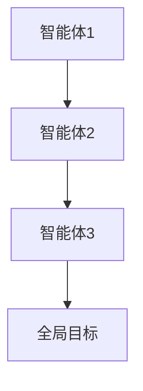
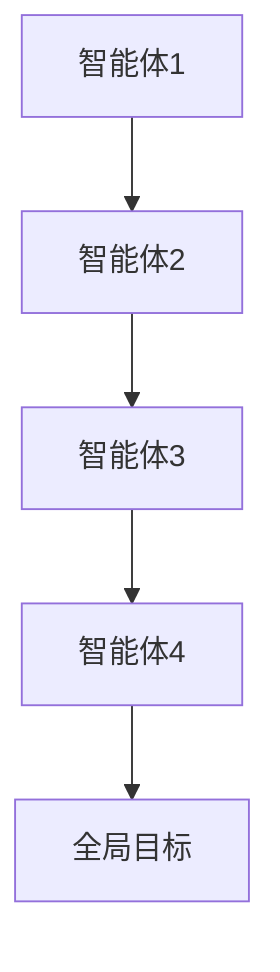
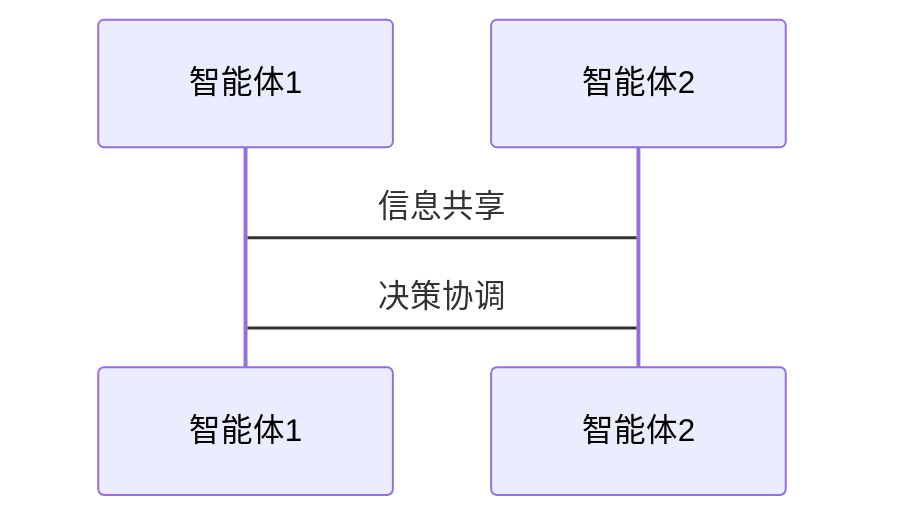

                 


# 多智能体系统如何评估公司的长期竞争优势

> 关键词：多智能体系统，企业竞争优势，分布式AI，协作学习，系统架构

> 摘要：本文深入探讨了多智能体系统在评估公司长期竞争优势中的应用，通过分析多智能体系统的核心概念、算法原理、系统架构以及实际项目案例，详细阐述了如何利用多智能体系统来优化企业内部协作、行业竞争分析和供应链管理，从而帮助企业建立长期竞争优势。

---

## 第一部分: 多智能体系统与企业竞争优势概述

### 第1章: 多智能体系统概述

#### 1.1 多智能体系统的基本概念

##### 1.1.1 智能体的定义与特征
智能体（Agent）是指能够感知环境并采取行动以实现目标的实体。智能体具有以下特征：
- **自主性**：能够自主决策。
- **反应性**：能够感知环境并实时响应。
- **目标导向性**：通过目标驱动行动。
- **协作性**：能够与其他智能体协作。

##### 1.1.2 多智能体系统的定义与特点
多智能体系统（Multi-Agent System, MAS）是由多个智能体组成的系统，这些智能体能够通过协作和竞争完成复杂的任务。其特点包括：
- **分布式性**：智能体分布在网络中，不依赖中央控制。
- **协作性**：智能体之间可以通过协作实现共同目标。
- **动态性**：环境和任务需求动态变化。

##### 1.1.3 多智能体系统与单智能体系统的区别
通过对比表展示两者的区别：

| 特性             | 单智能体系统            | 多智能体系统            |
|------------------|-----------------------|-----------------------|
| 结构             | 集中式结构             | 分布式结构             |
| 决策             | 单点决策               | 分布式决策             |
| 协作             | 无协作或单点协作       | 多点协作               |
| 灵活性           | 较低                   | 较高                   |

#### 1.2 多智能体系统的应用场景

##### 1.2.1 企业内部协作优化
多智能体系统可以优化企业的内部协作流程，例如供应链管理、项目管理和团队协作。

##### 1.2.2 行业竞争分析
通过多智能体系统，可以分析行业内各企业的竞争策略，帮助企业制定更有效的市场策略。

##### 1.2.3 跨组织合作与供应链优化
多智能体系统可以实现跨组织的合作，优化供应链管理，提高整体效率。

---

### 第2章: 多智能体系统的核心概念与联系

#### 2.1 多智能体系统的核心要素

##### 2.1.1 智能体
智能体是多智能体系统的基本单元，负责执行特定任务。

##### 2.1.2 环境
环境是智能体所处的外部世界，包括物理环境和任务环境。

##### 2.1.3 目标
目标是智能体行动的驱动力，可以是短期目标或长期目标。

##### 2.1.4 策略
策略是智能体为实现目标而采取的行为序列。

#### 2.2 多智能体系统的核心概念对比

##### 2.2.1 智能体属性特征对比表
以下是智能体属性的对比：

| 属性       | 反应式智能体 | 协作式智能体 | 竞争式智能体 |
|------------|-------------|-------------|-------------|
| 行为模式   | 响应环境     | 协作完成任务 | 竞争资源     |
| 信息共享   | 低           | 高           | 中           |
| 决策方式   | 单点决策     | 分布式决策   | 单点决策     |

##### 2.2.2 多智能体系统与分布式系统的关系
多智能体系统与分布式系统的关系可以用以下ER实体关系图表示：

```mermaid
er
actor: 智能体
environment: 环境
goal: 目标
action: 行为
```

---

### 第3章: 多智能体系统的算法原理

#### 3.1 多智能体系统中的分布式强化学习

##### 3.1.1 分布式强化学习的基本原理
分布式强化学习（Distributed Reinforcement Learning）是一种通过多个智能体协作学习的方法。其基本流程如下：



##### 3.1.2 分布式强化学习的实现流程
以下是实现分布式强化学习的Python代码示例：

```python
import numpy as np

class Agent:
    def __init__(self, state_space, action_space):
        self.state_space = state_space
        self.action_space = action_space
        self.q_table = np.zeros((state_space, action_space))

    def act(self, state):
        return np.argmax(self.q_table[state])

    def learn(self, state, action, reward):
        self.q_table[state, action] += reward

# 初始化智能体
agent = Agent(state_space=5, action_space=3)

# 分布式学习过程
for _ in range(100):
    state = 2
    action = agent.act(state)
    reward = 1
    agent.learn(state, action, reward)
```

#### 3.2 多智能体系统的协作学习算法

##### 3.2.1 协作学习的基本概念
协作学习是一种智能体之间通过共享信息和策略来共同完成任务的方法。

##### 3.2.2 协作学习的数学模型
以下是协作学习的数学模型：

$$ Q_i(s, a) = \sum_{j=1}^{n} Q_j(s, a) $$

其中，$Q_i(s, a)$ 表示第i个智能体在状态$s$下采取动作$a$的收益。

#### 3.3 多智能体系统的博弈论模型

##### 3.3.1 博弈论的基本概念
博弈论是研究多个参与者如何在竞争中做出决策的数学理论。

##### 3.3.2 博弈论在多智能体系统中的应用
以下是纳什均衡的数学表达：

$$ \text{纳什均衡} = \{ Q_i^*, Q_j^* \} $$

其中，$Q_i^*$ 和 $Q_j^*$ 分别表示两个智能体的最优策略。

---

### 第4章: 多智能体系统的数学模型与公式

#### 4.1 多智能体系统的数学模型
以下是多智能体系统的数学模型：

$$ S = \{ s_1, s_2, \ldots, s_n \} $$

其中，$S$ 表示系统中的所有状态。

#### 4.2 多智能体系统的数学公式
以下是协作学习的数学公式：

$$ V(s) = \max_{a} [ r(s, a) + \gamma V(s', a') ] $$

其中，$V(s)$ 表示状态$s$的价值函数，$\gamma$ 表示折扣因子。

---

### 第5章: 多智能体系统的系统分析与架构设计

#### 5.1 系统分析

##### 5.1.1 问题场景介绍
假设某公司需要优化其供应链管理流程。

##### 5.1.2 项目介绍
该项目旨在通过多智能体系统优化供应链中的库存管理和物流调度。

##### 5.1.3 系统功能设计
系统功能包括：
- **任务分配**：智能体分配任务。
- **信息共享**：智能体之间共享信息。
- **决策协调**：智能体协调决策。

#### 5.2 系统架构设计

##### 5.2.1 系统架构图
以下是系统架构图：



##### 5.2.2 系统交互流程图
以下是系统交互流程图：



---

### 第6章: 项目实战

#### 6.1 环境安装
需要安装以下环境：
- Python 3.8+
- numpy
- matplotlib

#### 6.2 核心代码实现

##### 6.2.1 系统功能实现
以下是核心代码：

```python
import numpy as np
import matplotlib.pyplot as plt

class MultiAgentSystem:
    def __init__(self, num_agents=4):
        self.agents = [Agent() for _ in range(num_agents)]
        self.env = Environment()

    def run(self, steps=100):
        for _ in range(steps):
            states = self.env.get_states()
            for i, agent in enumerate(self.agents):
                action = agent.act(states[i])
                reward = self.env.get_reward(states[i], action)
                agent.learn(states[i], action, reward)
            self.env.render()

# 初始化系统
mas = MultiAgentSystem()
# 运行系统
mas.run()
```

##### 6.2.2 代码应用解读与分析
以上代码实现了多智能体系统的协作学习过程，智能体通过不断学习和调整策略，实现共同目标。

---

### 第7章: 总结与展望

#### 7.1 总结
通过多智能体系统，企业可以优化内部协作、行业竞争分析和供应链管理，从而建立长期竞争优势。

#### 7.2 展望
未来，多智能体系统将在企业中发挥更大的作用，尤其是在人工智能和大数据领域。

---

**作者：AI天才研究院/AI Genius Institute & 禅与计算机程序设计艺术 /Zen And The Art of Computer Programming**

