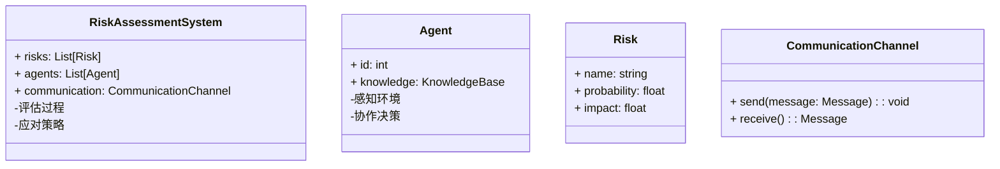
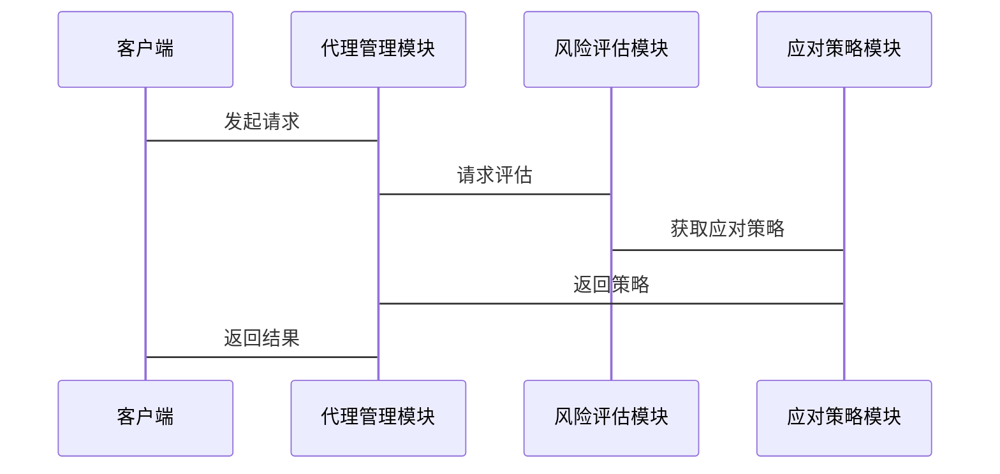

                 


# 多智能体系统实现全方位风险评估

> 关键词：多智能体系统，风险评估，D-S证据理论，贝叶斯网络，系统架构设计

> 摘要：本文将深入探讨如何利用多智能体系统实现全方位风险评估。通过分析多智能体系统的核心概念与风险评估的结合，结合典型的算法原理和系统架构设计，详细讲解如何构建一个多智能体风险评估系统，并通过实际案例展示其应用。

---

# 第一部分: 多智能体系统与风险评估基础

## 第1章: 多智能体系统与风险评估概述

### 1.1 多智能体系统的基本概念

#### 1.1.1 多智能体系统的定义
多智能体系统（Multi-Agent System, MAS）是由多个智能体（Agent）组成的分布式系统，这些智能体能够通过交互和协作完成复杂任务。每个智能体都是一个独立的实体，具有感知环境、自主决策和执行任务的能力。

#### 1.1.2 多智能体系统的特征
- **自主性**：智能体能够自主决策，无需外部干预。
- **反应性**：智能体能够实时感知环境并做出反应。
- **协作性**：多个智能体能够通过协作完成复杂任务。
- **分布性**：智能体分布在网络中，通过通信完成任务。

#### 1.1.3 多智能体系统的应用场景
- 智能交通系统
- 智能电网
- 智能制造
- 智能医疗

### 1.2 风险评估的基本概念

#### 1.2.1 风险的定义与分类
- **风险**：指在特定情境下，某种事件发生的可能性及其可能带来的损失。
- **风险分类**：根据来源可以分为自然风险、人为风险和技术风险等。

#### 1.2.2 风险评估的目的与方法
- **目的**：识别潜在风险，评估其影响，制定应对策略。
- **方法**：定性评估、定量评估、混合评估。

#### 1.2.3 风险评估在多智能体系统中的重要性
多智能体系统涉及多个智能体的协作，系统复杂性高，潜在风险多。因此，风险评估是确保系统稳定性和可靠性的关键步骤。

### 1.3 多智能体系统实现风险评估的背景与意义

#### 1.3.1 传统风险评估方法的局限性
- 传统方法通常基于单一智能体的视角，难以应对复杂系统的多维度风险。
- 传统方法难以实时更新和动态调整风险评估结果。

#### 1.3.2 多智能体系统在风险评估中的优势
- 多智能体系统能够从多个角度感知和分析风险，提供全面的风险评估结果。
- 多智能体系统具有分布式计算能力，能够实时更新风险评估结果。

#### 1.3.3 多智能体系统实现全方位风险评估的必要性
随着系统规模的增大和复杂性的提高，传统的风险评估方法已无法满足需求，多智能体系统提供了更高效的解决方案。

### 1.4 本章小结
本章介绍了多智能体系统的基本概念和风险评估的基本原理，阐述了多智能体系统在风险评估中的优势和必要性，为后续内容奠定了基础。

---

## 第2章: 多智能体系统实现风险评估的核心概念与联系

### 2.1 多智能体系统的核心概念

#### 2.1.1 智能体的定义与分类
- **智能体**：具有感知环境、自主决策和执行任务能力的实体。
- **分类**：基于智能体的智能水平，可以分为反应式智能体、认知式智能体和混合式智能体。

#### 2.1.2 多智能体系统的协作机制
- **协作机制**：智能体之间的通信与协作方式。
- **协作协议**：定义智能体之间的通信规则和协作流程。

#### 2.1.3 多智能体系统的通信协议
- **通信协议**：定义智能体之间如何交换信息。
- **消息传递机制**：通过消息传递实现智能体之间的协作。

### 2.2 风险评估的核心概念

#### 2.2.1 风险评估的指标体系
- **风险指标**：用于衡量风险程度的量化指标。
- **指标权重**：反映各个指标在风险评估中的重要性。

#### 2.2.2 风险评估的数学模型
- **概率模型**：基于概率论的风险评估方法。
- **模糊模型**：基于模糊逻辑的风险评估方法。

#### 2.2.3 风险评估的不确定性分析
- **不确定性**：风险评估过程中存在的不确定性因素。
- **处理方法**：概率方法、模糊方法和证据理论等。

### 2.3 多智能体系统与风险评估的联系

#### 2.3.1 多智能体系统在风险识别中的作用
- **风险识别**：通过多智能体系统的感知能力，识别潜在风险。
- **信息融合**：多个智能体协同工作，提高风险识别的准确性。

#### 2.3.2 多智能体系统在风险量化中的应用
- **风险量化**：通过数学模型量化风险程度。
- **多智能体协作**：多个智能体协同计算，提高风险量化的效果。

#### 2.3.3 多智能体系统在风险应对中的优势
- **动态调整**：根据实时风险情况，动态调整应对策略。
- **分布式决策**：多个智能体协同决策，提高应对效率。

### 2.4 本章小结
本章详细讲解了多智能体系统和风险评估的核心概念，并分析了两者之间的联系，为后续算法设计和系统实现奠定了基础。

---

## 第3章: 多智能体系统实现风险评估的算法原理

### 3.1 基于D-S证据理论的多智能体风险评估算法

#### 3.1.1 D-S证据理论的基本原理
- **D-S证据理论**：一种基于概率论的证据融合方法。
- **基本概率分配函数**：定义每个假设的基本概率。
- **组合规则**：通过公式将多个基本概率分配函数组合起来，得到最终的概率分布。

#### 3.1.2 多智能体系统中证据的获取与融合
- **证据获取**：智能体通过感知环境获取证据。
- **证据融合**：多个智能体的证据通过D-S理论进行融合，得到综合概率。

#### 3.1.3 基于D-S理论的风险评估算法实现
- **算法步骤**：
  1. 各智能体感知环境，获取证据。
  2. 每个智能体计算基本概率分配函数。
  3. 将所有智能体的证据进行融合，得到综合概率。
  4. 根据综合概率评估风险等级。

#### 3.1.4 代码实现
```python
import numpy as np

def basic_probability_distribution(hypotheses, weights):
    return {h: w for h, w in zip(hypotheses, weights)}

def combination_rule(a, b):
    combined = {}
    for h in a:
        for h2 in b:
            if h == h2:
                combined[h] = a[h] * b[h2]
    return combined

# 示例代码
hypotheses = ['低风险', '中风险', '高风险']
weights = [0.2, 0.3, 0.5]

basic_dist = basic_probability_distribution(hypotheses, weights)
print("基本概率分配函数:", basic_dist)

# 融合两个智能体的证据
a = {'低风险': 0.4, '中风险': 0.2, '高风险': 0.4}
b = {'低风险': 0.3, '中风险': 0.5, '高风险': 0.2}
combined = combination_rule(a, b)
print("融合后的结果:", combined)
```

### 3.2 基于贝叶斯网络的多智能体风险评估算法

#### 3.2.1 贝叶斯网络的基本原理
- **贝叶斯网络**：一种基于概率论的图形化模型。
- **节点与边**：节点表示随机变量，边表示变量之间的依赖关系。
- **条件概率**：节点的条件概率表。

#### 3.2.2 多智能体系统中贝叶斯网络的构建
- **构建步骤**：
  1. 确定风险评估的变量。
  2. 确定变量之间的依赖关系。
  3. 构建贝叶斯网络的结构。
  4. 确定各节点的条件概率。

#### 3.2.3 基于贝叶斯网络的风险评估算法实现
- **算法步骤**：
  1. 确定贝叶斯网络的结构和参数。
  2. 根据观测数据更新各节点的后验概率。
  3. 根据后验概率评估风险等级。

#### 3.2.4 代码实现
```python
from pgmpy.models import BayesianModel
from pgmpy.inference import VariableElimination

# 示例代码
model = BayesianModel([('A', 'B'), ('B', 'C')])
model.add_node('D')
model.add_edge('C', 'D')

# 构建贝叶斯网络的条件概率表
from pgmpy.factors import TabularCPD

cpd_a = TabularCPD('A', 2, [[0.5, 0.5]])
cpd_b = TabularCPD('B', 2, [[0.5, 0.5]], ['A'], [0.5, 0.5])
cpd_c = TabularCPD('C', 2, [[0.5, 0.5]], ['B'], [0.5, 0.5])
cpd_d = TabularCPD('D', 2, [[0.5, 0.5]], ['C'], [0.5, 0.5])

model.add_cpd(cpd_a)
model.add_cpd(cpd_b)
model.add_cpd(cpd_c)
model.add_cpd(cpd_d)

# 使用变量消除法进行推断
infer = VariableElimination(model)
result = infer.query('D')
print("推断结果:", result)
```

### 3.3 本章小结
本章详细讲解了基于D-S证据理论和贝叶斯网络的多智能体风险评估算法，通过数学公式和代码示例，展示了如何利用这些算法实现风险评估。

---

## 第4章: 多智能体系统实现风险评估的系统分析与架构设计

### 4.1 系统分析与需求分析

#### 4.1.1 问题场景介绍
- **场景描述**：假设我们正在设计一个智能交通系统，需要评估交通拥堵、事故风险等。

#### 4.1.2 系统功能需求
- **风险识别**：识别潜在的风险因素。
- **风险评估**：量化风险程度。
- **风险应对**：制定应对策略。

### 4.2 系统功能设计

#### 4.2.1 领域模型设计
- **领域模型**：通过类图展示系统的核心功能模块。



#### 4.2.2 系统架构设计
- **架构图**：通过mermaid展示系统架构。

```mermaid
architecturalDiagram
    客户端 -->> 代理管理模块
    代理管理模块 -->> 风险评估模块
    风险评估模块 -->> 应对策略模块
```

#### 4.2.3 系统接口设计
- **接口描述**：
  - `Agent.start()`：启动智能体。
  - `Agent.stop()`：停止智能体。
  - `Agent.request(message)`：接收外部请求。
  - `Agent.response()`：返回响应。

#### 4.2.4 系统交互流程
- **交互流程图**：通过mermaid展示系统交互流程。



### 4.3 本章小结
本章通过系统分析和架构设计，详细讲解了如何构建一个多智能体风险评估系统，并展示了系统的交互流程。

---

## 第5章: 多智能体系统实现风险评估的项目实战

### 5.1 环境安装与配置

#### 5.1.1 系统环境
- **操作系统**：Linux/Windows/macOS
- **编程语言**：Python 3.8+
- **依赖库**：numpy, pgmpy, matplotlib

#### 5.1.2 安装依赖
```bash
pip install numpy pgmpy matplotlib
```

### 5.2 核心代码实现

#### 5.2.1 多智能体系统的实现
- **智能体类**：定义智能体的基本功能。

```python
class Agent:
    def __init__(self, id):
        self.id = id
        self.knowledge = {}
    
    def perceive(self, environment):
        self.knowledge = self.update_knowledge(environment)
    
    def update_knowledge(self, environment):
        # 根据环境信息更新知识库
        return {}
    
    def collaborate(self, other_agents):
        # 与其他智能体协作
        pass
```

#### 5.2.2 风险评估算法的实现
- **D-S证据理论实现**：

```python
from pgmpy.inference import D-S Evidence Theory

class D-SEvidenceTheorem:
    def __init__(self, hypotheses):
        self.hypotheses = hypotheses
    
    def basic_probability_distribution(self, weights):
        return {h: w for h, w in zip(self.hypotheses, weights)}
    
    def combination_rule(self, a, b):
        combined = {}
        for h in a:
            for h2 in b:
                if h == h2:
                    combined[h] = a[h] * b[h2]
        return combined
```

#### 5.2.3 系统交互实现
- **通信模块**：

```python
class CommunicationChannel:
    def __init__(self):
        self.messages = []
    
    def send(self, message):
        self.messages.append(message)
    
    def receive(self):
        if self.messages:
            msg = self.messages.pop(0)
            return msg
        else:
            return None
```

### 5.3 实际案例分析

#### 5.3.1 案例描述
假设我们正在设计一个智能交通系统，需要评估交通拥堵风险。

#### 5.3.2 数据准备
- **环境数据**：交通流量、事故记录、天气状况等。

#### 5.3.3 算法实现
- **D-S证据理论**：融合多个智能体的证据，评估交通拥堵风险。

#### 5.3.4 结果分析
- **风险等级**：低风险、中风险、高风险。

### 5.4 本章小结
本章通过实际案例，展示了如何利用多智能体系统实现风险评估，并详细讲解了系统的实现过程。

---

## 第6章: 多智能体系统实现风险评估的最佳实践与总结

### 6.1 最佳实践

#### 6.1.1 系统设计
- **模块化设计**：确保系统模块化，便于维护和扩展。
- **容错设计**：设计容错机制，确保系统健壮性。

#### 6.1.2 算法选择
- **算法适用性**：根据具体场景选择合适的算法。
- **性能优化**：优化算法性能，提高评估效率。

#### 6.1.3 系统测试
- **单元测试**：测试各个模块的功能。
- **集成测试**：测试系统整体功能。

### 6.2 总结

#### 6.2.1 核心内容回顾
- 多智能体系统的定义与特征。
- 风险评估的基本原理与方法。
- 基于D-S证据理论和贝叶斯网络的算法实现。
- 系统架构设计与项目实战。

#### 6.2.2 注意事项
- 确保系统模块化设计。
- 选择合适的算法，优化性能。
- 定期更新系统，适应新需求。

#### 6.2.3 未来展望
- 结合人工智能技术，提升系统智能性。
- 研究新的风险评估算法，提高评估精度。

### 6.3 拓展阅读
- 《Multi-Agent Systems: Complexity and Cognitive Insights》
- 《Probabilistic Graphical Models: Principles and Techniques》

---

## 附录: 工具与数据集

### 附录A: 工具安装指南
- **Python依赖管理**：使用pip管理Python包。
- **开发环境配置**：推荐使用PyCharm或Jupyter Notebook。

### 附录B: 数据集说明
- **数据格式**：JSON格式，包含风险因素、概率分布等信息。
- **数据获取**：可以从公开数据集获取，如Kaggle。

---

# 作者：AI天才研究院 & 禅与计算机程序设计艺术

---

通过本文的详细讲解，读者可以全面了解多智能体系统实现风险评估的核心概念、算法原理和系统设计，并能够通过实际案例掌握系统的实现方法。希望本文能为读者在多智能体系统和风险评估领域的研究和实践提供有价值的参考。

