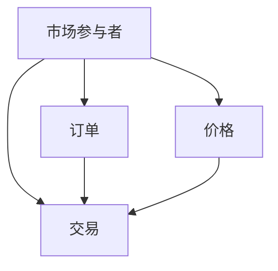
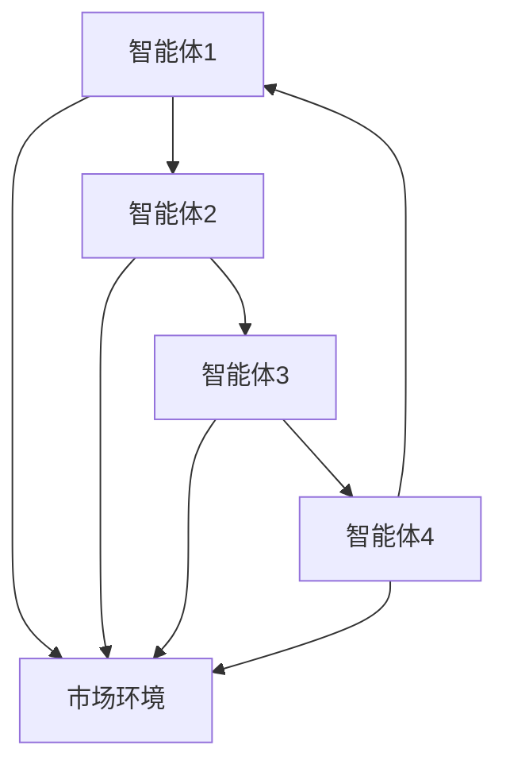
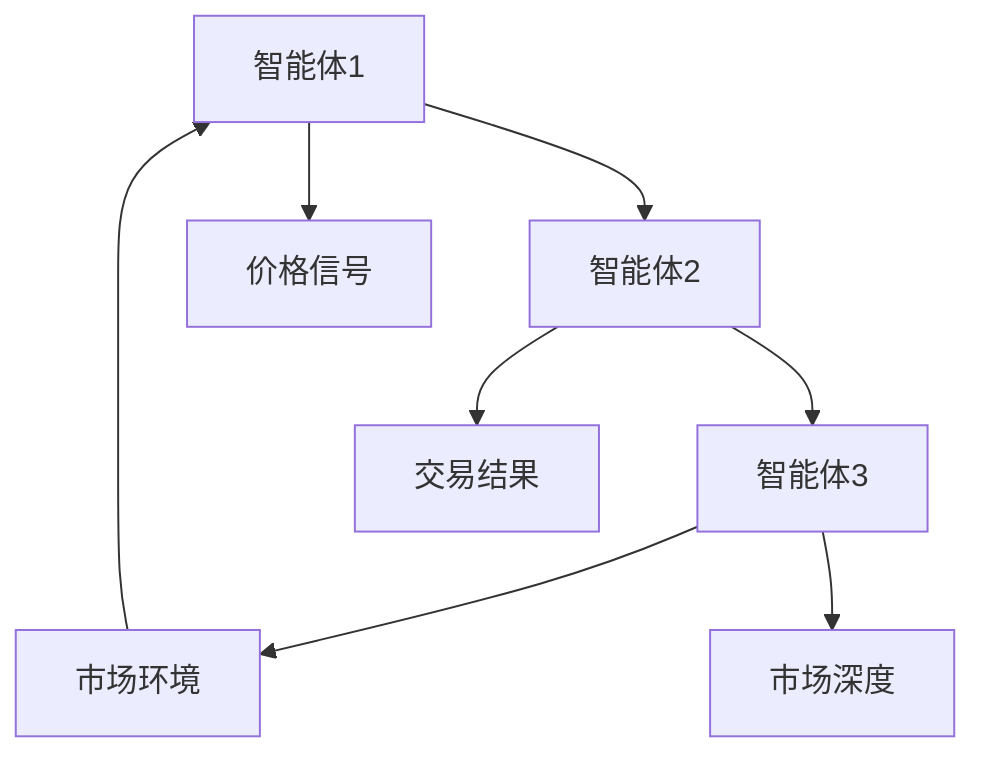
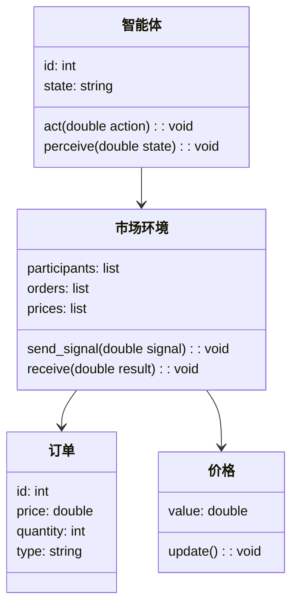
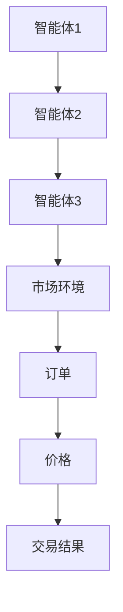
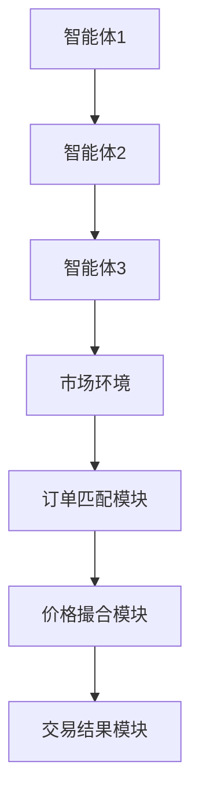

                 


# 多智能体系统模拟市场微观结构

---

## 关键词  
多智能体系统（Multi-Agent System）、市场微观结构、分布式协调算法、博弈论、价格形成机制、系统模拟、交互流程图  

---

## 摘要  
多智能体系统（MAS）在模拟市场微观结构方面具有广泛的应用潜力。本文从多智能体系统的概念出发，详细探讨其在模拟市场微观结构中的核心原理、算法实现和系统设计。通过分析市场参与者的交互行为、价格形成机制以及交易过程，结合具体的算法实现和系统架构设计，展示如何利用多智能体系统模拟市场微观结构。本文还提供了一个实际案例，通过代码实现和案例分析，深入剖析多智能体系统在市场微观结构模拟中的应用。

---

## 第一部分：多智能体系统与市场微观结构基础

### 第1章：多智能体系统概述

#### 1.1 多智能体系统的基本概念
- 多智能体系统的定义：多智能体系统是由多个自主或半自主的智能体组成的系统，智能体之间通过通信和协调完成特定任务。
- 多智能体系统的特点：
  - 分布式：智能体独立运行，通过通信协作完成目标。
  - 社会性：智能体之间存在社会关系，可能竞争或合作。
  - 动态性：系统状态随智能体交互而变化。
- 多智能体系统的分类：
  - 基于任务的MAS：智能体协作完成特定任务。
  - 基于市场的MAS：智能体通过市场机制进行资源分配。
  - 基于知识的MAS：智能体通过知识共享完成协作。

#### 1.2 市场微观结构的定义与特点
- 市场微观结构的定义：市场微观结构描述了市场中参与者的交互行为、交易机制和价格形成过程。
- 市场微观结构的核心要素：
  - 市场参与者：买方、卖方、撮合方（如交易所）。
  - 交易机制：订单匹配、价格撮合、市场深度。
  - 信息流动：市场信息的生成、传播和处理。
- 市场微观结构与宏观市场的关系：微观结构决定了市场的整体行为和价格波动。

#### 1.3 多智能体系统与市场微观结构的结合
- 多智能体系统在市场微观结构中的作用：
  - 模拟市场参与者的交互行为。
  - 模拟价格形成机制。
  - 分析市场动态和波动。
- 多智能体系统模拟市场微观结构的意义：
  - 提供市场机制的理论验证工具。
  - 支持市场设计和优化。
  - 用于市场仿真和预测。

---

### 第2章：多智能体系统的核心概念与联系

#### 2.1 多智能体系统的概念结构
- 多智能体系统的概念层次分析：
  - 智能体：自主实体，具有感知、决策和行动能力。
  - 交互：智能体之间的通信和协作。
  - 协调：智能体通过交互达成共同目标。
- 多智能体系统的核心要素与属性：
  - 智能体属性：自主性、反应性、主动性。
  - 交互属性：通信、协调、合作。
  - 环境属性：物理环境、社会环境、任务环境。
- 多智能体系统与相关概念的对比（表格形式）：

| 概念 | 定义 | 特点 | 应用场景 |
|------|------|------|----------|
| 智能体 | 具有感知、决策和行动能力的实体 | 自主性、反应性 | 任务协作、自动驾驶 |
| 分布式系统 | 由多个独立节点组成的系统 | 去中心化、异步通信 | 网络计算、云服务 |
| 市场微观结构 | 市场中的参与者交互行为和机制 | 价格形成、交易机制 | 金融仿真、经济建模 |

#### 2.2 市场微观结构的核心概念
- 市场参与者的角色与行为：
  - 买方：主动或被动发出订单。
  - 卖方：主动或被动接受订单。
  - 撮合方：撮合订单，确定成交价格。
- 市场信息的传递与处理：
  - 信息生成：买方和卖方的需求和报价。
  - 信息传播：信息在市场中的扩散和更新。
  - 信息处理：智能体对信息的解读和反应。
- 市场交易机制与价格形成：
  - 订单匹配：订单的最优撮合。
  - 价格撮合：基于订单簿的价格生成。
  - 市场深度：买卖订单的数量和价格分布。

#### 2.3 多智能体系统与市场微观结构的实体关系图
- 实体关系图（ER图）展示：



- 多智能体系统与市场微观结构的交互流程（Mermaid图）：



---

### 第3章：多智能体系统模拟市场微观结构的算法原理

#### 3.1 多智能体系统中的协调与通信算法
- 分布式协调算法：
  - 基于价格的协调：通过价格信号进行资源分配。
  - 基于优先级的协调：根据优先级顺序分配资源。
- 信息交换协议：
  - 请求-响应协议：智能体之间通过请求和响应进行通信。
  - 发布-订阅协议：智能体发布信息，其他智能体订阅信息。
- 基于博弈论的决策算法：
  - 纳什均衡：智能体在策略选择上的稳定状态。
  - 博弈树：分析多智能体决策的可能路径。

#### 3.2 市场微观结构模拟的核心算法
- 市场参与者行为建模：
  - 需求函数：买方的价格和数量决策。
  - 供给函数：卖方的价格和数量决策。
- 价格形成机制模拟：
  - 市场订单簿模型：订单的集合和价格生成。
  - 竞价拍卖模型：买方和卖方同时提交订单，系统确定成交价格。
- 交易过程模拟：
  - 订单匹配算法：根据价格和时间优先级撮合订单。
  - 交易结算算法：处理交易的清算和交割。

#### 3.3 算法实现与流程图
- 多智能体系统模拟流程图（Mermaid图）：



- 核心算法的Python代码实现：

```python
def nash_equilibrium(players, strategies):
    # 简单的纳什均衡求解示例
    for player in players:
        for strategy in strategies:
            if is_best_response(player, strategy):
                return (player, strategy)
    return None

def is_best_response(player, strategy):
    # 判断是否为纳什均衡中的最佳反应
    for other_strategy in strategies:
        if payoff(player, other_strategy) > payoff(player, strategy):
            return False
    return True

def payoff(player, strategy):
    # 简单的收益计算示例
    return player * strategy
```

---

### 第4章：系统分析与架构设计方案

#### 4.1 问题场景与需求分析
- 问题场景描述：
  - 模拟股票市场中的买方、卖方和交易所。
  - 分析市场参与者的交互行为和价格波动。
- 系统功能需求分析：
  - 模拟市场参与者的行为。
  - 实现订单匹配和价格撮合。
  - 展示市场深度和交易结果。
- 系统性能需求与约束：
  - 响应时间：实时模拟的延迟要求。
  - 并行性：多智能体的并行计算能力。
  - 可扩展性：系统的扩展能力。

#### 4.2 系统功能设计
- 领域模型设计（Mermaid类图）：



- 系统功能流程图（Mermaid图）：



#### 4.3 系统架构设计
- 系统架构设计（Mermaid图）：



- 系统接口设计：
  - 智能体接口：定义智能体的行为和通信接口。
  - 市场环境接口：定义市场环境的感知和反馈接口。
  - 交易模块接口：定义订单匹配和价格撮合的接口。

#### 4.4 系统交互流程图（Mermaid图）：


---

## 第五章：项目实战

### 5.1 环境安装与配置
- 环境需求：
  - Python 3.8+
  - Mermaid图生成工具（支持Markdown和HTML）。
  - 必要的Python库：numpy、pandas、matplotlib。

### 5.2 核心实现源代码
- 多智能体系统模拟市场微观结构的Python代码示例：

```python
class Agent:
    def __init__(self, id):
        self.id = id
        self.state = "idle"
    
    def perceive(self, market_state):
        # 感知市场状态并做出决策
        pass
    
    def act(self, action):
        # 执行动作
        pass

class MarketEnvironment:
    def __init__(self):
        self.participants = []
        self.orders = []
        self.prices = []
    
    def send_signal(self, signal):
        # 发送信号给参与者
        for participant in self.participants:
            participant.perceive(signal)
    
    def receive(self, result):
        # 接收参与者的反馈
        self.prices.append(result)

def main():
    # 初始化智能体和市场环境
    agent1 = Agent(1)
    agent2 = Agent(2)
    market = MarketEnvironment()
    
    # 添加智能体到市场环境
    market.participants.append(agent1)
    market.participants.append(agent2)
    
    # 发送信号并接收反馈
    market.send_signal("order update")
    market.receive("price update")

if __name__ == "__main__":
    main()
```

### 5.3 案例分析与代码解读
- 案例分析：
  - 模拟股票市场的价格波动。
  - 分析智能体之间的交互行为对市场价格的影响。
- 代码解读：
  - 智能体类：定义智能体的基本行为和属性。
  - 市场环境类：定义市场环境的参与者、订单和价格。
  - 主函数：初始化智能体和市场环境，模拟市场信号的发送和接收。

### 5.4 项目小结
- 项目总结：
  - 通过多智能体系统模拟了市场微观结构。
  - 展示了智能体之间的交互行为对市场价格的影响。
  - 验证了多智能体系统在市场微观结构模拟中的可行性。

---

## 第六章：最佳实践与小结

### 6.1 最佳实践
- 系统设计：
  - 明确系统的功能需求和性能需求。
  - 设计合理的系统架构和接口。
- 算法实现：
  - 选择合适的分布式协调算法和博弈论算法。
  - 确保算法的高效性和可扩展性。
- 系统实现：
  - 使用合适的编程语言和工具。
  - 确保代码的可读性和可维护性。

### 6.2 小结
- 本文通过多智能体系统的理论和算法，详细探讨了其在模拟市场微观结构中的应用。
- 结合具体的Python代码实现和案例分析，展示了多智能体系统在市场微观结构模拟中的潜力。
- 通过系统架构设计和项目实战，验证了多智能体系统在市场微观结构模拟中的可行性和有效性。

---

## 参考文献  
（此处可添加具体的参考文献）

---

## 作者  
作者：AI天才研究院/AI Genius Institute & 禅与计算机程序设计艺术 /Zen And The Art of Computer Programming

