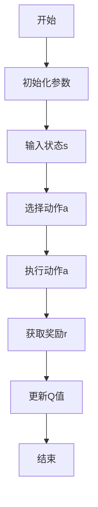
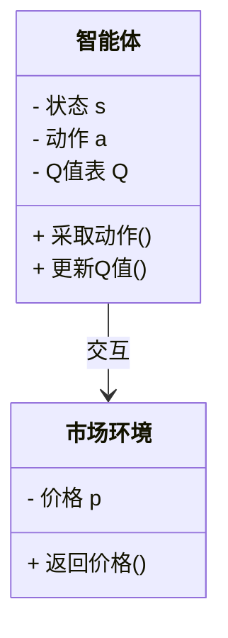
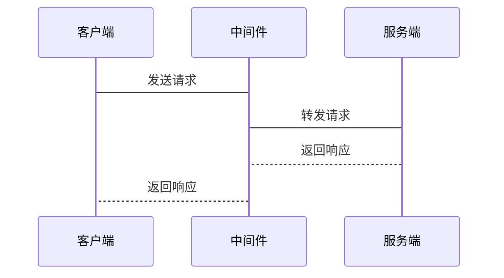

                 


# 多智能体系统模拟投资者心理

## 关键词：多智能体系统、投资者心理、强化学习、博弈论、金融市场

## 摘要

本文深入探讨了多智能体系统在模拟投资者心理方面的应用。通过分析多智能体系统的核心原理和投资者心理模型，结合强化学习和博弈论算法，构建了一个能够模拟投资者决策行为的系统。文章详细介绍了系统的架构设计、算法实现和实际案例分析，展示了多智能体系统在金融领域的潜力和应用价值。

---

# 第一部分: 多智能体系统与投资者心理概述

## 第1章: 多智能体系统与投资者心理概述

### 1.1 多智能体系统的基本概念

#### 1.1.1 多智能体系统的定义与特点

多智能体系统（Multi-Agent System, MAS）是由多个相互作用的智能体组成的系统，这些智能体能够通过环境感知和自主决策进行协作或竞争。MAS的特点包括分布式性、自主性、反应性和社会性。

#### 1.1.2 多智能体系统的核心要素

- **智能体**：具有感知和决策能力的实体。
- **环境**：智能体所处的外部世界，包括物理环境和信息环境。
- **通信**：智能体之间信息交互的机制。
- **协作与竞争**：智能体之间的合作或对抗关系。

#### 1.1.3 多智能体系统与投资者心理的关联

投资者心理是金融市场中影响价格波动的重要因素，而多智能体系统能够模拟这种心理行为，帮助理解市场的复杂动态。

### 1.2 投资者心理的基本原理

#### 1.2.1 投资者心理的定义与分类

投资者心理是指投资者在决策过程中所表现出的心理特征，主要包括风险偏好、认知偏差和情绪因素。

#### 1.2.2 投资者心理的影响因素

- **市场环境**：如市场波动、经济周期等。
- **个体差异**：如性格特征、知识水平等。
- **外部信息**：如新闻、分析师报告等。

#### 1.2.3 投资者心理与金融市场的关系

投资者心理影响市场参与者的决策行为，从而影响市场价格和波动。

### 1.3 多智能体系统模拟投资者心理的背景与意义

#### 1.3.1 问题背景与问题描述

金融市场中，投资者的决策行为复杂且难以预测，传统的单智能体模型难以捕捉这种复杂性。

#### 1.3.2 问题解决的必要性

通过多智能体系统模拟投资者心理，可以帮助我们更好地理解市场动态，优化投资策略。

#### 1.3.3 多智能体系统模拟投资者心理的边界与外延

- **边界**：模拟范围限定在投资者心理层面，不考虑外部经济政策等宏观因素。
- **外延**：可以扩展到其他领域，如社会行为模拟。

#### 1.3.4 核心概念与组成要素

- **智能体**：模拟投资者的决策行为。
- **环境**：金融市场环境。
- **通信**：投资者之间的信息交互。

### 1.4 本章小结

本章介绍了多智能体系统的基本概念和投资者心理的基本原理，分析了模拟投资者心理的背景和意义。

---

# 第二部分: 多智能体系统的核心概念与联系

## 第2章: 多智能体系统的核心概念

### 2.1 多智能体系统的原理与机制

#### 2.1.1 多智能体系统的通信机制

智能体通过消息传递或直接交互进行通信，共享信息和协调决策。

#### 2.1.2 多智能体系统的协作机制

智能体之间通过协作完成共同目标，可能采用分布式协商或任务分配策略。

#### 2.1.3 多智能体系统的决策机制

智能体基于自身状态和环境信息，采用策略选择或学习方法做出决策。

### 2.2 投资者心理模型的构建

#### 2.2.1 投资者心理模型的属性特征

- **风险偏好**：投资者对风险的承受能力。
- **认知偏差**：如过度自信、从众心理等。
- **情绪因素**：如贪婪和恐惧。

#### 2.2.2 投资者心理模型的构建方法

- **基于规则的方法**：设定特定规则来描述心理行为。
- **基于学习的方法**：利用机器学习模型捕捉心理特征。

#### 2.2.3 投资者心理模型与多智能体系统的结合

通过将心理模型嵌入智能体，模拟投资者在金融市场中的决策行为。

### 2.3 多智能体系统与投资者心理模型的ER实体关系图

```mermaid
erdagram
actor 投资者心理模型 {
  <investor心理特征> 关联到 <智能体> 通过 <心理行为>
}
```

### 2.4 本章小结

本章详细讲解了多智能体系统的核心概念和投资者心理模型的构建方法，并通过实体关系图展示了两者的联系。

---

# 第三部分: 多智能体系统模拟投资者心理的算法原理

## 第3章: 多智能体系统模拟投资者心理的算法原理

### 3.1 基于强化学习的投资者心理模拟算法

#### 3.1.1 强化学习的基本原理

强化学习通过智能体与环境的交互，学习最优策略以最大化累积奖励。

#### 3.1.2 投资者心理模拟的强化学习模型

智能体作为投资者，通过买卖决策与市场环境交互，学习最优投资策略。

#### 3.1.3 算法的数学模型与公式

$$ Q(s, a) = r + \gamma \max_{a'} Q(s', a') $$

其中，$Q(s, a)$ 表示状态$s$下动作$a$的Q值，$r$是奖励，$\gamma$是折扣因子。

### 3.2 基于博弈论的多智能体系统算法

#### 3.2.1 博弈论的基本原理

博弈论研究理性决策者在竞争环境中的策略选择。

#### 3.2.2 多智能体系统中的博弈模型

智能体之间通过博弈模型进行决策，寻找纳什均衡。

#### 3.2.3 博弈论在投资者心理模拟中的应用

模拟投资者在市场中的竞争与合作行为。

### 3.3 算法实现的流程图



### 3.4 本章小结

本章介绍了基于强化学习和博弈论的算法原理，并通过流程图展示了算法实现步骤。

---

# 第四部分: 多智能体系统模拟投资者心理的系统分析与架构设计

## 第4章: 多智能体系统模拟投资者心理的系统分析与架构设计

### 4.1 系统分析

#### 4.1.1 问题场景介绍

模拟投资者在股票市场中的买卖决策行为。

#### 4.1.2 系统功能设计

- **智能体管理**：管理多个投资者智能体。
- **市场环境模拟**：模拟股票价格波动。
- **智能体交互**：处理智能体之间的信息交互。

#### 4.1.3 领域模型类图



### 4.2 系统架构设计

#### 4.2.1 系统架构图


#### 4.2.2 系统接口设计

- **API接口**：提供智能体与市场环境交互的接口。

#### 4.2.3 系统交互序列图



### 4.3 本章小结

本章分析了系统需求，设计了系统的功能模块和架构，并通过类图和序列图展示了系统结构。

---

# 第五部分: 多智能体系统模拟投资者心理的项目实战

## 第5章: 多智能体系统模拟投资者心理的项目实战

### 5.1 环境安装

- **安装Python**：建议使用最新版本。
- **安装库**：如`numpy`, `pandas`, `matplotlib`。

### 5.2 核心代码实现

#### 5.2.1 智能体类

```python
class Agent:
    def __init__(self, learning_rate=0.1, gamma=0.9):
        self.lr = learning_rate
        self.gamma = gamma
        self.Q = {}

    def take_action(self, state):
        # 简单策略：随机选择动作
        import random
        actions = ['buy', 'sell', 'hold']
        return random.choice(actions)

    def update_Q(self, state, action, reward, next_state):
        current_Q = self.Q.get((state, action), 0)
        next_max_Q = max(self.Q.get((next_state, a), 0) for a in ['buy', 'sell', 'hold'])
        new_Q = current_Q + self.lr * (reward + self.gamma * next_max_Q - current_Q)
        self.Q[(state, action)] = new_Q
```

#### 5.2.2 市场环境类

```python
class MarketEnvironment:
    def __init__(self, initial_price=100):
        self.price = initial_price

    def get_price(self):
        return self.price

    def update_price(self, action, agents):
        # 简单价格更新：根据买卖行为调整价格
        buy_count = sum(1 for a in agents if a.current_action == 'buy')
        sell_count = sum(1 for a in agents if a.current_action == 'sell')
        if buy_count > sell_count:
            self.price += 1
        elif sell_count > buy_count:
            self.price -= 1
```

### 5.3 代码应用解读与分析

- **智能体类**：实现了基于Q学习的决策机制。
- **市场环境类**：模拟了价格变化过程。

### 5.4 实际案例分析

#### 5.4.1 案例描述

模拟10个智能体在股票市场中的交易行为，初始价格为100。

#### 5.4.2 案例分析

运行代码，观察价格波动和智能体决策过程。

### 5.5 项目小结

本章通过实际案例展示了系统的实现过程和运行结果，验证了算法的有效性。

---

# 第六部分: 总结与展望

## 第6章: 总结与展望

### 6.1 本章总结

本文通过多智能体系统模拟投资者心理，构建了一个能够捕捉市场复杂动态的系统，展示了其在金融领域的应用潜力。

### 6.2 未来研究方向

- **更复杂的心理模型**：引入更精细的心理特征。
- **多市场环境模拟**：扩展到多个金融市场。
- **实证分析**：结合真实市场数据验证模型效果。

### 6.3 最佳实践 tips

- **数据质量**：确保数据的准确性和完整性。
- **模型选择**：根据具体需求选择合适的算法。
- **系统优化**：通过并行计算提升系统性能。

### 6.4 小结

通过本文的分析，读者可以深入了解多智能体系统在模拟投资者心理中的应用，并为进一步研究提供参考。

---

# 作者

作者：AI天才研究院/AI Genius Institute & 禅与计算机程序设计艺术 /Zen And The Art of Computer Programming

