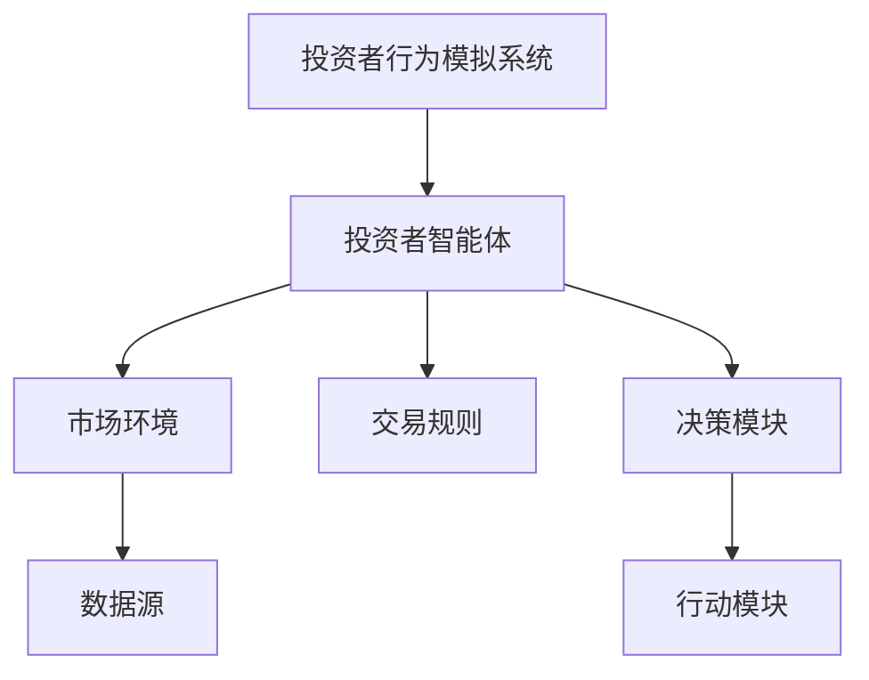

                 


# 多智能体系统模拟投资者行为

**关键词：** 多智能体系统、投资者行为、模拟、博弈论、机器学习、系统架构

**摘要：**  
本文探讨了多智能体系统在模拟投资者行为中的应用。通过分析投资者的决策机制和心理因素，结合多智能体系统的建模与仿真技术，提出了基于博弈论和机器学习的投资者行为模拟方法。文章详细讲解了多智能体系统的核心概念、算法原理、系统架构设计以及实际项目案例，展示了如何利用多智能体系统来理解和预测投资者行为，为金融市场的分析和决策提供支持。

---

## 第1章: 多智能体系统背景介绍

### 1.1 多智能体系统的定义与特点

#### 1.1.1 多智能体系统的定义
多智能体系统（Multi-Agent System, MAS）是由多个智能体（Agent）组成的分布式系统，这些智能体能够通过交互和协作完成复杂的任务。智能体是具有感知、决策和行动能力的实体，能够独立运作并与其他智能体或环境进行交互。

#### 1.1.2 多智能体系统的核心特点
- **分布式性**：智能体独立运作，无中心化控制。
- **协作性**：智能体之间通过协作完成共同目标。
- **反应性**：智能体能够实时感知环境并做出反应。
- **动态性**：环境和智能体的状态可能动态变化。

#### 1.1.3 多智能体系统与传统单智能体系统的区别
| 特性         | 多智能体系统                 | 单智能体系统             |
|--------------|------------------------------|--------------------------|
| 控制方式     | 分布式控制                 | 集中式控制             |
| 任务处理     | 多任务协作                 | 单任务处理             |
| 可扩展性     | 高                         | 低                     |

### 1.2 投资者行为模拟的背景与意义

#### 1.2.1 投资者行为模拟的背景
投资者行为模拟是研究金融市场的重要手段，能够帮助我们理解市场的动态和投资者决策的复杂性。传统的基于假设的投资者行为模型（如理性预期假设）在实际应用中存在诸多限制，而多智能体系统能够更真实地模拟投资者的决策过程。

#### 1.2.2 多智能体系统在投资者行为模拟中的优势
- **高真实感**：能够模拟多个投资者的互动和决策过程。
- **动态性**：能够捕捉市场环境的动态变化。
- **可扩展性**：可以模拟大规模的投资者群体。

#### 1.2.3 投资者行为模拟的实际应用领域
- 金融市场预测
- 投资策略优化
- 风险管理
- 市场微观结构分析

### 1.3 本章小结
本章介绍了多智能体系统的定义和特点，探讨了投资者行为模拟的背景和意义，并分析了多智能体系统在投资者行为模拟中的优势和应用场景。

---

## 第2章: 投资者行为分析

### 2.1 投资者决策机制

#### 2.1.1 投资者的决策过程
投资者的决策过程通常包括以下几个步骤：
1. **信息收集**：投资者通过各种渠道获取市场信息。
2. **信息处理**：对收集到的信息进行分析和判断。
3. **决策制定**：基于信息和自身目标，制定投资决策。
4. **行动执行**：根据决策采取相应的投资行动。

#### 2.1.2 影响投资者决策的因素
- **市场信息**：如价格、成交量等。
- **投资者心理**：如贪婪、恐惧等情绪。
- **外部环境**：如经济政策、市场波动等。

#### 2.1.3 投资者心理与行为特征
- **羊群效应**：投资者倾向于跟随 majority 的决策。
- **过度自信**：投资者倾向于高估自己的判断能力。
- **损失厌恶**：投资者对损失的敏感度高于对收益的敏感度。

### 2.2 投资者行为建模方法

#### 2.2.1 基于博弈论的行为建模
博弈论是一种研究理性决策的数学工具，可以用来建模投资者之间的竞争与合作。

##### 投资者行为的博弈模型
假设两个投资者在股票市场中进行交易，他们的决策会影响市场价格。博弈模型可以通过纳什均衡来分析双方的最优策略。

$$ 纳什均衡的定义是：在给定其他参与者策略的情况下，每个参与者都无法通过单方面改变策略而获得更好的结果。 $$

##### 博弈论在投资者行为模拟中的应用
- 分析投资者之间的竞争与合作。
- 预测市场中的价格波动。

#### 2.2.2 基于机器学习的行为建模
机器学习是一种数据驱动的方法，可以通过历史数据来预测投资者的行为。

##### 投资者行为的机器学习模型
常用的机器学习模型包括：
- **支持向量机（SVM）**：用于分类投资者的决策类型。
- **随机森林（Random Forest）**：用于预测投资者的交易行为。

##### 机器学习在投资者行为模拟中的应用
- 分析投资者的交易模式。
- 预测市场的短期波动。

#### 2.2.3 基于规则引擎的行为建模
规则引擎是一种基于预定义规则的决策系统，可以模拟投资者的理性决策。

##### 投资者行为的规则模型
规则模型通常基于以下假设：
- 投资者根据市场信息做出理性决策。
- 投资者的行为受到心理因素的影响。

##### 规则引擎在投资者行为模拟中的应用
- 模拟投资者的理性决策过程。
- 分析投资者的非理性行为。

### 2.3 本章小结
本章分析了投资者的决策机制，探讨了基于博弈论、机器学习和规则引擎的投资者行为建模方法，并讨论了这些方法在实际应用中的优缺点。

---

## 第3章: 多智能体系统的核心概念与联系

### 3.1 多智能体系统中的智能体

#### 3.1.1 智能体的定义与分类
智能体（Agent）是具有感知、决策和行动能力的实体。根据智能体的智能水平，可以分为：
- **反应式智能体**：基于当前感知做出反应。
- **认知式智能体**：具有推理和规划能力。

#### 3.1.2 智能体的属性与特征
- **自主性**：智能体能够自主决策。
- **反应性**：智能体能够实时感知环境并做出反应。
- **协作性**：智能体能够与其他智能体协作完成任务。

#### 3.1.3 智能体之间的交互机制
智能体之间的交互机制包括：
- **直接通信**：智能体之间通过消息传递进行交互。
- **间接通信**：通过共享环境状态进行交互。

### 3.2 多智能体系统的环境

#### 3.2.1 环境的定义与分类
环境是多智能体系统中智能体所处的外部世界，可以是虚拟的（如金融市场）或物理的（如智能家居）。

#### 3.2.2 环境与智能体的交互方式
- **可观察性**：智能体能够感知环境的状态。
- **可干预性**：智能体能够通过行动改变环境的状态。

#### 3.2.3 环境的动态性与复杂性
环境的动态性和复杂性直接影响多智能体系统的性能。

### 3.3 多智能体系统的核心原理

#### 3.3.1 分布式计算与协作
分布式计算是多智能体系统的核心，通过智能体之间的协作完成任务。

#### 3.3.2 通信与信息共享
智能体之间的通信和信息共享是实现协作的关键。

#### 3.3.3 协调与冲突解决
在多智能体系统中，协调与冲突解决是确保系统高效运行的重要环节。

### 3.4 本章小结
本章详细介绍了多智能体系统中的智能体和环境，分析了它们的属性和交互机制，并探讨了多智能体系统的核心原理。

---

## 第4章: 投资者行为模拟的算法与实现

### 4.1 基于博弈论的投资者行为模拟

#### 4.1.1 博弈论基础
博弈论是一种研究理性决策的数学工具，可以用来分析投资者之间的互动。

#### 4.1.2 投资者行为的博弈模型
通过博弈论可以建立投资者行为的模型，分析投资者之间的策略选择。

#### 4.1.3 博弈论在投资者行为模拟中的应用
- 分析投资者之间的竞争与合作。
- 预测市场的价格波动。

### 4.2 基于机器学习的投资者行为模拟

#### 4.2.1 机器学习基础
机器学习是一种数据驱动的方法，可以通过历史数据来预测投资者的行为。

#### 4.2.2 投资者行为的机器学习模型
常用的机器学习模型包括：
- **支持向量机（SVM）**：用于分类投资者的决策类型。
- **随机森林（Random Forest）**：用于预测投资者的交易行为。

#### 4.2.3 机器学习在投资者行为模拟中的应用
- 分析投资者的交易模式。
- 预测市场的短期波动。

### 4.3 本章小结
本章探讨了基于博弈论和机器学习的投资者行为模拟方法，并分析了这些方法在实际应用中的优缺点。

---

## 第5章: 数学模型与系统架构设计

### 5.1 投资者行为的数学模型

#### 5.1.1 预期效用函数
预期效用函数是用来描述投资者在不确定环境下的决策模型。

$$ 预期效用函数的定义：U = \sum p_i u_i $$

其中，$p_i$ 是第 $i$ 种结果的概率，$u_i$ 是第 $i$ 种结果的效用。

#### 5.1.2 博弈论模型
博弈论模型可以用来分析投资者之间的互动，例如纳什均衡。

$$ 纳什均衡的定义是：在给定其他参与者策略的情况下，每个参与者都无法通过单方面改变策略而获得更好的结果。 $$

### 5.2 系统架构设计

#### 5.2.1 领域模型类图
以下是投资者行为模拟系统的领域模型类图：

```mermaid
classDiagram

    class 投资者 {
        +身份：id
        +行为：action
        +决策：decision
    }

    class 市场环境 {
        +价格：price
        +成交量：volume
    }

    class 智能体 {
        +感知：perception
        +决策：decision
        +行动：action
    }

   抽屉关系：投资者 <|-- 智能体
   抽屉关系：市场环境 <|-- 智能体
```

#### 5.2.2 系统架构图
以下是投资者行为模拟系统的架构图：



### 5.3 本章小结
本章详细介绍了投资者行为的数学模型，并设计了投资者行为模拟系统的架构。

---

## 第6章: 项目实战

### 6.1 环境安装

#### 6.1.1 安装Python环境
安装Python 3.x及以上版本，并安装必要的库：
- numpy
- pandas
- scikit-learn
- matplotlib

#### 6.1.2 安装多智能体系统框架
可以选择使用以下框架：
- **Multi-Agent Systems Framework (MAS Framework)**
- **OpenAI Gym**

### 6.2 核心代码实现

#### 6.2.1 投资者智能体的实现
以下是投资者智能体的Python代码示例：

```python
class InvestorAgent:
    def __init__(self, id):
        self.id = id
        self.position = 0  # 持股数量
        self.cash = 1000  # 初始资金

    def perceive(self, market_env):
        # 感知市场环境
        self.market_price = market_env.price
        self.market_volume = market_env.volume

    def decide(self):
        # 基于当前市场环境做出决策
        if self.market_price > 100:
            return 'sell'
        else:
            return 'buy'

    def act(self, action):
        # 执行交易操作
        if action == 'buy':
            self.position += 1
            self.cash -= 1
        elif action == 'sell':
            self.position -= 1
            self.cash += 1
```

#### 6.2.2 市场环境的实现
以下是市场环境的Python代码示例：

```python
class MarketEnvironment:
    def __init__(self):
        self.price = 100  # 初始价格
        self.volume = 100  # 初始成交量

    def update(self, actions):
        # 更新市场环境
        for action in actions:
            if action == 'buy':
                self.price += 1
                self.volume += 1
            elif action == 'sell':
                self.price -= 1
                self.volume -= 1
```

### 6.3 代码解读与分析

#### 6.3.1 投资者智能体的代码解读
- **初始化方法**：设置投资者的初始状态。
- **perceive方法**：感知市场环境。
- **decide方法**：基于市场环境做出决策。
- **act方法**：执行交易操作。

#### 6.3.2 市场环境的代码解读
- **初始化方法**：设置初始市场环境。
- **update方法**：根据投资者的交易行为更新市场环境。

### 6.4 实际案例分析

#### 6.4.1 案例背景
假设我们有三个投资者智能体，初始市场环境为：
- 价格：100
- 成交量：100

#### 6.4.2 案例分析
1. **时间步1**：
   - 投资者1：感知价格为100，决定购买。
   - 投资者2：感知价格为100，决定卖出。
   - 投资者3：感知价格为100，决定持有。

2. **时间步2**：
   - 市场环境更新：价格变为99（投资者2卖出），成交量变为99。
   - 投资者1：感知价格为99，决定卖出。
   - 投资者2：感知价格为99，决定购买。
   - 投资者3：感知价格为99，决定卖出。

3. **时间步3**：
   - 市场环境更新：价格变为98（投资者3卖出），成交量变为98。
   - 投资者1：感知价格为98，决定购买。
   - 投资者2：感知价格为98，决定卖出。
   - 投资者3：感知价格为98，决定卖出。

### 6.5 本章小结
本章通过实际案例展示了投资者行为模拟系统的实现过程，并分析了智能体之间的互动对市场环境的影响。

---

## 第7章: 总结与展望

### 7.1 本章总结
本文探讨了多智能体系统在模拟投资者行为中的应用，分析了投资者的决策机制和心理因素，提出了基于博弈论和机器学习的投资者行为模拟方法，并通过实际案例展示了系统的实现过程。

### 7.2 未来展望
未来的研究可以进一步探讨以下方向：
- 更复杂的市场环境模拟。
- 更高效的多智能体系统设计。
- 更精确的投资者行为预测模型。

---

## 作者：AI天才研究院/AI Genius Institute & 禅与计算机程序设计艺术 /Zen And The Art of Computer Programming

---

**摘要**：  
本文系统地探讨了多智能体系统在模拟投资者行为中的应用，分析了投资者的决策机制和心理因素，提出了基于博弈论和机器学习的投资者行为模拟方法，并通过实际案例展示了系统的实现过程。未来的研究可以进一步探讨更复杂的市场环境模拟和更高效的多智能体系统设计。

