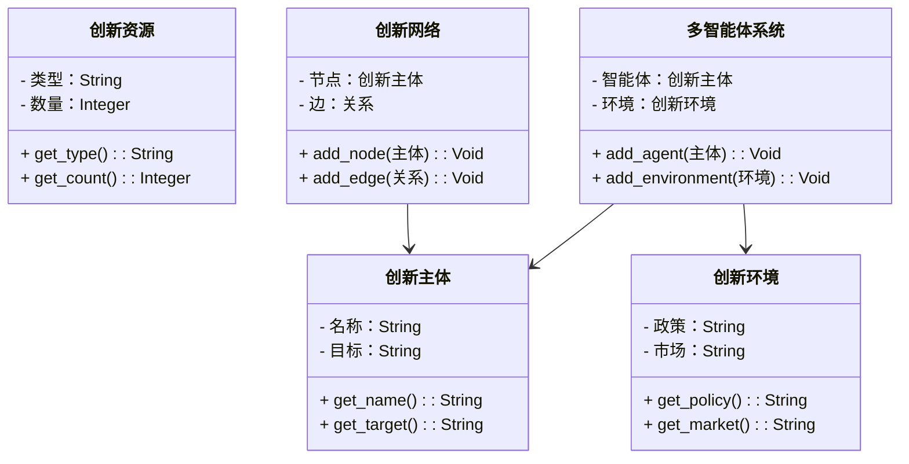

                 


# 多智能体系统评估公司创新生态系统：长期价值创造力分析

---

## 关键词：
多智能体系统、创新生态系统、长期价值创造力、系统评估、数学模型

---

## 摘要：
本文旨在探讨如何利用多智能体系统（Multi-Agent System, MAS）对公司的创新生态系统进行评估，特别是在长期价值创造力方面。通过分析多智能体系统的核心概念、算法原理、系统架构以及实际项目案例，本文为读者提供了一种全新的视角来理解创新生态系统的动态演化过程。文章从背景介绍、核心概念、算法实现、系统设计到项目实战，逐步深入，最终得出多智能体系统在创新生态系统评估中的应用价值和实际意义。

---

## 第1章: 多智能体系统与创新生态系统概述

### 1.1 多智能体系统的定义与特点

#### 1.1.1 多智能体系统的定义
多智能体系统（Multi-Agent System, MAS）是由多个智能体（Agent）组成的分布式系统，这些智能体能够通过协同工作完成复杂任务。每个智能体都是一个具有自主性、反应性、目标导向和社交能力的实体。

#### 1.1.2 多智能体系统的核心特点
| 特性 | 描述 |
|------|------|
| 分布性 | 智能体独立运行，通过通信和协作完成任务。 |
| 协作性 | 智能体之间通过交互实现协同，完成单一智能体无法完成的任务。 |
| 反应性 | 智能体能够感知环境并做出实时响应。 |
| 多样性 | 智能体可以有不同的目标、行为和能力。 |

#### 1.1.3 多智能体系统与传统单智能体系统的区别
- **自主性**：多智能体系统中的智能体具有自主决策能力，而传统单智能体系统通常依赖中央控制。
- **协作性**：多智能体系统通过智能体之间的协作完成任务，而传统系统通常由单一决策者控制。
- **动态性**：多智能体系统的环境和任务通常是动态变化的，而传统系统相对静态。

### 1.2 创新生态系统的定义与特点

#### 1.2.1 创新生态系统的定义
创新生态系统是指由企业、研究机构、政府、用户和第三方服务提供商等多个主体共同构成的复杂系统，这些主体通过互动和协作推动技术创新和价值创造。

#### 1.2.2 创新生态系统的核心要素
| 要素 | 描述 |
|------|------|
| 创新主体 | 包括企业、研究机构、用户等。 |
| 创新资源 | 包括技术、资金、人才等。 |
| 创新网络 | 包括合作网络、知识共享网络等。 |
| 创新环境 | 包括政策、法规、市场环境等。 |

#### 1.2.3 创新生态系统与传统企业创新模式的区别
- **复杂性**：创新生态系统是一个复杂的网络系统，而传统企业创新模式通常较为简单。
- **协作性**：创新生态系统依赖多方协作，而传统模式通常依赖企业内部资源。
- **动态性**：创新生态系统具有动态演化特性，而传统模式相对稳定。

### 1.3 多智能体系统与创新生态系统的联系

#### 1.3.1 多智能体系统在创新生态系统中的作用
- **信息共享**：智能体之间可以实时共享信息，促进知识流动。
- **协作创新**：智能体通过协作完成技术创新和价值创造。
- **动态适应**：智能体能够根据环境变化调整行为，适应创新生态系统的需求。

#### 1.3.2 多智能体系统如何促进创新生态系统的演进
- **分布式决策**：通过多智能体的分布式决策，创新生态系统能够快速响应市场变化。
- **协作与竞争**：智能体之间的协作与竞争推动了创新生态系统的动态演化。
- **知识共享**：智能体之间的知识共享促进了创新资源的有效利用。

#### 1.3.3 多智能体系统与创新生态系统结合的典型案例
- **案例1**：某科技公司通过多智能体系统协调研发部门、市场部门和用户之间的互动，实现了技术创新的快速迭代。
- **案例2**：某创新孵化器利用多智能体系统评估初创企业的潜力，优化资源配置。

### 1.4 本章小结
本章介绍了多智能体系统和创新生态系统的定义、特点及其联系，强调了多智能体系统在创新生态系统评估中的重要性。

---

## 第2章: 多智能体系统评估创新生态系统的方法论

### 2.1 多智能体系统评估创新生态系统的框架

#### 2.1.1 多智能体系统评估框架的构成
- **目标设定**：明确评估的目标，例如技术创新能力、市场竞争力等。
- **数据收集**：收集创新生态系统中的相关数据，例如企业绩效、研发投入等。
- **模型构建**：构建多智能体模型，模拟创新生态系统的动态演化。

#### 2.1.2 创新生态系统评估的关键指标
| 指标 | 描述 |
|------|------|
| 技术创新能力 | 创新主体的技术研发能力。 |
| 市场竞争力 | 产品或服务在市场中的表现。 |
| 协作能力 | 创新主体之间的协作效率。 |

#### 2.1.3 多智能体系统评估框架的应用场景
- **企业战略规划**：帮助企业制定创新战略。
- **政策制定**：帮助政府制定创新政策。
- **投资决策**：帮助投资者评估创新项目的潜力。

### 2.2 多智能体系统评估创新生态系统的步骤

#### 2.2.1 问题分析与目标设定
- **问题分析**：识别创新生态系统中存在的问题。
- **目标设定**：明确评估的目标，例如评估技术创新能力。

#### 2.2.2 数据收集与预处理
- **数据收集**：收集创新生态系统中的相关数据。
- **数据预处理**：清洗数据，提取特征。

#### 2.2.3 模型构建与仿真
- **模型构建**：基于多智能体系统构建评估模型。
- **模型仿真**：模拟创新生态系统的动态演化。

#### 2.2.4 结果分析与优化
- **结果分析**：分析仿真结果，识别问题和机会。
- **优化调整**：优化模型参数，提高评估精度。

### 2.3 本章小结
本章详细介绍了多智能体系统评估创新生态系统的方法论，包括框架、步骤和应用场景。

---

## 第3章: 多智能体系统评估创新生态系统的数学模型

### 3.1 多智能体系统评估模型的构建

#### 3.1.1 多智能体系统评估模型的基本假设
- **假设1**：创新主体之间的交互是基于利益最大化的。
- **假设2**：创新生态系统的演化是连续的、动态的。

#### 3.1.2 多智能体系统评估模型的数学表达
$$ V(t) = \sum_{i=1}^{n} v_i(t) $$
其中，\( V(t) \) 表示系统在时间 \( t \) 的总价值，\( v_i(t) \) 表示第 \( i \) 个智能体的价值。

#### 3.1.3 多智能体系统评估模型的参数设定
- **参数1**：智能体的协作系数 \( c \)。
- **参数2**：智能体的竞争系数 \( d \)。

### 3.2 创新生态系统长期价值创造力的数学表达

#### 3.2.1 创新生态系统长期价值创造力的定义
创新生态系统长期价值创造力是指系统在长期时间内创造价值的能力。

#### 3.2.2 创新生态系统长期价值创造力的数学公式
$$ LV(t) = \alpha \cdot V(t) + (1-\alpha) \cdot G(t) $$
其中，\( LV(t) \) 表示长期价值创造力，\( \alpha \) 是权重系数，\( G(t) \) 是增长潜力。

#### 3.2.3 创新生态系统长期价值创造力的计算方法
- **步骤1**：计算系统在时间 \( t \) 的总价值 \( V(t) \)。
- **步骤2**：计算系统在时间 \( t \) 的增长潜力 \( G(t) \)。
- **步骤3**：计算长期价值创造力 \( LV(t) \)。

### 3.3 多智能体系统与创新生态系统交互的数学模型

#### 3.3.1 多智能体系统与创新生态系统交互的数学表达
$$ I(t) = \sum_{i=1}^{n} i_i(t) $$
其中，\( I(t) \) 表示系统在时间 \( t \) 的交互强度，\( i_i(t) \) 表示第 \( i \) 个智能体的交互强度。

#### 3.3.2 多智能体系统与创新生态系统交互的仿真模型
- **模型构建**：基于多智能体系统构建交互仿真模型。
- **仿真分析**：分析交互强度对创新生态系统演化的影响。

#### 3.3.3 多智能体系统与创新生态系统交互的案例分析
- **案例分析**：某科技公司通过多智能体系统优化创新生态系统的交互，提高了技术创新能力。

### 3.4 本章小结
本章详细介绍了多智能体系统评估创新生态系统的数学模型，包括模型构建、长期价值创造力的计算方法和交互模型的应用。

---

## 第4章: 系统分析与架构设计

### 4.1 问题场景介绍
- **问题背景**：某公司需要评估其创新生态系统在长期价值创造力方面的表现。
- **项目目标**：构建多智能体系统，评估创新生态系统的长期价值创造力。

### 4.2 系统功能设计

#### 4.2.1 领域模型（Mermaid 类图）


#### 4.2.2 系统架构设计（Mermaid 架构图）


#### 4.2.3 系统接口设计
- **接口1**：创新主体与创新资源的交互接口。
- **接口2**：创新主体与创新网络的交互接口。
- **接口3**：创新环境与多智能体系统的交互接口。

### 4.3 本章小结
本章通过系统分析与架构设计，明确了多智能体系统在创新生态系统评估中的实现方案。

---

## 第5章: 项目实战

### 5.1 环境安装
- **安装步骤**：
  1. 安装Python。
  2. 安装相关库（例如，numpy、scipy、matplotlib）。

### 5.2 核心代码实现

#### 5.2.1 多智能体系统核心代码
```python
import numpy as np

class Agent:
    def __init__(self, name, target):
        self.name = name
        self.target = target
        self.value = 0

    def update_value(self, environment):
        self.value = self.value + environment.get_value()

class Environment:
    def __init__(self, policy, market):
        self.policy = policy
        self.market = market
        self.resource = 100

    def get_value(self):
        return self.resource * 0.1

# 示例代码
agent1 = Agent("研发部门", "技术创新")
agent2 = Agent("市场部门", "市场拓展")
environment = Environment("支持", "增长")

agent1.update_value(environment)
agent2.update_value(environment)

print(agent1.value)
print(agent2.value)
```

#### 5.2.2 创新生态系统评估代码
```python
import numpy as np

def calculate_long_value(v, g, alpha=0.5):
    return alpha * v + (1 - alpha) * g

v = 100
g = 0.8
alpha = 0.7

lv = calculate_long_value(v, g, alpha)
print("长期价值创造力：", lv)
```

### 5.3 代码应用解读与分析
- **代码功能**：上述代码实现了多智能体系统和创新生态系统评估的核心功能。
- **代码解读**：
  - `Agent` 类：表示智能体，具有名称、目标和价值属性。
  - `Environment` 类：表示环境，具有政策、市场和资源属性。
  - `calculate_long_value` 函数：计算长期价值创造力。

### 5.4 案例分析
- **案例分析**：某科技公司通过上述代码评估其创新生态系统的长期价值创造力，优化资源配置。

### 5.5 本章小结
本章通过项目实战，展示了如何利用多智能体系统评估创新生态系统的长期价值创造力。

---

## 第6章: 最佳实践与总结

### 6.1 最佳实践
- **实践1**：在实际应用中，建议根据具体需求调整模型参数。
- **实践2**：建议结合实际情况选择合适的算法和工具。

### 6.2 小结
本文通过多智能体系统评估创新生态系统的方法论、数学模型、系统架构和项目实战，展示了多智能体系统在创新生态系统评估中的应用价值。

### 6.3 注意事项
- **注意事项1**：模型的复杂性可能会影响计算效率。
- **注意事项2**：数据质量和完整性对评估结果有重要影响。

### 6.4 拓展阅读
- **推荐书籍**：《多智能体系统》、《创新生态系统》。
- **推荐论文**：相关领域的学术论文。

---

## 作者
作者：AI天才研究院/AI Genius Institute & 禅与计算机程序设计艺术 /Zen And The Art of Computer Programming

