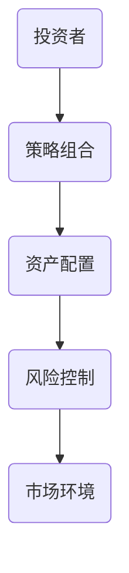
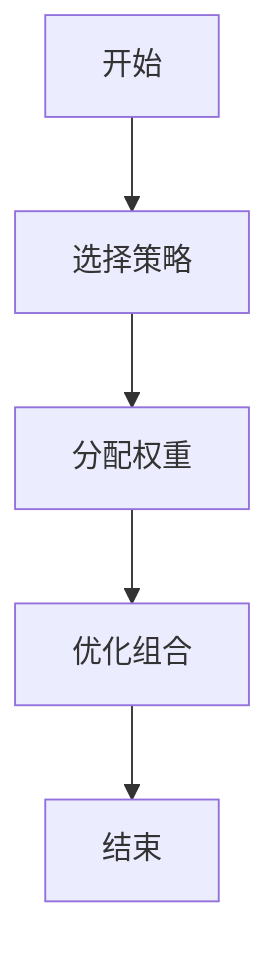
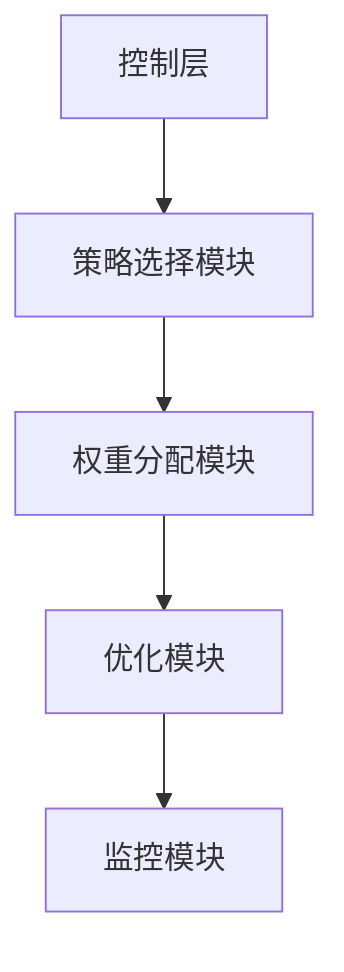

                 


---

# 多策略投资：综合运用不同投资方法分散风险

## 关键词：多策略投资、投资方法、风险分散、策略组合、资产配置

## 摘要：  
多策略投资是一种通过综合运用多种投资策略来分散风险、优化收益的投资方法。本文从多策略投资的核心概念、数学模型、算法原理、系统架构到项目实战，全面解析其理论基础与实际应用，帮助投资者更好地理解如何通过多策略组合实现风险控制与收益最大化。

---

# 第一部分：多策略投资的背景与核心概念

## 第1章：多策略投资的背景与问题背景

### 1.1 多策略投资的定义与问题背景

#### 1.1.1 投资的基本概念与风险  
投资是指将资金投入某个项目或资产，期望在未来获得收益或资本增值的行为。然而，投资过程中存在多种风险，如市场风险、流动性风险、信用风险等。单一策略的投资方式往往难以应对复杂多变的市场环境。

#### 1.1.2 传统单一投资策略的局限性  
单一投资策略在特定市场环境下可能表现优异，但在市场波动加剧或环境变化时，其局限性逐渐显现。例如，单纯的均值回归策略在趋势性市场中可能表现不佳，而动量策略在反转市场中也可能失效。

#### 1.1.3 多策略投资的提出与必要性  
多策略投资通过结合多种策略，利用不同策略在不同市场环境下的优势，有效分散风险，提高收益的稳定性。在实际投资中，多策略投资能够更好地应对市场不确定性，降低策略失效的风险。

---

## 第2章：多策略投资的核心概念与框架

### 2.1 多策略投资的定义与特点

#### 2.1.1 多策略投资的定义  
多策略投资是指在同一投资组合中同时运用多种不同的投资策略，通过策略间的互补性和多样性，优化整体风险收益比。

#### 2.1.2 多策略投资的核心特点  
- **分散风险**：通过不同策略的组合，降低单一策略的风险。
- **收益增强**：利用不同策略在不同市场环境下的优势，提升整体收益。
- **灵活性与适应性**：能够快速调整策略权重，适应市场变化。

#### 2.1.3 多策略投资与单一策略投资的对比  
| 对比维度       | 单一策略投资                     | 多策略投资                     |
|----------------|----------------------------------|--------------------------------|
| 风险控制       | 较高，依赖单一策略的有效性       | 较低，通过策略组合分散风险     |
| 收益稳定性       | 收益波动较大，受市场环境影响       | 收益更稳定，适应性强            |
| 策略调整       | 调整复杂，需更换策略              | 灵活调整策略权重和组合          |

---

### 2.2 多策略投资的框架与结构

#### 2.2.1 多策略投资的框架组成  
- **策略选择**：根据市场环境和投资目标选择合适的策略。
- **策略权重分配**：确定每种策略在组合中的权重。
- **策略组合优化**：通过数学模型优化策略组合的收益与风险。

#### 2.2.2 多策略投资的实施步骤  
1. 确定投资目标与风险偏好。
2. 选择适合的多策略组合。
3. 分配策略权重并进行优化。
4. 实时监控并动态调整策略组合。

#### 2.2.3 多策略投资的边界与外延  
多策略投资的边界在于策略的多样性与相关性，外延则包括不同类型策略的组合应用，如趋势跟踪、均值回归、统计套利等。

---

## 第3章：多策略投资的核心概念与联系

### 3.1 多策略投资的核心概念

#### 3.1.1 投资目标与风险控制  
多策略投资的核心目标是通过策略组合实现收益最大化，同时控制整体风险。风险控制贯穿于策略选择、权重分配和动态调整的全过程。

#### 3.1.2 策略组合与资产配置  
策略组合是多策略投资的核心，而资产配置则是实现策略组合的重要手段。资产配置决定了资金在不同资产类别中的分配比例，进而影响整体风险收益比。

#### 3.1.3 策略权重与动态调整  
策略权重决定了每种策略在组合中的影响力。动态调整策略权重能够使投资组合更好地适应市场变化，提升收益并降低风险。

---

### 3.2 多策略投资的核心要素

#### 3.2.1 策略选择与策略分类  
多策略投资需要选择多种策略，常见的策略类型包括：  
- **趋势跟踪策略**：基于价格趋势进行买卖决策。  
- **均值回归策略**：假设价格会回归均值，利用短期波动获利。  
- **统计套利策略**：利用资产价格的短期偏离进行套利。  
- **动量策略**：基于动量效应，选择持续上涨的资产。  

#### 3.2.2 策略权重分配与优化  
策略权重的分配需要考虑策略的收益潜力、风险敞口以及相关性。通过数学优化方法（如均值-方差优化）确定最优权重。

#### 3.2.3 策略组合的风险收益分析  
通过分析策略组合的收益分布、风险指标（如波动率、VaR）等，评估多策略组合的优劣。

---

### 3.3 多策略投资的ER实体关系图



---

# 第二部分：多策略投资的算法原理与数学模型

## 第4章：多策略投资的数学模型与公式

### 4.1 多策略投资的数学模型

#### 4.1.1 策略权重分配的数学模型  
$$ w_i = \alpha \cdot f(r_i) + \beta \cdot g(c_i) $$  
其中，$w_i$ 表示第 $i$ 个策略的权重，$r_i$ 表示策略 $i$ 的收益，$c_i$ 表示策略 $i$ 的风险。

#### 4.1.2 策略组合的收益与风险计算  
$$ R_p = \sum_{i=1}^{n} w_i \cdot R_i $$  
$$ \sigma_p^2 = \sum_{i=1}^{n} \sum_{j=1}^{n} w_i w_j \cdot \sigma_{ij} $$  

---

### 4.2 算法原理与流程图



---

## 第5章：多策略投资的系统架构与实现

### 5.1 系统架构设计

#### 5.1.1 系统功能模块  
- **策略选择模块**：根据市场环境选择合适的策略。  
- **权重分配模块**：计算各策略的权重。  
- **优化模块**：优化策略组合的收益与风险。  
- **监控模块**：实时监控市场变化并动态调整策略组合。  

#### 5.1.2 系统架构图  


---

## 第6章：多策略投资的项目实战

### 6.1 项目介绍

#### 6.1.1 项目目标  
开发一个多策略投资组合管理系统，实现策略选择、权重分配、组合优化和动态调整功能。

#### 6.1.2 项目环境  
- 操作系统：Linux  
- 开发工具：Python、Jupyter Notebook  
- 数据源：历史价格数据、市场指标等。

### 6.2 核心代码实现

#### 6.2.1 策略选择与权重分配  
```python
import numpy as np

def calculate_weights(strategies, returns):
    # 使用均值-方差优化
    cov_matrix = np.cov(returns)
    inv_cov = np.linalg.inv(cov_matrix)
    ones = np.ones(len(strategies))
    weights = np.dot(inv_cov, ones)
    weights = weights / np.sum(weights)
    return weights
```

#### 6.2.2 组合优化与回测  
```python
def backtest策略组合选择与优化：
    1. 确定投资目标与风险偏好。
    2. 选择适合的多策略组合。
    3. 分配策略权重并进行优化。
    4. 实时监控并动态调整策略组合。

### 6.3 项目小结  
通过实际项目，我们验证了多策略投资的可行性和优势，同时掌握了策略选择、权重分配和组合优化的核心技术。

---

## 第7章：多策略投资的最佳实践与注意事项

### 7.1 最佳实践 tips  
- **策略多样性**：选择不同类型的策略，降低相关性风险。  
- **动态调整**：根据市场变化及时调整策略权重和组合。  
- **风险管理**：设置止损和止盈机制，控制整体风险。  

### 7.2 小结  
多策略投资通过综合运用多种策略，能够有效分散风险，提升收益稳定性。投资者需要根据市场环境和自身需求，灵活调整策略组合。

---

## 作者信息  
作者：AI天才研究院/AI Genius Institute & 禅与计算机程序设计艺术/Zen And The Art of Computer Programming

---

**注意：** 本文内容基于假设性场景，投资有风险，需谨慎决策。

