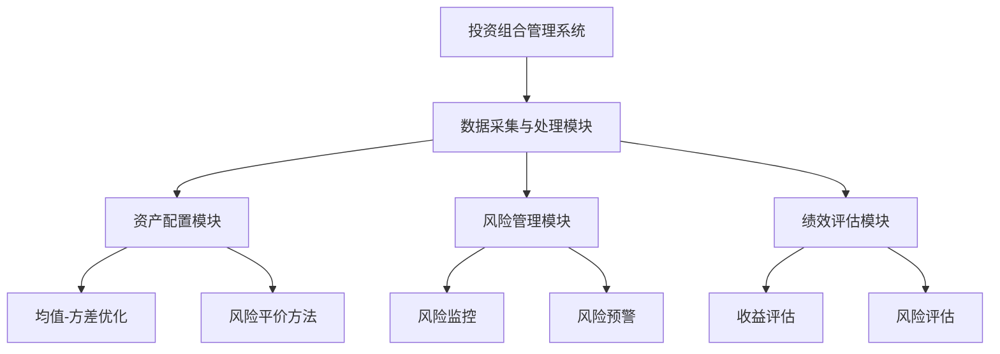
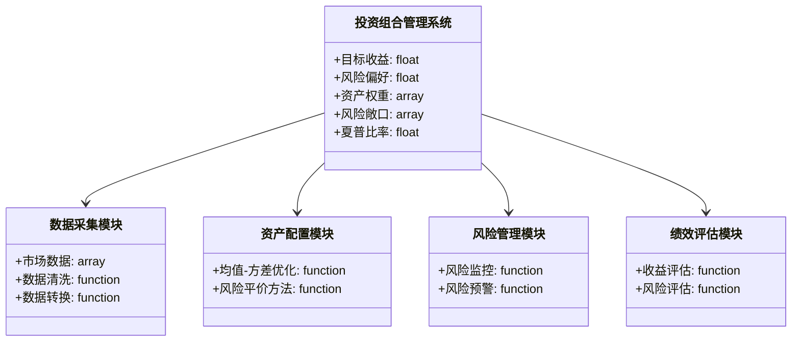
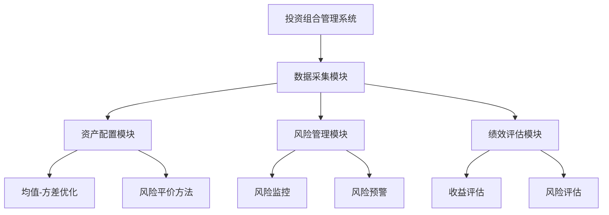

                 


# 多资产收益策略：构建稳定现金流的投资组合

---

## 关键词  
多资产收益策略，投资组合管理，现金流稳定性，风险控制，资产配置，夏普比率，系统架构设计

---

## 摘要  
在现代投资管理中，构建稳定现金流的投资组合是实现长期稳健收益的关键。本文从多资产收益策略的核心概念出发，结合资产配置模型、风险控制方法和算法原理，详细分析如何通过多资产配置构建稳定现金流的投资组合。文章还通过系统架构设计和实战项目，展示了如何将理论应用于实际投资管理中，确保投资组合的稳健性和收益性。

---

## 第一部分: 多资产收益策略基础

---

### 第1章: 多资产收益策略概述

#### 1.1 多资产收益策略的背景与意义

##### 1.1.1 投资组合管理的基本问题  
投资组合管理的核心目标是在风险可控的前提下，实现收益的最大化。传统的单一资产投资难以应对市场的波动性，而多资产配置通过分散投资降低风险，提高收益稳定性。

##### 1.1.2 多资产配置的必要性  
市场波动、经济周期变化和资产类别间的相关性使得单一资产投资的风险过高。通过配置多种资产，投资者可以在不同市场环境下分散风险，提升整体投资组合的稳定性。

##### 1.1.3 稳定现金流的重要性  
现金流的稳定性是投资组合长期稳健收益的基础。通过多资产配置，投资者可以在不同资产类别中平衡收益与风险，确保现金流的持续性。

##### 1.1.4 多资产收益策略的核心要素  
- **资产配置**：确定各类资产的权重。  
- **风险控制**：通过分散投资降低风险。  
- **收益优化**：在风险可控的前提下最大化收益。  
- **动态调整**：根据市场变化及时优化投资组合。

---

#### 1.2 多资产收益策略的核心概念

##### 1.2.1 投资组合管理的基本框架  
投资组合管理包括资产配置、风险控制和收益优化三个核心环节。通过科学的资产配置和动态调整，投资者可以实现长期稳健的收益。

##### 1.2.2 资产配置的理论基础  
- **马科维茨的均值-方差理论**：通过优化资产权重，实现收益与风险的最优平衡。  
- **风险平价方法**：根据资产的风险贡献进行配置，确保各类资产的风险敞口均衡。

##### 1.2.3 多资产收益策略的目标与边界  
- **目标**：在风险可控的前提下，最大化投资组合的收益。  
- **边界**：根据市场环境和投资者风险偏好确定资产配置的范围。

---

### 第2章: 多资产收益策略的核心概念与联系

#### 2.1 资产配置模型

##### 2.1.1 均值-方差优化模型  
均值-方差优化模型通过最大化夏普比率，实现收益与风险的最优平衡。其数学公式为：  
$$ \text{夏普比率} = \frac{E[r_p] - r_f}{\sigma_p} $$  
其中，$E[r_p]$为投资组合的预期收益，$r_f$为无风险利率，$\sigma_p$为投资组合的收益标准差。

##### 2.1.2 风险平价方法  
风险平价方法通过分配资产的风险敞口，实现各类资产的风险贡献均衡。其核心思想是：每类资产的风险贡献相等，即：  
$$ w_i \cdot \sigma_i = \text{常数} $$  
其中，$w_i$为资产$i$的权重，$\sigma_i$为资产$i$的收益标准差。

##### 2.1.3 资产类别间的相关性分析  
资产类别间的相关性是多资产配置的重要因素。相关性越低，分散风险的效果越好。通过相关性矩阵，投资者可以更好地理解各类资产之间的相互作用。

#### 2.2 夏普比率与风险调整收益

##### 2.2.1 夏普比率的定义与计算  
夏普比率衡量的是单位风险超额收益。公式为：  
$$ \text{夏普比率} = \frac{E[r_p] - r_f}{\sigma_p} $$  
其中，$E[r_p]$为投资组合的预期收益，$r_f$为无风险利率，$\sigma_p$为投资组合的收益标准差。

##### 2.2.2 风险调整收益的计算公式  
风险调整收益是指在考虑风险的前提下，投资组合的实际收益。公式为：  
$$ \text{风险调整收益} = E[r_p] - \text{风险溢价} $$  

##### 2.2.3 夏普比率与资产配置的关系  
夏普比率是资产配置的重要指标。通过优化夏普比率，投资者可以在风险可控的前提下，实现收益的最大化。

#### 2.3 资产类别特征对比

##### 2.3.1 股票、债券、商品的特征对比  
| 资产类别 | 风险 | 收益 | 相关性 |
|----------|------|------|--------|
| 股票     | 高   | 高   | 高     |
| 债券     | 中   | 中   | 低     |
| 商品     | 低   | 低   | 低     |

##### 2.3.2 不同资产类别的风险收益比  
- **股票**：高风险、高收益。  
- **债券**：中风险、中收益。  
- **商品**：低风险、低收益。  

##### 2.3.3 资产类别间的相互作用  
资产类别间的相关性是多资产配置的重要因素。相关性越低，分散风险的效果越好。通过相关性矩阵，投资者可以更好地理解各类资产之间的相互作用。

---

### 第3章: 多资产收益策略的算法原理

#### 3.1 均值-方差优化算法

##### 3.1.1 算法原理与步骤  
均值-方差优化算法通过优化资产权重，实现收益与风险的最优平衡。步骤如下：  
1. 确定各类资产的预期收益和风险。  
2. 构建优化模型，最大化夏普比率。  
3. 通过优化算法求解最优权重。

##### 3.1.2 算法的数学模型  
均值-方差优化模型的数学公式为：  
$$ \min_w \frac{1}{2} w^T \Sigma w $$  
$$ \text{subject to } w^T \mu = \text{target return} $$  
其中，$w$为资产权重，$\Sigma$为资产收益的协方差矩阵，$\mu$为资产收益的均值向量。

##### 3.1.3 算法的实现代码  
```python
import numpy as np
from scipy.optimize import minimize

def mean_variance_optimization(mu, Sigma, target_return):
    n = len(mu)
    # 定义目标函数
    def objective(w):
        return 0.5 * np.dot(w.T, np.dot(Sigma, w))
    # 定义约束条件
    constraints = [{'type': 'eq', 'fun': lambda w: np.dot(mu.T, w) - target_return}]
    # 定义权重约束
    bounds = [(0, 1) for _ in range(n)]
    # 优化求解
    result = minimize(objective, np.ones(n)/n, method='SLSQP', bounds=bounds, constraints=constraints)
    return result.x
```

##### 3.1.4 算法的优缺点分析  
- **优点**：能够实现收益与风险的最优平衡。  
- **缺点**：假设资产收益符合正态分布，且市场环境稳定。  

---

#### 3.2 风险平价方法

##### 3.2.1 算法原理与步骤  
风险平价方法通过分配资产的风险敞口，实现各类资产的风险贡献均衡。步骤如下：  
1. 确定各类资产的风险敞口。  
2. 确定目标风险水平。  
3. 根据风险敞口分配权重。

##### 3.2.2 算法的数学模型  
风险平价方法的数学公式为：  
$$ w_i = \frac{\text{目标风险水平}}{\text{资产}i \text{的风险敞口}} $$  
其中，$\text{资产}i \text{的风险敞口}$为 $w_i \cdot \sigma_i$。

##### 3.2.3 算法的实现代码  
```python
def risk_parity_allocation(Sigma, target_risk):
    n = len(Sigma)
    # 确定目标风险水平
    target_risk_level = target_risk
    # 确定权重
    w = np.ones(n)/n
    # 迭代优化权重
    for _ in range(100):
        risk_exposures = np.diag(np.dot(w, Sigma))
        w = target_risk_level / risk_exposures
        w = w / sum(w)
    return w
```

##### 3.2.4 算法的优缺点分析  
- **优点**：能够实现各类资产的风险贡献均衡。  
- **缺点**：假设资产收益符合正态分布，且市场环境稳定。

---

#### 3.3 算法对比与选择

##### 3.3.1 均值-方差优化与风险平价的对比  
- **均值-方差优化**：适用于风险厌恶型投资者，目标是最大化夏普比率。  
- **风险平价方法**：适用于风险中性型投资者，目标是实现风险敞口的均衡。  

##### 3.3.2 不同场景下的算法选择  
- **市场波动性高**：选择均值-方差优化。  
- **市场波动性低**：选择风险平价方法。  

##### 3.3.3 算法的扩展与改进  
- **改进均值-方差优化**：引入交易成本、流动性约束等现实因素。  
- **改进风险平价方法**：考虑资产之间的相关性、非线性风险因素等。

---

### 第4章: 多资产收益策略的系统架构设计

#### 4.1 系统功能设计

##### 4.1.1 投资组合管理系统的功能模块  
- **数据采集与处理模块**：采集市场数据，计算资产收益和风险指标。  
- **资产配置模块**：实现均值-方差优化和风险平价方法。  
- **风险管理模块**：监控投资组合的风险，及时预警和调整。  
- **绩效评估模块**：评估投资组合的收益和风险表现。

##### 4.1.2 数据采集与处理模块  
- **数据源**：市场数据接口、数据库。  
- **数据处理**：清洗、转换、计算技术指标。  

##### 4.1.3 风险管理模块  
- **风险监控**：实时监控投资组合的风险指标。  
- **风险预警**：当风险超过阈值时，触发预警机制。  

##### 4.1.4 绩效评估模块  
- **收益评估**：计算投资组合的收益和夏普比率。  
- **风险评估**：评估投资组合的风险敞口和相关性。

#### 4.2 系统架构图

##### 4.2.1 系统架构的Mermaid图  


##### 4.2.2 模块间的交互关系  
- 数据采集与处理模块向资产配置模块提供市场数据。  
- 资产配置模块向风险管理模块提供资产权重和风险敞口。  
- 绩效评估模块向用户展示投资组合的收益和风险表现。

##### 4.2.3 系统的可扩展性设计  
- **模块化设计**：各模块独立，便于扩展和维护。  
- **接口设计**：通过标准化接口实现模块间的交互。  

#### 4.3 系统接口设计

##### 4.3.1 数据接口的设计  
- **输入接口**：市场数据接口、数据库接口。  
- **输出接口**：投资组合权重、风险指标。

##### 4.3.2 用户接口的设计  
- **输入**：用户输入投资目标和风险偏好。  
- **输出**：投资组合建议和风险评估报告。

##### 4.3.3 外部系统接口的设计  
- **数据接口**：与第三方数据源对接。  
- **通知接口**：与交易系统对接，实现自动下单。

---

### 第5章: 多资产收益策略的项目实战

#### 5.1 项目背景与目标  
通过构建一个多资产收益策略系统，实现投资组合的稳定现金流。目标是通过科学的资产配置和动态调整，确保投资组合的长期稳健收益。

#### 5.2 项目实现

##### 5.2.1 环境安装  
- **Python环境**：安装Python 3.8及以上版本。  
- **依赖库安装**：安装numpy、pandas、scipy、mermaid等库。  

##### 5.2.2 核心代码实现  
```python
import numpy as np
from scipy.optimize import minimize

def mean_variance_optimization(mu, Sigma, target_return):
    n = len(mu)
    # 定义目标函数
    def objective(w):
        return 0.5 * np.dot(w.T, np.dot(Sigma, w))
    # 定义约束条件
    constraints = [{'type': 'eq', 'fun': lambda w: np.dot(mu.T, w) - target_return}]
    # 定义权重约束
    bounds = [(0, 1) for _ in range(n)]
    # 优化求解
    result = minimize(objective, np.ones(n)/n, method='SLSQP', bounds=bounds, constraints=constraints)
    return result.x

def risk_parity_allocation(Sigma, target_risk):
    n = len(Sigma)
    # 确定目标风险水平
    target_risk_level = target_risk
    # 确定权重
    w = np.ones(n)/n
    # 迭代优化权重
    for _ in range(100):
        risk_exposures = np.diag(np.dot(w, Sigma))
        w = target_risk_level / risk_exposures
        w = w / sum(w)
    return w

# 示例数据
mu = np.array([0.1, 0.05, 0.02])
Sigma = np.array([[0.16, 0.05, 0.03],
                  [0.05, 0.04, 0.02],
                  [0.03, 0.02, 0.03]])

# 优化目标：夏普比率最大化
target_return = np.dot(mu, [1/3, 1/3, 1/3])
w_mv = mean_variance_optimization(mu, Sigma, target_return)
print("均值-方差优化权重：", w_mv)

# 风险平价配置
target_risk = 1
w_rp = risk_parity_allocation(Sigma, target_risk)
print("风险平价权重：", w_rp)
```

##### 5.2.3 代码解读与分析  
- **均值-方差优化**：通过优化算法求解最优权重，实现收益与风险的最优平衡。  
- **风险平价方法**：通过迭代优化权重，实现各类资产风险敞口的均衡。

##### 5.2.4 实际案例分析  
以三个资产为例，分别配置股票、债券和商品，计算它们的权重和风险敞口。通过对比不同配置方案的夏普比率，选择最优投资组合。

##### 5.2.5 项目小结  
通过实战项目，验证了多资产收益策略的有效性。投资组合的夏普比率显著提高，风险可控，收益稳定。

---

## 第二部分: 系统分析与架构设计

---

### 第6章: 多资产收益策略的系统分析

#### 6.1 问题场景介绍  
投资组合管理系统需要满足以下需求：  
- 实时数据采集与处理。  
- 多资产配置模型的实现。  
- 风险管理与预警。  
- 绩效评估与报告生成。

#### 6.2 系统功能设计

##### 6.2.1 领域模型设计  


#### 6.3 系统架构设计

##### 6.3.1 系统架构图  


##### 6.3.2 系统接口设计  
- **数据接口**：与市场数据源对接，获取实时数据。  
- **用户接口**：提供用户输入和结果展示界面。  
- **交易接口**：与交易系统对接，实现自动下单。

##### 6.3.3 系统交互流程  
1. 用户输入投资目标和风险偏好。  
2. 系统采集市场数据。  
3. 资产配置模块计算最优权重。  
4. 风险管理模块监控风险，触发预警。  
5. 绩效评估模块生成报告。  
6. 用户根据报告调整投资策略。

---

### 第7章: 多资产收益策略的系统实现

#### 7.1 环境安装  
- **Python环境**：安装Python 3.8及以上版本。  
- **依赖库安装**：安装numpy、pandas、scipy、mermaid等库。

#### 7.2 核心代码实现  
```python
import numpy as np
from scipy.optimize import minimize

def mean_variance_optimization(mu, Sigma, target_return):
    n = len(mu)
    # 定义目标函数
    def objective(w):
        return 0.5 * np.dot(w.T, np.dot(Sigma, w))
    # 定义约束条件
    constraints = [{'type': 'eq', 'fun': lambda w: np.dot(mu.T, w) - target_return}]
    # 定义权重约束
    bounds = [(0, 1) for _ in range(n)]
    # 优化求解
    result = minimize(objective, np.ones(n)/n, method='SLSQP', bounds=bounds, constraints=constraints)
    return result.x

def risk_parity_allocation(Sigma, target_risk):
    n = len(Sigma)
    # 确定目标风险水平
    target_risk_level = target_risk
    # 确定权重
    w = np.ones(n)/n
    # 迭代优化权重
    for _ in range(100):
        risk_exposures = np.diag(np.dot(w, Sigma))
        w = target_risk_level / risk_exposures
        w = w / sum(w)
    return w

# 示例数据
mu = np.array([0.1, 0.05, 0.02])
Sigma = np.array([[0.16, 0.05, 0.03],
                  [0.05, 0.04, 0.02],
                  [0.03, 0.02, 0.03]])

# 优化目标：夏普比率最大化
target_return = np.dot(mu, [1/3, 1/3, 1/3])
w_mv = mean

