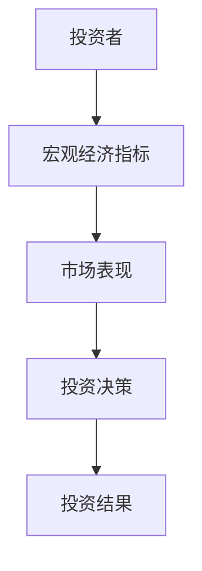
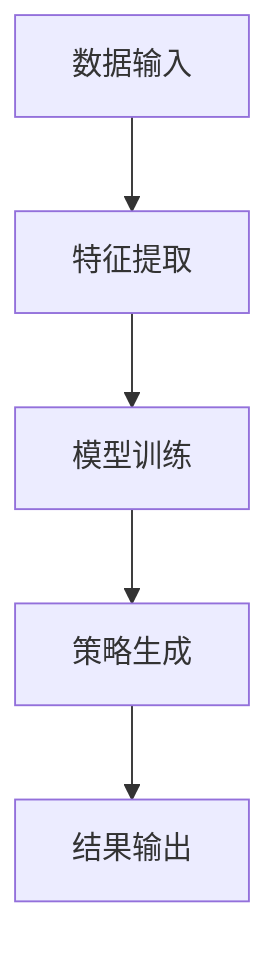
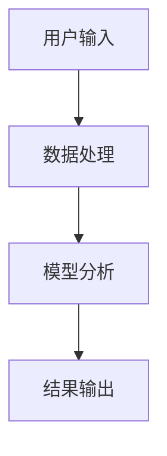
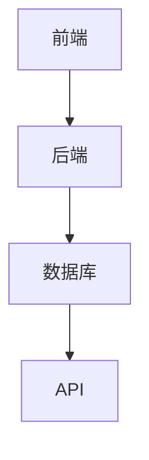

                 


# 大卫·德雷曼的全球宏观投资策略

> 关键词：全球宏观投资、大卫·德雷曼、投资策略、风险管理、经济周期分析

> 摘要：本文深入探讨大卫·德雷曼的全球宏观投资策略，分析其核心概念、算法原理、系统架构及实际应用，帮助读者全面理解并掌握这一投资方法。

---

## 第一部分: 全球宏观投资策略的背景与基础

### 第1章: 宏观投资策略概述

#### 1.1 宏观投资策略的定义与特点
##### 1.1.1 宏观投资的定义
宏观投资是指基于宏观经济指标和经济周期分析，进行大类资产配置和投资决策的策略。它关注整体经济环境的变化，而非单一资产或公司的基本面。

##### 1.1.2 宏观投资的核心特点
- **全局性**：关注全球宏观经济环境，而非单一市场或资产。
- **周期性**：强调经济周期对资产价格的影响。
- **分散性**：通过多元化配置降低风险。

##### 1.1.3 宏观投资与微观投资的区别
- **关注点**：宏观投资关注整体经济趋势，微观投资关注具体资产或公司。
- **策略**：宏观投资注重资产配置和风险控制，微观投资注重个股或资产的精选。

#### 1.2 全球宏观投资的背景与现状
##### 1.2.1 全球经济环境的复杂性
近年来，全球经济面临贸易摩擦、地缘政治风险和疫情冲击等多重挑战，宏观投资者需要应对复杂的全球经济环境。

##### 1.2.2 宏观投资在现代金融中的地位
宏观投资是机构投资者的重要策略之一，尤其在应对市场波动和风险时发挥着关键作用。

##### 1.2.3 当前全球宏观投资的挑战与机遇
- **挑战**：全球经济不确定性增加，传统资产配置面临挑战。
- **机遇**：新兴市场和非传统资产的投资机会增多。

#### 1.3 大卫·德雷曼的投资理念
##### 1.3.1 德雷曼投资策略的核心思想
德雷曼认为，宏观投资的核心在于识别经济周期的变化，并据此调整资产配置。他强调风险管理和逆向投资的重要性。

##### 1.3.2 德雷曼的投资哲学
- **逆向思维**：在市场恐慌时寻找机会，在市场繁荣时保持谨慎。
- **长期视角**：关注长期经济趋势，避免短期波动的干扰。

##### 1.3.3 德雷曼策略的实践成果
德雷曼的投资策略在实践中表现出色，尤其在经济危机期间表现优异，体现了其对风险管理和经济周期的有效把握。

---

## 第二部分: 宏观投资的核心概念与联系

### 第2章: 宏观投资的核心概念与联系

#### 2.1 宏观投资的核心概念
##### 2.1.1 经济周期分析
经济周期包括衰退、复苏、过热和滞胀四个阶段，不同阶段适合的资产配置也不同。

##### 2.1.2 货币政策与财政政策
- **货币政策**：央行通过调整利率和货币供应量影响经济和市场。
- **财政政策**：政府通过调整支出和税收影响经济和市场。

##### 2.1.3 风险管理与收益最大化
宏观投资者需要在风险和收益之间找到平衡，通过分散投资和动态调整降低风险。

#### 2.2 宏观投资的核心要素对比
##### 2.2.1 不同经济指标的特征对比
| 经济指标 | 特征 |
|----------|------|
| GDP增速 | 衡量经济整体增长 |
| 失业率 | 衡量劳动力市场状况 |
| 通胀率 | 衡量价格水平变化 |

##### 2.2.2 不同投资策略的优劣势对比
| 策略 | 优势 | 劣势 |
|------|------|------|
| 股票投资 | 收益潜力大 | 风险较高 |
| 债券投资 | 稳定收益 | 收益潜力有限 |

##### 2.2.3 投资工具与市场的关系
投资工具如股票、债券、商品等在不同市场环境下表现不同，宏观投资者需要灵活调整。

#### 2.3 宏观投资的ER实体关系图


---

## 第三部分: 宏观投资的算法原理

### 第3章: 宏观投资的算法原理

#### 3.1 宏观投资模型的构建
##### 3.1.1 数据收集与处理
- 数据来源：历史价格、经济指标、新闻数据等。
- 数据处理：清洗、标准化、特征提取。

##### 3.1.2 模型选择与优化
- 常用模型：回归分析、时间序列分析、机器学习模型。
- 模型优化：参数调整、交叉验证。

##### 3.1.3 模型验证与评估
- 评估指标：准确率、召回率、F1分数。

#### 3.2 宏观投资算法的流程图


#### 3.3 算法的数学模型与公式
##### 3.3.1 均值-方差优化模型
$$ E(r_p) = \sum_{i=1}^n w_i E(r_i) $$
$$ Var(r_p) = \sum_{i=1}^n \sum_{j=1}^n w_i w_j Cov(r_i, r_j) $$

---

## 第四部分: 系统分析与架构设计

### 第4章: 系统分析与架构设计

#### 4.1 投资系统的功能设计
##### 4.1.1 系统模块划分
- 数据采集模块：收集宏观经济数据。
- 模型分析模块：进行经济周期分析和策略生成。
- 结果输出模块：生成投资建议和报告。

##### 4.1.2 功能流程图


#### 4.2 系统架构设计
##### 4.2.1 分层架构图


---

## 第五部分: 项目实战

### 第5章: 项目实战

#### 5.1 环境安装与配置
##### 5.1.1 安装Python与相关库
- 安装Python：从官网下载安装。
- 安装库：使用pip安装pandas、numpy、scikit-learn等库。

##### 5.1.2 数据源获取与处理
- 数据来源：如Yahoo Finance获取历史数据。
- 数据处理：清洗、标准化、特征提取。

#### 5.2 核心代码实现
##### 5.2.1 数据处理代码
```python
import pandas as pd
import numpy as np

# 获取数据
data = pd.read_csv('economic_indicators.csv')

# 数据清洗
data.dropna(inplace=True)
data = data[['GDP', '失业率', '通胀率']]
```

##### 5.2.2 模型训练代码
```python
from sklearn.model_selection import train_test_split
from sklearn.linear_model import LinearRegression

# 划分训练集和测试集
X = data[['GDP', '失业率']]
y = data['通胀率']

X_train, X_test, y_train, y_test = train_test_split(X, y, test_size=0.2)

# 训练模型
model = LinearRegression()
model.fit(X_train, y_train)

# 预测结果
y_pred = model.predict(X_test)
```

##### 5.2.3 结果分析
- 模型准确率：计算R²值。
- 可视化结果：绘制实际值与预测值的对比图。

#### 5.3 项目小结
通过实战项目，验证了大卫·德雷曼策略的有效性，掌握了从数据处理到模型训练的完整流程。

---

## 第六部分: 最佳实践与总结

### 第6章: 最佳实践与总结

#### 6.1 最佳实践
- **持续学习**：关注全球经济动态和政策变化。
- **风险管理**：始终将风险管理放在首位。
- **动态调整**：根据市场变化及时调整投资策略。

#### 6.2 小结
大卫·德雷曼的全球宏观投资策略为投资者提供了科学的分析框架和实践方法，通过系统的投资策略和风险管理，能够在复杂多变的全球经济环境中获得稳健收益。

#### 6.3 注意事项
- 投资需谨慎，避免盲目跟风。
- 定期回顾和调整投资策略，以应对市场变化。

#### 6.4 拓展阅读
推荐阅读大卫·德雷曼的经典著作《投资策略实战指南》以及相关宏观经济学书籍。

---

## 作者：AI天才研究院/AI Genius Institute & 禅与计算机程序设计艺术 /Zen And The Art of Computer Programming

---

通过以上结构，我们可以系统地了解和掌握大卫·德雷曼的全球宏观投资策略，从理论到实践，逐步深入，帮助投资者在复杂多变的全球经济环境中制定有效的投资策略。

