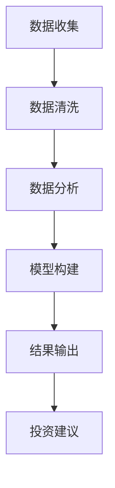
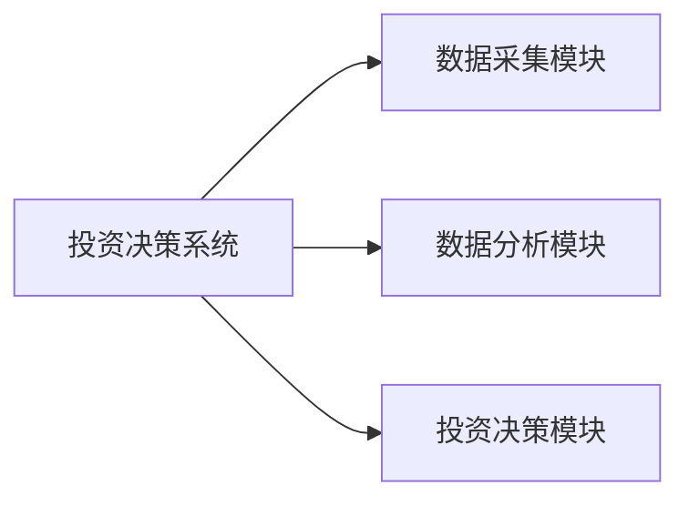
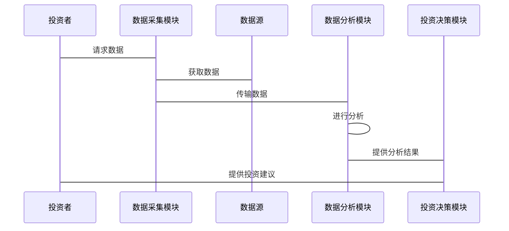

                 


# 《大卫·德雷曼的宏观经济分析在投资中的应用》

> 关键词：宏观经济分析、大卫·德雷曼、投资策略、经济指标、逆向投资、基本面分析、风险管理

> 摘要：本文深入探讨了大卫·德雷曼的宏观经济分析方法及其在投资中的应用。通过分析宏观经济指标和经济周期，德雷曼的逆向投资策略为投资者提供了独特的视角。文章详细讲解了宏观经济分析的核心概念、算法原理、数学模型，并通过实际案例展示了如何将这些方法应用于投资决策中。

---

## 第一部分: 宏观经济分析基础

### 第1章: 宏观经济分析概述

#### 1.1 宏观经济分析的定义与目标
- **1.1.1 宏观经济分析的基本概念**  
  宏观经济分析是研究整体经济体系运行规律的学科，关注GDP、通货膨胀、失业率等宏观指标，帮助投资者理解经济趋势和市场波动。

- **1.1.2 宏观经济分析的主要目标**  
  通过分析经济指标，预测经济走势，评估投资环境，优化投资决策，降低风险。

- **1.1.3 宏观经济分析与投资的关系**  
  宏观经济分析为投资者提供经济背景，帮助识别投资机会和风险，指导资产配置。

#### 1.2 宏观经济指标解析
- **1.2.1 GDP、通货膨胀、失业率等核心指标**  
  GDP衡量经济规模，通货膨胀影响购买力，失业率反映就业状况。

- **1.2.2 指标之间的相互关系与影响**  
  高通货膨胀可能导致高失业率，影响企业利润和股价。

- **1.2.3 指标对投资决策的指导意义**  
  低失业率和高GDP增长可能预示股市上涨，高通货膨胀可能引发加息，影响债券价格。

#### 1.3 大卫·德雷曼的宏观经济分析框架
- **1.3.1 德雷曼分析框架的核心要素**  
  逆向思维、基本面分析、经济周期分析。

- **1.3.2 德雷曼的逆向投资哲学**  
  在市场恐慌时寻找低估资产，在乐观时保持谨慎。

- **1.3.3 宏观经济分析在投资中的应用前景**  
  帮助投资者识别周期性机会，优化资产配置，降低投资风险。

### 第2章: 宏观经济分析的核心概念与联系

#### 2.1 宏观经济分析的核心原理
- **2.1.1 宏观经济分析的理论基础**  
  基于凯恩斯主义和 monetarist 的理论，结合实际数据进行分析。

- **2.1.2 宏观经济指标的数学模型**  
  使用回归分析预测GDP增长率，评估通货膨胀对利率的影响。

- **2.1.3 宏观经济分析的工具与方法**  
  统计模型、时间序列分析、计量经济学方法。

#### 2.2 核心概念对比表
- **2.2.1 经济周期与市场波动的对比分析**
  | 经济周期阶段 | 市场波动特征 |
  |--------------|--------------|
  | 萧条 | 低市场波动，资产价格低估 |
  | 复苏 | 市场波动上升，资产价格上涨 |
  |过热 | 高市场波动，资产价格泡沫风险 |
  |衰退 | 市场波动剧烈，资产价格大幅波动 |

- **2.2.2 不同经济指标的特征对比**
  | 指标 | 定义 | 影响 |
  |------|------|------|
  | GDP | 国内生产总值 | 经济增长的主要指标 |
  | 通货膨胀 | 货币购买力下降 | 利率上升，债券价格下跌 |
  | 失业率 | 劳动力市场状况 | 消费者支出减少，企业利润下降 |

- **2.2.3 投资者与宏观经济的关系对比**
  | 投资者类型 | 宏观经济影响 | 投资策略 |
  |------------|---------------|-----------|
  | 保守投资者 | 高通货膨胀 | 偏好债券 |
  | 投机者 | 经济衰退 | 偏好股票 |

#### 2.3 宏观经济分析的ER实体关系图
- **2.3.1 实体关系图的构建**  
  实体包括：经济指标、经济周期、投资决策。

- **2.3.2 实体之间的关系与作用**  
  经济指标影响经济周期，经济周期影响投资决策。

- **2.3.3 实体关系图对投资决策的影响**  
  通过分析经济指标和周期，投资者可以调整资产配置策略。

---

## 第二部分: 宏观经济分析的算法原理

### 第3章: 宏观经济分析的算法原理

#### 3.1 宏观经济分析的算法流程
- **3.1.1 数据收集与处理**  
  收集GDP、通货膨胀、失业率等数据，清洗和标准化。

- **3.1.2 数据分析与建模**  
  使用回归分析预测经济指标，构建宏观经济模型。

- **3.1.3 结果输出与投资建议**  
  根据模型结果生成投资策略，指导投资者决策。

#### 3.2 宏观经济分析的mermaid流程图


#### 3.3 宏观经济分析的Python代码实现
```python
import pandas as pd
import numpy as np
from sklearn.linear_model import LinearRegression

# 示例数据
data = {
    'GDP': [5, 6, 7, 8, 9],
    'Inflation': [2, 3, 2, 4, 5],
    'Unemployment': [6, 5, 7, 4, 8]
}

df = pd.DataFrame(data)
# 使用回归模型预测GDP增长率
model = LinearRegression()
model.fit(df[['Inflation', 'Unemployment']], df['GDP'])
预测 = model.predict([[3, 5]])
print("预测的GDP增长率：", 预测[0])
```

#### 3.4 宏观经济分析的数学模型与公式
- **回归模型**：$$ y = \beta_0 + \beta_1x_1 + \beta_2x_2 + \epsilon $$
  其中，$$ y $$ 是GDP增长率，$$ x_1 $$ 是通货膨胀率，$$ x_2 $$ 是失业率。

---

## 第三部分: 宏观经济分析的系统架构设计

### 第4章: 投资决策系统的构建

#### 4.1 问题场景介绍
- 投资者需要基于宏观经济分析做出投资决策。

#### 4.2 系统功能设计
- 数据采集模块：收集宏观经济数据。
- 数据分析模块：分析数据，生成报告。
- 投资决策模块：根据分析结果提供投资建议。

#### 4.3 系统架构设计


#### 4.4 系统接口设计
- 数据接口：与数据源对接，获取实时经济指标。
- 报告接口：生成分析报告，供投资者参考。

#### 4.5 系统交互设计


---

## 第四部分: 项目实战

### 第5章: 宏观经济分析的项目实战

#### 5.1 环境安装
- 安装Python、Pandas、NumPy、Scikit-learn等工具。

#### 5.2 系统核心实现源代码
```python
import pandas as pd
from sklearn.linear_model import LinearRegression

# 数据读取
data = pd.read_csv('economic_data.csv')

# 数据处理
X = data[['Inflation', 'Unemployment']]
y = data['GDP']

# 建立模型
model = LinearRegression()
model.fit(X, y)

# 预测
new_data = [[3, 5]]
预测 = model.predict(new_data)
print(f"预测的GDP增长率：{预测[0]:.2f}")
```

#### 5.3 案例分析
- 使用实际经济数据，应用模型预测GDP增长率，指导投资决策。

#### 5.4 项目小结
- 通过项目实战，验证了宏观经济分析在投资中的有效性，帮助投资者做出科学决策。

---

## 第五部分: 最佳实践、小结、注意事项和拓展阅读

### 第6章: 最佳实践与小结

#### 6.1 最佳实践
- 定期更新数据，持续监控经济指标。
- 结合多种分析方法，全面评估投资风险。

#### 6.2 小结
- 大卫·德雷曼的宏观经济分析为投资者提供了科学的决策工具。
- 通过系统分析和实战项目，投资者可以有效应用这些方法。

### 6.3 注意事项
- 数据的准确性和及时性至关重要。
- 投资者需具备一定的经济学和编程基础。

### 6.4 拓展阅读
- 建议阅读德雷曼的经典著作，深入学习宏观经济分析方法。

---

## 作者信息

作者：AI天才研究院/AI Genius Institute & 禅与计算机程序设计艺术 /Zen And The Art of Computer Programming

---

这篇文章详细介绍了大卫·德雷曼的宏观经济分析方法，并通过理论与实践相结合的方式，帮助投资者理解如何将这些方法应用于实际投资中。希望对您有所帮助！

