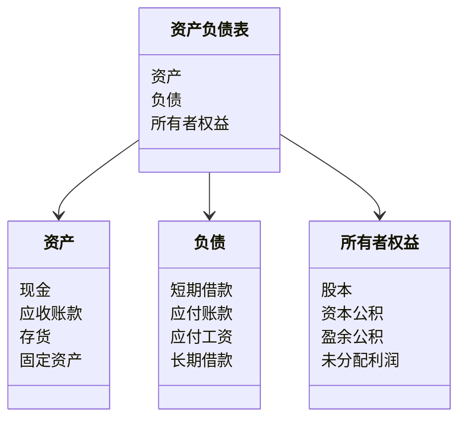

                 


# 《大卫·德雷曼的资产负债表价值投资：深入分析财务状况》

> **关键词**：大卫·德雷曼，资产负债表，价值投资，财务分析，投资策略，财务指标

> **摘要**：本文深入探讨了大卫·德雷曼的资产负债表价值投资方法，分析了企业财务状况的核心要素，包括资产、负债和所有者权益的评估与分析。通过详细讲解财务报表分析的关键指标和方法，本文为投资者提供了如何通过资产负债表进行投资决策的实用指南。结合实际案例和系统设计，本文旨在帮助读者掌握资产负债表分析的精髓，从而在投资实践中做出更明智的决策。

---

# 第一部分：资产负债表价值投资的背景与基础

## 第1章：价值投资与资产负债表分析

### 1.1 价值投资的核心理念

#### 1.1.1 价值投资的定义与特点
价值投资是一种以企业内在价值为核心的投资策略，强调通过分析企业的财务状况、行业地位和竞争优势来判断其投资价值。大卫·德雷曼的价值投资方法注重对企业财务报表的深入分析，尤其是资产负债表，以识别被市场低估的企业。

#### 1.1.2 资产负债表在价值投资中的重要性
资产负债表是企业财务状况的静态记录，反映了企业在某一特定时点的资产、负债和所有者权益的构成。通过分析资产负债表，投资者可以评估企业的资产质量、负债风险和财务稳定性，从而判断其内在价值。

#### 1.1.3 大卫·德雷曼的投资方法与风格
大卫·德雷曼的价值投资方法强调对企业财务状况的深入研究，尤其是对资产负债表的分析。他认为，企业的财务报表是反映其经营状况和未来盈利能力的重要工具。通过分析资产负债表，投资者可以识别出那些财务健康、估值合理的优质企业。

### 1.2 资产负债表分析的基本概念

#### 1.2.1 资产负债表的构成与作用
资产负债表由资产、负债和所有者权益三部分构成，反映了企业在某一特定时点的财务状况。资产是企业拥有的资源，负债是企业需要偿还的债务，所有者权益是企业净资产的价值。

#### 1.2.2 资产负债表的主要指标与比率
- **流动比率**：流动资产与流动负债的比率，衡量企业的短期偿债能力。
- **速动比率**：速动资产（流动资产减去存货）与流动负债的比率，进一步衡量企业的短期偿债能力。
- **负债比率**：负债总额与资产总额的比率，反映企业的杠杆水平。
- **所有者权益比率**：所有者权益与资产总额的比率，衡量企业的净资产规模。

#### 1.2.3 资产负债表分析的常见误区
- **只看数字，不看质量**：资产负债表中的数字需要结合企业的实际经营状况和行业特点进行分析。
- **忽略行业差异**：不同行业的企业有不同的资产和负债结构，投资者需要结合行业特点进行分析。
- **过度依赖财务报表**：财务报表是企业经营状况的反映，但不能完全替代对企业经营情况的实地调研。

### 1.3 价值投资与财务报表分析的关系

#### 1.3.1 财务报表分析在价值投资中的地位
财务报表分析是价值投资的核心工具之一。通过分析财务报表，投资者可以评估企业的盈利能力、财务健康状况和成长潜力。

#### 1.3.2 资产负债表分析的核心要素
- 资产质量与流动性
- 负债结构与偿债能力
- 所有者权益与资本结构

#### 1.3.3 财务报表分析的局限性与应对策略
- **局限性**：财务报表反映的是过去的经营状况，无法直接预测未来的表现；财务报表可能存在会计估计和主观判断的影响。
- **应对策略**：结合企业历史业绩、行业趋势和管理层素质进行综合分析。

### 1.4 本章小结
本章介绍了价值投资的核心理念，强调了资产负债表在价值投资中的重要性，并分析了资产负债表的主要指标和常见误区。通过本章的学习，读者可以理解资产负债表在价值投资中的地位和作用。

---

## 第2章：资产分析与评估

### 2.1 资产的分类与评估方法

#### 2.1.1 资产的分类
资产可以分为流动资产和非流动资产。流动资产包括现金、应收账款、存货等，非流动资产包括固定资产、无形资产、长期股权投资等。

#### 2.1.2 流动资产的评估指标
- **流动资产周转率**：衡量流动资产的使用效率。
- **应收账款周转率**：衡量应收账款的回收效率。

#### 2.1.3 非流动资产的评估指标
- **固定资产净值率**：固定资产净值与原值的比率，反映固定资产的 depreciatio 状况。
- **无形资产占比**：无形资产占总资产的比例，反映企业对无形资产的依赖程度。

### 2.2 资产质量与价值评估

#### 2.2.1 资产质量的定义与影响因素
资产质量是指资产的流动性、变现能力、使用效率和保值能力。资产质量的好坏直接影响企业的经营效率和财务状况。

#### 2.2.2 资产周转率与资产使用效率
- **资产周转率**：总资产周转率 = 营业收入 / 平均总资产。
- **资产使用效率**：资产周转率越高，资产使用效率越高。

#### 2.2.3 资产减值与计提准备金的分析
企业需要定期对资产进行减值测试，计提减值准备金。资产减值准备金的计提反映了资产的实际价值下降，可能影响企业的财务状况。

### 2.3 资产负债表中的资产风险分析

#### 2.3.1 资产结构的风险影响
- 高流动资产比例的企业具有较强的短期偿债能力，但可能面临资产使用效率低的问题。
- 高非流动资产比例的企业具有较强的长期增长潜力，但可能面临流动性不足的风险。

#### 2.3.2 资产流动性与企业偿债能力
- 流动资产比例高的企业具有较强的短期偿债能力，但可能面临资产使用效率低的问题。
- 流动资产比例低的企业可能面临短期偿债压力，但可能具有较高的长期增长潜力。

#### 2.3.3 资产质量对企业价值的影响
- 资产质量高的企业具有较强的盈利能力和发展潜力，通常会被市场给予较高的估值。
- 资产质量低的企业可能面临经营效率低下或资产贬值的风险，通常会被市场给予较低的估值。

### 2.4 本章小结
本章详细分析了资产的分类与评估方法，探讨了资产质量与价值评估的关系，并分析了资产结构对企业偿债能力和价值的影响。通过本章的学习，读者可以掌握如何通过资产分析来评估企业的财务状况和投资价值。

---

## 第3章：负债分析与偿债能力评估

### 3.1 负债的分类与评估方法

#### 3.1.1 负债的分类
负债可以分为流动负债和非流动负债。流动负债包括短期借款、应付账款、应付工资等，非流动负债包括长期借款、债券发行等。

#### 3.1.2 负债的偿付顺序与风险
- 流动负债需要在一年内偿还，通常与企业的日常经营密切相关。
- 非流动负债需要在一年以上偿还，通常与企业的长期融资活动相关。

#### 3.1.3 负债对企业财务状况的影响
- 负债比例高意味着企业杠杆高，可能面临较高的偿债压力，但可能通过杠杆效应提高股东权益回报率。

### 3.2 偿债能力的指标分析

#### 3.2.1 流动比率与速动比率
- **流动比率** = 流动资产 / 流动负债。
- **速动比率** = (流动资产 - 存货) / 流动负债。

#### 3.2.2 负债比率与债务负担率
- **负债比率** = 负债总额 / 资产总额。
- **债务负担率** = 利息支出 / 息税前利润（EBIT）。

#### 3.2.3 利息覆盖倍数与偿债压力
- **利息覆盖倍数** = 息税前利润（EBIT） / 利息支出。
- 利息覆盖倍数越高，企业的偿债压力越小。

### 3.3 负债结构对企业价值的影响

#### 3.3.1 高负债企业的风险与收益
- 高负债企业可能面临较高的偿债压力，但可以通过杠杆效应提高股东权益回报率。

#### 3.3.2 低负债企业的稳定性与增长潜力
- 低负债企业财务稳定性较高，但可能需要通过内部积累或外部融资来实现增长。

#### 3.3.3 行业差异对负债结构的影响
- 不同行业的企业负债结构差异较大，例如重资产行业通常负债比例较高。

### 3.4 本章小结
本章分析了负债的分类与评估方法，探讨了偿债能力的指标，并分析了负债结构对企业价值的影响。通过本章的学习，读者可以掌握如何通过负债分析来评估企业的财务风险和偿债能力。

---

## 第4章：所有者权益分析与企业价值评估

### 4.1 所有者权益的构成与意义

#### 4.1.1 所有者权益的定义与组成部分
所有者权益是企业净资产的价值，包括股本、资本公积、盈余公积、未分配利润等。

#### 4.1.2 所有者权益与企业价值的关系
- 所有者权益是企业价值的重要组成部分，反映了企业的净资产规模。
- 所有者权益的增长通常意味着企业盈利能力的提高或资产的增值。

#### 4.1.3 所有者权益变动的分析
- 所有者权益的增加可能来自净利润的积累或外部资本的注入。
- 所有者权益的减少可能来自净利润的亏损或外部资本的退出。

### 4.2 净资产收益率与企业盈利能力

#### 4.2.1 净资产收益率（ROE）的计算与分析
- **ROE** = 净利润 / 平均净资产。
- ROE越高，说明企业的净资产利用效率越高。

#### 4.2.2 ROE与企业价值的关系
- ROE是衡量企业盈利能力的重要指标，通常被用作评估企业内在价值的重要依据。

#### 4.2.3 影响ROE的关键因素
- 净利润增长率
- 资本结构
- 资产使用效率

### 4.3 股东权益比率与资本结构优化

#### 4.3.1 股东权益比率的定义与计算
- **股东权益比率** = 股东权益总额 / 资产总额。

#### 4.3.2 资本结构对企业价值的影响
- 高股东权益比率意味着企业资本结构中股东权益占比高，财务风险较低。
- 低股东权益比率意味着企业资本结构中负债占比高，财务风险较高。

#### 4.3.3 优化资本结构的策略与方法
- 通过调整资产负债比例优化资本结构。
- 通过提高净资产收益率（ROE）提高资本使用效率。

### 4.4 本章小结
本章分析了所有者权益的构成与意义，探讨了净资产收益率（ROE）与企业盈利能力的关系，并分析了资本结构优化的策略与方法。通过本章的学习，读者可以掌握如何通过所有者权益分析来评估企业的内在价值和资本结构。

---

## 第5章：系统分析与架构设计方案

### 5.1 项目背景与需求分析

#### 5.1.1 问题场景介绍
- 通过资产负债表分析企业财务状况，识别潜在投资机会。
- 通过系统化的方法优化投资决策流程。

#### 5.1.2 项目介绍
- 开发一个基于资产负债表分析的投资决策支持系统。

### 5.2 系统功能设计

#### 5.2.1 领域模型（mermaid 类图）


#### 5.2.2 系统架构设计（mermaid 架构图）


#### 5.2.3 系统接口设计
- 输入接口：接收用户提交的财务数据。
- 输出接口：向用户展示分析结果和投资建议。

#### 5.2.4 系统交互（mermaid 序列图）
```mermaid
sequenceDiagram
    participant 用户
    participant 系统
    用户 -> 系统：提交财务数据
    系统 -> 用户：显示分析结果
```

### 5.3 项目实战

#### 5.3.1 环境安装
- 安装Python和相关库（如pandas、numpy、matplotlib）。
- 安装Jupyter Notebook用于数据分析和可视化。

#### 5.3.2 核心实现源代码
```python
import pandas as pd
import numpy as np
import matplotlib.pyplot as plt

# 示例数据加载
data = {
    '资产': [100, 200, 150],
    '负债': [50, 100, 75],
    '所有者权益': [50, 100, 75]
}
df = pd.DataFrame(data)

# 资产负债表分析
def analyze_balance_sheet(df):
    # 计算主要指标
    current_assets = df['资产'].sum()
    current_liabilities = df['负债'].sum()
    net_profit = df['所有者权益'].sum()

    # 计算ROE
    roe = net_profit / (current_assets + current_liabilities) * 100
    return roe

# 可视化分析
def visualize_analysis(df):
    plt.figure(figsize=(10, 6))
    df.plot(kind='bar', stacked=True, colormap='viridis')
    plt.title('资产负债表分析')
    plt.xlabel('项目')
    plt.ylabel('金额')
    plt.show()

# 主程序
if __name__ == "__main__":
    roe = analyze_balance_sheet(df)
    print(f"净资产收益率（ROE）为：{roe}%")
    visualize_analysis(df)
```

#### 5.3.3 代码应用解读与分析
- **数据加载**：将资产负债表数据加载到Pandas DataFrame中。
- **指标计算**：计算净资产收益率（ROE）并输出结果。
- **可视化分析**：通过柱状图展示资产负债表的构成。

#### 5.3.4 实际案例分析
假设某企业的资产负债表数据如下：
| 资产   | 负债   | 所有者权益 |
|--------|--------|------------|
| 100万 | 50万   | 50万       |
| 200万 | 100万  | 100万      |
| 150万 | 75万   | 75万       |

通过代码计算ROE：
```python
roe = 50万 / (100万 + 50万) * 100 = 33.33%
```

可视化结果如下：

![资产负债表分析柱状图]

### 5.4 本章小结
本章通过系统设计和项目实战，展示了如何通过资产负债表分析进行投资决策支持。通过Python代码实现数据加载、指标计算和可视化分析，帮助投资者更好地理解和应用资产负债表分析方法。

---

## 第6章：最佳实践与小结

### 6.1 最佳实践 tips
- **持续学习**：关注行业动态和市场变化，不断更新财务分析方法。
- **结合实际**：根据企业的实际情况进行分析，避免机械套用公式。
- **多元化分析**：结合资产负债表、利润表和现金流量表进行综合分析。

### 6.2 小结
通过本章的学习，读者掌握了资产负债表分析的核心方法和实际应用技巧。资产负债表分析不仅是价值投资的重要工具，也是企业财务管理的关键环节。通过深入分析资产、负债和所有者权益的构成与变化，投资者可以更好地识别企业的财务风险和投资机会。

### 6.3 注意事项
- 财务报表分析需要结合企业实际经营状况，不能仅依赖数字进行判断。
- 注意行业差异，不同行业的财务指标标准可能不同。
- 财务报表可能存在会计估计和主观判断的影响，需要谨慎分析。

### 6.4 拓展阅读
- 建议阅读大卫·德雷曼的经典著作《价值投资：从入门到精通》。
- 学习更多财务分析方法，如杜邦分析法、比率分析法等。

---

# 作者：AI天才研究院/AI Genius Institute & 禅与计算机程序设计艺术 /Zen And The Art of Computer Programming

