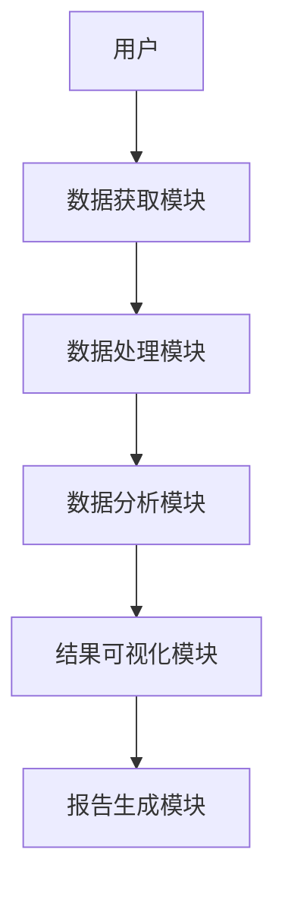
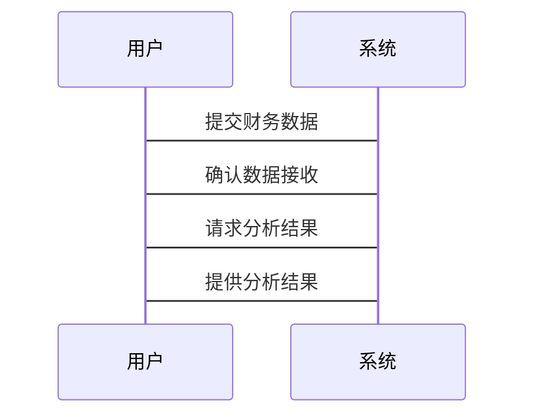

                 


# 《大卫德雷曼的财务报表解读》

---

## 关键词：

- 财务报表分析  
- 大卫德雷曼  
- 财务健康评估  
- 财务指标计算  
- 企业估值  

---

## 摘要：

本文系统地解读大卫德雷曼的财务报表分析方法，从基础概念到高级技巧，全面剖析财务报表的核心内容与解读方法。通过详细的理论分析、算法原理、系统设计和实战案例，帮助读者掌握如何通过财务报表评估企业财务健康状况，优化财务决策。文章结合大卫德雷曼的经典理论，深入探讨财务报表分析的工具、方法和应用场景，提供实用的技巧和最佳实践。

---

## 目录：

# {{此处是文章标题}}

> 关键词：{{此处列出文章的5-7个核心关键词}}

> 摘要：{{此处给出文章的核心内容和主题思想}}

---

# 第1章: 财务报表解读的背景与重要性

## 1.1 财务报表的基本概念

### 1.1.1 财务报表的定义与组成

财务报表是企业财务状况、经营成果和现金流量的正式记录，通常包括资产负债表、利润表和现金流量表。这些报表为企业内外部利益相关者提供了重要的财务信息，帮助他们评估企业的财务健康状况和经营表现。

### 1.1.2 财务报表的重要性

财务报表是企业决策的核心依据，能够帮助投资者、债权人和管理层评估企业的偿债能力、盈利能力和发展潜力。通过分析财务报表，可以识别企业潜在的风险和机会，为投资决策提供支持。

### 1.1.3 财务报表分析的常见应用场景

- 投资决策：评估企业的投资价值和风险。
- 融资决策：评估企业的偿债能力和信用状况。
- 经营决策：优化企业内部管理和资源配置。
- 并购决策：评估目标企业的财务健康状况。

## 1.2 大卫德雷曼的财务分析方法

### 1.2.1 大卫德雷曼的分析框架

大卫德雷曼（David Dreman）是价值投资领域的知名投资者，他的财务分析方法以基本面分析为核心，强调通过财务报表识别低估股票。他提出了一系列独特的财务指标和分析框架，帮助投资者发现市场中的估值错配机会。

### 1.2.2 大卫德雷曼分析方法的核心思想

大卫德雷曼的核心思想是：市场往往过度反应，投资者可以通过深入分析财务报表，找到那些被市场低估的企业。他的方法强调以下几点：
- 重视企业的基本面，尤其是财务报表中的关键指标。
- 寻找那些具有稳定盈利能力和良好财务状况的企业。
- 通过历史数据分析，识别市场周期中的低估机会。

### 1.2.3 大卫德雷曼分析方法与其他分析方法的对比

大卫德雷曼的方法与传统财务分析方法相比，更注重长期价值和基本面分析。他的方法结合了定量分析和定性分析，强调对企业财务状况的全面评估。

## 1.3 财务报表分析的工具与方法

### 1.3.1 常用财务分析工具

- 财务报表分析软件：如Excel、QuickBooks、SAP等。
- 数据可视化工具：如Tableau、Power BI。
- 财务分析模型：如杜邦分析模型、情景分析模型。

### 1.3.2 财务报表分析的基本方法

- 比较分析法：将企业的财务数据与行业平均水平或竞争对手进行比较。
- 趋势分析法：分析企业的财务数据在时间上的变化趋势。
- 假设分析法：假设某些关键变量的变化，评估对企业财务状况的影响。

### 1.3.3 数据可视化在财务分析中的应用

数据可视化是财务报表分析的重要工具，能够将复杂的财务数据转化为直观的图表，帮助分析师快速识别关键信息。常见的数据可视化方法包括：
- 折线图：展示财务数据的变化趋势。
- 条形图：比较不同项目或期间的财务数据。
- 饼图：展示财务数据的构成比例。

## 1.4 本章小结

---

# 第2章: 资产负债表解读

## 2.1 资产负债表的结构与内容

### 2.1.1 资产负债表的基本结构

资产负债表由资产、负债和所有者权益三部分组成，反映了企业在某一特定时点的财务状况。资产部分包括流动资产和非流动资产，负债部分包括流动负债和非流动负债，所有者权益部分包括股本、资本公积、盈余公积和未分配利润等。

### 2.1.2 资产、负债和所有者权益的定义与分类

- 资产：企业拥有的资源，能够为企业带来经济利益的未来收益。
- 负债：企业对外部的债务，需要在未来某个时间点偿还。
- 所有者权益：企业资产扣除负债后归所有者所有的部分。

### 2.1.3 资产负债表的编制原则

资产负债表的编制需要遵循会计准则，确保数据的真实、准确和完整性。编制过程中需要注意资产和负债的配比原则，以及所有者权益的独立性。

## 2.2 资产负债表的关键指标分析

### 2.2.1 流动资产与非流动资产的分析

流动资产是指可以在一年内变现或消耗的资产，主要包括现金、应收账款、存货等。非流动资产是指不能在一年内变现或消耗的资产，主要包括固定资产、无形资产、长期股权投资等。

### 2.2.2 负债结构的分析

负债结构分析是评估企业财务健康状况的重要内容。流动负债包括短期借款、应付账款、应付职工薪酬等，非流动负债包括长期借款、债券发行等。

### 2.2.3 股东权益的分析

股东权益分析是评估企业资本结构和财务稳定性的关键。通过分析股本、资本公积、盈余公积和未分配利润等指标，可以评估企业的资本构成和盈利能力。

## 2.3 资产负债表分析的常见问题与解决方案

### 2.3.1 资产负债表分析的误区

- 仅关注资产总额，忽略资产构成。
- 仅关注负债总额，忽略负债结构。
- 忽略所有者权益对企业财务状况的影响。

### 2.3.2 如何通过资产负债表评估企业财务健康状况

- 分析流动资产与流动负债的比例，评估企业的短期偿债能力。
- 分析资产总额与负债总额的比例，评估企业的整体财务杠杆。
- 分析所有者权益的构成，评估企业的资本结构和财务稳定性。

### 2.3.3 资产负债表与企业偿债能力的关系

通过分析资产负债表，可以评估企业的短期和长期偿债能力。短期偿债能力主要关注流动资产与流动负债的比例，长期偿债能力主要关注资产负债率和利息保障倍数。

## 2.4 本章小结

---

# 第3章: 利润表解读

## 3.1 利润表的结构与内容

### 3.1.1 利润表的基本结构

利润表反映了企业在一定会计期间内的经营成果，主要包括收入、成本、费用和利润四个部分。收入部分包括营业收入和其他收入，成本部分包括营业成本和其他支出，费用部分包括销售费用、管理费用和研发费用等。

### 3.1.2 收入、成本和利润的关系

收入减去成本和费用等于利润。利润表的核心是展示企业的盈利能力，包括营业利润、利润总额和净利润。

### 3.1.3 利润表的编制原则

利润表的编制需要遵循会计准则，确保收入和费用的配比原则。编制过程中需要注意收入确认和费用归集的准确性。

## 3.2 利润表的关键指标分析

### 3.2.1 毛利率的计算与分析

毛利率 = （营业收入 - 营业成本）/ 营业收入 × 100%

毛利率反映了企业的生产效率和成本控制能力。毛利率越高，说明企业的盈利能力越强。

### 3.2.2 净利率的计算与分析

净利率 = 净利润 / 营业收入 × 100%

净利率是衡量企业整体盈利能力的重要指标，反映了企业在扣除所有费用后的最终利润水平。

### 3.2.3 营业利润率的计算与分析

营业利润率 = 营业利润 / 营业收入 × 100%

营业利润率反映了企业核心业务的盈利能力，排除了非核心业务的影响。

## 3.3 利润表分析的常见问题与解决方案

### 3.3.1 利润表分析的误区

- 仅关注净利润，忽略其他利润指标。
- 仅关注当期利润，忽略历史数据和趋势分析。
- 忽略费用结构对企业利润的影响。

### 3.3.2 如何通过利润表评估企业盈利能力

- 分析毛利率和营业利润率，评估企业核心业务的盈利能力。
- 分析净利率，评估企业整体盈利能力。
- 分析费用结构，评估企业成本控制能力。

### 3.3.3 利润表与企业估值的关系

通过分析利润表，可以评估企业的盈利能力和成长潜力，为企业的估值提供重要依据。常用的估值方法包括市盈率、市净率和EV/EBITDA等。

## 3.4 本章小结

---

# 第4章: 现金流量表解读

## 4.1 现金流量表的结构与内容

### 4.1.1 现金流量表的基本结构

现金流量表反映了企业在一定会计期间内的现金流入和流出情况，主要包括经营活动、投资活动和筹资活动三个部分。经营活动现金流主要来自企业的日常经营活动，投资活动现金流主要来自企业的投资活动，筹资活动现金流主要来自企业的融资活动。

### 4.1.2 现金流量的分类

现金流入：经营活动、投资活动和筹资活动中的现金流入。

现金流出：经营活动、投资活动和筹资活动中的现金流出。

### 4.1.3 现金流量表的编制原则

现金流量表的编制需要遵循会计准则，确保现金流入和流出的准确记录。编制过程中需要注意现金流量的分类和归集。

## 4.2 现金流量表的关键指标分析

### 4.2.1 经营活动现金流净额的计算与分析

经营活动现金流净额 = 经营活动现金流入 - 经营活动现金流出

经营活动现金流净额反映了企业在日常经营活动中产生的现金流量，是评估企业经营能力的重要指标。

### 4.2.2 投资活动现金流净额的计算与分析

投资活动现金流净额 = 投资活动现金流入 - 投资活动现金流出

投资活动现金流净额反映了企业在投资活动中的现金流量，是评估企业投资活动的重要指标。

### 4.2.3 筹资活动现金流净额的计算与分析

筹资活动现金流净额 = 筹资活动现金流入 - 筹资活动现金流出

筹资活动现金流净额反映了企业在筹资活动中的现金流量，是评估企业融资能力的重要指标。

## 4.3 现金流量表分析的常见问题与解决方案

### 4.3.1 现金流量表分析的误区

- 仅关注经营活动现金流，忽略投资和筹资活动的影响。
- 仅关注当期现金流，忽略历史数据和趋势分析。
- 忽略现金流结构对企业财务状况的影响。

### 4.3.2 如何通过现金流量表评估企业流动性

- 分析经营活动现金流净额，评估企业的经营能力。
- 分析投资活动现金流净额，评估企业的投资活动。
- 分析筹资活动现金流净额，评估企业的融资能力。

### 4.3.3 现金流量表与企业财务健康状况的关系

通过分析现金流量表，可以评估企业的流动性、投资能力和融资能力，为企业的财务健康状况提供重要信息。常用的财务健康指标包括现金比率、流动比率和速动比率等。

## 4.4 本章小结

---

# 第5章: 财务指标计算与企业估值

## 5.1 财务指标计算方法

### 5.1.1 常用财务指标的计算公式

- 市盈率（P/E）= 股价 / 每股收益
- 市净率（P/B）= 股价 / 每股净资产
- EV/EBITDA = 企业价值 / 息税折旧及摊销前利润

### 5.1.2 财务指标计算的注意事项

- 确保财务数据的准确性和完整性。
- 合理选择估值模型和指标。
- 考虑行业特性和企业具体情况。

## 5.2 企业估值的方法

### 5.2.1 市盈率法

市盈率法是通过比较企业的市盈率与行业平均水平，评估企业的估值水平。市盈率越低，说明企业的估值可能越低。

### 5.2.2 市净率法

市净率法是通过比较企业的市净率与行业平均水平，评估企业的估值水平。市净率越低，说明企业的估值可能越低。

### 5.2.3 内部价值法

内部价值法是通过分析企业的基本面，估算企业的内在价值，通常用于价值投资策略。

## 5.3 财务指标分析与企业估值的关系

### 5.3.1 财务指标分析在企业估值中的作用

- 通过分析财务指标，评估企业的盈利能力、成长潜力和财务风险。
- 通过比较财务指标，识别企业的竞争优势和劣势。

### 5.3.2 财务指标分析的局限性

- 财务指标分析仅能提供定量信息，无法全面反映企业的定性因素。
- 财务指标分析受到会计政策和假设的影响，可能存在偏差。

## 5.4 本章小结

---

# 第6章: 系统分析与架构设计

## 6.1 系统分析与架构设计的背景

### 6.1.1 系统分析的目标

系统分析的目标是通过对企业财务报表的全面分析，识别企业的财务健康状况和潜在风险，为企业的财务决策提供支持。

### 6.1.2 系统分析的步骤

- 数据收集与整理
- 数据分析与建模
- 结果可视化与报告

## 6.2 系统架构设计

### 6.2.1 系统功能模块

- 数据获取模块：从企业财务报表中获取财务数据。
- 数据处理模块：对财务数据进行清洗、转换和计算。
- 数据分析模块：计算财务指标，进行趋势分析和对比分析。
- 结果可视化模块：将分析结果以图表形式展示。

### 6.2.2 系统架构图



## 6.3 系统接口设计

### 6.3.1 数据接口

- 数据输入接口：从企业财务报表中获取数据。
- 数据输出接口：将分析结果输出到报告或数据库中。

### 6.3.2 用户接口

- 界面设计：用户友好的界面设计，方便用户输入和查看分析结果。
- 操作流程：用户输入数据，系统进行分析，输出结果。

## 6.4 系统交互设计

### 6.4.1 交互流程图



## 6.5 本章小结

---

# 第7章: 项目实战与代码实现

## 7.1 项目实战环境安装

### 7.1.1 安装Python

- 下载并安装Python：https://www.python.org/downloads/
- 安装Python包管理工具pip。

### 7.1.2 安装数据分析包

- pandas: pip install pandas
- numpy: pip install numpy
- matplotlib: pip install matplotlib
- seaborn: pip install seaborn

## 7.2 核心实现代码

### 7.2.1 数据获取模块

```python
import pandas as pd

# 从CSV文件中读取财务数据
df = pd.read_csv('financial_data.csv')

# 查看数据前几行
print(df.head())
```

### 7.2.2 数据处理模块

```python
import pandas as pd
import numpy as np

# 删除缺失值
df.dropna(inplace=True)

# 填补缺失值
df.fillna(0, inplace=True)
```

### 7.2.3 数据分析模块

```python
import pandas as pd
import numpy as np

# 计算毛利率
df['毛利率'] = (df['营业收入'] - df['营业成本']) / df['营业收入'] * 100

# 计算净利率
df['净利率'] = df['净利润'] / df['营业收入'] * 100

# 计算市盈率
df['市盈率'] = df['股价'] / df['每股收益']
```

### 7.2.4 结果可视化模块

```python
import matplotlib.pyplot as plt
import seaborn as sns

# 绘制毛利率分布图
plt.figure(figsize=(10, 6))
sns.histplot(df['毛利率'], bins=10, kde=True)
plt.title('毛利率分布图')
plt.show()

# 绘制净利率趋势图
plt.figure(figsize=(10, 6))
sns.lineplot(x='年份', y='净利率', data=df)
plt.title('净利率趋势图')
plt.show()
```

## 7.3 项目实战小结

---

# 第8章: 最佳实践与注意事项

## 8.1 最佳实践

### 8.1.1 财务报表分析的技巧

- 结合行业特点和企业实际情况，灵活运用分析方法。
- 多维度分析，避免单一指标的误导。
- 定期更新财务数据，保持分析的时效性。

### 8.1.2 财务报表分析的注意事项

- 确保财务数据的准确性和完整性。
- 合理选择分析方法和工具。
- 结合定量分析和定性分析，全面评估企业的财务状况。

## 8.2 注意事项

### 8.2.1 分析中的常见误区

- 仅关注财务数据，忽略非财务因素。
- 仅关注短期数据，忽略长期趋势。
- 仅关注单个指标，忽略指标之间的关联。

### 8.2.2 如何避免分析错误

- 交叉验证财务数据，确保数据的准确性。
- 多角度分析问题，避免单一指标的误导。
- 定期更新分析结果，保持分析的时效性。

## 8.3 本章小结

---

# 作者信息

作者：AI天才研究院/AI Genius Institute & 禅与计算机程序设计艺术 /Zen And The Art of Computer Programming

