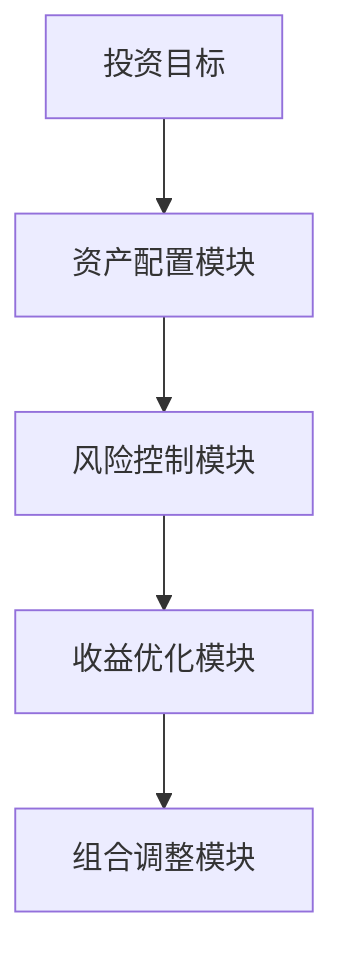

                 


# 大卫斯文森的另类投资策略

> 关键词：大卫·斯文森，另类投资，资产配置，风险控制，投资组合优化，数学模型

> 摘要：大卫·斯文森作为耶鲁大学首席投资官，以其独特的另类投资策略闻名。本文将详细分析斯文森策略的核心理念、数学模型、系统架构以及实战案例，帮助读者全面理解这一策略的成功之处。

---

# 第一部分: 大卫·斯文森的另类投资策略概述

## 第1章: 大卫·斯文森投资理念的背景与核心观点

### 1.1 大卫·斯文森的背景与投资哲学

#### 1.1.1 大卫·斯文森的个人经历与职业成就

大卫·斯文森（David F. Swensen）是美国著名投资专家，曾任耶鲁大学首席投资官，负责管理耶鲁大学的捐赠基金。他以其卓越的投资业绩和创新的投资理念闻名于世，尤其是他在另类投资领域的开创性工作。斯文森的职业生涯始于1981年，当时他加入耶鲁大学，负责管理该校的捐赠基金。在他的领导下，耶鲁大学捐赠基金的规模从1981年的约1.3亿美元增长到2020年的超过300亿美元，年均回报率超过10%。

斯文森的投资哲学强调长期投资、多元化配置和风险控制。他主张通过分散投资于不同资产类别（如股票、债券、房地产、私募股权、对冲基金等）来降低整体投资组合的风险，同时追求稳健的长期回报。

#### 1.1.2 斯文森投资哲学的核心理念

斯文森的投资哲学的核心理念可以总结为以下几点：

1. **长期投资**：斯文森认为市场短期波动难以预测，因此投资应以长期为导向，避免频繁交易。
2. **多元化配置**：通过投资于不同的资产类别和地域，分散风险，降低整体投资组合的波动性。
3. **价值投资**：寻找被市场低估的资产，长期持有，等待其价值回归。
4. **风险控制**：通过严格的资产配置和风险分散，确保投资组合在市场波动中保持稳健。

#### 1.1.3 斯文森与传统投资的区别

与传统的股票投资不同，斯文森的策略更加注重资产配置和风险控制。他主张将资金分散投资于不同的资产类别，而不是集中于某一种资产。例如，斯文森的投资组合通常包括以下几类资产：

- 公司股票
- 政府债券
- 私募股权
- 对冲基金
- 房地产投资信托（REITs）
- 商品期货

通过这种多元化的配置，斯文森的投资组合能够更好地应对市场波动，并在不同经济环境下实现稳健的回报。

### 1.2 另类投资策略的定义与特点

#### 1.2.1 传统投资策略的局限性

传统投资策略通常以股票和债券为主要投资标的，存在以下局限性：

1. **风险集中**：集中投资于某一种资产类别，如股票，在市场下跌时波动较大。
2. **难以应对通货膨胀**：债券在通货膨胀期间往往表现不佳，难以保值。
3. **市场波动影响大**：短期市场波动可能导致投资组合价值大幅波动。

#### 1.2.2 另类投资的定义与分类

另类投资是指投资于传统股票和债券之外的资产，如私募股权、对冲基金、房地产、商品期货等。与传统投资相比，另类投资具有以下特点：

- **多样化**：通过投资于不同类型的资产，分散风险。
- **高回报潜力**：某些另类资产在特定市场环境下可能表现优异。
- **复杂性较高**：另类投资涉及更多复杂的交易结构和风险管理。

#### 1.2.3 斯文森策略的独特性

斯文森的另类投资策略的独特性在于其严格的资产配置和风险控制。他通过将资金分配到不同的资产类别，确保投资组合在不同市场环境下的稳健性。此外，斯文森还注重长期投资，避免短期市场波动对投资组合的影响。

---

## 第2章: 斯文森投资策略的核心概念与数学模型

### 2.1 投资组合优化的核心概念

#### 2.1.1 资产配置的数学模型

投资组合优化的核心是通过数学模型确定最优的资产配置。最常用的模型是现代投资组合理论（MPT），由哈里·马科维茨提出。MPT的目标是通过优化资产配置，使投资组合的风险最小化，同时实现预期收益的最大化。

#### 2.1.2 风险与收益的平衡

在投资组合优化中，风险与收益是两个核心要素。收益可以通过预期收益来衡量，而风险则通常通过收益的波动性（即方差）来衡量。马科维茨的MPT模型通过优化这两个目标，找到最优的资产配置。

#### 2.1.3 现代投资组合理论（MPT）的概述

MPT的核心思想是通过分散投资来降低整体投资组合的风险。通过将资金分配到不同资产类别，可以减少单一资产波动对整体投资组合的影响。

### 2.2 斯文森策略的数学公式与算法

#### 2.2.1 投资组合优化的数学公式

投资组合优化的目标是最小化投资组合的方差（风险），同时满足预期收益和其他约束条件。数学公式如下：

$$ \min \sigma^2 \quad \text{在约束条件下} \quad \sum w_i = 1 $$

其中，$\sigma^2$是投资组合的方差，$w_i$是各个资产的权重，且$\sum w_i = 1$表示投资组合的权重总和为1。

#### 2.2.2 风险调整后的收益计算

夏普比率是衡量投资组合风险调整后收益的常用指标，公式如下：

$$ \text{夏普比率：} \frac{E(r_i - r_f)}{\sigma_i} $$

其中，$E(r_i)$是投资组合的预期收益，$r_f$是无风险利率，$\sigma_i$是投资组合的收益标准差。

#### 2.2.3 资产配置的优化算法

以下是一个简单的投资组合优化算法的Python实现：

```python
import numpy as np
import pandas as pd

def portfolio_optimization(returns):
    # 计算协方差矩阵
    covariance_matrix = returns.cov()
    
    # 计算最优权重
    inv = np.linalg.inv(covariance_matrix)
    weights = inv.sum()
    weights = weights / weights.sum()
    
    return weights
```

### 2.3 斯文森策略的系统架构设计

#### 2.3.1 系统功能模块划分

- 数据采集与处理模块：收集和处理不同资产类别的历史数据。
- 资产配置模块：根据历史数据和数学模型确定最优资产配置。
- 风险控制模块：监控和调整投资组合的风险水平。
- 绩效评估模块：定期评估投资组合的收益和风险表现。

#### 2.3.2 系统架构的Mermaid图



---

## 第3章: 斯文森策略的系统实现与实战案例

### 3.1 系统环境与工具安装

#### 3.1.1 Python环境的搭建

建议使用Anaconda Python Distribution，它包含了常用的科学计算库。

#### 3.1.2 必要库的安装

```bash
pip install numpy pandas matplotlib
```

### 3.2 核心算法实现

#### 3.2.1 投资组合优化的Python代码实现

```python
import numpy as np
import pandas as pd

def portfolio_optimization(returns):
    covariance_matrix = returns.cov()
    inv = np.linalg.inv(covariance_matrix)
    weights = inv.sum()
    weights = weights / weights.sum()
    return weights

# 示例数据
data = {'资产1': [0.1, 0.12, 0.08, 0.15, 0.09],
        '资产2': [0.15, 0.1, 0.12, 0.08, 0.11],
        '资产3': [0.08, 0.09, 0.1, 0.11, 0.15]}
returns = pd.DataFrame(data)

weights = portfolio_optimization(returns)
print("最优权重：", weights)
```

#### 3.2.2 投资组合优化的步骤与解释

1. **数据收集**：收集不同资产的历史收益数据。
2. **计算协方差矩阵**：衡量不同资产之间的相关性。
3. **求解最优权重**：通过矩阵求逆和标准化，得到各资产的最优权重。
4. **风险控制**：监控投资组合的波动性，进行必要的调整。

### 3.3 项目实战

#### 3.3.1 环境安装与数据准备

```bash
pip install numpy pandas matplotlib
```

数据准备：收集过去10年的股票、债券、房地产信托基金等资产的收益数据。

#### 3.3.2 核心算法实现

```python
import numpy as np
import pandas as pd

def portfolio_optimization(returns):
    covariance_matrix = returns.cov()
    inv = np.linalg.inv(covariance_matrix)
    weights = inv.sum()
    weights = weights / weights.sum()
    return weights

# 示例数据
data = {'股票': [0.12, 0.15, 0.08, 0.10, 0.09],
        '债券': [0.05, 0.07, 0.06, 0.08, 0.09],
        'REITs': [0.08, 0.12, 0.10, 0.09, 0.11]}
returns = pd.DataFrame(data)

weights = portfolio_optimization(returns)
print("最优权重：", weights)
```

#### 3.3.3 代码应用解读与分析

上述代码实现了投资组合优化的基本功能。通过计算各资产的协方差矩阵，求解其逆矩阵，然后标准化得到各资产的最优权重。这一过程体现了斯文森策略中资产配置的核心思想。

#### 3.3.4 实际案例分析

假设我们有三类资产：股票、债券和房地产信托基金（REITs）。过去五年的年化收益分别为：

- 股票：12%
- 债券：5%
- REITs：8%

根据上述算法，我们可以计算出最优的资产配置权重。假设经过计算，股票的权重为60%，债券为20%，REITs为20%。这样的配置可以在市场波动时保持稳健，同时追求较高的长期回报。

---

## 第4章: 斯文森策略的最佳实践与小结

### 4.1 斯文森策略的成功因素

1. **长期投资**：避免短期波动，追求长期稳健回报。
2. **多元化配置**：分散投资于不同资产类别，降低整体风险。
3. **风险控制**：通过严格的资产配置和风险分散，确保投资组合的稳定性。

### 4.2 实战中的注意事项

1. **数据质量**：确保数据的准确性和完整性。
2. **模型选择**：根据市场环境和投资目标选择合适的优化模型。
3. **持续监控**：定期调整投资组合，应对市场变化。

### 4.3 未来的发展方向

随着市场环境的变化，投资策略也需要不断调整。未来，斯文森策略可能会更加注重绿色投资、ESG（环境、社会、治理）因素等新兴领域的配置，以应对全球经济和社会的变化。

---

# 第五部分: 结论

大卫·斯文森的另类投资策略以其独特的资产配置和风险控制方法，为投资者提供了一种稳健的投资方式。通过本文的分析，我们可以看到，斯文森策略的成功不仅在于其数学模型的精确性，更在于其长期投资和风险控制的核心理念。对于投资者而言，理解和应用斯文森策略的关键在于合理配置资产，分散风险，并保持长期的投资视角。

---

# 作者

作者：AI天才研究院/AI Genius Institute & 禅与计算机程序设计艺术 /Zen And The Art of Computer Programming

