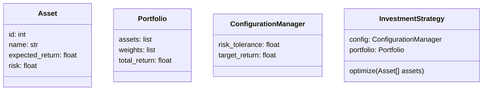
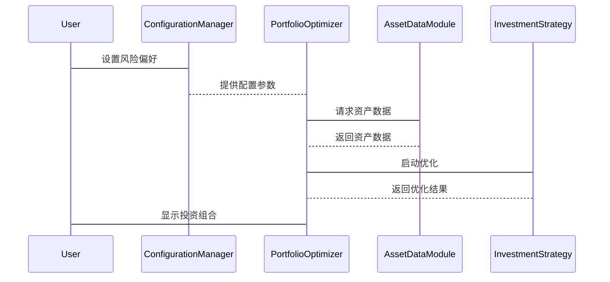

                 


# 《大卫斯文森的长期资本配置》

## 关键词：大卫·斯文森，长期资本配置，资产配置，投资策略，风险管理，算法优化

## 摘要：本文深入探讨大卫·斯文森的长期资本配置策略，结合理论与实践，分析其核心概念、数学模型和系统架构。通过详细讲解，帮助读者掌握长期资本配置的方法，并通过Python代码实现，提供实际案例分析和最佳实践建议。

---

# 《大卫斯文森的长期资本配置》

## 第1章: 长期资本配置的背景与理论基础

### 1.1 大卫·斯文森与长期资本配置

大卫·斯文森（David Swensen）是耶鲁大学的首席投资官，以其卓越的长期资本配置策略闻名。他强调多元化配置和长期投资，将复杂的投资理论转化为实践，为机构投资者提供了宝贵的指导。

#### 1.1.1 大卫·斯文森的背景与成就

- **背景**：大卫·斯文森在耶鲁大学工作超过30年，管理着规模庞大的捐赠基金。
- **成就**：他通过长期资本配置策略，帮助耶鲁大学实现了超越市场平均水平的投资回报。

#### 1.1.2 长期资本配置的核心理念

- **核心理念**：斯文森认为，长期资本配置应注重资产类别间的多元分散，以降低风险并提高收益。
- **投资哲学**：强调长期视角，避免短期波动干扰，追求稳定增长。

#### 1.1.3 长期资本配置的现实意义

- **现实意义**：在复杂多变的市场环境中，长期资本配置为机构投资者提供了稳健的投资框架。
- **适用性**：不仅适用于机构投资者，也对个人投资者具有借鉴意义。

### 1.2 资本配置的基本概念

#### 1.2.1 资本配置的定义与分类

- **定义**：资本配置是将资金分配到不同资产类别以实现投资目标的过程。
- **分类**：包括战略配置、战术配置和资产分配。

#### 1.2.2 长期资本配置的特征

- **长期性**：注重长期收益，而非短期波动。
- **多元化**：通过分散投资降低风险。
- **稳健性**：追求稳定回报，避免过度风险。

#### 1.2.3 资本配置与投资回报的关系

- **相关性**：合理的资本配置是实现超额回报的关键。
- **平衡性**：在风险与收益之间找到最佳平衡点。

### 1.3 资产类别与风险分析

#### 1.3.1 主要资产类别介绍

- **股票**：高风险，高回报。
- **债券**：相对稳定，风险较低。
- **房地产**：实物资产，提供稳定收益。
- ** commodities**：对冲通胀的有效工具。

#### 1.3.2 不同资产类别的风险特征

| 资产类别 | 风险特征 | 收益特征 |
|----------|----------|----------|
| 股票     | 高       | 高       |
| 债券     | 中       | 稳定     |
| 房地产   | 中       | 稳定     |
| 大宗商品 | 中       | 抗通胀   |

#### 1.3.3 资产配置中的风险分散策略

- **分散投资**：通过多种资产类别降低风险。
- **动态调整**：根据市场变化及时调整配置比例。

---

## 第2章: 大卫·斯文森的多元化配置策略

### 2.1 多元化配置的核心思想

#### 2.1.1 多元化配置的定义

- **定义**：将资金分散投资于不同资产类别，以降低整体风险。

#### 2.1.2 多元化配置的优势

- **优势**：降低特定资产类别的风险，提高整体稳定性。

#### 2.1.3 如何实现真正的多元化

- **方法**：选择多样化的资产类别，避免过于集中。

### 2.2 不同资产类别在配置中的作用

#### 2.2.1 股票在配置中的作用

- **作用**：提供高增长潜力。
- **权重**：在长期配置中占据较大比例。

#### 2.2.2 债券在配置中的作用

- **作用**：提供稳定性，降低整体波动性。
- **权重**：在保守配置中比例较高。

#### 2.2.3 其他资产类别（如房地产、大宗商品）的作用

- **房地产**：提供实物资产的稳定性。
- **大宗商品**：对冲通胀，平衡投资组合。

### 2.3 资产配置中的动态调整

#### 2.3.1 动态调整的必要性

- **必要性**：市场变化要求及时调整。

#### 2.3.2 调整的依据与方法

- **依据**：市场环境变化、投资者风险偏好调整。
- **方法**：定期评估，根据评估结果进行调整。

#### 2.3.3 调整中的常见误区

- **误区**：过于频繁调整，忽视长期目标。

---

## 第3章: 现代投资组合理论与资本配置

### 3.1 现代投资组合理论（MPT）概述

#### 3.1.1 MPT的基本假设

- **假设**：投资者是理性的，市场有效。
- **目标**：通过优化投资组合实现收益最大化。

#### 3.1.2 MPT的核心思想

- **核心思想**：通过分散投资降低风险，实现最优风险收益比。

#### 3.1.3 MPT与长期资本配置的关系

- **关系**：MPT为长期资本配置提供了理论基础。

### 3.2 资产配置的数学模型

#### 3.2.1 均值-方差优化模型

- **模型**：通过优化投资组合的收益和风险，找到最优配置。

#### 3.2.2 风险调整后的收益模型

- **模型**：考虑风险调整后的收益，进行资产配置。

#### 3.2.3 夏普比率与资产配置

- **夏普比率**：衡量投资组合的风险调整后收益。

### 3.3 资本配置的算法实现

#### 3.3.1 均值-方差优化的算法步骤

1. **输入**：各资产的预期收益、方差和协方差矩阵。
2. **计算**：使用矩阵运算优化投资组合。
3. **输出**：最优配置比例。

#### 3.3.2 使用Python实现MPT模型

```python
import numpy as np

def mpt_optimization(expected_returns, covariance_matrix):
    n = len(expected_returns)
    cov = np.array(covariance_matrix)
    mu = np.array(expected_returns)
    
    inv_cov = np.linalg.inv(cov)
    w = inv_cov.dot(mu)
    w = w / np.sum(w)
    return w
```

#### 3.3.3 算法的优缺点分析

- **优点**：科学合理，降低风险。
- **缺点**：假设市场有效，实际可能不准确。

---

## 第4章: 长期资本配置系统的架构设计

### 4.1 长期资本配置系统的功能设计

#### 4.1.1 领域模型（Mermaid 类图）



#### 4.1.2 系统架构设计（Mermaid 架构图）

```mermaid
container CapitalAllocationSystem {
    Portfolio Optimization Module
    ConfigurationManager
    Asset Data Module
}
PortfolioOptimizer --> ConfigurationManager
PortfolioOptimizer --> AssetDataModule
```

#### 4.1.3 接口设计

- **输入接口**：接收资产数据和配置参数。
- **输出接口**：提供优化后的投资组合。

#### 4.1.4 系统交互（Mermaid 序列图）



### 4.2 系统实现细节

#### 4.2.1 代码实现

```python
class Asset:
    def __init__(self, id, name, expected_return, risk):
        self.id = id
        self.name = name
        self.expected_return = expected_return
        self.risk = risk

class Portfolio:
    def __init__(self, assets, weights):
        self.assets = assets
        self.weights = weights
        self.total_return = sum(w * a.expected_return for w, a in zip(weights, assets))

class ConfigurationManager:
    def __init__(self, risk_tolerance, target_return):
        self.risk_tolerance = risk_tolerance
        self.target_return = target_return

class PortfolioOptimizer:
    def __init__(self, config):
        self.config = config

    def optimize(self, assets):
        n = len(assets)
        returns = np.array([a.expected_return for a in assets])
        cov_matrix = np.array([[a.risk for a in assets] for _ in range(n)])
        inv_cov = np.linalg.inv(cov_matrix)
        weights = inv_cov.dot(returns)
        weights = weights / np.sum(weights)
        return weights
```

#### 4.2.2 系统实现流程

1. **初始化**：读取资产数据和配置参数。
2. **优化**：计算最优权重。
3. **输出**：展示优化结果。

### 4.3 系统实现的注意事项

- **数据准确性**：确保输入数据的准确性。
- **计算效率**：优化算法效率，减少计算时间。
- **风险管理**：定期评估和调整配置，降低风险。

---

## 第5章: 项目实战——基于大卫·斯文森策略的长期资本配置系统

### 5.1 项目介绍

#### 5.1.1 项目目标

- **目标**：实现大卫·斯文森的长期资本配置策略，提供投资建议。

### 5.2 环境安装

#### 5.2.1 安装Python和必要的库

- **库**：numpy, pandas, matplotlib.

### 5.3 核心代码实现

#### 5.3.1 资产数据准备

```python
assets = [
    Asset(1, '股票', 0.1, 0.2),
    Asset(2, '债券', 0.05, 0.03),
    Asset(3, '房地产', 0.08, 0.1),
    Asset(4, 'commodities', 0.07, 0.15)
]
```

#### 5.3.2 配置管理器

```python
config = ConfigurationManager(risk_tolerance=0.05, target_return=0.08)
```

#### 5.3.3 优化过程

```python
optimizer = PortfolioOptimizer(config)
weights = optimizer.optimize(assets)
```

#### 5.3.4 结果展示

```python
for i in range(len(assets)):
    print(f"{assets[i].name}: {weights[i]:.2f}")
```

### 5.4 案例分析

#### 5.4.1 数据分析与可视化

```python
import matplotlib.pyplot as plt

plt.bar([a.name for a in assets], weights)
plt.title('投资组合权重')
plt.show()
```

#### 5.4.2 结果解读

- **权重分配**：股票占据较大比例，债券和房地产作为平衡。
- **风险控制**：通过分散投资降低了整体风险。

### 5.5 项目小结

- **系统优势**：科学优化，降低风险。
- **实际应用**：帮助投资者实现长期稳健回报。

---

## 第6章: 最佳实践、小结、注意事项与拓展阅读

### 6.1 最佳实践 tips

- **定期评估**：市场变化要求定期调整配置。
- **分散投资**：避免集中，降低风险。
- **长期视角**：关注长期目标，避免短期波动干扰。

### 6.2 小结

大卫·斯文森的长期资本配置策略强调多元化和长期视角，通过科学的配置实现稳健回报。本文通过理论与实践结合，帮助读者掌握这一策略。

### 6.3 注意事项

- **市场风险**：需关注宏观经济变化。
- **数据质量**：确保输入数据准确。
- **模型局限**：算法假设可能与实际不符。

### 6.4 拓展阅读

- **书籍推荐**：《机构投资的创新实践》。
- **在线资源**：相关投资策略的学术论文。

---

## 作者：AI天才研究院/AI Genius Institute & 禅与计算机程序设计艺术/Zen And The Art of Computer Programming

---

**本文内容基于公开资料整理，旨在传播知识，如有侵权请联系删除。**

