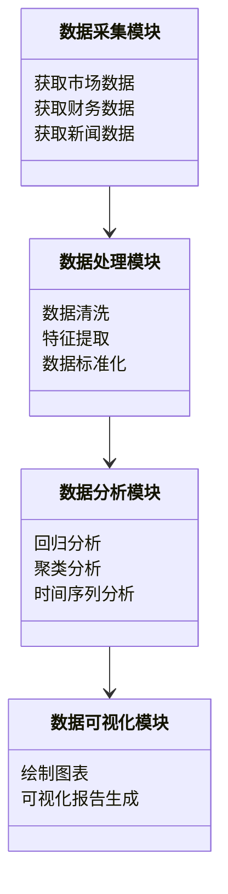
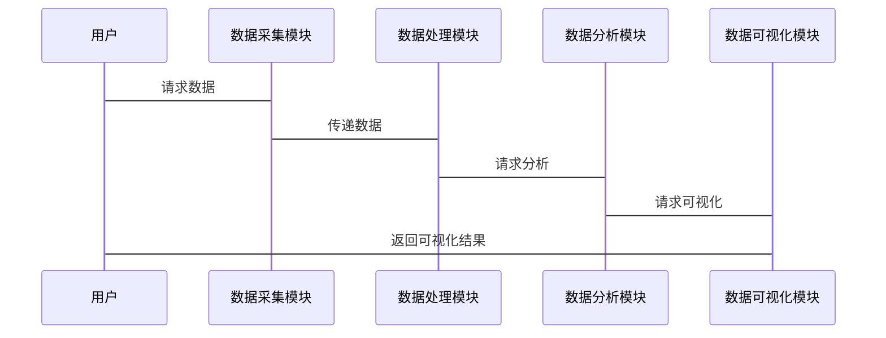

                 


# 大数据分析在投资研究中的应用

## 关键词：大数据分析，投资研究，机器学习，数据挖掘，金融时间序列

## 摘要：  
大数据分析在投资研究中的应用已经成为现代金融领域的重要趋势。通过大数据分析技术，投资者能够从海量数据中提取有价值的信息，优化投资决策，降低风险，提高投资效率。本文详细探讨了大数据分析的核心技术、投资研究中的数据处理方法、常用的大数据分析算法与模型，以及系统架构设计。通过实际案例分析，展示了如何利用大数据分析构建股票价格预测模型，并提出了在实际应用中的最佳实践和注意事项。

---

# 第1章：大数据分析与投资研究的结合

## 1.1 大数据分析的定义与特点

### 1.1.1 大数据分析的定义  
大数据分析是指对海量、多样化、高速生成的数据进行采集、存储、处理、分析和可视化的过程，旨在从数据中提取有价值的信息和洞察。  

### 1.1.2 大数据分析的核心特点  
- **数据量大（Volume）**：处理的数据量通常以太字节（TB）或拍字节（PB）为单位。  
- **多样性（Variety）**：数据来源多样，包括结构化数据（如表格数据）和非结构化数据（如文本、图像）。  
- **高速性（Velocity）**：数据生成速度快，需要实时处理。  
- **价值密度低（Value）**：数据中真正有价值的信息占比通常较低。  

### 1.1.3 大数据分析与传统数据分析的区别  
- 传统数据分析通常处理较小规模的数据，且数据结构简单；  
- 大数据分析强调处理大规模、多样化的数据，并利用先进算法提取复杂模式。  

---

## 1.2 投资研究的核心概念

### 1.2.1 投资研究的基本概念  
投资研究是通过对市场、公司、行业等多方面的分析，评估投资标的的价值和风险，为投资决策提供支持。  

### 1.2.2 投资研究的主要方法  
- **基本面分析**：分析公司的财务报表、行业地位等基本面因素。  
- **技术分析**：通过历史价格和成交量数据预测未来价格走势。  
- **定量分析**：利用数学模型和算法进行投资组合优化和风险评估。  

### 1.2.3 投资研究中的数据类型  
- **市场数据**：包括股票价格、成交量、指数等。  
- **财务数据**：包括公司财务报表、财务指标（如市盈率、市净率）。  
- **新闻数据**：包括财经新闻、社交媒体数据等。  

---

## 1.3 大数据分析在投资研究中的价值

### 1.3.1 大数据分析对投资决策的支持  
通过分析历史数据和实时数据，大数据分析可以帮助投资者发现市场趋势和潜在机会。  

### 1.3.2 大数据分析在风险控制中的应用  
利用大数据分析，投资者可以更好地识别和量化市场风险，优化投资组合。  

### 1.3.3 大数据分析对投资效率的提升  
大数据分析技术可以自动化处理海量数据，显著提高投资研究的效率。  

---

## 1.4 本章小结  
本章介绍了大数据分析的基本概念和特点，探讨了投资研究的核心概念和方法，并分析了大数据分析在投资研究中的价值。

---

# 第2章：大数据分析的核心技术

## 2.1 数据采集与处理

### 2.1.1 数据采集的常见方法  
- **API接口**：通过金融数据供应商提供的API获取实时数据。  
- **网络爬取**：使用爬虫技术从网页获取数据。  
- **数据库提取**：从结构化数据库中提取数据。  

### 2.1.2 数据清洗与预处理  
- **数据清洗**：去除重复数据、处理缺失值、纠正错误数据。  
- **特征工程**：提取有用的特征，如计算技术指标（如MACD、RSI）。  

### 2.1.3 数据标准化与特征工程  
- **标准化**：将数据按比例缩放到同一范围内。  
- **特征选择**：通过统计方法或模型选择重要特征。  

---

## 2.2 数据存储与管理

### 2.2.1 数据库的选择与设计  
- **关系型数据库**：如MySQL，适合结构化数据存储。  
- **非关系型数据库**：如MongoDB，适合处理非结构化数据。  

### 2.2.2 数据仓库的构建  
- **数据仓库**：用于存储和管理大量历史数据，支持复杂查询。  

### 2.2.3 大数据存储技术  
- **Hadoop**：用于分布式存储和处理海量数据。  
- **Spark**：用于高效的数据处理和分析。  

---

## 2.3 数据分析与挖掘

### 2.3.1 数据分析的基本方法  
- **描述性分析**：总结数据的基本特征，如均值、方差。  
- **诊断性分析**：分析数据的分布和异常值。  

### 2.3.2 数据挖掘的核心算法  
- **聚类分析**：用于客户分群或股票分类。  
- **分类分析**：用于预测股票涨跌。  
- **回归分析**：用于预测股票价格。  

### 2.3.3 数据可视化的工具与技巧  
- **工具**：如Matplotlib、Seaborn、Tableau。  
- **技巧**：选择合适的图表类型，如折线图、柱状图、散点图等。  

---

## 2.4 本章小结  
本章介绍了大数据分析的核心技术，包括数据采集与处理、存储与管理、分析与挖掘的常见方法和工具。

---

# 第3章：投资研究中的数据来源与处理

## 3.1 投资研究中的数据来源

### 3.1.1 市场数据  
- **来源**：股票交易所、数据供应商（如Yahoo Finance、Quandl）。  
- **类型**：开盘价、收盘价、最高价、最低价、成交量等。  

### 3.1.2 财务数据  
- **来源**：公司财报、财务报表。  
- **类型**：收入、利润、资产负债表等。  

### 3.1.3 新闻数据  
- **来源**：财经新闻网站、社交媒体（如Twitter、Reddit）。  
- **类型**：新闻标题、正文、情感分析结果。  

---

## 3.2 数据清洗与特征提取

### 3.2.1 数据清洗的常见步骤  
- **去除重复数据**：确保每条数据唯一。  
- **处理缺失值**：填充、删除或插值。  
- **纠正错误数据**：如将“100”纠正为“100.0”。  

### 3.2.2 特征提取的方法  
- **技术指标**：计算MACD、RSI等技术指标。  
- **情感分析**：对新闻文本进行情感分析，提取情感特征。  

### 3.2.3 数据增强与降维技术  
- **数据增强**：通过合成数据或数据变换增加数据量。  
- **降维**：使用主成分分析（PCA）减少特征维度。  

---

## 3.3 数据预处理的案例分析

### 3.3.1 市场数据的预处理案例  
- **数据清洗**：去除缺失值和异常值。  
- **特征工程**：计算移动平均线、相对强弱指数（RSI）。  

### 3.3.2 财务数据的预处理案例  
- **数据清洗**：纠正财务数据中的错误。  
- **特征选择**：选择对公司价值影响大的财务指标。  

### 3.3.3 新闻数据的预处理案例  
- **数据清洗**：去除无关信息。  
- **情感分析**：使用自然语言处理技术提取情感特征。  

---

## 3.4 本章小结  
本章详细探讨了投资研究中的数据来源，并通过具体案例展示了数据清洗和特征提取的过程。

---

# 第4章：常用的大数据分析算法与模型

## 4.1 回归分析

### 4.1.1 线性回归的原理与应用  
- **线性回归公式**：$$y = \beta_0 + \beta_1 x + \epsilon$$  
- **应用**：预测股票价格与公司规模的关系。  

### 4.1.2 逻辑回归的原理与应用  
- **逻辑回归公式**：$$P(y=1|x) = \frac{1}{1 + e^{- (\beta_0 + \beta_1 x)}}$$  
- **应用**：预测股票涨跌（二分类问题）。  

### 4.1.3 回归分析在投资中的案例  
- **案例**：使用线性回归预测某公司股票价格。  

---

## 4.2 聚类分析

### 4.2.1 K-means算法的原理与应用  
- **原理**：将数据分为K个簇，使得簇内数据点的相似性最大化。  
- **应用**：将股票分为不同的风险类别。  

### 4.2.2 层次聚类的原理与应用  
- **原理**：通过层次化的方式将数据点聚集成树状结构。  
- **应用**：分析不同行业股票的相似性。  

### 4.2.3 聚类分析在投资中的案例  
- **案例**：将客户分为不同的投资风格类别。  

---

## 4.3 时间序列分析

### 4.3.1 时间序列分析的基本概念  
- **时间序列数据**：按时间顺序排列的数据。  
- **常用方法**：移动平均法、指数平滑法、ARIMA模型。  

### 4.3.2 ARIMA模型的原理与应用  
- **ARIMA公式**：$$ARIMA(p, d, q)$$  
- **应用**：预测股票价格的未来走势。  

### 4.3.3 时间序列分析在投资中的案例  
- **案例**：预测某股票的未来价格。  

---

## 4.4 本章小结  
本章介绍了回归分析、聚类分析和时间序列分析的基本原理和应用，展示了这些算法在投资研究中的实际案例。

---

# 第5章：投资研究中的系统分析与架构设计

## 5.1 问题场景介绍

### 5.1.1 投资研究中的典型问题  
- 如何预测股票价格？  
- 如何识别市场趋势？  
- 如何优化投资组合？  

---

## 5.2 系统功能设计

### 5.2.1 领域模型（Mermaid类图）  


---

## 5.3 系统架构设计

### 5.3.1 系统架构（Mermaid架构图）  
```mermaid
container 投资研究系统 {
    数据采集模块
    数据处理模块
    数据分析模块
    数据可视化模块
}
```

---

## 5.4 系统接口设计

### 5.4.1 数据接口  
- **输入接口**：接收市场数据、财务数据、新闻数据。  
- **输出接口**：提供分析结果、可视化图表。  

---

## 5.5 系统交互设计

### 5.5.1 系统交互（Mermaid序列图）  


---

## 5.6 本章小结  
本章通过系统功能设计和架构设计，展示了如何构建一个高效的投资研究系统，并通过接口和交互设计明确了系统各部分的功能和协作方式。

---

# 第6章：项目实战——基于大数据分析的股票价格预测模型

## 6.1 环境安装

### 6.1.1 安装Python和相关库  
- **Python**：3.8及以上版本。  
- **Pandas**：用于数据处理。  
- **NumPy**：用于数值计算。  
- **Scikit-learn**：用于机器学习算法。  
- **LSTM模型**：使用Keras或TensorFlow。  

---

## 6.2 数据获取与预处理

### 6.2.1 数据获取  
```python
import pandas as pd
import requests
import json

url = "https://query1.finance.yahoo.com/ws/v1/finance/quote/AAPL"
response = requests.get(url)
data = json.loads(response.text)
df = pd.DataFrame(data['quoteResponse']['result'][0]['regularMarketData'])
```

### 6.2.2 数据清洗  
```python
df.dropna(inplace=True)
df = df[~df['timestamp'].isnull()]
```

### 6.2.3 特征工程  
```python
# 计算移动平均线
df['MA_5'] = df['close'].rolling(window=5).mean()
df['MA_10'] = df['close'].rolling(window=10).mean()
```

---

## 6.3 模型构建与训练

### 6.3.1 数据分割  
```python
train_size = int(len(df) * 0.8)
train_data = df[:train_size]
test_data = df[train_size:]
```

### 6.3.2 模型构建（LSTM）  
```python
from keras.models import Sequential
from keras.layers import LSTM, Dense

model = Sequential()
model.add(LSTM(50, input_shape=(None, 1)))
model.add(Dense(1))
model.compile(loss='mean_squared_error', optimizer='adam')
```

### 6.3.3 模型训练  
```python
X_train = train_data['close'].values.reshape(-1, 1, 1)
y_train = train_data['close'].values.reshape(-1, 1)
model.fit(X_train, y_train, epochs=50, batch_size=32)
```

---

## 6.4 结果可视化与解读

### 6.4.1 预测结果  
```python
X_test = test_data['close'].values.reshape(-1, 1, 1)
y_pred = model.predict(X_test).reshape(-1)
```

### 6.4.2 可视化  
```python
import matplotlib.pyplot as plt

plt.plot(test_data.index, test_data['close'], label='Actual Price')
plt.plot(test_data.index, y_pred, label='Predicted Price')
plt.title('股票价格预测')
plt.xlabel('时间')
plt.ylabel('价格')
plt.legend()
plt.show()
```

---

## 6.5 模型优化与部署

### 6.5.1 模型优化  
- 调整LSTM的层数和神经元数量。  
- 使用超参数优化技术（如网格搜索）。  

### 6.5.2 模型部署  
- 将模型封装成API，供其他系统调用。  
- 使用容器化技术（如Docker）部署模型。  

---

## 6.6 本章小结  
本章通过一个实际案例展示了如何利用大数据分析构建股票价格预测模型，并详细讲解了环境安装、数据获取与预处理、模型构建与训练、结果可视化与解读的全过程。

---

# 第7章：最佳实践、小结与展望

## 7.1 最佳实践

### 7.1.1 数据质量的重要性  
- 确保数据的完整性、准确性和一致性。  

### 7.1.2 模型选择与评估  
- 根据数据类型和业务需求选择合适的算法。  
- 使用交叉验证评估模型性能。  

### 7.1.3 模型部署与维护  
- 定期更新模型，适应市场变化。  
- 监控模型性能，及时优化。  

---

## 7.2 小结

本文详细探讨了大数据分析在投资研究中的应用，从核心概念到具体案例，全面介绍了大数据分析的技术和方法。通过实际案例分析，展示了如何利用大数据分析构建股票价格预测模型，并提出了在实际应用中的最佳实践和注意事项。

---

## 7.3 注意事项

- **数据隐私**：遵守相关法律法规，保护数据隐私。  
- **模型过拟合**：避免模型过拟合训练数据，确保泛化能力。  
- **市场变化**：市场环境复杂多变，需定期更新模型。  

---

## 7.4 拓展阅读

- 《Python机器学习实战》  
- 《大数据分析与应用》  
- 《金融数据分析与R语言》  

---

## 作者：AI天才研究院/AI Genius Institute & 禅与计算机程序设计艺术 /Zen And The Art of Computer Programming

---

本文通过系统的分析和详细的案例，展示了大数据分析在投资研究中的巨大潜力和实际应用价值。希望读者能够通过本文的指导，掌握大数据分析的核心技术，并将其应用到实际的投资研究中，提升投资决策的效率和准确性。

