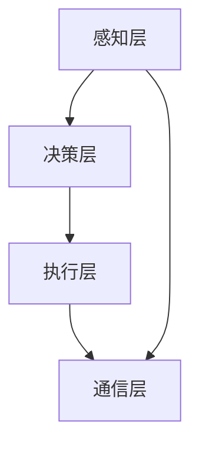
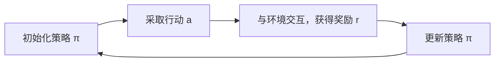
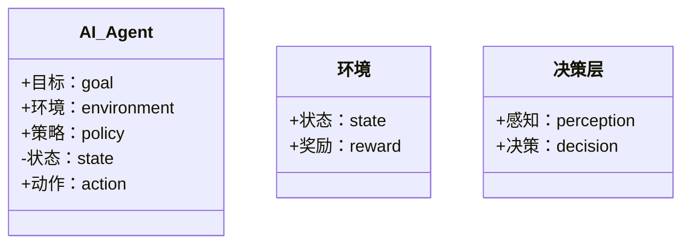
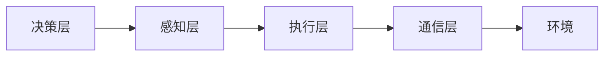

                 


# 大规模AI Agent系统的部署与维护

> 关键词：AI Agent, 系统架构, 分布式计算, 算法原理, 系统维护

> 摘要：本文详细探讨了大规模AI Agent系统的部署与维护的关键问题，从系统设计、算法原理、架构优化到实际部署，层层剖析，结合实际案例和最佳实践，为读者提供全面的技术指南。

---

## 第二章: 大规模AI Agent系统的构成与核心要素

### 2.1 AI Agent的分类与特点

#### 2.1.1 AI Agent的定义
AI Agent（人工智能代理）是指能够感知环境并采取行动以实现目标的智能实体。与传统的被动程序不同，AI Agent具有主动性、反应性和社会性，能够与环境和其他Agent进行交互。

#### 2.1.2 AI Agent的核心特征
| 特征       | 描述                               |
|------------|------------------------------------|
| 主动性     | Agent能够主动采取行动，而非被动响应 |
| 反应性     | Agent能够实时感知环境并做出反应     |
| 社会性     | Agent能够与其他Agent或人类交互      |
| 学习能力   | Agent能够通过经验或数据进行优化      |

#### 2.1.3 AI Agent与传统AI的区别
| 对比维度       | 传统AI                             | AI Agent                           |
|----------------|------------------------------------|------------------------------------|
| 行为驱动       | 基于规则或预设程序                 | 基于目标和环境反馈                 |
| 交互方式       | 单向输入输出                       | 双向交互                           |
| 自适应能力     | 较弱                               | 较强                               |

---

### 2.2 大规模AI Agent系统的架构

#### 2.2.1 系统构成要素
- **感知层**：负责环境数据的采集和解析。
- **决策层**：负责制定行动策略。
- **执行层**：负责具体行动的执行。
- **通信层**：负责与其他Agent或系统的交互。

#### 2.2.2 核心组件关系



---

## 第三章: 大规模AI Agent系统的算法原理

### 3.1 强化学习算法

#### 3.1.1 强化学习的基本原理

强化学习是一种通过试错机制来优化决策策略的算法。其核心是通过与环境的交互，不断更新策略以最大化累积奖励。

#### 3.1.2 算法步骤



#### 3.1.3 数学模型

```latex
$$
Q(s, a) = Q(s, a) + \alpha (r + \gamma \max Q(s', a') - Q(s, a))
$$

其中：
- \( Q(s, a) \) 表示状态 \( s \) 下采取行动 \( a \) 的价值
- \( \alpha \) 表示学习率
- \( \gamma \) 表示折扣因子
- \( r \) 表示奖励
- \( Q(s', a') \) 表示下一个状态下的最大价值
```

---

## 第四章: 系统分析与架构设计方案

### 4.1 问题场景介绍

假设我们正在设计一个智能客服系统，该系统需要处理大量的用户请求，并通过AI Agent实现自动响应和问题解决。

---

### 4.2 系统功能设计

#### 4.2.1 领域模型类图



---

### 4.3 系统架构设计

#### 4.3.1 系统架构图



---

## 第五章: 项目实战

### 5.1 环境安装

#### 5.1.1 安装Python环境

```bash
python --version
pip install numpy
pip install gym
pip install matplotlib
```

---

### 5.2 核心代码实现

#### 5.2.1 强化学习算法实现

```python
import numpy as np
import gym

class AI_Agent:
    def __init__(self, env):
        self.env = env
        self.Q = np.zeros(env.observation_space.shape)
        
    def choose_action(self, state, epsilon=0.1):
        if np.random.random() < epsilon:
            return self.env.action_space.sample()
        else:
            return np.argmax(self.Q[state])
    
    def update_Q(self, reward, state, action, alpha=0.1, gamma=0.9):
        next_state, _ = self.env.step(action)
        next_action = self.choose_action(next_state)
        self.Q[state][action] += alpha * (reward + gamma * self.Q[next_state][next_action] - self.Q[state][action])

if __name__ == "__main__":
    env = gym.make('CartPole-v1')
    agent = AI_Agent(env)
    for _ in range(1000):
        state = env.reset()
        done = False
        while not done:
            action = agent.choose_action(state)
            next_state, reward, done, _ = env.step(action)
            agent.update_Q(reward, state, action)
            state = next_state
```

---

### 5.3 案例分析

#### 5.3.1 实验结果

通过上述代码实现的强化学习算法，AI Agent能够在CartPole环境中逐渐掌握平衡杆的操作技巧，最终达到稳定状态。

---

## 第六章: 总结与展望

### 6.1 最佳实践

- **模块化设计**：确保系统的可扩展性和可维护性。
- **监控与日志**：实时监控系统状态，及时发现和解决问题。
- **容错设计**：设计容错机制，确保系统的高可用性。

### 6.2 未来展望

- **更高效的算法**：研究更高效的强化学习算法，提升系统的决策能力。
- **更强大的硬件支持**：通过分布式计算和边缘计算，进一步提升系统的处理能力。

---

作者：AI天才研究院 & 禅与计算机程序设计艺术

