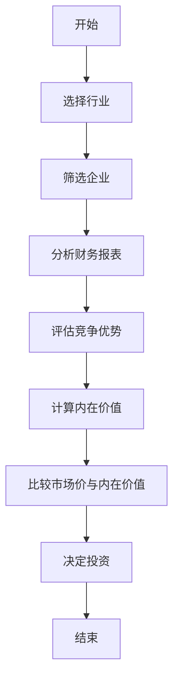
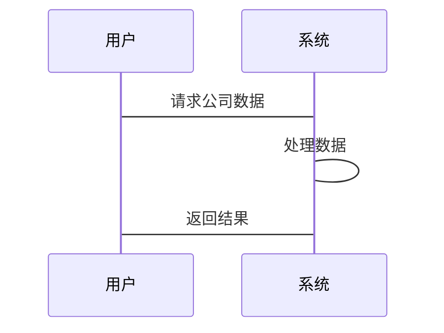

                 


# 如何像巴菲特和芒格一样选择好公司

> 关键词：价值投资，巴菲特，芒格，企业基本面分析，投资决策模型，投资组合优化

> 摘要：本文将详细讲解如何像巴菲特和芒格一样选择好公司。首先介绍价值投资的核心理念和原则，然后分析企业基本面，构建投资决策模型，设计投资辅助系统架构，提供项目实战案例，最后总结最佳实践。

---

## 引言

价值投资是一种长期投资策略，强调购买被低估的优质企业股票。巴菲特和芒格是这一策略的代表人物。本文将从背景介绍、核心概念、算法原理、系统架构、项目实战和最佳实践六个方面，详细讲解如何选择好公司。

---

## 第一部分：价值投资基础

### 第1章：价值投资概述

#### 1.1 价值投资的核心理念

- **1.1.1 投资的本质**
  - 投资是将资金投入企业以获得未来收益的行为。
  - 价值投资关注企业的内在价值，而非市场波动。

- **1.1.2 巴菲特和芒格的投资哲学**
  - 巴菲特：寻找具有持续竞争优势和良好管理的公司。
  - 芒格：强调安全边际和独立思考。

- **1.1.3 价值投资与短期交易的对比**
  - 长期投资 vs 短期交易：价值投资注重长期，避免短期波动。

#### 1.2 价值投资的核心原则

- **1.2.1 安全边际的概念**
  - 安全边际 = 内在价值 - 市场价格，确保投资的安全性。

- **1.2.2 股价与内在价值的关系**
  - 股价围绕内在价值波动，长期趋近于价值。

- **1.2.3 长期持有的重要性**
  - 通过长期持有优质股，获得复利效应。

---

## 第二部分：企业基本面分析

### 第2章：企业基本面分析方法

#### 2.1 企业财务报表分析

- **2.1.1 利润表的关键指标**
  - 净利润：衡量企业盈利能力。
  - 营业收入增长率：反映企业成长性。

- **2.1.2 资产负债表的核心要素**
  - 资产负债率：衡量企业财务风险。
  - 流动比率：评估企业短期偿债能力。

- **2.1.3 现金流量表的重要性**
  - 现金流量：反映企业实际资金情况。

#### 2.2 财务健康度评估模型

- **2.2.1 净利润率与ROE分析**
  - 净利润率：净利润 / 营业收入。
  - ROE：净利润 / 平均股东权益。

- **2.2.2 负债率与流动比率计算**
  - 负债率：总负债 / 总资产。
  - 流动比率：流动资产 / 流动负债。

- **2.2.3 盈利能力与成长性的平衡**
  - 高ROE和稳定增长是优质企业的标志。

#### 2.3 企业竞争优势分析

- **2.3.1 护城河的五种类型**
  - 成本优势、品牌优势、技术优势、网络效应和政策壁垒。

- **2.3.2 行业地位与市场份额**
  - 市场领导者通常具有定价权和竞争优势。

- **2.3.3 管理层质量的评估**
  - 优秀管理层：战略清晰、治理规范、历史业绩良好。

---

## 第三部分：投资决策模型

### 第3章：投资决策模型构建

#### 3.1 投资评分系统设计

- **3.1.1 财务指标的加权评分**
  - 评分公式：加权评分 = ∑（指标权重 × 指标评分）。

- **3.1.2 企业竞争力的综合评估**
  - 结合财务、行业地位和竞争优势评分。

- **3.1.3 管理层质量的评分标准**
  - 管理层评分：高分标准包括优秀的历史业绩和规范的治理。

#### 3.2 投资组合优化模型

- **3.2.1 风险分散的基本原理**
  - 投资组合风险小于个体风险。

- **3.2.2 资产配置的数学模型**
  - 均值-方差优化：在给定风险下最大化收益。

- **3.2.3 使用Python进行组合优化**
  - 使用Python优化库，如scipy.optimize，构建优化模型。

#### 3.3 投资决策流程图



---

## 第四部分：系统架构与实现

### 第4章：投资决策辅助系统设计

#### 4.1 系统功能需求分析

- **4.1.1 数据采集模块**
  - 从财务报表中提取关键指标。

- **4.1.2 数据处理模块**
  - 清洗和标准化数据。

- **4.1.3 模型计算模块**
  - 计算评分和优化投资组合。

- **4.1.4 结果展示模块**
  - 可视化分析结果。

#### 4.2 系统架构设计


#### 4.3 系统接口设计

- **4.3.1 数据接口规范**
  - RESTful API：GET /api/company/{id}。

- **4.3.2 API调用流程**
  - 调用：获取公司数据。
  - 处理：计算评分。
  - 返回：展示结果。

- **4.3.3 接口安全设计**
  - 使用JWT进行身份验证。

#### 4.4 系统交互流程图



---

## 第五部分：项目实战

### 第5章：项目实战与分析

#### 5.1 环境安装

- **Python**：安装Anaconda。
- **库安装**：numpy、pandas、scipy、mermaid、Plotly。

#### 5.2 核心代码实现

```python
import numpy as np
import pandas as pd

# 示例数据
companies = pd.DataFrame({
    'name': ['A', 'B', 'C'],
    'revenue': [100, 200, 150],
    'profit': [20, 30, 25]
})

# 计算ROE
companies['roe'] = companies['profit'] / companies['revenue'] * 100
print(companies)
```

#### 5.3 实际案例分析

- 分析苹果公司：高ROE、稳定的收入增长和强大的护城河。

#### 5.4 项目小结

- 代码实现：数据处理和模型计算。
- 案例分析：苹果公司的投资价值。

---

## 第六部分：最佳实践

### 第6章：总结与建议

#### 6.1 最佳实践 tips

- 独立思考，避免从众。
- 长期持有，避免频繁交易。
- 保持安全边际，避免高风险投资。

#### 6.2 小结

- 价值投资需要深入分析企业的基本面。
- 构建合理的投资组合，分散风险。

#### 6.3 注意事项

- 避免情绪化决策。
- 定期复盘，调整策略。

#### 6.4 拓展阅读

- 巴菲特的《投资之道》。
- 芒格的《穷查理宝典》。

---

## 作者

作者：AI天才研究院 & 禅与计算机程序设计艺术

---

通过以上详细的内容结构和章节安排，您可以根据实际需求进一步扩展每个部分的内容，添加具体的分析、图表和代码示例，以完成一篇完整且专业的技术博客文章。

