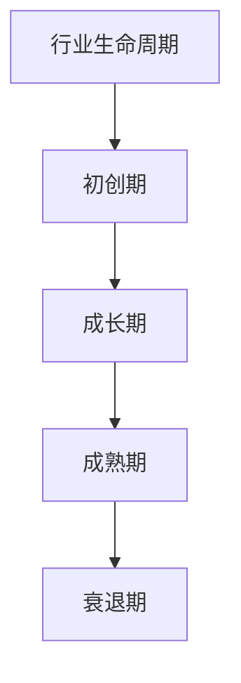
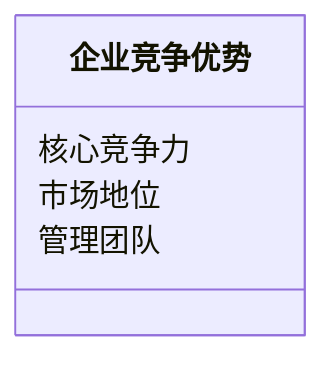
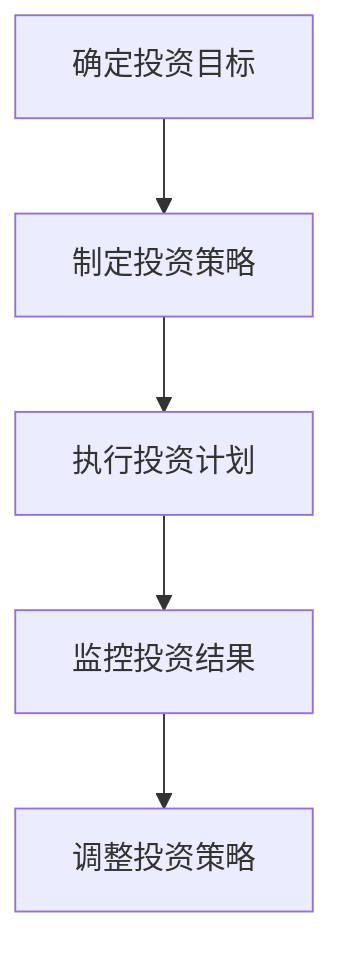
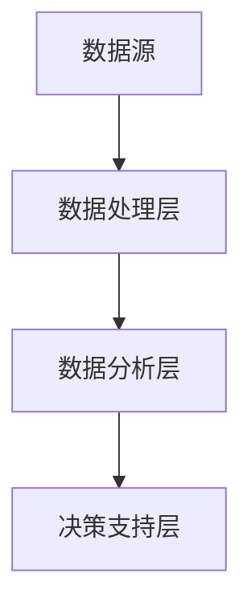

                 


# 如何像彼得林奇一样分析行业趋势

## 关键词：彼得·林奇、行业趋势、投资分析、价值投资、安全边际

## 摘要：  
本文将详细介绍如何像彼得·林奇一样分析行业趋势。通过解析彼得·林奇的投资哲学、行业分析方法和企业竞争优势分析，结合实际案例和系统化框架，帮助读者掌握行业趋势分析的核心技能。文章内容涵盖背景介绍、核心概念、算法原理、系统分析、实战案例等多个方面，旨在为读者提供全面且深入的分析方法。

---

## 第一部分: 引言

### 1.1 彼得·林奇与他的投资理念

彼得·林奇是全球最著名的基金经理之一，以其卓越的投资能力和对行业趋势的精准判断而闻名。他在任职富达投资管理公司期间，管理的基金规模从1977年的2000万美元增长至1990年的140亿美元，创造了华尔街的神话。林奇的成功不仅在于他的投资技巧，更在于他对行业趋势的深刻理解以及对企业竞争优势的敏锐洞察。

---

### 1.2 本书的目的与结构

本文旨在通过解析彼得·林奇的投资方法，为读者提供一套系统化、可操作的行业趋势分析框架。文章结构如下：

- **第二章**：详细讲解彼得·林奇的投资哲学，包括价值投资的核心理念和安全边际的概念。
- **第三章**：介绍行业趋势分析的核心方法，包括行业生命周期分析、竞争结构分析和财务指标分析。
- **第四章**：分析企业竞争优势，包括核心竞争力、市场地位和管理团队的评估。
- **第五章**：构建投资决策的系统化框架，涵盖数据驱动的决策支持和投资流程的系统化管理。
- **第六章**：通过经典案例分析，展示彼得·林奇的投资策略在实际中的应用。
- **第七章**：总结行业趋势分析的系统化方法，并展望未来投资趋势。

---

## 第二部分: 彼得·林奇的投资哲学

### 2.1 价值投资的核心理念

价值投资是一种以内在价值为导向的投资方法，强调以低于内在价值的价格买入优质资产。以下是价值投资的核心理念：

- **内在价值**：资产的内在价值是其未来现金流的现值，而非市场的短期波动。
- **安全边际**：买入价格应低于内在价值，以确保投资的安全性。
- **长期视角**：关注企业的长期盈利能力，而非短期市场波动。

**案例分析**：彼得·林奇在投资可口可乐时，正是看中了其强大的品牌影响力和稳定的现金流，认为其内在价值远高于市场估值。

---

### 2.2 安全边际的概念

安全边际是价值投资中一个关键概念，它是指买入价格与内在价值之间的差距。通过建立安全边际，投资者可以在市场波动中避免重大损失。

- **安全边际的计算**：安全边际 = 内在价值 - 买入价格。
- **安全边际的重要性**：在市场恐慌时，安全边际可以保护投资者免受损失；在市场繁荣时，安全边际可以确保收益。

**公式**：  
$$ \text{安全边际} = \text{内在价值} - \text{买入价格} $$

---

## 第三部分: 行业趋势分析的核心方法

### 3.1 行业分析的基本框架

行业分析是投资决策的基础，以下是行业分析的基本框架：

- **行业生命周期分析**：行业通常经历初创期、成长期、成熟期和衰退期。
- **行业竞争结构分析**：包括行业集中度、进入壁垒和竞争格局。
- **行业财务指标分析**：如ROE（净资产收益率）、毛利率等。

**图表**：  


---

### 3.2 彼得·林奇的行业趋势识别方法

彼得·林奇在识别行业趋势时，注重以下步骤：

1. **行业趋势的定义**：行业趋势是指行业未来发展方向的长期变化。
2. **行业趋势的识别步骤**：
   - 收集行业数据。
   - 分析行业财务指标。
   - 研究行业政策和市场环境。
3. **行业趋势的验证方法**：通过对比不同时间周期的数据，验证趋势的持续性。

**公式**：  
$$ \text{行业趋势强度} = \frac{\text{行业增长率}}{\text{行业平均增长率}} $$

---

## 第四部分: 企业竞争优势分析

### 4.1 企业竞争优势的定义

企业竞争优势是企业在行业中获得超额收益的关键因素，包括核心竞争力、市场地位和管理团队。

- **核心竞争力**：企业的独特优势，如技术创新、成本优势等。
- **市场地位**：企业在市场中的份额和影响力。
- **管理团队**：团队的能力和战略决策。

**图表**：  


---

### 4.2 企业竞争优势的分析框架

1. **核心竞争力分析**：评估企业的技术创新能力和成本优势。
2. **市场地位分析**：分析企业的市场份额和品牌影响力。
3. **管理团队分析**：评估团队的能力和战略决策。

**公式**：  
$$ \text{核心竞争力指数} = \frac{\text{技术创新能力} + \text{成本优势}}{2} $$

---

## 第五部分: 投资决策的系统化框架

### 5.1 投资决策的流程

1. **确定投资目标**：明确投资目的和风险承受能力。
2. **制定投资策略**：基于行业分析和企业评估制定投资计划。
3. **执行投资计划**：按照策略进行投资。
4. **监控投资结果**：定期评估投资表现。
5. **调整投资策略**：根据市场变化和企业表现进行调整。

**流程图**：  


---

### 5.2 数据分析与决策支持

1. **数据收集与整理**：收集行业和企业的财务数据、市场数据等。
2. **数据分析工具的使用**：利用Excel、Python等工具进行数据分析。
3. **数据驱动的决策方法**：基于数据分析结果制定投资决策。

**代码示例**：  
```python
import pandas as pd

# 数据收集
data = pd.read_csv('industry_data.csv')

# 数据分析
data['增长率'] = data['收入'].pct_change()

# 数据可视化
import matplotlib.pyplot as plt
plt.plot(data['增长率'])
plt.title('行业增长率分析')
plt.show()
```

---

## 第六部分: 实战案例分析

### 6.1 彼得·林奇的经典投资案例

1. **高盛集团**：林奇通过分析高盛的行业地位和财务表现，认为其具有长期投资价值。
2. **可口可乐**：林奇看中其强大的品牌影响力和稳定的现金流。
3. **卡夫食品**：林奇通过分析行业趋势和企业竞争优势，认为其具有增长潜力。

---

### 6.2 现实中的行业趋势分析

1. **当前热门行业的趋势分析**：如人工智能、云计算等。
2. **行业趋势分析的实战技巧**：结合行业数据和市场环境进行综合分析。
3. **投资决策中的实际应用**：通过案例分析展示如何将理论应用于实际投资。

---

## 第七部分: 行业趋势分析的系统化方法

### 7.1 系统化方法的核心要素

1. **问题场景介绍**：系统化分析需要明确目标和数据来源。
2. **系统功能设计**：包括数据收集、分析、决策支持等功能。
3. **系统架构设计**：采用分层架构，确保系统的可扩展性和灵活性。

**图表**：  


---

## 第八部分: 总结与展望

### 8.1 总结

本文详细介绍了如何像彼得·林奇一样分析行业趋势，涵盖了投资哲学、行业分析、企业竞争优势分析以及系统化投资框架等多个方面。通过理论与实践相结合，帮助读者掌握行业趋势分析的核心技能。

---

### 8.2 展望

未来，随着技术的进步和市场的变化，行业趋势分析将更加依赖于数据驱动的方法。投资者需要不断学习和适应新的分析工具和技术，以在竞争激烈的市场中获得优势。

---

## 作者：AI天才研究院/AI Genius Institute & 禅与计算机程序设计艺术 /Zen And The Art of Computer Programming

