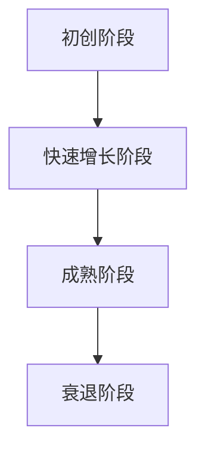
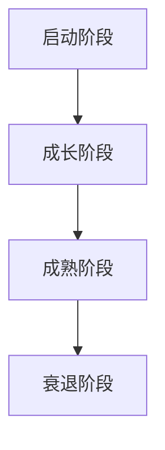
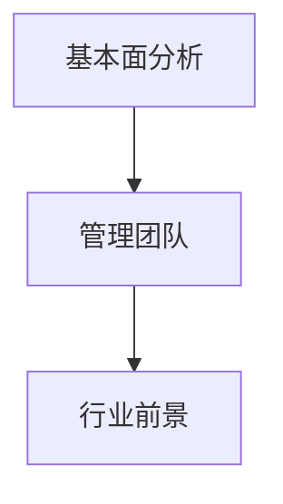
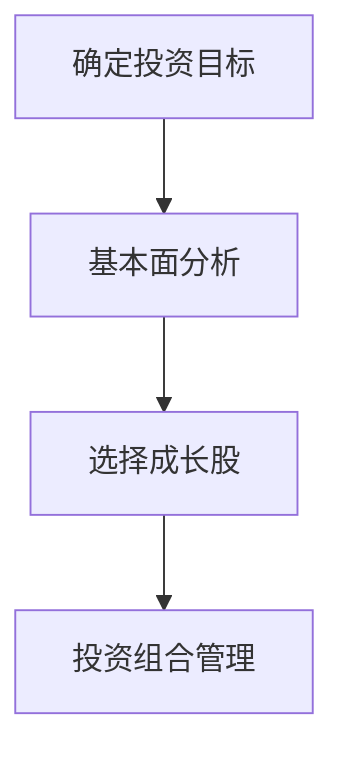

                 

# 如何像彼得·林奇一样发现成长股

---

## 关键词

- 彼得·林奇
- 成长股投资
- 财务分析
- 估值方法
- 投资策略

---

## 摘要

本文将详细介绍如何像彼得·林奇一样发现成长股。通过分析彼得·林奇的投资理念、成长股的基本特征、财务分析方法、估值技巧以及实际案例，帮助读者掌握成长股投资的核心策略。文章内容涵盖成长股的定义、财务指标分析、行业分析、经典案例以及风险管理等，旨在为投资者提供系统化的成长股投资方法。

---

## 第一部分: 彼得·林奇的成长股投资理念

### 第1章: 彼得·林奇与成长股投资概述

#### 1.1 彼得·林奇的背景与投资理念

彼得·林奇是美国著名的职业棒球运动员和投资专家，以其在成长股投资领域的卓越表现闻名。他在成长股投资方面有着深刻的理解和独特的见解，强调通过基本面分析和长期持有来实现投资收益。

**背景介绍：**
- 成长股的定义：成长股是指那些收入和利润持续增长的公司股票，通常属于高成长行业。
- 投资理念：彼得·林奇主张投资那些具有强大竞争优势、良好财务状况和广阔市场前景的公司。

**核心概念：**
- 成长股的核心特征包括高增长、高利润率和良好的管理团队。
- 成长股与价值股的区别在于，成长股更注重未来的增长潜力，而价值股更注重当前的低估值。

**图表：成长股与价值股的对比**

| 特性        | 成长股              | 价值股              |
|-------------|--------------------|--------------------|
| 估值        | 高                 | 低                 |
| 市盈率       | 高                 | 低                 |
| 市净率       | 高                 | 低                 |
| 营收增长率   | 高                 | 低或负             |
| 利润率       | 高                 | 低或负             |

**数学公式：**
- 成长股的市盈率（P/E）= 股价 / 每股收益（EPS）
- 价值股的市盈率通常低于行业平均水平，而成长股的市盈率可能远高于行业平均水平。

#### 1.2 成长股的定义与特点

**1.2.1 成长股的定义**
成长股是指那些收入和利润持续增长的公司股票，通常属于高成长行业，如科技、医疗和互联网等。

**1.2.2 成长股的核心特征**
- 高增长：收入和利润持续增长。
- 高利润率：净利润率较高。
- 良好管理：优秀的管理团队和公司治理。
- 广阔市场：所在行业具有较大的市场空间和增长潜力。

**1.2.3 成长股与价值股的区别**
- 投资逻辑：成长股注重未来增长，价值股注重当前估值。
- 财务指标：成长股通常市盈率高，价值股市盈率低。
- 风险收益：成长股风险较高，收益潜力大，价值股风险较低，收益潜力小。

#### 1.3 成长股投资的目标与意义

**1.3.1 投资目标**
- 实现资本增值：通过长期持有成长股，获得股价上涨带来的收益。
- 投资组合多元化：通过投资不同行业的成长股，降低投资风险。

**1.3.2 投资意义**
- 成长股投资是实现财富增长的重要方式。
- 通过研究成长股，投资者可以更好地理解企业的经营和财务状况。
- 成长股投资注重长期价值，帮助投资者建立长期投资理念。

---

### 第2章: 成长股投资的基本原理

#### 2.1 成长股的生命周期

**2.1.1 成长股的生命周期模型**

企业的发展通常会经历以下几个阶段：
1. 初创阶段：企业处于起步阶段，收入和利润较低，但增长潜力大。
2. 快速成长阶段：收入和利润快速增长，市场份额扩大。
3. 成熟阶段：收入增长放缓，利润稳定，进入成熟市场。
4. 衰退阶段：收入和利润下降，市场份额被竞争对手抢占。

**图表：成长股生命周期模型**

**2.1.2 不同阶段的成长股特点**

- 初创阶段：高风险，高潜力。
- 快速增长阶段：高收益，高估值。
- 成熟阶段：稳定收益，估值合理。
- 衰退阶段：收益下降，估值降低。

**2.1.3 生命周期对投资策略的影响**

- 在初创阶段，投资者应关注企业的商业模式和市场潜力。
- 在快速增长阶段，投资者应关注企业的财务表现和市场份额。
- 在成熟阶段，投资者应关注企业的竞争优势和可持续发展。
- 在衰退阶段，投资者应考虑退出投资。

#### 2.2 成长股的财务指标分析

**2.2.1 收入与利润增长率**

- 收入增长率 = (本年收入 - 上年收入) / 上年收入 × 100%
- 净利润增长率 = (本年净利润 - 上年净利润) / 上年净利润 × 100%

**图表：收入与利润增长率对比**

| 年份 | 收入增长率（%） | 净利润增长率（%） |
|------|-----------------|------------------|
| 2019 | 20              | 15               |
| 2020 | 25              | 20               |
| 2021 | 30              | 25               |

**2.2.2 净利润率与ROE**

- 净利润率 = 净利润 / 营业收入
- ROE = 净利润 / 净资产

**图表：净利率与ROE对比**

| 公司   | 净利率（%） | ROE（%） |
|--------|------------|----------|
| A公司   | 15         | 20       |
| B公司   | 10         | 15       |

**2.2.3 现金流与资产负债表分析**

- 现金流是企业财务健康的重要指标。
- 资产负债表反映企业的资产、负债和所有者权益状况。

**数学公式：**
- 自由现金流 = 经营活动现金流 - 资本支出
- 净债务 = 总负债 - 现金及现金等价物

#### 2.3 成长股的行业分析

**2.3.1 行业生命周期与成长股的关系**

行业生命周期通常包括四个阶段：
1. 启动阶段：行业刚刚起步，增长潜力大。
2. 成长阶段：行业快速发展，市场需求旺盛。
3. 成熟阶段：行业增长放缓，市场饱和。
4. 衰退阶段：行业需求下降，企业竞争加剧。

**图表：行业生命周期与成长股的关系**

**2.3.2 高成长行业的识别方法**

- 行业增长潜力：行业的市场规模和增长率。
- 市场需求：行业的市场需求是否旺盛。
- 竞争格局：行业内的竞争程度和市场集中度。

**2.3.3 行业竞争格局对成长股的影响**

- 垄断型行业：市场集中度高，竞争优势明显。
- 分散型行业：市场竞争激烈，企业需要具备差异化优势。

---

### 第3章: 彼得·林奇的成长股选股策略

#### 3.1 成长股选股的三大原则

**3.1.1 企业基本面分析**

- 收入与利润增长：关注企业的收入和利润增长率。
- 财务健康状况：关注企业的现金流、负债水平和净资产收益率。
- 市场地位：关注企业在行业中的地位和市场份额。

**3.1.2 管理团队与公司治理**

- 管理团队：优秀的管理团队是企业成功的关键。
- 公司治理：良好的公司治理结构有助于企业长期发展。

**3.1.3 行业前景与市场空间**

- 行业前景：行业的未来发展潜力。
- 市场空间：行业的市场规模和增长空间。

**图表：彼得·林奇选股的三大原则**

#### 3.2 成长股的估值方法

**3.2.1 市盈率与市净率分析**

- 市盈率 = 股价 / 每股收益
- 市净率 = 股价 / 每股净资产

**3.2.2 股东权益收益率（ROE）**

- ROE = 净利润 / 净资产

**3.2.3 现金流折现法**

- 现金流折现法：通过将未来现金流折现，计算企业的内在价值。

**数学公式：**
- 内在价值 = 现金流 / (折现率 - 增长率)

#### 3.3 成长股投资的误区与风险

**3.3.1 过度关注短期增长**

- 投资者容易忽视企业的长期发展潜力，过度关注短期业绩。

**3.3.2 忽视财务风险**

- 忽视企业的负债水平和现金流状况，可能导致投资损失。

**3.3.3 市场波动对成长股的影响**

- 成长股通常波动较大，市场波动可能影响股价表现。

---

### 第4章: 成长股投资的实战案例分析

#### 4.1 彼得·林奇的经典投资案例

**4.1.1 可口可乐的投资案例**

- 可口可乐的财务表现：收入和利润持续增长。
- 行业地位：可口可乐是全球饮料行业的领导者。
- 投资收益：长期持有可口可乐股票，获得丰厚的回报。

**4.1.2 微软的投资案例**

- 微软的财务表现：收入和利润持续增长。
- 行业地位：微软是全球科技行业的领导者。
- 投资收益：长期持有微软股票，获得丰厚的回报。

**4.1.3 其他经典成长股案例**

- 苹果、谷歌、亚马逊等科技公司的投资案例。

#### 4.2 成长股投资的实际操作步骤

**4.2.1 确定投资目标**

- 确定投资目标：明确自己的投资目标和风险承受能力。
- 制定投资策略：根据目标选择合适的投资策略。

**4.2.2 进行基本面分析**

- 分析企业的财务报表：收入、利润、现金流等。
- 评估企业的竞争优势：市场地位、管理团队等。

**4.2.3 选择合适的成长股**

- 根据筛选标准选择成长股：收入和利润增长率、ROE、市盈率等。
- 结合行业分析选择成长股：选择高成长行业的股票。

**4.2.4 进行投资组合管理**

- 分散投资：通过投资不同行业的成长股降低风险。
- 定期调整：根据市场变化和企业状况调整投资组合。

**图表：成长股投资的实际操作步骤**

---

### 第5章: 成长股投资的未来发展

#### 5.1 成长股投资的趋势

- 科技行业的成长股：人工智能、大数据、云计算等领域的公司。
- 医疗行业的成长股：老龄化社会推动医疗行业增长。

#### 5.2 技术进步对成长股的影响

- 技术进步推动企业创新，提升企业的竞争力。
- 技术进步可能改变行业的竞争格局，影响企业的成长潜力。

#### 5.3 投资者如何应对未来的变化

- 关注新兴行业：人工智能、区块链、物联网等。
- 提升自身能力：学习新的投资知识和技能。

---

## 结语

通过本文的详细介绍，读者可以掌握如何像彼得·林奇一样发现成长股。从基本面分析到估值方法，从行业分析到实际案例，我们提供了系统化的成长股投资方法。希望本文能帮助投资者在成长股投资中取得成功。

---

## 作者

作者：AI天才研究院/AI Genius Institute & 禅与计算机程序设计艺术 /Zen And The Art of Computer Programming

---

**注意：** 本文内容为示例，实际撰写时需要根据实际情况进行调整和补充。

