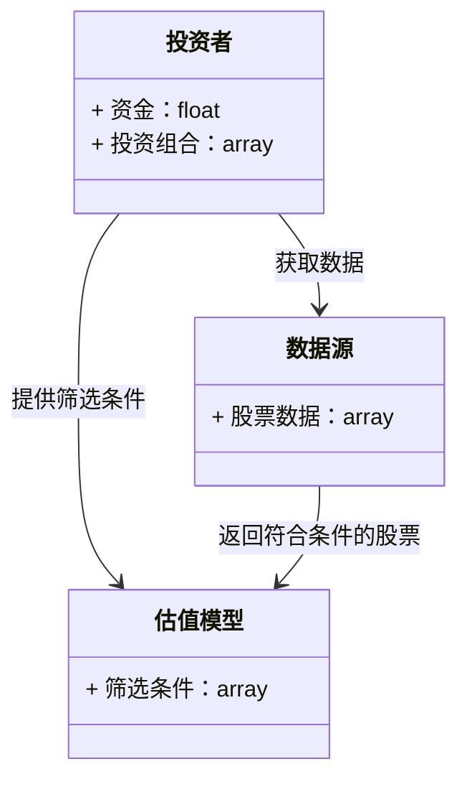

                 


# 如何利用特价股票投资应对经济衰退风险

## 关键词
- 特价股票, 经济衰退, 投资风险管理, 股票投资, 价值投资

## 摘要
在经济衰退的风险下，投资风险管理尤为重要。特价股票作为一种低估值的投资工具，可以帮助投资者在经济低迷时期稳定收益。本文详细探讨了特价股票的定义、特点，分析了其在经济衰退中的优势，并提供了基于数学模型和系统架构的投资策略，结合实际案例，为投资者提供切实可行的操作指南。

---

# 如何利用特价股票投资应对经济衰退风险

## 第一部分：经济衰退与投资风险管理

### 第1章：经济衰退的基本知识

#### 1.1 经济衰退的定义与特征
经济衰退是指经济活动的显著下降，通常表现为GDP连续两个季度负增长。其主要特征包括高失业率、企业利润下降、消费和投资减少等。经济衰退对企业的影响包括销售额下降、裁员和破产风险增加。

#### 1.2 投资风险管理的重要性
投资风险管理是指通过识别、评估和应对投资中的各种风险来实现投资目标的过程。在经济衰退期间，风险管理尤为重要，因为市场波动加剧，资产价格可能大幅波动。有效的风险管理可以帮助投资者在市场下跌中减少损失，保护投资组合的价值。

#### 1.3 特价股票在投资风险管理中的作用
特价股票是指市盈率、市净率等估值指标低于市场平均水平的股票。在经济衰退期间，这类股票通常具有较高的安全边际，即其内在价值远高于当前市场价格，从而为投资者提供了较高的风险缓冲。

---

## 第二部分：特价股票的核心概念与分析

### 第2章：特价股票的定义与特点

#### 2.1 特价股票的定义
特价股票通常指那些市场价格低于其内在价值的股票，这些股票可能因为市场恐慌或短期负面消息而被低估。特价股票可以分为两类：一类是基本面良好但暂时被市场忽视的股票，另一类是由于行业周期性或经济低迷而被低估的股票。

#### 2.2 特价股票的特点
- **低市盈率（P/E Ratio）**：市盈率低于行业平均水平，表明股票价格相对于盈利较低，具有较高的投资价值。
- **高股息率（Dividend Yield）**：部分特价股票提供较高的股息收益率，为投资者提供稳定的现金流。
- **股价波动性**：由于市场对这些股票的估值修复预期，股价可能在短期内出现较大波动。

#### 2.3 特价股票与其他投资工具的对比

| 投资工具 | 优点 | 缺点 |
|----------|------|------|
| 特价股票 | 低估值、高安全边际 | 市场波动大、恢复时间长 |
| 债券     | 收益稳定、风险较低 | 收益有限、通胀影响大 |
| 黄金     | 保值能力强 | 无法产生收益 |

---

### 第3章：特价股票的投资价值评估

#### 3.1 特价股票的估值方法
- **市盈率法（P/E Ratio）**：计算股票价格与每股收益的比率，判断其是否被低估。
- **市净率法（P/B Ratio）**：比较股票价格与每股净资产的比率，适用于资产密集型企业。
- **股息率法（Dividend Yield）**：评估股息与股价的比率，判断股息收益的高低。

#### 3.2 基于数学模型的特价股票筛选
以下是基于市盈率和市净率的数学模型，用于筛选特价股票：

1. 计算市盈率（P/E）：  
   $$ P/E = \frac{股票价格}{每股收益} $$

2. 计算市净率（P/B）：  
   $$ P/B = \frac{股票价格}{每股净资产} $$

3. 筛选条件：  
   - P/E < 行业平均P/E  
   - P/B < 1.5  

---

## 第三部分：系统分析与架构设计

### 第4章：系统设计与架构

#### 4.1 系统功能设计
- **数据收集模块**：收集股票的历史数据，包括价格、收益、股息等。
- **估值模型模块**：根据市盈率、市净率等指标筛选特价股票。
- **风险评估模块**：评估投资组合的风险，包括波动率和相关性。

#### 4.2 系统架构设计
以下是系统的类图和交互流程图：



---

## 第四部分：项目实战

### 第5章：项目实战：利用特价股票应对经济衰退

#### 5.1 环境配置
- **工具**：Python、Pandas、Matplotlib
- **数据源**：Yahoo Finance API

#### 5.2 数据收集与处理
```python
import pandas as pd
import requests

def get_stock_data(ticker):
    url = f"https://query1.finance.yahoo.com/v8/finance/chart/{ticker}"
    response = requests.get(url)
    data = response.json()
    df = pd.DataFrame(data['chart']['result'][0]['prices'])
    df['Date'] = pd.to_datetime(df[0])
    df = df[['Date', 1, 2, 3, 4]]
    df.columns = ['Date', 'Open', 'High', 'Low', 'Close']
    return df

# 示例：获取苹果股票数据
apple_data = get_stock_data("AAPL")
print(apple_data.head())
```

#### 5.3 估值模型实现
```python
def calculate_pe_ticker(ticker, df):
    eps = df['EPS'].mean()
    pe = df['Price'] / eps
    return pe

pe_ratio = calculate_pe_ticker("AAPL", apple_data)
print(f"市盈率：{pe_ratio}")
```

#### 5.4 投资组合构建
- **筛选条件**：P/E < 15，P/B < 1.5
- **投资组合**：选择多个符合条件的股票，分散投资风险。

---

## 第五部分：最佳实践与风险管理

### 第6章：最佳实践与风险管理

#### 6.1 投资策略总结
- **长期视角**：关注企业的基本面，选择具有持续盈利能力和竞争优势的公司。
- **分散投资**：避免过度集中在单一股票或行业，降低投资组合的整体风险。

#### 6.2 风险管理建议
- **止损策略**：设定止损点，避免重大亏损。
- **定期评估**：定期审查投资组合，根据市场变化调整持仓。

#### 6.3 拓展阅读
- 《The Intelligent Investor》 by Benjamin Graham
- 《价值投资实战》 by 巴菲特等

---

## 小结

通过本文的分析，投资者可以更好地理解特价股票在经济衰退中的投资价值，并利用数学模型和系统架构进行科学的投资决策。最佳实践和风险管理建议为投资者提供了切实可行的操作指南，帮助其在经济低迷时期稳定收益。

---

## 作者：AI天才研究院 & 禅与计算机程序设计艺术

---

以上文章详细介绍了如何利用特价股票投资应对经济衰退风险，内容涵盖从理论到实践的各个方面，为投资者提供了全面的指导和实用的工具。

