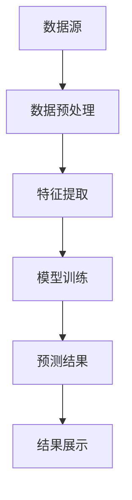

                 


# 如何利用特价股票策略应对全球数字化供应链碎片化风险

> 关键词：特价股票策略、供应链碎片化风险、股票市场、风险管理、投资策略

> 摘要：本文探讨了如何利用特价股票策略应对全球数字化供应链碎片化风险。通过分析特价股票策略的核心概念、算法原理、系统架构设计以及实际案例，文章详细阐述了如何在供应链风险加剧的情况下，通过特价股票策略进行有效的投资和风险管理。

---

## 第一部分：背景与核心概念

### 第1章：特价股票策略的背景

#### 1.1 什么是特价股票策略
- **定义**：特价股票策略是一种投资策略，旨在通过识别市场中被低估的股票进行投资，以在市场波动中获得超额收益。
- **核心目标**：通过寻找低价股票，抓住市场低估的机会，实现资本增值。
- **边界与外延**：
  - 边界：仅关注股票价格的低估，不考虑其他因素。
  - 外延：结合技术分析、基本面分析等多维度策略。

#### 1.2 全球数字化供应链的碎片化风险
- **供应链碎片化**：指供应链的各个环节分散在全球不同地区，导致协调困难和风险增加。
- **风险特征**：
  - 高度依赖全球物流网络。
  - 地缘政治风险、疫情等事件加剧供应链中断。
  - 供应链中断导致企业成本上升、生产延迟，进而影响股价。

#### 1.3 特价股票策略与供应链风险的关系
- **策略应用**：在供应链风险导致市场波动时，特价股票策略可以帮助投资者捕捉低价股票机会。
- **量化关系**：供应链中断可能导致部分行业股票价格下跌，为特价股票策略提供投资机会。

---

## 第二部分：特价股票策略的核心概念与联系

### 第2章：特价股票策略的核心原理

#### 2.1 市场波动与特价股票的出现
- **市场波动**：短期市场波动可能导致股票价格偏离其内在价值，形成特价股票。
- **投资者行为**：市场恐慌时，投资者抛售资产，导致股价短期下跌，形成特价股票机会。

#### 2.2 投资者行为对特价股票的影响
- **情绪影响**：投资者恐慌时，低价股票被抛售，价格进一步下跌。
- **价值回归**：市场恢复后，低估股票价格回升，带来收益。

#### 2.3 经济周期与特价股票的关系
- **经济周期波动**：经济衰退时，更多股票价格下跌，形成特价股票机会。
- **经济复苏**：市场回暖，特价股票价格回升，带来收益。

### 第3章：供应链风险对股票市场的影响

#### 3.1 供应链中断的经济后果
- **企业成本上升**：供应链中断导致生产延迟，企业成本增加。
- **股价波动**：成本上升影响企业盈利，导致股价下跌。

#### 3.2 供应链风险对股价的影响
- **行业影响**：供应链中断影响特定行业，导致相关股票价格波动。
- **系统性风险**：供应链风险可能引发系统性市场波动，影响整体股价。

#### 3.3 供应链风险的量化与评估
- **量化指标**：供应链中断对GDP的影响、企业盈利变化。
- **评估方法**：通过历史数据分析供应链中断对股价的影响。

---

## 第三部分：算法原理与实现

### 第3章：算法原理

#### 3.1 时间序列分析
- **ARIMA模型**：用于预测股票价格。
  ```mermaid
  graph TD
    A[市场数据] --> B[数据预处理]
    B --> C[模型训练]
    C --> D[模型预测]
    D --> E[结果分析]
  ```

#### 3.2 机器学习模型
- **随机森林**：用于分类股票是否为特价股票。
  ```python
  import pandas as pd
  from sklearn.ensemble import RandomForestClassifier

  # 数据加载与处理
  df = pd.read_csv('stock_data.csv')
  features = df[['PE', 'PB', 'PS']]
  target = df['is_cheap_stock']

  # 模型训练
  model = RandomForestClassifier()
  model.fit(features, target)

  # 预测
  new_features = df[['PE', 'PB', 'PS']].iloc[-1]
  prediction = model.predict(new_features.values.reshape(1, -1))
  ```

#### 3.3 基于动量策略的算法
- **动量策略**：买入近期上涨的股票，卖出近期下跌的股票。
  ```python
  import pandas as pd

  # 计算动量指标
  df['Momentum'] = df['Close'].pct_change(12).fillna(0)
  df['Signal'] = df['Momentum'].apply(lambda x: 1 if x > 0 else -1)

  # 生成交易信号
  df['Return'] = df['Close'].pct_change(1).shift(-1)
  df['Strategy_Return'] = df['Signal'] * df['Return']
  ```

---

## 第四部分：系统分析与架构设计

### 第4章：系统架构设计

#### 4.1 问题场景介绍
- **场景描述**：供应链中断导致市场波动，投资者需要利用特价股票策略进行风险管理。

#### 4.2 系统功能设计
- **数据采集**：收集供应链相关数据和股票市场数据。
- **特征提取**：提取影响供应链风险的关键特征。
- **模型预测**：预测股票价格波动，识别特价股票。
- **结果展示**：展示预测结果和投资建议。

#### 4.3 系统架构图


#### 4.4 接口设计
- **数据接口**：与供应链数据源对接。
- **用户接口**：提供投资建议和交易信号。

---

## 第五部分：项目实战

### 第5章：环境安装与核心实现

#### 5.1 环境安装
- **Python版本**：Python 3.8+
- **依赖安装**：`pip install pandas sklearn`

#### 5.2 核心代码实现
```python
import pandas as pd
from sklearn.ensemble import RandomForestClassifier

# 数据加载与处理
df = pd.read_csv('stock_data.csv')

# 特征工程
features = df[['PE', 'PB', 'PS']]
target = df['is_cheap_stock']

# 模型训练
model = RandomForestClassifier()
model.fit(features, target)

# 预测
new_features = df[['PE', 'PB', 'PS']].iloc[-1]
prediction = model.predict(new_features.values.reshape(1, -1))

# 输出结果
print(f"预测结果：{prediction}")
```

#### 5.3 实际案例分析
- **案例选择**：假设某行业供应链中断，导致相关股票价格下跌。
- **策略应用**：利用模型预测，识别出特价股票，进行投资。

---

## 第六部分：总结与展望

### 第6章：总结与展望

#### 6.1 总结
- **核心内容回顾**：特价股票策略在应对供应链碎片化风险中的应用。
- **算法与系统设计**：详细讲解了算法原理和系统架构。

#### 6.2 展望
- **未来研究方向**：结合更多因素优化模型，探索更复杂的机器学习算法。
- **实际应用建议**：建议投资者在实际操作中结合多种策略，谨慎决策。

---

## 作者信息

作者：AI天才研究院/AI Genius Institute & 禅与计算机程序设计艺术 /Zen And The Art of Computer Programming

---

以上是《如何利用特价股票策略应对全球数字化供应链碎片化风险》的技术博客文章大纲和内容。文章详细分析了特价股票策略的背景、核心概念、算法原理、系统设计和实际应用，帮助读者全面理解如何应对供应链碎片化风险。

