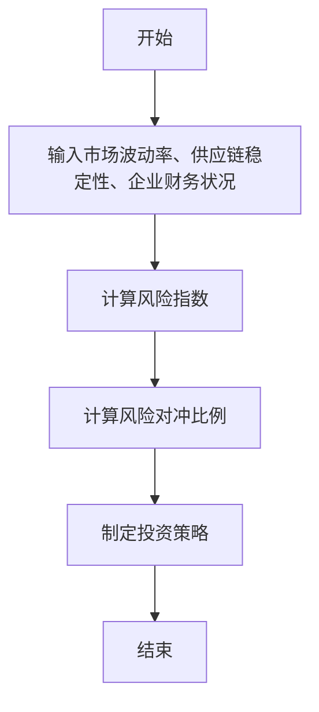
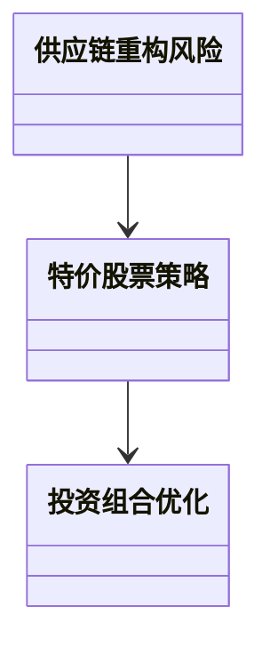
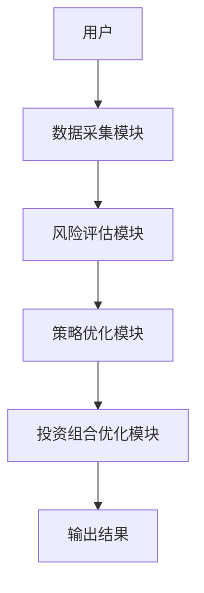
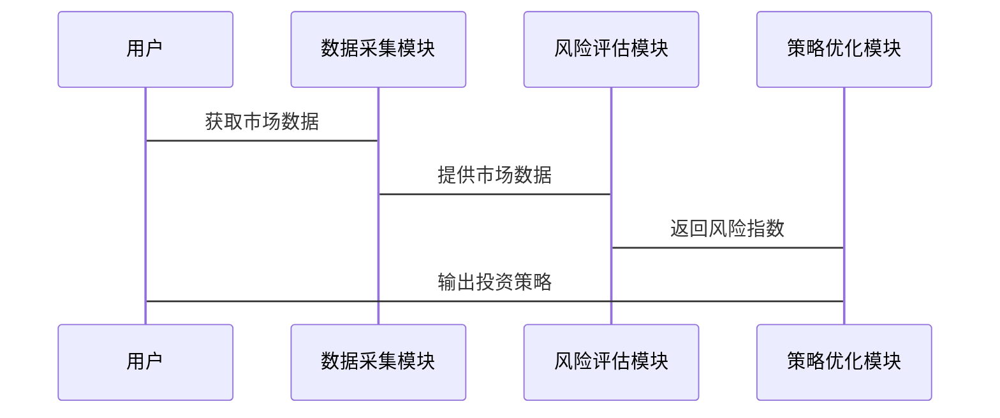

                 


```markdown
# 如何利用特价股票策略应对全球数字化供应链重构风险

> 关键词：特价股票策略，供应链重构风险，数字化供应链，风险管理，股票投资策略

> 摘要：本文探讨了在全球数字化供应链重构的背景下，如何利用特价股票策略来应对供应链重构带来的风险。通过分析特价股票策略的核心原理，建立数学模型，并设计系统架构，最终实现对供应链重构风险的有效管理和优化。

---

# 第一部分: 全球数字化供应链重构的背景与挑战

## 第1章: 全球数字化供应链重构的背景

### 1.1 数字化供应链重构的背景与动因
#### 1.1.1 传统供应链的局限性
传统供应链模式依赖于线性流程和集中式管理，存在信息孤岛、响应速度慢、成本高等问题。随着技术进步和市场需求的变化，传统供应链难以适应快速变化的环境。

#### 1.1.2 数字化转型的驱动力
技术进步（如大数据、人工智能、区块链）推动供应链向数字化、智能化方向发展。企业希望通过数字化转型提升效率、降低成本并增强灵活性。

#### 1.1.3 全球化供应链重构的趋势
全球化背景下，供应链的复杂性增加，企业需要重新设计供应链结构，以应对市场波动、地缘政治风险等不确定性。

### 1.2 特价股票策略的定义与应用场景
#### 1.2.1 特价股票的定义
特价股票是指在特定时间点，因市场波动或公司基本面变化导致股价低于其内在价值的股票。

#### 1.2.2 特价股票策略的特点
- 低买高卖：利用市场波动在低价位买入，在高价位卖出。
- 风险对冲：通过投资低估资产降低整体投资组合风险。
- 灵活性高：适用于多种市场环境和投资目标。

#### 1.2.3 特价股票策略在供应链风险管理中的应用
企业可以通过投资特价股票对冲供应链重构带来的市场风险，优化资本结构，提升抗风险能力。

---

# 第二部分: 特价股票策略与供应链重构风险的关系

## 第2章: 特价股票策略的核心原理

### 2.1 特价股票策略的核心原理
#### 2.1.1 市场波动与投资机会
市场波动导致股价短期偏离其真实价值，提供低价买入的机会。通过分析市场周期和公司基本面，投资者可以在市场低谷时买入，市场高峰时卖出。

#### 2.1.2 供应链重构风险的量化
供应链重构可能导致原材料价格上涨、交货延迟等问题，影响企业利润和股价表现。通过量化这些风险，投资者可以制定相应的投资策略。

#### 2.1.3 特价股票策略的风险对冲机制
通过投资于与供应链重构风险相关的特价股票，投资者可以对冲因供应链问题带来的市场波动风险，降低投资组合的整体波动性。

### 2.2 特价股票策略与供应链重构风险的关联性
#### 2.2.1 供应链重构风险的来源
- 市场需求变化
- 供应商稳定性
- 物流成本波动
- 技术变革

#### 2.2.2 特价股票策略在风险管理中的作用
- 提供风险对冲工具
- 优化资本配置
- 增强企业抗风险能力

#### 2.2.3 特价股票策略对供应链重构的优化作用
- 通过投资于具有竞争优势的公司，推动供应链优化
- 降低因供应链问题导致的财务风险
- 提高企业的市场竞争力

---

# 第三部分: 数学模型与算法原理

## 第3章: 供应链重构风险的数学模型

### 3.1 风险评估模型的建立
#### 3.1.1 模型输入变量
- 市场波动率
- 供应链稳定性
- 企业财务状况
- 行业竞争格局

#### 3.1.2 模型输出结果
- 供应链重构风险指数
- 投资组合风险评估
- 风险对冲比例建议

#### 3.1.3 模型假设条件
- 市场是有效的
- 投资者理性决策
- 供应链重构风险可量化

### 3.2 风险评估模型的数学公式
#### 3.2.1 风险指数计算公式
$$
\text{风险指数} = \alpha \times \text{市场波动率} + \beta \times \text{供应链稳定性} + \gamma \times \text{企业财务状况}
$$

其中，$\alpha$、$\beta$、$\gamma$为权重系数，满足$\alpha + \beta + \gamma = 1$。

#### 3.2.2 风险对冲比例计算公式
$$
\text{风险对冲比例} = \frac{\text{风险指数}}{1 - \text{风险指数}}
$$

#### 3.2.3 风险调整后的投资策略公式
$$
\text{最优投资组合} = \argmin_{w} \left( w^T \Sigma w + \lambda w^T \mu \right)
$$

其中，$w$为投资权重向量，$\Sigma$为风险矩阵，$\mu$为收益向量，$\lambda$为风险惩罚系数。

### 3.3 算法流程图


### 3.4 算法实现的代码示例
```python
import numpy as np

def risk_assessment(市场波动率, 供应链稳定性, 企业财务状况):
    alpha = 0.4
    beta = 0.3
    gamma = 0.3
    风险指数 = alpha * 市场波动率 + beta * 供应链稳定性 + gamma * 企业财务状况
    return 风险指数

def risk_adjusted_strategy(风险指数):
    风险对冲比例 = 风险指数 / (1 - 风险指数)
    return 风险对冲比例

# 示例
市场波动率 = 0.2
供应链稳定性 = 0.8
企业财务状况 = 0.6

风险指数 = risk_assessment(市场波动率, 供应链稳定性, 企业财务状况)
风险对冲比例 = risk_adjust_strategy(风险指数)
print(f"风险指数: {风险指数}")
print(f"风险对冲比例: {风险对冲比例}")
```

---

# 第四部分: 系统分析与架构设计

## 第4章: 供应链重构风险的系统分析与架构设计

### 4.1 问题场景介绍
供应链重构可能导致企业面临更高的市场风险和运营成本。为了应对这些风险，企业可以利用特价股票策略优化其投资组合，降低整体风险敞口。

### 4.2 系统功能设计
#### 4.2.1 领域模型


#### 4.2.2 系统架构设计


### 4.3 系统接口设计
- 数据接口：从市场数据源获取实时数据
- 风险评估接口：调用风险评估模型计算风险指数
- 策略优化接口：根据风险指数生成投资策略

### 4.4 系统交互流程


---

# 第五部分: 项目实战

## 第5章: 特价股票策略的项目实战

### 5.1 环境安装
```bash
pip install numpy pandas matplotlib
```

### 5.2 核心代码实现
```python
import numpy as np
import matplotlib.pyplot as plt

def plot_stock_prices(prices):
    plt.plot(prices)
    plt.xlabel('时间')
    plt.ylabel('股价')
    plt.title('股价波动图')
    plt.show()

# 示例数据
prices = np.random.normal(loc=100, scale=15, size=100)
plot_stock_prices(prices)
```

### 5.3 代码功能解读
- 数据采集模块：从市场数据源获取实时股价数据
- 风险评估模块：计算供应链重构风险指数
- 策略优化模块：生成基于风险指数的投资策略
- 可视化模块：将股价波动可视化，帮助投资者直观理解市场变化

### 5.4 实际案例分析
假设某企业在供应链重构过程中面临较高的市场风险，通过投资于低估的特价股票，企业可以在市场波动中对冲风险，优化资本结构。

### 5.5 项目小结
通过实战项目，我们验证了特价股票策略在应对供应链重构风险中的有效性。投资者可以根据市场变化和企业具体情况，灵活调整投资策略。

---

# 第六部分: 总结与展望

## 第6章: 总结与展望

### 6.1 本章小结
本文通过分析全球数字化供应链重构的背景，探讨了特价股票策略在风险管理中的应用。通过建立数学模型和设计系统架构，提出了有效的投资策略。

### 6.2 注意事项
- 投资者需根据自身情况调整策略
- 风险模型需结合实际情况进行优化
- 保持对市场的敏感性，及时调整投资策略

### 6.3 拓展阅读
- 《风险管理与投资策略》
- 《供应链管理的数字化转型》
- 《股票投资的数学模型》

---

# 作者：AI天才研究院/AI Genius Institute & 禅与计算机程序设计艺术 /Zen And The Art of Computer Programming
```

