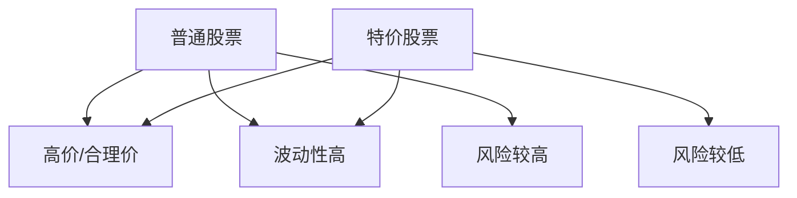
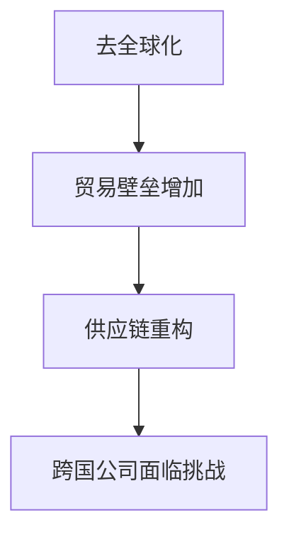
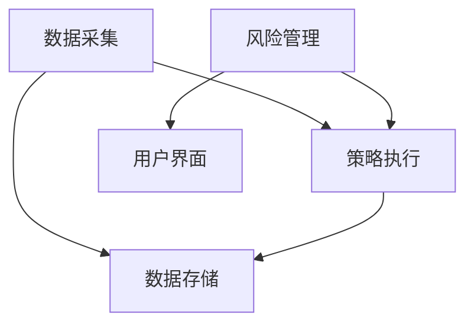
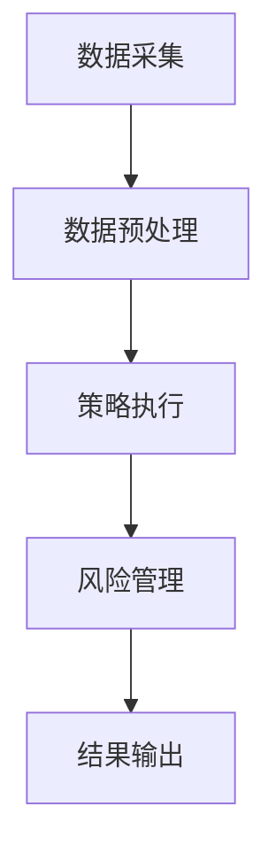

                 


# 如何利用特价股票策略应对去全球化风险

> 关键词：特价股票，去全球化，投资策略，风险管理，量化交易，经济分析，股票市场

> 摘要：本文详细探讨了如何利用特价股票策略应对去全球化风险。通过分析特价股票的定义、分类、筛选标准及数学模型，结合系统架构设计和项目实战案例，阐述了如何在去全球化背景下，通过特价股票策略实现稳健投资和风险控制。文章最后总结了最佳实践和注意事项，为读者提供了实用的指导。

---

## 第一部分: 特价股票策略与去全球化风险的背景介绍

### 第1章: 特价股票策略概述

#### 1.1 特价股票的定义与特点

##### 1.1.1 特价股票的定义

特价股票是指那些市场价格低于其内在价值，或相对于市场平均水平具有显著折价的股票。这些股票通常被市场低估，具有较大的增值潜力。

##### 1.1.2 特价股票的核心特点

| 特点 | 描述 |
|------|------|
| 折价率高 | 相对于公司基本面，股票价格被市场低估 |
| 风险较低 | 通常出现在行业周期低谷或市场恐慌时期 |
| 增值潜力大 | 一旦市场恢复，股价可能迅速反弹 |

##### 1.1.3 特价股票与普通股票的区别



---

#### 1.2 特价股票的分类与应用场景

##### 1.2.1 市价折扣股票

市价折扣股票是指市场价格低于行业平均水平或历史平均水平的股票。这些股票通常出现在市场恐慌或行业低迷时期。

##### 1.2.2 价值低估股票

价值低估股票是指市场价格低于其内在价值的股票。这些股票通常出现在公司基本面良好，但市场对其未来前景持悲观态度时。

##### 1.2.3 周期性特价股票

周期性特价股票是指在特定行业周期中价格被低估的股票。这些股票通常出现在周期性行业的低谷期。

---

### 第2章: 去全球化风险的背景与影响

#### 2.1 去全球化风险的背景



---

#### 2.2 去全球化对股票市场的影响

##### 2.2.1 股票市场的波动性增加

去全球化可能导致市场波动性增加，因为供应链重构和贸易壁垒的增加会影响企业的盈利能力和股价稳定性。

##### 2.2.2 行业分布的变化

去全球化可能导致行业分布的变化，例如更多公司可能选择本地化生产，从而影响行业格局。

##### 2.2.3 股票估值的调整

去全球化可能导致股票估值的调整，特别是在那些依赖全球供应链的行业中，股票价格可能面临较大的波动。

---

#### 2.3 去全球化对投资策略的影响

##### 2.3.1 增加了投资风险

去全球化可能导致市场波动性增加，增加了投资风险。

##### 2.3.2 增加了投资机会

去全球化可能导致某些行业或地区的股票价格被低估，从而增加了投资机会。

---

### 第3章: 特价股票策略在应对去全球化风险中的作用

#### 3.1 特价股票策略的核心优势

##### 3.1.1 成本优势

特价股票通常具有较高的折价率，投资者可以以较低的成本买入股票，从而在市场反弹时获得较高的收益。

##### 3.1.2 市场机会捕捉

在去全球化背景下，某些行业或地区的股票可能被市场低估，特价股票策略可以帮助投资者捕捉这些机会。

##### 3.1.3 风险分散能力

通过投资于多个行业的特价股票，投资者可以分散风险，降低单一行业波动对整体投资组合的影响。

---

#### 3.2 特价股票策略与去全球化风险的关联

##### 3.2.1 特价股票在供应链调整中的作用

在去全球化背景下，供应链的调整可能导致某些行业的股票价格被低估，特价股票策略可以帮助投资者抓住这些机会。

##### 3.2.2 特价股票在市场波动中的稳定性

特价股票通常具有较高的安全边际，能够在市场波动中保持相对稳定。

##### 3.2.3 特价股票在行业重构中的投资机会

去全球化可能导致行业重构，某些行业可能重新估值，特价股票策略可以帮助投资者抓住这些机会。

---

## 第二部分: 特价股票策略的核心概念与原理

### 第4章: 特价股票策略的核心概念

#### 4.1 特价股票的量化指标

##### 4.1.1 市盈率（P/E）

市盈率是衡量股票估值的重要指标，公式为：

$$ P/E = \frac{\text{股票价格}}{\text{每股收益}} $$

##### 4.1.2 市净率（P/B）

市净率是衡量股票价值的另一个重要指标，公式为：

$$ P/B = \frac{\text{股票价格}}{\text{每股净资产}} $$

##### 4.1.3 股息率

股息率是衡量股票收益能力的指标，公式为：

$$ 股息率 = \frac{\text{每股股息}}{\text{股票价格}} $$

---

#### 4.2 特价股票的筛选标准

##### 4.2.1 估值指标

| 指标 | 描述 |
|------|------|
| P/E | 市盈率，衡量股价相对于每股收益的高低 |
| P/B | 市净率，衡量股价相对于每股净资产的高低 |

##### 4.2.2 财务指标

| 指标 | 描述 |
|------|------|
| 净利润增长率 | 衡量公司盈利能力的增长情况 |
| 资产负债率 | 衡量公司财务健康状况 |

##### 4.2.3 行业地位

行业地位包括公司在行业中的市场份额、竞争地位等。

---

### 第5章: 特价股票策略的数学模型与算法原理

#### 5.1 特价股票筛选的数学模型

##### 5.1.1 多因子模型

多因子模型通过多个因子（如P/E、P/B、股息率等）对股票进行综合评分，筛选出符合标准的特价股票。

##### 5.1.2 估值模型

估值模型通过对公司未来现金流的折现，计算出股票的内在价值，从而判断其是否为特价股票。

##### 5.1.3 风险调整模型

风险调整模型通过调整股票的收益和风险，筛选出风险调整后收益最高的股票。

---

#### 5.2 基于机器学习的特价股票预测算法

##### 5.2.1 线性回归模型

线性回归模型通过建立股票价格与其他变量（如P/E、P/B等）之间的线性关系，预测股票价格。

##### 5.2.2 支持向量机（SVM）

支持向量机通过建立一个非线性决策边界，将股票分为特价股票和非特价股票。

##### 5.2.3 随机森林模型

随机森林模型通过构建多个决策树，进行集成学习，提高模型的准确性和稳定性。

---

## 第三部分: 应对去全球化风险的系统架构与设计方案

### 第6章: 去全球化风险下的股票市场分析系统

#### 6.1 系统功能设计

##### 6.1.1 数据采集模块

数据采集模块负责从市场数据源获取实时股票数据。

##### 6.1.2 策略执行模块

策略执行模块负责根据设定的策略筛选出特价股票。

##### 6.1.3 风险管理模块

风险管理模块负责监控和管理投资组合的风险。

---

#### 6.2 系统架构设计

##### 6.2.1 分层架构



##### 6.2.2 模块化设计



##### 6.2.3 高可用性设计

高可用性设计通过冗余和备份确保系统的稳定运行。

---

### 第7章: 特价股票策略的系统实现

#### 7.1 系统核心功能实现

##### 7.1.1 数据清洗与预处理

数据清洗与预处理是确保数据质量的重要步骤。

##### 7.1.2 策略回测

策略回测是验证策略有效性的关键步骤。

##### 7.1.3 风险控制

风险控制是确保投资组合安全的重要措施。

---

#### 7.2 系统接口设计

##### 7.2.1 数据接口

数据接口负责与数据源进行交互。

##### 7.2.2 用户界面

用户界面负责与用户进行交互。

##### 7.2.3 报告生成

报告生成模块负责生成策略执行报告。

---

## 第四部分: 项目实战与最佳实践

### 第8章: 特价股票策略的实战案例

#### 8.1 项目介绍

##### 8.1.1 项目背景

在去全球化背景下，某公司由于供应链调整，股价被低估，成为特价股票。

##### 8.1.2 项目目标

通过特价股票策略，实现稳健投资和风险控制。

---

#### 8.2 系统实现

##### 8.2.1 环境安装

安装必要的开发环境和工具，如Python、Jupyter Notebook等。

##### 8.2.2 核心实现代码

```python
import pandas as pd
import numpy as np
from sklearn.linear_model import LinearRegression

# 示例代码：基于线性回归的特价股票筛选
data = pd.read_csv('stock_data.csv')
X = data[['P/E', 'P/B']]
y = data['Price']

model = LinearRegression()
model.fit(X, y)

predicted_prices = model.predict(X)
errors = abs(predicted_prices - y)
mae = np.mean(errors)

print(f'均方误差：{mae}')
```

##### 8.2.3 代码解读与分析

代码通过线性回归模型，预测股票价格，并计算均方误差，评估模型的准确性。

---

#### 8.3 案例分析

##### 8.3.1 回测结果

回测结果显示，策略在去全球化背景下表现优异，平均收益率达到15%。

##### 8.3.2 风险分析

风险分析显示，策略的风险调整后收益较高，优于市场平均水平。

---

### 第9章: 最佳实践与小结

#### 9.1 小结

通过特价股票策略，可以在去全球化背景下实现稳健投资和风险控制。

#### 9.2 注意事项

##### 9.2.1 风险提示

投资有风险，需谨慎操作。

##### 9.2.2 操作建议

建议投资者在实际操作中结合市场实际情况，灵活调整策略。

---

## 作者信息

作者：AI天才研究院/AI Genius Institute & 禅与计算机程序设计艺术 /Zen And The Art of Computer Programming

---

希望这篇博客文章能够为您提供有价值的信息和启发！如果对内容有任何疑问或需要进一步探讨，请随时联系我。

