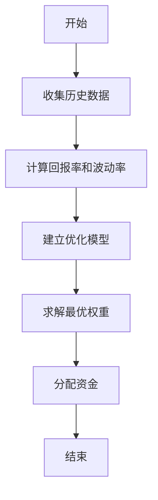
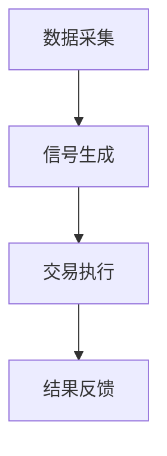

                 


# 如何利用特价股票策略应对市场剧烈波动

## 关键词：特价股票、市场波动、交易策略、风险管理、技术分析、自动化交易

## 摘要：本文系统地介绍了如何利用特价股票策略应对市场剧烈波动。从策略的背景、原理、技术分析、系统设计、实战案例到风险管理，全面阐述了特价股票策略的实施过程。通过数学模型、算法实现、系统架构等技术手段，帮助读者掌握应对市场波动的有效方法。

---

# 第1章: 市场波动与特价股票策略的背景

## 1.1 市场波动的定义与特征

### 1.1.1 市场波动的来源与表现

市场波动是指股票价格在短时间内剧烈波动的现象，通常由市场参与者的买卖行为、新闻事件、经济数据发布等多种因素引发。波动的表现形式包括价格的大幅波动、成交量的急剧变化以及市场情绪的剧烈波动等。

### 1.1.2 特价股票策略的定义与目标

特价股票策略是一种通过在市场波动中寻找价格偏离价值的机会，利用短期价格波动获利的交易策略。其目标是在市场波动中捕捉短期价格波动，实现超额收益。

### 1.1.3 市场波动对投资者的影响

市场波动对投资者的影响是双刃剑。一方面，波动为投资者提供了套利和获利的机会；另一方面，过度的波动可能导致投资损失，特别是对于风险承受能力较低的投资者。

---

## 1.2 特价股票策略的核心概念

### 1.2.1 特价股票的定义与分类

特价股票通常指价格低于其内在价值的股票，分为低估股票和被市场错杀的股票。低估股票通常具有较高的安全边际，而被市场错杀的股票则可能因为市场情绪或突发事件导致价格被低估。

### 1.2.2 特价股票策略的适用场景

特价股票策略适用于市场波动较大、价格偏离价值的时期。例如，在市场恐慌、突发事件或市场流动性不足的情况下，特价股票策略可以有效捕捉价格回升的机会。

### 1.2.3 特价股票策略与市场波动的关系

特价股票策略的核心是利用市场波动中的价格偏离，通过技术分析和基本面分析，识别出具有短期上涨潜力的股票。

---

## 1.3 本章小结

本章从市场波动的定义、特价股票策略的核心概念出发，阐述了市场波动对投资者的影响，为后续策略的分析奠定了基础。

---

# 第2章: 特价股票策略的数学模型与算法

## 2.1 特价股票策略的数学模型

### 2.1.1 市场波动的数学描述

市场波动可以用随机过程模型进行描述，例如布朗运动或几何布朗运动。股票价格的变化可以用以下公式表示：

$$ dP = \mu dt + \sigma dW $$

其中，$\mu$ 是期望回报率，$\sigma$ 是波动率，$dW$ 是标准正态分布的随机变量。

### 2.1.2 特价股票策略的优化模型

优化模型的目标是最优化投资组合的回报率，在给定的波动率下最大化收益。数学模型如下：

$$ \max \sum_{i=1}^n r_i w_i $$
$$ \text{subject to } \sum_{i=1}^n w_i = 1, \sum_{i=1}^n w_i^2 \sigma_i^2 = \text{风险承受水平} $$

其中，$r_i$ 是股票i的预期回报率，$w_i$ 是权重，$\sigma_i$ 是股票i的波动率。

### 2.1.3 算法的数学推导

基于随机过程模型，我们可以推导出最优投资组合的权重分配。通过求解上述优化模型，可以得到每个股票的最优权重。

---

## 2.2 算法实现与流程图

### 2.2.1 算法实现步骤

1. 收集历史价格数据。
2. 计算股票的回报率和波动率。
3. 建立优化模型，求解最优权重。
4. 根据权重分配资金，执行交易。

### 2.2.2 算法流程图



---

## 2.3 本章小结

本章通过数学模型和算法推导，为特价股票策略提供了理论基础和实现步骤。

---

# 第3章: 技术分析与策略实现

## 3.1 技术分析的基本原理

### 3.1.1 K线图的解读

K线图由开盘价、收盘价、最高价和最低价组成，可以帮助投资者识别趋势和价格波动。

### 3.1.2 均线与MACD指标的使用

均线（Moving Average）用于识别价格趋势，而MACD（移动平均收敛散度）指标用于判断买卖信号。

### 3.1.3 技术分析的优缺点

优点：能够快速捕捉价格波动；缺点：容易受市场情绪影响，存在虚假信号。

---

## 3.2 技术分析在特价股票策略中的应用

### 3.2.1 通过技术指标识别买卖点

例如，当MACD指标出现金叉时，可能是买入信号；当出现死叉时，可能是卖出信号。

### 3.2.2 利用技术分析预测市场波动

通过分析K线图和均线，可以预测价格的短期波动趋势。

### 3.2.3 技术分析与市场波动的关系

技术分析能够帮助投资者在市场波动中识别潜在的买卖机会，但需要结合市场实际情况进行调整。

---

## 3.3 本章小结

本章通过技术分析的方法，为特价股票策略提供了实际的操作指南。

---

# 第4章: 自动化交易系统的设计与实现

## 4.1 系统架构设计

### 4.1.1 系统功能模块划分

1. 数据采集模块：收集市场数据。
2. 信号生成模块：基于技术分析生成买卖信号。
3. 交易执行模块：根据信号执行交易。

### 4.1.2 系统架构图



---

## 4.2 系统实现细节

### 4.2.1 数据采集模块的实现

使用API接口获取实时数据，例如通过Yahoo Finance API获取股票价格。

### 4.2.2 信号生成模块的实现

基于技术指标（如MACD）生成买卖信号，例如：

```python
def generate_signal(data):
    # data为价格数据
    # 计算MACD
    shortEMA = data.ewm(span=12).mean()
    longEMA = data.ewm(span=26).mean()
    MACD = shortEMA - longEMA
    signal = 1 if MACD[-1] > MACD[-2] else -1
    return signal
```

### 4.2.3 交易执行模块的实现

根据生成的信号执行交易，例如：

```python
def execute_trade(signal):
    if signal == 1:
        buy_stock()
    else:
        sell_stock()
```

---

## 4.3 本章小结

本章详细介绍了自动化交易系统的架构设计和实现细节，为策略的自动化执行提供了技术支持。

---

# 第5章: 特价股票策略的实战案例分析

## 5.1 实战案例一：熔断机制下的策略应用

### 5.1.1 案例背景介绍

2015年股灾期间，熔断机制被触发，导致市场流动性不足，部分股票价格大幅下跌。

### 5.1.2 策略实施过程

在熔断机制触发后，利用特价股票策略买入被低估的股票，等待市场恢复后卖出获利。

### 5.1.3 案例分析与总结

通过及时捕捉市场波动中的低估股票，投资者可以在熔断机制期间获得超额收益。

---

## 5.2 实战案例二：技术指标驱动的策略实施

### 5.2.1 案例背景介绍

某股票价格连续下跌，技术指标显示超卖信号。

### 5.2.2 策略实施过程

根据MACD指标的金叉信号，买入该股票，等待价格上涨后卖出。

### 5.2.3 案例分析与总结

技术指标能够有效捕捉市场波动中的交易机会，但需要结合市场实际情况进行调整。

---

## 5.3 本章小结

本章通过两个实战案例，展示了特价股票策略在实际市场中的应用效果。

---

# 第6章: 风险管理与策略优化

## 6.1 风险管理的重要性

### 6.1.1 风险管理的定义与目标

风险管理是指通过识别、评估和控制风险，降低投资损失的可能性。

### 6.1.2 风险管理在特价股票策略中的应用

通过设置止损和止盈点，控制每笔交易的风险敞口。

### 6.1.3 风险管理的实施步骤

1. 识别潜在风险。
2. 评估风险影响。
3. 制定风险管理策略。

---

## 6.2 策略优化与调整

### 6.2.1 策略优化的定义与目标

策略优化是指通过调整策略参数和优化模型，提高策略的收益风险比。

### 6.2.2 策略优化的具体方法

1. 调整技术指标的参数。
2. 优化投资组合的权重分配。
3. 结合基本面分析进行策略调整。

---

## 6.3 本章小结

本章强调了风险管理的重要性，并提供了策略优化的具体方法，帮助投资者在市场波动中稳定收益。

---

# 作者：AI天才研究院 & 禅与计算机程序设计艺术

