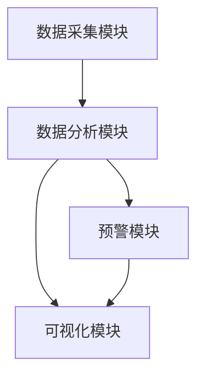

                 


# 如何利用特价股票策略应对市场泡沫

## 关键词：市场泡沫、特价股票、算法、投资策略、风险管理

## 摘要：市场泡沫是金融市场中的一个常见现象，它通常会导致投资者的决策失误和投资损失。特价股票策略作为一种有效的投资策略，在市场泡沫中具有重要的应用价值。本文通过分析市场泡沫的形成机制，探讨特价股票策略的核心概念与算法原理，并结合实际案例，详细阐述如何利用特价股票策略应对市场泡沫。文章还介绍了系统的架构设计和项目实战，帮助读者更好地理解和应用相关策略。

---

# 如何利用特价股票策略应对市场泡沫

## 第1章: 市场泡沫与特价股票策略概述

### 1.1 市场泡沫的定义与特征
#### 1.1.1 市场泡沫的定义
市场泡沫是指资产价格在短期内迅速上涨，远远超过其内在价值的现象。它通常发生在投资者对未来收益的过度乐观预期下，导致资产价格虚高。市场泡沫的形成与投资者的心理预期、市场流动性、信息不对称等因素密切相关。

#### 1.1.2 市场泡沫的主要特征
1. **价格波动剧烈**：资产价格在短时间内出现大幅波动，尤其是上涨幅度远超正常水平。
2. **投资者情绪化**：市场参与者通常会受到乐观情绪的驱动，忽视基本面分析。
3. **资金流动性过剩**：市场泡沫的形成往往伴随着大量资金的流入，尤其是在低利率环境下。

#### 1.1.3 市场泡沫与经济周期的关系
市场泡沫通常出现在经济周期的扩张阶段，尤其是在经济增长放缓但市场参与者预期向好的情况下。然而，当市场泡沫破裂时，往往会导致经济衰退或危机。

### 1.2 特价股票策略的定义与特点
#### 1.2.1 特价股票的定义
特价股票是指市场价格低于其内在价值的股票。通常，这些股票被市场低估，具有较高的投资潜力。特价股票的核心在于其价格与价值的背离，投资者可以通过识别这种背离，找到被市场错杀的投资机会。

#### 1.2.2 特价股票策略的核心特点
1. **价值导向**：特价股票策略注重股票的内在价值，而非短期价格波动。
2. **逆向思维**：在市场恐慌或低迷时，投资者可以利用特价股票策略，寻找被市场忽视的优质资产。
3. **长期导向**：特价股票策略通常需要较长的投资周期，等待市场回归理性。

#### 1.2.3 特价股票与普通股票的区别
| 特性 | 特价股票 | 普通股票 |
|------|----------|----------|
| 价格 | 低于内在价值 | 反映市场情绪 |
| 投资策略 | 价值导向，逆向思维 | 价格导向，趋势跟随 |
| 风险 | 中低风险，但需精挑细选 | 风险较高，波动较大 |

### 1.3 市场泡沫中特价股票策略的应用前景
#### 1.3.1 市场泡沫中的投资机会
在市场泡沫期间，许多股票的价格被推高，但其内在价值并未随之增长。此时，寻找那些被市场过度炒作、但基本面不佳的股票，可能会出现价格大幅下跌的风险。然而，对于那些基本面良好、但被市场低估的股票，投资者可以通过特价股票策略，抓住市场调整后的投资机会。

#### 1.3.2 特价股票策略在市场泡沫中的优势
1. **逆向投资**：在市场泡沫期间，投资者通常会蜂拥而入高增长的股票，而忽视那些基本面稳定但价格被低估的股票。特价股票策略通过逆向投资，可以在市场调整后获得超额收益。
2. **风险控制**：通过选择基本面良好的特价股票，投资者可以在市场泡沫破裂时，降低投资组合的波动性。

#### 1.3.3 特价股票策略的潜在风险
1. **市场泡沫破裂的风险**：如果市场泡沫破裂，所有股票的价格都可能大幅下跌，尤其是那些基本面不佳的股票。
2. **误判风险**：投资者可能误判某些股票的内在价值，导致投资损失。

### 1.4 本章小结
本章介绍了市场泡沫的定义、特征及其与经济周期的关系，详细阐述了特价股票的定义、特点及其与普通股票的区别。同时，分析了市场泡沫中特价股票策略的应用前景及其优势和风险。

---

## 第2章: 特价股票策略的核心概念与联系

### 2.1 特价股票策略的核心概念
#### 2.1.1 市场估值的基本原理
市场估值是确定股票内在价值的重要方法。常用的市场估值指标包括市盈率（P/E）、市净率（P/B）、股息率等。通过比较市场价格与这些指标的合理范围，可以帮助投资者判断股票是否被低估或高估。

#### 2.1.2 特价股票的识别标准
1. **市盈率低于行业平均水平**：如果一只股票的市盈率显著低于行业平均水平，可能意味着该股票被低估。
2. **市净率低于1**：市净率低于1通常表明股票的价格低于其账面价值，可能是特价股票。
3. **股息率较高**：股息率较高的股票可能意味着公司具有稳定的盈利能力和较高的分红能力，也可能是特价股票。

#### 2.1.3 市场情绪对股票价格的影响
市场情绪是影响股票价格的重要因素。在市场情绪高涨时，投资者可能会忽视基本面，导致股票价格上涨；而在市场情绪低落时，投资者可能会抛售股票，导致价格下跌。

### 2.2 特价股票策略与市场泡沫的关系
#### 2.2.1 市场泡沫对股票价格的推动作用
在市场泡沫期间，投资者的乐观情绪和过度投机行为会导致股票价格上涨，甚至超过其内在价值。这种情况下，特价股票策略可以帮助投资者识别那些被市场低估的股票。

#### 2.2.2 特价股票策略在市场泡沫中的应用
在市场泡沫期间，投资者可以通过特价股票策略，寻找那些基本面良好但价格被低估的股票。这些股票在市场泡沫破裂后，可能会出现反弹或稳定的表现。

#### 2.2.3 市场泡沫破裂对特价股票策略的影响
当市场泡沫破裂时，股票价格可能会大幅下跌，尤其是那些基本面不佳的股票。然而，那些基本面良好但价格被低估的股票可能会在市场调整后表现出更强的抗跌性。

### 2.3 特价股票策略与其他投资策略的对比
#### 2.3.1 长期投资策略
长期投资策略注重持有优质股票，等待其内在价值的增长。与特价股票策略相比，长期投资策略更关注公司的基本面和长期增长潜力。

#### 2.3.2 技术分析策略
技术分析策略通过分析股票价格和成交量的变化，预测未来的价格走势。与特价股票策略相比，技术分析策略更关注短期价格波动，而非内在价值。

#### 2.3.3 价值投资策略
价值投资策略与特价股票策略有相似之处，都注重寻找被市场低估的股票。然而，价值投资策略更注重公司的基本面和内在价值，而非短期价格波动。

### 2.4 本章小结
本章分析了特价股票策略的核心概念，包括市场估值的基本原理和特价股票的识别标准。同时，探讨了特价股票策略与市场泡沫的关系，以及与其他投资策略的对比。

---

## 第3章: 特价股票策略的算法原理

### 3.1 特价股票识别的算法原理
#### 3.1.1 数据收集与预处理
为了识别特价股票，需要收集相关的股票数据，包括市场价格、市盈率、市净率、股息率等。数据预处理包括数据清洗、标准化和特征提取。

#### 3.1.2 关键指标的筛选
通过分析历史数据，可以筛选出一些关键指标，如市盈率、市净率、股息率等，作为判断特价股票的依据。

#### 3.1.3 特价股票识别模型的构建
基于筛选出的特征，可以使用机器学习算法（如决策树、随机森林）构建特价股票识别模型。模型可以通过训练数据学习特价股票的特征，并对新数据进行预测。

### 3.2 市场情绪预测的算法原理
#### 3.2.1 市场情绪的定义与度量
市场情绪可以通过分析新闻、社交媒体、投资者行为等数据进行度量。常用的市场情绪指标包括情绪指数、恐慌指数等。

#### 3.2.2 基于自然语言处理的市场情绪分析
通过自然语言处理技术，分析新闻标题、社交媒体评论等文本数据，提取市场情绪的关键词和情感倾向，构建市场情绪分析模型。

#### 3.2.3 市场情绪预测模型的构建
基于时间序列分析的方法（如ARIMA、LSTM），可以构建市场情绪预测模型，预测未来市场的整体情绪走势。

### 3.3 算法实现与优化
#### 3.3.1 算法实现的步骤
1. 数据收集与预处理。
2. 特征提取与筛选。
3. 模型训练与优化。
4. 模型评估与验证。

#### 3.3.2 算法优化的策略
1. 参数调优：通过网格搜索、随机搜索等方法优化模型参数。
2. 特征选择：通过特征重要性分析，筛选出对模型影响最大的特征。
3. 模型集成：通过集成学习（如投票法、加权平均）提高模型的预测性能。

#### 3.3.3 算法的性能评估
1. 准确率：模型正确预测特价股票的比例。
2. 召回率：模型正确识别特价股票的比例。
3. F1分数：综合准确率和召回率的指标。

### 3.4 本章小结
本章详细介绍了特价股票识别和市场情绪预测的算法原理，包括数据预处理、特征提取、模型构建与优化等内容。

---

## 第4章: 特价股票策略的系统分析与架构设计

### 4.1 系统功能设计
#### 4.1.1 数据采集模块
数据采集模块负责从数据源（如股票交易所、新闻网站）获取实时数据，包括股票价格、市场情绪等。

#### 4.1.2 数据分析模块
数据分析模块负责对采集的数据进行清洗、预处理和特征提取，为后续的模型训练提供数据支持。

#### 4.1.3 预警模块
预警模块负责根据模型预测结果，发出投资预警信号，提醒投资者注意市场风险。

#### 4.1.4 可视化模块
可视化模块负责将分析结果以图形化的方式呈现，帮助投资者更好地理解和决策。

### 4.2 系统架构设计
#### 4.2.1 分层架构设计
系统的分层架构包括数据层、业务逻辑层和表现层。数据层负责数据的存储和管理，业务逻辑层负责数据的处理和分析，表现层负责结果的展示和交互。

#### 4.2.2 模块之间的关系
- 数据采集模块与数据分析模块之间通过数据接口进行交互。
- 数据分析模块与预警模块之间通过预测结果进行交互。
- 可视化模块与数据分析模块之间通过数据接口进行交互。

#### 4.2.3 系统架构图


### 4.3 本章小结
本章详细设计了系统的功能模块和架构，为后续的系统实现提供了理论基础。

---

## 第5章: 特价股票策略的项目实战

### 5.1 环境安装
为了实现特价股票策略，需要安装以下环境：
1. **数据源**：选择可靠的股票数据源，如Yahoo Finance、Alpha V affiliate。
2. **工具与库**：安装Python编程语言，以及相关的数据处理和机器学习库（如Pandas、Scikit-learn、TensorFlow）。

### 5.2 核心代码实现
#### 5.2.1 数据采集
```python
import pandas_datareader as pdr

# 从Yahoo Finance获取数据
data = pdr.get_data_yahoo('AAPL', start='2020-01-01', end='2023-12-31')
```

#### 5.2.2 数据分析与特征提取
```python
import pandas as pd
import numpy as np

# 计算市盈率
data['PE'] = data['Close'] / data['Earnings Per Share']
# 计算市净率
data['PB'] = data['Close'] / data['Book Value Per Share']
# 计算股息率
data['Dividend Yield'] = data['Dividends'] / data['Close']
```

#### 5.2.3 模型训练
```python
from sklearn.model_selection import train_test_split
from sklearn.ensemble import RandomForestClassifier

# 数据分割
X = data[['PE', 'PB', 'Dividend Yield']]
y = data['Is_Specia

