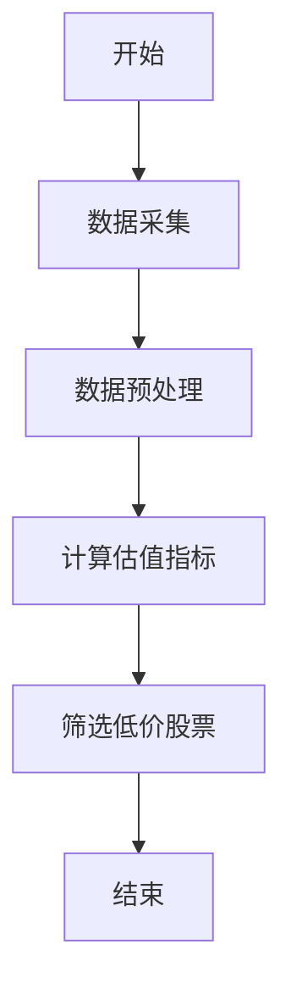
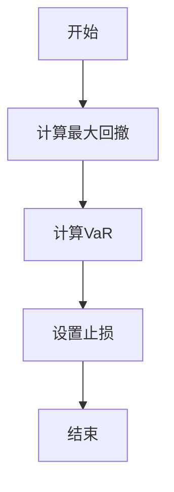
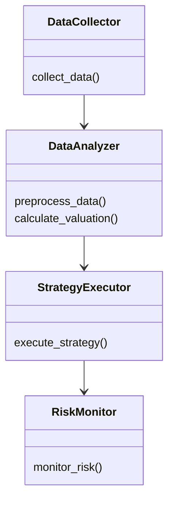
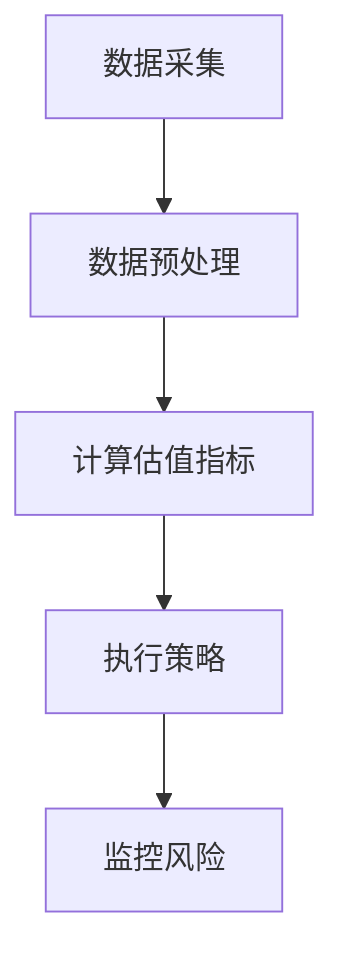
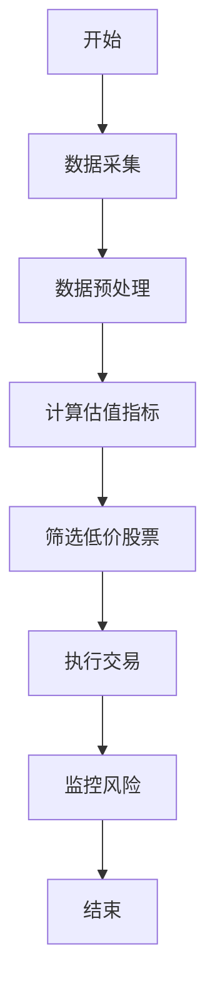

                 


# 如何利用特价股票策略应对市场泡沫风险

> **关键词**：特价股票策略、市场泡沫、投资风险、股票筛选算法、风险管理

> **摘要**：  
> 本文详细探讨了如何利用特价股票策略应对市场泡沫风险。文章从市场泡沫的定义、成因及影响入手，分析了特价股票策略的核心概念与数学模型，并通过系统设计与项目实战，展示了如何构建基于特价股票策略的自动化交易系统。本文还提供了具体的Python代码实现和实际案例分析，帮助读者更好地理解和应用这些策略。

---

## 第一部分: 市场泡沫与特价股票策略概述

### 第1章: 市场泡沫的基本概念与成因

#### 1.1 市场泡沫的定义与特征
市场泡沫是指资产价格在短时间内迅速上涨，远远超出其实际价值的现象。这种现象通常由市场情绪、信息不对称和过度投机等因素驱动。市场泡沫的特征包括：
1. **价格虚高**：资产价格脱离基本面。
2. **交易量激增**：市场参与者大量涌入，推动价格进一步上涨。
3. **投资者情绪化**：市场参与者往往被乐观情绪主导，忽视潜在风险。

#### 1.2 市场泡沫的成因分析
市场泡沫的形成与多种因素有关，主要包括：
1. **市场情绪与投资者行为**：投资者过度乐观导致价格虚高。
2. **资本流动与市场波动**：大量资金涌入特定资产类别，推高价格。
3. **信息不对称与市场失灵**：信息不对称导致市场参与者做出非理性决策。

### 第2章: 特价股票策略的基本原理

#### 2.1 特价股票的定义与特点
特价股票是指价格被市场低估的股票，通常具有较高的投资价值。其特点包括：
1. **低估值**：市盈率、市净率等指标低于行业平均水平。
2. **高分红潜力**：公司有能力支付稳定或增长的股息。
3. **风险较低**：相对于高增长股票，风险更可控。

#### 2.2 特价股票策略的应用场景
在市场泡沫中，特价股票策略可以帮助投资者规避市场风险，寻找被市场低估的投资机会。以下是其主要应用场景：
1. **市场泡沫中的投资机会**：在市场泡沫中，部分股票可能因市场情绪被低估，特价股票策略可以帮助投资者发现这些机会。
2. **风险分散策略**：通过投资于多个低价股票，分散市场风险。

---

## 第二部分: 特价股票策略的核心概念与数学模型

### 第3章: 特价股票策略的核心概念

#### 3.1 市场波动与投资机会
市场波动是投资者的机会，尤其是在市场泡沫期间。投资者需要识别市场波动中的投资机会，例如：
1. **技术指标分析**：通过K线图、MACD等技术指标识别超卖股票。
2. **基本面分析**：通过财务报表分析公司的真实价值。

#### 3.2 特价股票策略的数学模型
以下是特价股票策略中常用的数学模型：

##### 3.2.1 CAPM模型在特价股票策略中的应用
CAPM（资本资产定价模型）用于评估股票的预期收益。公式如下：
$$ E(R_i) = R_f + \beta_i (E(R_m) - R_f) $$
其中，$R_f$ 是无风险利率，$E(R_m)$ 是市场预期收益率，$\beta_i$ 是股票的贝塔系数。

##### 3.2.2 股价波动率的数学公式
波动率可以通过标准差衡量：
$$ \sigma = \sqrt{\frac{1}{n-1} \sum_{i=1}^{n} (x_i - \bar{x})^2} $$
其中，$\bar{x}$ 是平均值，$n$ 是数据点数。

##### 3.2.3 特价股票的估值模型
以下是基于市盈率（P/E）的估值模型：
$$ \text{合理股价} = \frac{\text{每股收益} \times \text{目标市盈率}}{\text{当前市盈率}} $$

### 第4章: 特价股票策略的算法原理

#### 4.1 特价股票筛选算法
以下是特价股票筛选算法的流程图：



以下是基于Python的筛选代码：

```python
import pandas as pd

# 假设df为股票数据
def screen_cheap_stocks(df, target_pe=15):
    # 计算平均市盈率
    avg_pe = df['PE'].mean()
    # 筛选市盈率低于平均值的股票
    cheap_stocks = df[df['PE'] < avg_pe]
    return cheap_stocks

# 示例数据
data = {'PE': [10, 12, 18, 20]}
df = pd.DataFrame(data)
result = screen_cheap_stocks(df)
print(result)
```

#### 4.2 风险管理算法
以下是风险管理算法的流程图：



以下是基于Python的风险管理代码：

```python
import numpy as np

def calculate_max_drawdown(prices):
    max_drawdown = 0
    peak = prices[0]
    for price in prices:
        if price > peak:
            peak = price
        drawdown = (peak - price) / peak
        if drawdown > max_drawdown:
            max_drawdown = drawdown
    return max_drawdown

# 示例数据
prices = [100, 90, 80, 95, 100]
print(calculate_max_drawdown(prices))
```

---

## 第三部分: 系统分析与架构设计

### 第5章: 特价股票策略系统的功能设计

#### 5.1 系统功能模块
以下是系统功能模块的类图：



#### 5.2 系统架构设计
以下是系统架构设计的流程图：



---

## 第四部分: 项目实战与案例分析

### 第6章: 特价股票策略的实战应用

#### 6.1 项目实战
以下是基于Python的实战代码：

```python
import pandas as pd
import numpy as np

# 数据采集
data = {'stock': ['A', 'B', 'C'], 'price': [10, 20, 30], 'PE': [15, 20, 25]}
df = pd.DataFrame(data)

# 数据预处理
df = df.sort_values('price')

# 策略执行
selected_stocks = df[df['PE'] < 20]

print(selected_stocks)
```

#### 6.2 案例分析
以下是案例分析的流程图：



---

## 第五部分: 最佳实践与总结

### 5.1 最佳实践
以下是最佳实践的总结：
1. **持续学习市场动态**：市场环境不断变化，投资者需要持续学习新的策略。
2. **风险管理优先**：在市场泡沫中，风险管理是投资成功的关键。
3. **分散投资**：通过分散投资降低风险。

### 5.2 小结
特价股票策略是一种有效的应对市场泡沫风险的工具。通过本文的分析，读者可以掌握特价股票策略的核心概念、数学模型和系统设计方法，并能够实际应用于投资实践中。

### 5.3 注意事项
1. **避免过度杠杆**：使用杠杆会放大投资风险。
2. **谨慎选择策略**：根据市场环境选择合适的策略。
3. **定期复盘**：定期检查投资组合，及时调整策略。

### 5.4 拓展阅读
1. 《The Intelligent Investor》——本杰明·格雷厄姆
2. 《Fooled by Randomness》—— Nassim Nicholas Taleb

---

**作者：AI天才研究院/AI Genius Institute & 禅与计算机程序设计艺术 /Zen And The Art of Computer Programming**

