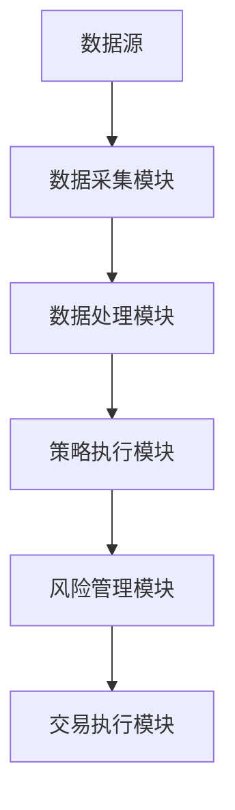

                 

# 如何利用特价股票策略应对市场结构性变化

## 关键词：特价股票、市场结构性变化、投资策略、风险管理、系统设计

## 摘要：本文详细探讨了如何利用特价股票策略应对市场结构性变化。通过分析特价股票的定义、分类和市场变化的类型，结合数学模型和系统设计，提供从理论到实践的指导，帮助投资者有效应对市场波动。

---

## 第一部分：特价股票策略的背景与基础

### 第1章：特价股票策略的背景与重要性

#### 1.1 什么是特价股票

##### 1.1.1 特价股票的定义

特价股票（Cheap Stock）是指市场价格低于其内在价值的股票。通常，这些股票可能因市场波动、公司困境或行业周期而被低估。

##### 1.1.2 特价股票的特点

| 特点 | 描述 |
|------|------|
| 低市盈率 | 市盈率低于行业平均水平 |
| 高股息率 | 股息收益率较高 |
| 高市净率 | 市净率低于行业平均水平 |

##### 1.1.3 特价股票与普通股票的区别

- 普通股票：反映市场情绪，价格波动较大。
- 特价股票：价格被低估，具有长期投资价值。

#### 1.2 市场结构性变化的定义与影响

##### 1.2.1 市场结构性变化的定义

市场结构性变化指市场内部结构的变化，如行业整合、技术进步或宏观经济政策变化，影响市场参与者的行为和资产价格。

##### 1.2.2 市场结构性变化的类型

- 行业周期性变化
- 经济周期性变化
- 宏观政策变化

##### 1.2.3 市场结构性变化对投资的影响

- 投资者需调整投资策略，以适应市场变化。
- 特价股票策略在市场低迷或行业低谷时更具优势。

#### 1.3 特价股票策略在市场变化中的作用

##### 1.3.1 特价股票策略的优势

- 低估值，具有上升潜力。
- 抗跌性强，适合市场波动时的投资。

##### 1.3.2 特价股票策略的适用场景

- 市场低迷期
- 行业低谷期
- 经济衰退期

##### 1.3.3 特价股票策略的局限性

- 需要长期持有，短期内可能继续下跌。
- 需要分析公司基本面，选择真正具有价值的股票。

---

## 第二部分：特价股票策略的核心概念与原理

### 第2章：特价股票的定义与分类

#### 2.1 特价股票的分类

##### 2.1.1 周期性股票

周期性股票受经济周期影响较大，如制造业和能源行业股票。

##### 2.1.2 高负债比率股票

负债比率高的公司可能因市场变化面临财务压力，但可能在市场恢复时表现良好。

##### 2.1.3 低估值股票

市盈率、市净率低于行业平均水平的股票。

#### 2.2 特价股票的特征

##### 2.2.1 低市盈率

$$\text{市盈率} = \frac{\text{股价}}{\text{每股收益}}$$

##### 2.2.2 高股息率

$$\text{股息率} = \frac{\text{每股股息}}{\text{股价}}$$

##### 2.2.3 高市净率

$$\text{市净率} = \frac{\text{股价}}{\text{每股净资产}}$$

#### 2.3 特价股票与市场周期的关系

##### 2.3.1 经济周期对特价股票的影响

- 衰退期：特价股票价格可能继续下跌，但长期投资者可买入。
- 恢复期：特价股票可能回升，带来收益。

##### 2.3.2 市场情绪对特价股票的影响

- 焦虑情绪：投资者抛售，导致特价股票价格进一步下跌。
- 乐观情绪：投资者买入，推动股价回升。

##### 2.3.3 特价股票在熊市中的表现

- 熊市中，特价股票可能因市场恐慌被进一步低估，但长期来看，具有投资价值。

---

## 第三部分：市场结构性变化的分析与应对策略

### 第3章：市场结构性变化的分析方法

#### 3.1 市场结构性变化的识别

##### 3.1.1 市场趋势分析

分析市场趋势，识别周期性变化。

##### 3.1.2 市场周期分析

使用经济周期模型，识别市场所处阶段。

##### 3.1.3 市场波动性分析

分析市场波动性，判断风险水平。

#### 3.2 结构性变化的类型

##### 3.2.1 行业结构性变化

行业整合、技术进步导致的结构变化。

##### 3.2.2 宏观经济结构性变化

经济政策、国际贸易导致的结构变化。

##### 3.2.3 市场情绪变化

投资者情绪波动导致的市场变化。

#### 3.3 特价股票策略的实施

##### 3.3.1 确定市场周期

使用经济周期模型，判断当前市场所处阶段。

##### 3.3.2 选择合适股票

根据市场周期，选择具有长期投资价值的特价股票。

##### 3.3.3 制定交易计划

制定买入和卖出策略，控制风险。

---

## 第四部分：策略实施与风险管理

### 第4章：策略实施的关键步骤

#### 4.1 选股方法

##### 4.1.1 基本面分析

分析公司财务报表，评估公司价值。

##### 4.1.2 技术分析

使用技术指标，判断股票买卖时机。

#### 4.2 交易策略

##### 4.2.1 长期投资

买入并持有，等待股价回升。

##### 4.2.2 短期交易

根据市场波动，进行高抛低吸。

#### 4.3 组合管理

##### 4.3.1 分散投资

避免过度集中，降低风险。

##### 4.3.2 定期调整

根据市场变化，及时调整投资组合。

### 第5章：风险管理与绩效评估

#### 5.1 风险来源

##### 5.1.1 市场风险

市场波动导致的资产价格下跌。

##### 5.1.2 公司风险

公司基本面变化导致的股价下跌。

##### 5.1.3 操作风险

交易错误或策略失误导致的损失。

#### 5.2 风险控制方法

##### 5.2.1 设置止损点

在股价下跌到一定点位时卖出，避免更大损失。

##### 5.2.2 分散投资

通过投资不同行业的股票，降低风险。

##### 5.2.3 定期评估

定期检查投资组合，及时调整策略。

#### 5.3 绩效评估

##### 5.3.1 回撤分析

评估策略在市场下跌时的回撤情况。

##### 5.3.2 风险调整后收益

使用夏普比率等指标，评估策略的风险调整后收益。

---

## 第五部分：系统设计与实现

### 第6章：系统设计与实现

#### 6.1 系统架构设计

##### 6.1.1 系统功能模块

- 数据采集模块：采集股票数据。
- 数据处理模块：计算股票估值。
- 策略执行模块：根据策略生成交易信号。
- 风险管理模块：监控和管理风险。

##### 6.1.2 系统架构图

#### 6.2 系统接口设计

##### 6.2.1 数据接口

- API接口：从数据源获取股票数据。
- 数据格式：JSON格式。

##### 6.2.2 策略接口

- 策略输入：股票数据、市场状态。
- 策略输出：交易信号。

#### 6.3 系统实现

##### 6.3.1 数据采集

使用Python的`pandas`和`requests`库，从API获取股票数据。

##### 6.3.2 数据处理

计算市盈率、市净率等指标，判断是否为特价股票。

##### 6.3.3 策略执行

根据策略生成买入或卖出信号，通过`Trading API`执行交易。

##### 6.3.4 风险管理

监控投资组合的回撤和风险指标，调整策略参数。

---

## 第六部分：实战案例与扩展

### 第7章：实战案例分析

#### 7.1 案例分析

##### 7.1.1 案例背景

2020年新冠疫情导致市场下跌，许多股票被低估。

##### 7.1.2 特价股票选择

选择市盈率低、股息率高的股票。

##### 7.1.3 交易策略

在股价下跌至一定点位时买入，设定止损点。

#### 7.2 性能分析

##### 7.2.1 回测结果

通过回测验证策略的有效性。

##### 7.2.2 风险评估

评估策略在不同市场条件下的表现。

### 第8章：算法交易与大数据分析

#### 8.1 算法交易

##### 8.1.1 算法交易简介

使用算法自动执行交易，提高效率。

##### 8.1.2 算法实现

通过Python编写算法交易脚本，连接Trading API。

#### 8.2 大数据分析

##### 8.2.1 数据挖掘

使用大数据分析技术，发现市场机会。

##### 8.2.2 数据可视化

使用工具如Tableau，展示市场变化和策略表现。

### 第9章：总结与展望

#### 9.1 总结

- 特价股票策略在市场结构性变化中具有重要作用。
- 需要结合基本面分析和技术分析，制定合理的交易策略。
- 系统设计和风险管理是成功实施策略的关键。

#### 9.2 展望

- 结合人工智能和大数据分析，优化策略。
- 开发更复杂的算法，适应市场变化。
- 进一步研究市场结构性变化的预测方法。

---

## 作者：AI天才研究院 & 禅与计算机程序设计艺术

---

### 附录：参考文献

1. Graham, Benjamin. *The Intelligent Investor*.
2. Fama, Eugene. *Portfolio Selection*.
3. Sharpe, William. *The Sharpe Ratio*.

---

以上是《如何利用特价股票策略应对市场结构性变化》的目录大纲和文章内容，涵盖了从基础理论到实践应用的各个方面，结合数学模型、系统设计和实战案例，为投资者提供了全面的指导。

