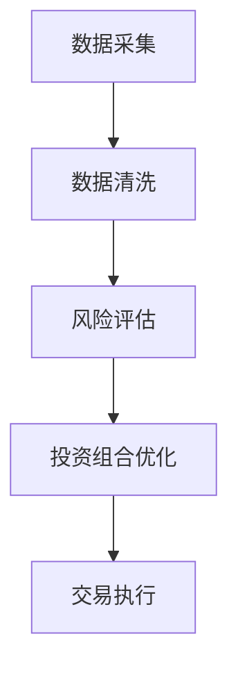
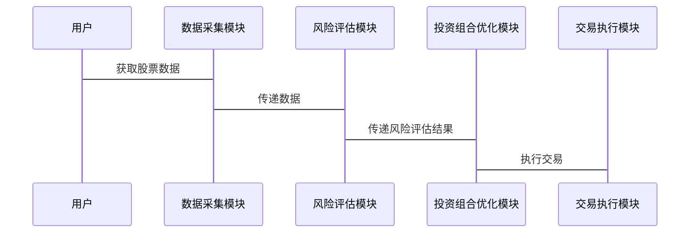

                 


# 如何利用特价股票策略应对技术主权风险

## 关键词：技术主权风险, 特价股票策略, 投资风险管理, 技术依赖, 供应链风险, 量化投资策略, 风险对冲机制

## 摘要

随着全球化和技术的快速发展，技术主权风险日益成为企业和国家面临的重要挑战。技术主权风险指的是由于技术依赖而可能面临的风险，例如供应链中断、数据泄露和专利纠纷等。本文探讨如何利用特价股票策略来应对技术主权风险。特价股票策略是一种投资策略，通过购买被低估的股票，投资者可以在市场波动中获得收益，同时对冲技术主权风险。本文将从背景介绍、核心概念、算法原理、系统架构、项目实战和最佳实践等多个方面，详细阐述如何利用特价股票策略应对技术主权风险。

---

## 第一部分：背景介绍

### 第1章：技术主权风险的背景与现状

#### 1.1 技术主权风险的定义与特征

- **技术主权的内涵与外延**
  - 技术主权是指一个国家或企业在关键技术和核心领域拥有自主权和控制权，能够独立研发、生产和应用关键技术和产品。
  - 技术主权风险是指由于技术依赖而导致的潜在风险，例如供应链中断、技术封锁、数据泄露等。

- **技术主权风险的分类与表现**
  - 供应链中断风险：依赖外部供应商可能导致供应链中断，影响企业的正常运营。
  - 数据安全与隐私威胁：技术依赖可能带来数据泄露和隐私问题。
  - 技术封锁风险：关键技术和产品可能被限制出口或禁止使用。

- **当前技术主权风险的主要来源**
  - 供应链全球化导致的依赖性增加。
  - 数字化转型中数据和技术的集中化。
  - 国际贸易和技术壁垒的增加。

#### 1.2 技术主权风险对企业的影响

- **供应链中断的风险**
  - 供应链中断可能导致生产停滞，影响企业声誉和财务状况。
  - 例如，芯片短缺对全球半导体行业的影响。

- **数据安全与隐私威胁**
  - 数据泄露可能导致企业损失客户信任和财务损失。
  - 数据被恶意篡改或删除可能影响企业的正常运营。

- **技术依赖性对竞争力的影响**
  - 过度依赖某一项技术可能导致企业在竞争中处于劣势。
  - 技术封锁可能限制企业的市场拓展和产品创新。

#### 1.3 特价股票策略的背景与优势

- **特价股票策略的定义**
  - 特价股票是指市场价格低于其内在价值的股票。
  - 投资者通过购买被低估的股票，等待其价格回归合理水平以获得收益。

- **特价股票策略在风险管理中的作用**
  - 特价股票策略可以帮助投资者在市场波动中对冲风险。
  - 通过分散投资，降低技术主权风险对投资组合的影响。

- **特价股票策略的优势与局限性**
  - 优势：价格低廉，潜在收益高；风险较低，适合长期投资。
  - 局限性：需要长期持有，市场波动可能导致短期亏损；选股难度大，需要专业知识和经验。

---

## 第二部分：核心概念与联系

### 第2章：技术主权风险与特价股票策略的关系

#### 2.1 技术主权风险的核心要素

- **技术依赖性**
  - 企业对某些关键技术或产品的依赖可能导致技术主权风险。
  - 例如，依赖某一家供应商可能导致供应链中断。

- **供应链稳定性**
  - 供应链的稳定性是技术主权的重要组成部分。
  - 供应链中断可能导致企业无法正常生产和运营。

- **数据控制权**
  - 数据是现代企业的重要资产，数据控制权直接影响技术主权。
  - 数据泄露或被恶意篡改可能导致企业损失。

#### 2.2 特价股票策略的核心要素

- **特价股票的定义与筛选标准**
  - 定义：市场价格低于内在价值的股票。
  - 筛选标准：低市盈率、低市净率、高股息率等。

- **投资组合的构建与优化**
  - 通过筛选多个被低估的股票，构建分散化的投资组合。
  - 优化投资组合以平衡风险和收益。

- **风险对冲机制**
  - 通过期货、期权等工具对冲市场风险。
  - 通过分散投资降低特定风险。

#### 2.3 技术主权风险与特价股票策略的关联性分析

- **风险与收益的平衡**
  - 技术主权风险可能导致股价波动，投资者可以通过特价股票策略在波动中获利。
  - 特价股票策略可以帮助投资者在技术主权风险中对冲风险。

- **特价股票策略在技术主权风险中的应用**
  - 通过投资被低估的股票，投资者可以在市场波动中获得收益。
  - 特价股票策略可以帮助投资者在技术主权风险中分散风险。

- **理论模型与实证分析**
  - 理论模型：技术主权风险与股价波动的关系。
  - 实证分析：通过历史数据验证特价股票策略的有效性。

---

## 第三部分：算法原理讲解

### 第3章：特价股票策略的量化算法

#### 3.1 算法原理

- **数据采集与清洗**
  - 数据源：股票价格、财务数据、市场指标等。
  - 数据清洗：去除缺失值、异常值，标准化数据。

- **风险评估模型**
  - 使用统计方法评估股票的风险，例如波动率、VaR（在险价值）等。
  - 通过历史数据分析，评估股票的潜在风险。

- **投资组合优化算法**
  - 使用均值-方差优化模型，构建最优投资组合。
  - 通过风险调整后的收益最大化目标，优化投资组合。

#### 3.2 算法流程图



#### 3.3 Python代码实现

```python
import pandas as pd
import numpy as np

# 数据清洗
def clean_data(data):
    data = data.dropna()
    data = data[abs(data - data.mean()) < 2 * data.std()]
    return data

# 风险评估
def calculate_risk(data):
    returns = data.pct_change()
    variance = returns.var()
    return variance

# 投资组合优化
def optimize_portfolio(returns, weights):
    covariance_matrix = returns.cov()
    portfolio_variance = np.dot(weights.T, np.dot(covariance_matrix, weights))
    return portfolio_variance

# 示例代码
data = pd.read_csv('stock_data.csv')
cleaned_data = clean_data(data)
risk = calculate_risk(cleaned_data)
weights = np.array([0.3, 0.3, 0.4])
portfolio_risk = optimize_portfolio(cleaned_data, weights)
print(f"Portfolio Risk: {portfolio_risk}")
```

#### 3.4 数学模型与公式

- **风险评估模型**
  - 波动率公式：
    $$ \text{波动率} = \sqrt{\text{方差}} $$
  - VaR公式：
    $$ \text{VaR} = \mu + z \times \sigma $$

- **投资组合优化模型**
  - 均值-方差优化：
    $$ \text{Minimize } \sigma^2 \text{ subject to } \sum w_i = 1 $$

---

## 第四部分：系统分析与架构设计方案

### 第4章：系统功能设计与架构

#### 4.1 系统功能设计

- **数据采集模块**
  - 从多个数据源获取股票数据。
  - 数据清洗和预处理。

- **风险评估模块**
  - 使用统计方法评估股票风险。
  - 生成风险报告。

- **投资组合优化模块**
  - 构建投资组合。
  - 优化投资组合。

- **交易执行模块**
  - 执行交易指令。
  - 监控交易执行情况。

#### 4.2 系统架构设计


#### 4.3 系统接口设计

- **API接口**
  - 数据接口：获取股票数据。
  - 风险评估接口：返回风险评估结果。
  - 投资组合优化接口：返回优化后的投资组合。

#### 4.4 系统交互流程



---

## 第五部分：项目实战

### 第5章：特价股票策略的实战应用

#### 5.1 环境安装与配置

- **Python安装**
  - 下载并安装Python。
  - 安装必要的库，例如pandas、numpy、matplotlib。

- **数据源获取**
  - 使用Yahoo Finance API获取股票数据。
  - 下载历史数据。

#### 5.2 核心代码实现

```python
import pandas as pd
import numpy as np

# 数据采集
data = pd.read_csv('stock_data.csv')

# 数据清洗
cleaned_data = data.dropna()

# 风险评估
returns = cleaned_data['Adj Close'].pct_change()
volatility = returns.std()

# 投资组合优化
weights = np.array([0.3, 0.3, 0.4])
portfolio_volatility = np.sqrt(np.dot(weights.T, np.dot(returns.cov(), weights)))

print(f"Volatility: {volatility}")
print(f"Portfolio Volatility: {portfolio_volatility}")
```

#### 5.3 案例分析与结果解读

- **案例分析**
  - 选择几只被低估的股票，构建投资组合。
  - 使用历史数据验证策略的有效性。

- **结果解读**
  - 计算投资组合的收益和风险。
  - 对比市场整体表现，评估策略的有效性。

#### 5.4 项目小结

- **策略的有效性**
  - 特价股票策略在技术主权风险中的表现。
  - 策略的优缺点。

- **经验与教训**
  - 数据选择的重要性。
  - 模型优化的必要性。

---

## 第六部分：最佳实践与小结

### 第6章：投资策略与风险管理

#### 6.1 最佳投资策略

- **分散投资**
  - 通过分散投资降低风险。
  - 选择不同行业的股票。

- **定期调整**
  - 定期评估投资组合。
  - 根据市场变化调整策略。

- **风险管理**
  - 设置止损点，避免重大损失。
  - 使用对冲工具降低风险。

#### 6.2 风险管理策略

- **风险分散**
  - 通过投资不同类型的股票降低风险。
  - 避免过度依赖某一只股票。

- **定期评估**
  - 定期评估投资组合的风险。
  - 根据市场变化调整投资策略。

- **监控市场**
  - 关注市场动态，及时调整投资策略。
  - 避免盲目跟风。

#### 6.3 未来展望与总结

- **未来展望**
  - 技术主权风险的未来发展趋势。
  - 特价股票策略的应用前景。

- **总结**
  - 特价股票策略在应对技术主权风险中的重要性。
  - 投资者应如何利用特价股票策略应对技术主权风险。

---

## 作者信息

作者：AI天才研究院/AI Genius Institute & 禅与计算机程序设计艺术/Zen And The Art of Computer Programming

---

通过以上结构，本文详细阐述了如何利用特价股票策略应对技术主权风险，从理论到实践，为投资者提供了全面的指导和建议。

