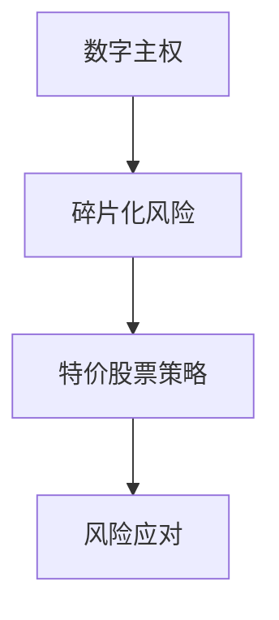
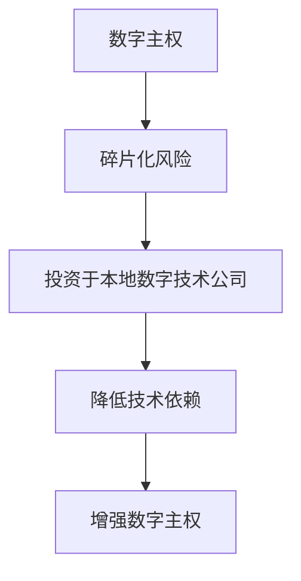

                 


```markdown
# 如何利用特价股票策略应对数字主权碎片化风险

> 关键词：数字主权，碎片化风险，特价股票，投资策略，风险管理

> 摘要：数字主权碎片化风险是当前数字化时代面临的重要挑战。本文通过分析数字主权的定义、碎片化风险的形成机制以及特价股票策略的核心原理，探讨如何利用特价股票策略来应对数字主权碎片化风险。文章详细介绍了数字主权与特价股票策略的关系，分析了策略在风险应对中的作用，并通过实际案例展示了策略的应用过程。最后，文章总结了策略的优势与局限性，并提出了未来的发展方向。

---

## 第一部分: 特价股票策略与数字主权碎片化风险背景介绍

### 第1章: 数字主权碎片化风险概述

#### 1.1 数字主权的定义与特征

##### 1.1.1 数字主权的定义
数字主权是指一个国家在数字领域内自主决定和控制其信息、数据和网络的能力。它是国家主权在数字化时代的延伸，涉及数据安全、网络安全、信息控制等多个方面。

##### 1.1.2 数字主权的核心特征
- **自主性**：国家能够自主决定其数字资源的使用和管理。
- **安全性**：数字资源和网络免受外部威胁和攻击。
- **可控性**：对数字活动进行有效监管和控制。
- **创新性**：通过数字技术推动国家发展和创新能力。

##### 1.1.3 数字主权的边界与外延
数字主权的边界主要在于如何平衡国家安全与国际合作的关系。外延则涉及数字技术的广泛应用，如人工智能、大数据、区块链等。

#### 1.2 数字主权碎片化风险的产生机制

##### 1.2.1 数字化时代的主权挑战
随着数字化的深入，传统的国家主权在数字空间中受到挑战。数据的跨国流动、技术的依赖性以及网络攻击等问题，使得数字主权的维护变得更加复杂。

##### 1.2.2 碎片化风险的形成原因
- **技术依赖**：过度依赖外国技术和服务，导致数据控制权的分散。
- **数据流动**：数据的跨国流动可能导致信息不对称和数据被滥用。
- **网络攻击**：网络攻击和数据泄露事件频发，威胁数字主权的完整性。

##### 1.2.3 碎片化风险的潜在影响
数字主权的碎片化可能导致国家在全球数字经济中的弱势地位，影响国家安全和经济发展。

#### 1.3 特价股票策略的定义与特点

##### 1.3.1 特价股票的定义
特价股票是指市场价格被低估的股票，通常具有较高的潜在增值空间。

##### 1.3.2 特价股票策略的核心特征
- **价值投资**：注重公司基本面，寻找被市场低估的股票。
- **长期持有**：通过长期投资来实现资本增值。
- **风险控制**：通过分散投资降低风险。

##### 1.3.3 特价股票策略的应用场景
- **市场低迷期**：在市场低迷时，寻找被低估的股票进行投资。
- **行业调整期**：在行业结构调整时，投资于具有竞争优势的公司。

### 第2章: 数字主权碎片化风险与特价股票策略的关系

#### 2.1 数字主权碎片化风险的现状分析

##### 2.1.1 当前数字主权面临的挑战
- **数据安全威胁**：网络攻击和数据泄露事件频发。
- **技术依赖**：在某些关键技术领域依赖外国技术。
- **政策冲突**：国际间的数据政策差异和冲突。

##### 2.1.2 碎片化风险的具体表现
- **数据主权流失**：数据被跨国公司控制，国家失去数据主权。
- **技术垄断**：关键数字技术被少数国家或公司垄断。
- **信息不对称**：不同国家在数字技术发展中的信息不对称。

##### 2.1.3 碎片化风险的未来趋势
随着数字化的深入，数字主权碎片化风险可能进一步加剧，但通过技术创新和政策调整，有望逐步缓解。

#### 2.2 特价股票策略在数字主权风险应对中的作用

##### 2.2.1 特价股票策略的核心优势
- **价值发现**：通过识别具有长期增长潜力的公司，支持其技术创新和市场扩展。
- **风险分散**：通过投资于多个行业和公司，降低投资风险。
- **长期收益**：通过长期持有股票，获得资本增值。

##### 2.2.2 策略在风险应对中的具体应用
- **投资于本地数字技术公司**：支持国内数字技术的发展，减少对外部技术的依赖。
- **关注具有竞争优势的公司**：投资于那些在全球数字市场中具有竞争优势的公司，提升国家的数字影响力。

##### 2.2.3 策略的有效性与局限性
- **有效性**：通过投资于优质公司，支持数字技术的发展，增强数字主权。
- **局限性**：市场波动和公司业绩的不确定性可能影响投资效果。

#### 2.3 数字主权碎片化风险与特价股票策略的关联性分析

##### 2.3.1 策略如何缓解数字主权风险
- **支持本地技术创新**：通过投资于本地数字技术公司，促进技术创新和产业升级。
- **降低技术依赖**：减少对外国技术的依赖，增强数字主权。

##### 2.3.2 策略在风险应对中的独特价值
- **资本支持**：通过投资于数字技术公司，为这些公司提供资金支持，推动其发展。
- **市场影响力**：通过资本市场的力量，提升本地数字技术公司的市场地位和国际竞争力。

##### 2.3.3 策略的长期影响与可持续性
通过长期投资于优质公司，特价股票策略能够持续支持数字技术的发展，增强数字主权的可持续性。

---

## 第二部分: 数字主权碎片化风险的核心概念与联系

### 第3章: 数字主权与特价股票策略的核心概念

#### 3.1 数字主权的核心概念

##### 3.1.1 数字主权的内涵与外延
- **内涵**：数字主权涉及数据安全、网络安全、信息控制等方面。
- **外延**：包括数字技术的开发、应用和管理等多个方面。

##### 3.1.2 数字主权的关键属性
- **自主性**：国家能够自主决定数字资源的使用和管理。
- **安全性**：数字资源和网络免受外部威胁和攻击。
- **可控性**：对数字活动进行有效监管和控制。

##### 3.1.3 数字主权的实现路径
- **技术创新**：通过技术创新提升数字技术的自主可控能力。
- **政策制定**：制定相关政策法规，规范数字资源的使用和管理。
- **国际合作**：通过国际合作，推动数字技术的全球治理和标准制定。

#### 3.2 特价股票策略的核心概念

##### 3.2.1 特价股票策略的内涵
- **价值投资**：注重公司基本面，寻找被市场低估的股票。
- **长期持有**：通过长期投资实现资本增值。

##### 3.2.2 策略的核心要素
- **选股标准**：选择具有长期增长潜力的公司。
- **投资组合**：通过分散投资降低风险。
- **风险管理**：通过监控市场波动和公司业绩，及时调整投资策略。

#### 3.3 数字主权与特价股票策略的联系

##### 3.3.1 策略如何影响数字主权
- **支持本地技术创新**：通过投资于本地数字技术公司，促进技术创新和产业升级。
- **降低技术依赖**：减少对外国技术的依赖，增强数字主权。

##### 3.3.2 策略在数字主权中的具体应用
- **投资于本地数字技术公司**：支持国内数字技术的发展，减少对外部技术的依赖。
- **关注具有竞争优势的公司**：投资于那些在全球数字市场中具有竞争优势的公司，提升国家的数字影响力。

### 第4章: 数字主权碎片化风险与特价股票策略的关系模型

#### 4.1 数字主权碎片化风险的实体关系图



#### 4.2 特价股票策略在数字主权风险中的作用机制



---

## 第三部分: 数字主权碎片化风险的应对策略

### 第5章: 数字主权碎片化风险的应对策略

#### 5.1 特价股票策略在应对数字主权碎片化风险中的具体应用

##### 5.1.1 投资策略
- **选择本地数字技术公司**：投资于那些在本地具有竞争优势的数字技术公司。
- **关注技术创新**：选择那些在技术创新方面具有优势的公司，支持其发展。

##### 5.1.2 风险管理
- **分散投资**：通过投资于多个行业和公司，降低投资风险。
- **监控市场波动**：及时调整投资策略，应对市场变化。

#### 5.2 数字主权碎片化风险的长期应对策略

##### 5.2.1 技术创新
- **推动技术创新**：通过技术创新提升数字技术的自主可控能力。
- **支持 startups**：支持本地初创公司，促进技术创新和产业升级。

##### 5.2.2 政策制定
- **制定相关政策法规**：规范数字资源的使用和管理，保障数字主权。
- **推动国际合作**：通过国际合作，推动数字技术的全球治理和标准制定。

---

## 第四部分: 数字主权碎片化风险的应对策略

### 第6章: 数字主权碎片化风险的应对策略总结

#### 6.1 总结

通过利用特价股票策略，投资者可以支持本地数字技术公司的发展，降低技术依赖，增强数字主权。同时，通过技术创新和政策制定，可以进一步提升数字主权的自主性和安全性。

#### 6.2 未来发展方向

- **技术创新**：推动数字技术的自主可控，减少对外部技术的依赖。
- **政策支持**：制定相关政策法规，规范数字资源的使用和管理。
- **国际合作**：通过国际合作，推动数字技术的全球治理和标准制定。

---

## 作者

作者：AI天才研究院/AI Genius Institute & 禅与计算机程序设计艺术 /Zen And The Art of Computer Programming
```

