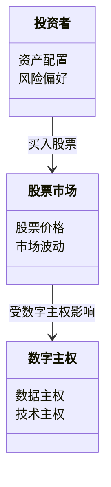
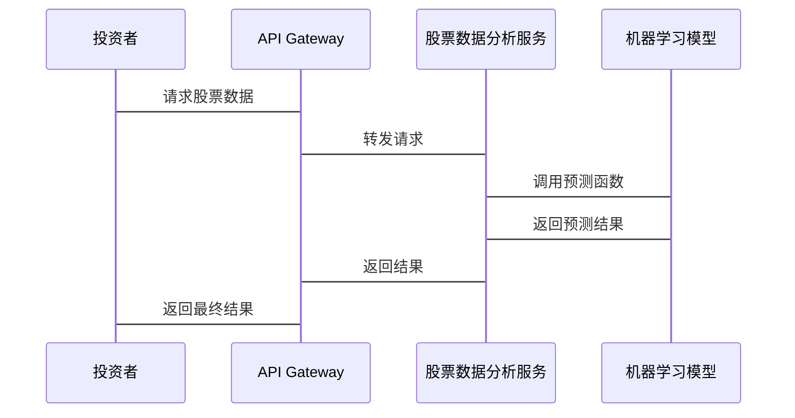

                 


# 如何利用特价股票策略应对数字主权竞争风险

> 关键词：数字主权，股票策略，特价股票，竞争风险，投资策略

> 摘要：本文探讨了如何通过特价股票策略来应对数字主权竞争带来的风险。首先，我们分析了数字主权的定义、核心要素及其在全球化背景下的发展趋势。接着，我们详细介绍了特价股票策略的基本概念、特点及其与数字主权竞争的内在联系。随后，我们从算法原理、系统架构、项目实战等多个维度深入分析了如何利用特价股票策略来应对数字主权竞争中的各种风险。最后，我们总结了最佳实践经验和未来研究方向。

---

## 第一部分: 数字主权竞争与特价股票策略的背景介绍

### 第1章: 数字主权竞争的现状与挑战

#### 1.1 数字主权的定义与核心概念

##### 1.1.1 数字主权的定义
数字主权是指一个国家对数字资源、数字技术和数字基础设施的自主控制和管理能力。它包括数据主权、技术主权和网络主权等多个方面。

##### 1.1.2 数字主权的核心要素
- 数据主权：对数据的生成、存储、传输和使用的控制权。
- 技术主权：对关键数字技术的自主研发和创新能力。
- 网络主权：对国家网络空间的管理和安全自主权。

##### 1.1.3 数字主权的全球发展趋势
随着全球化和技术的进步，数字主权已成为各国竞争的重要领域。各国通过立法、技术创新和国际合作来维护数字主权。

#### 1.2 特价股票策略的基本概念

##### 1.2.1 特价股票的定义
特价股票是指市场价格低于其内在价值的股票。这种股票通常被视为被市场低估，具有较大的上涨潜力。

##### 1.2.2 特价股票策略的特点
- 低估值：基于基本面分析，寻找市场价格低于内在价值的股票。
- 长期投资：通常持有较长时间，等待市场回归理性。
- 风险控制：通过分散投资和严格筛选降低风险。

##### 1.2.3 特价股票与数字主权的关系
数字主权的竞争可能影响特定行业的股票价格，而特价股票策略可以帮助投资者在动荡的市场中寻找机会。

---

### 第2章: 数字主权竞争中的风险分析

#### 2.1 数字主权竞争的主要风险

##### 2.1.1 数据主权风险
数据泄露或被他国控制可能对国家利益造成威胁。

##### 2.1.2 技术依赖风险
过度依赖外国技术可能导致供应链中断。

##### 2.1.3 市场波动风险
数字主权竞争可能导致相关股票市场的剧烈波动。

#### 2.2 特价股票策略在风险应对中的作用

##### 2.2.1 特价股票策略的防御性特点
- 避免高位买入：通过寻找低估股票降低市场波动风险。
- 分散投资：降低单一风险的影响。

##### 2.2.2 特价股票策略在数字主权竞争中的应用
- 投资本国技术公司：支持国内技术自主创新。
- 避免过度依赖外国技术：通过投资本地化企业降低技术依赖风险。

##### 2.2.3 特价股票策略的风险分担机制
通过多样化投资和严格的风险评估，降低数字主权竞争带来的市场波动风险。

---

## 第二部分: 数字主权竞争与特价股票策略的核心概念与联系

### 第3章: 数字主权与特价股票策略的核心概念

#### 3.1 数字主权的核心概念

##### 3.1.1 数字主权的法律框架
各国通过立法保护数据和网络安全，例如《网络安全法》、《数据保护法》等。

##### 3.1.2 数字主权的技术实现
包括自主研发的关键技术、网络安全防护和数据加密技术。

##### 3.1.3 数字主权的经济影响
数字主权的强弱直接影响国家的经济发展和国际竞争力。

#### 3.2 特价股票策略的核心概念

##### 3.2.1 特价股票的估值方法
- 市盈率（P/E）：市价与每股收益的比率。
- 市净率（P/B）：市价与每股净资产的比率。
- 内在价值模型：基于未来现金流的现值评估股票价值。

##### 3.2.2 特价股票的市场时机选择
- 技术分析：通过K线图、移动平均线等技术指标判断市场趋势。
- 价值分析：寻找市场价格低于内在价值的股票。
- 市场周期：关注市场底部区域，寻找被低估的股票。

##### 3.2.3 特价股票的风险评估指标
- 波动率：股票价格的波动程度。
- 市盈率：市盈率低于行业平均水平的股票可能被低估。
- 财务健康状况：关注公司的盈利能力、资产负债率等财务指标。

---

### 第4章: 数字主权与特价股票策略的联系

#### 4.1 数字主权竞争对股票市场的影响

##### 4.1.1 数字主权竞争对股价波动的影响
数字主权竞争可能导致相关行业股票的剧烈波动，例如科技股、网络安全股等。

##### 4.1.2 数字主权竞争对行业选择的影响
投资者可能更倾向于投资本国具有技术优势的企业，避免过度依赖外国技术。

##### 4.1.3 数字主权竞争对投资策略的影响
投资者需要更加关注国家政策、行业趋势和技术发展，调整投资组合以应对数字主权竞争带来的风险。

#### 4.2 特价股票策略在数字主权竞争中的应用

##### 4.2.1 特价股票策略在数字主权风险中的防御作用
- 避免高位买入：通过寻找低估股票降低市场波动风险。
- 分散投资：降低单一风险的影响。

##### 4.2.2 特价股票策略在数字主权机会中的捕捉作用
- 投资本国技术公司：支持国内技术自主创新。
- 选择具有技术优势的企业：投资那些在数字主权竞争中有优势的公司。

##### 4.2.3 特价股票策略在数字主权平衡中的调节作用
通过投资组合的优化，平衡数字主权竞争带来的风险和机会。

---

## 第三部分: 特价股票策略的算法原理与数学模型

### 第5章: 特价股票策略的算法原理

#### 5.1 特价股票策略的核心算法

##### 5.1.1 基于技术分析的算法
- 移动平均线（MA）：计算一定周期内的平均价格，判断市场趋势。
- 相对强弱指数（RSI）：衡量股票的超买或超卖状态。
- MACD指标：通过移动平均收敛散度判断市场趋势。

##### 5.1.2 基于价值分析的算法
- 内在价值模型：计算股票的合理估值，判断是否低估。
- 市盈率筛选：寻找市盈率低于行业平均水平的股票。
- 财务指标分析：关注公司的盈利能力、资产负债率等财务指标。

##### 5.1.3 基于大数据分析的算法
- 自然语言处理（NLP）：分析新闻、社交媒体等非结构化数据，预测市场情绪。
- 机器学习：通过历史数据训练模型，预测股票价格走势。

#### 5.2 特价股票策略的数学模型

##### 5.2.1 估值模型
股票的内在价值可以通过以下公式计算：
$$ V = \frac{CF}{r - g} $$
其中，$CF$ 是未来现金流，$r$ 是折现率，$g$ 是现金流增长率。

##### 5.2.2 波动率模型
股票的波动率可以通过标准差衡量：
$$ \sigma = \sqrt{\frac{1}{n}\sum_{i=1}^{n}(x_i - \bar{x})^2} $$
其中，$x_i$ 是每个价格点，$\bar{x}$ 是平均价格，$n$ 是数据点数。

---

## 第四部分: 系统分析与架构设计方案

### 第6章: 数字主权竞争与特价股票策略的系统架构

#### 6.1 问题场景介绍
数字主权竞争可能导致股票市场的剧烈波动，投资者需要一种有效的策略来应对这种风险。

#### 6.2 项目介绍
本项目旨在通过特价股票策略，帮助投资者在数字主权竞争中降低风险，捕捉机会。

#### 6.3 系统功能设计

##### 6.3.1 领域模型


#### 6.4 系统架构设计


#### 6.5 系统接口设计
- 投资者通过API Gateway访问股票数据分析服务。
- 数据分析服务调用机器学习模型进行预测。
- 结果通过API返回给投资者。

#### 6.6 系统交互流程图


---

## 第五部分: 项目实战

### 第7章: 特价股票策略的项目实战

#### 7.1 环境安装
- Python 3.8+
- Pandas, NumPy, Matplotlib, Scikit-learn

#### 7.2 系统核心实现

##### 7.2.1 数据获取
```python
import pandas as pd
import requests

def get_stock_data(ticker):
    url = f"https://api.example.com/stock/{ticker}"
    response = requests.get(url)
    return pd.DataFrame(response.json()['data'])
```

##### 7.2.2 数据分析
```python
def calculate_ma(df, window=20):
    df['MA'] = df['Close'].rolling(window).mean()
    return df
```

##### 7.2.3 模型训练
```python
from sklearn.linear_model import LinearRegression

def train_model(df, target_column):
    model = LinearRegression()
    model.fit(df[['Open', 'High', 'Low']], df[target_column])
    return model
```

#### 7.3 代码应用解读与分析
- 数据获取：从API获取股票数据。
- 数据分析：计算移动平均线，判断市场趋势。
- 模型训练：使用线性回归预测股票价格。

#### 7.4 实际案例分析
通过具体案例分析，展示如何利用特价股票策略应对数字主权竞争带来的风险。

#### 7.5 项目小结
总结项目实现的关键步骤和经验教训，提出改进建议。

---

## 第六部分: 最佳实践

### 第8章: 特价股票策略的最佳实践

#### 8.1 小结
总结全文内容，强调特价股票策略在数字主权竞争中的重要性。

#### 8.2 注意事项
- 风险提示：投资有风险，需谨慎操作。
- 系统维护：定期更新模型和数据，确保准确性。

#### 8.3 拓展阅读
推荐相关书籍和论文，供读者深入学习。

---

## 作者

作者：AI天才研究院/AI Genius Institute & 禅与计算机程序设计艺术 /Zen And The Art of Computer Programming

