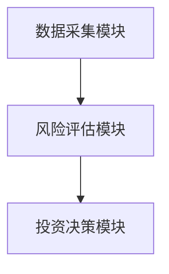

                 


```markdown
# 如何利用特价股票策略应对数字主权风险

> 关键词：特价股票策略、数字主权风险、投资策略、风险管理、数据安全

> 摘要：本文探讨了如何利用特价股票策略来应对数字主权风险。首先，我们介绍了特价股票策略和数字主权风险的基本概念，分析了两者之间的联系。接着，我们详细讲解了特价股票策略的核心原理、数字主权风险的评估方法，以及两者结合的数学模型。然后，我们通过系统架构设计和项目实战，展示了如何将特价股票策略应用于数字主权风险管理中。最后，我们总结了最佳实践和注意事项，为读者提供了全面的解决方案。

## 第一部分: 特价股票策略与数字主权风险概述

### 第1章: 特价股票策略的定义与特点

#### 1.1 特价股票的定义
- 特价股票是指市场价格低于其内在价值的股票。
- 这类股票通常被市场低估，具有较大的上涨潜力。

#### 1.2 特价股票策略的特点
- 高收益潜力
- 高风险性
- 长期持有策略
- 逆向投资原则

### 第2章: 数字主权风险的概念与影响

#### 2.1 数字主权的定义
- 数字主权指国家对其数字资产和网络空间的自主控制权。
- 包括数据主权、网络安全、数字治理等多个方面。

#### 2.2 数字主权风险的来源
- 数据泄露
- 网络攻击
- 数据滥用
- 政策变化

#### 2.3 数字主权风险的影响
- 对企业运营的影响
- 对国家安全的影响
- 对个人隐私的影响

## 第二部分: 特价股票策略的核心原理

### 第3章: 市场周期分析

#### 3.1 市场周期的定义
- 包括牛市、熊市、震荡市等不同阶段。

#### 3.2 市场周期与特价股票策略的关系
- 在熊市中寻找低估股票
- 在牛市中规避高估风险

### 第4章: 价值投资与成长投资的区别

#### 4.1 价值投资的定义
- 以低于内在价值的价格买入优质股票。

#### 4.2 成长投资的定义
- 投资于高成长性企业，追求未来高收益。

#### 4.3 两者的区别
- 投资目标不同
- 风险承受能力不同
- 持股期限不同

## 第三部分: 数字主权风险的评估与应对

### 第5章: 数字主权风险的评估方法

#### 5.1 数据主权评估
- 数据存储位置
- 数据控制权
- 数据访问权限

#### 5.2 网络安全评估
- 网络攻击风险
- 系统漏洞
- 数据加密措施

### 第6章: 应对数字主权风险的策略

#### 6.1 数据备份与恢复
- 定期备份数据
- 建立灾难恢复计划

#### 6.2 加强网络安全
- 部署防火墙
- 使用加密技术
- 定期安全审计

## 第四部分: 特价股票策略在数字主权风险管理中的应用

### 第7章: 系统架构设计

#### 7.1 系统功能模块
- 数据采集模块
- 风险评估模块
- 投资决策模块

#### 7.2 系统架构图


### 第8章: 项目实战

#### 8.1 环境安装
- 安装Python
- 安装数据分析库（如Pandas、NumPy）

#### 8.2 核心代码实现
```python
import pandas as pd
import numpy as np

def calculate_intrinsic_value(stock_price, growth_rate, discount_rate):
    return stock_price * (1 + growth_rate) / (1 + discount_rate)
```

#### 8.3 代码解读与分析
- 计算股票的内在价值
- 对比市场价格与内在价值
- 识别低估股票

### 第9章: 案例分析

#### 9.1 案例背景
- 假设某科技公司面临数据主权风险

#### 9.2 投资策略
- 寻找相关行业的低估股票
- 长期持有，等待价值回归

## 第五部分: 最佳实践与小结

### 第10章: 最佳实践

#### 10.1 定期评估投资组合
- 监控市场变化
- 重新评估风险

#### 10.2 加强风险管理
- 设置止损点
- 分散投资风险

### 第11章: 小结

- 特价股票策略在应对数字主权风险中具有重要作用
- 需要结合市场周期和企业基本面进行综合分析
- 需要注意风险管理，避免过度集中投资

## 作者

作者：AI天才研究院/AI Genius Institute & 禅与计算机程序设计艺术 /Zen And The Art of Computer Programming
```

