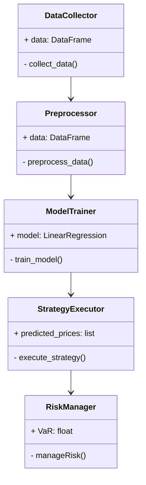
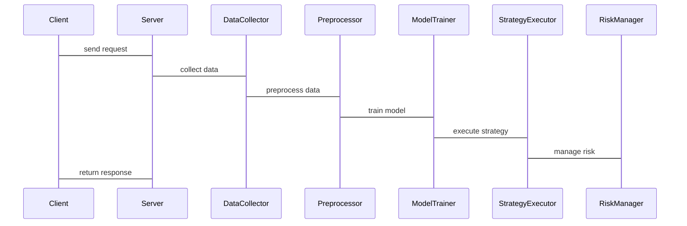

                 


# 如何利用特价股票策略应对数字化去全球化风险

> 关键词：特价股票策略、数字化、去全球化、金融市场、风险管理、投资策略

> 摘要：本文探讨了在数字化和去全球化背景下，如何利用特价股票策略来应对市场风险。通过分析数字化和去全球化对金融市场的双重影响，本文提出了基于数学模型和系统架构的策略，帮助投资者在不确定性中捕捉机会，实现稳健投资。

---

# 第一部分: 特价股票策略与数字化去全球化风险概述

## 第1章: 特价股票策略的背景与核心概念

### 1.1 数字化与去全球化背景下的金融市场变化

#### 1.1.1 数字化对金融市场的深远影响

随着数字化技术的快速发展，金融市场正在经历深刻的变化。人工智能、大数据和区块链等技术的应用，使得市场参与者能够更高效地分析数据、预测趋势并做出决策。然而，数字化也带来了新的风险，例如算法交易的高频化和复杂化，可能导致市场的不稳定。

#### 1.1.2 去全球化趋势下的市场波动性分析

去全球化是指全球化进程的逆转，表现为跨国合作减少、贸易壁垒增加以及地缘政治冲突加剧。这种趋势对金融市场的影响是多方面的，可能导致供应链中断、跨国公司利润下降以及市场波动性增加。

#### 1.1.3 特价股票策略的兴起与应用场景

在市场波动加剧的背景下，投资者开始寻找新的策略来应对风险。特价股票策略作为一种短期投资策略，通过识别市场中的低估股票，利用短期价格波动获利。这种策略在市场不确定性较高的情况下表现出色，尤其是在去全球化导致的市场波动中。

### 1.2 特价股票策略的核心概念与定义

#### 1.2.1 什么是特价股票

特价股票是指那些由于市场波动、信息不对称或短期市场情绪影响，导致其价格低于其内在价值的股票。这些股票通常具有较高的波动性和潜在的上升空间。

#### 1.2.2 特价股票的特征与分类

- **特征**：价格低估、高波动性、短期交易机会。
- **分类**：根据市场情绪、公司基本面和技术分析，将特价股票分为成长型、价值型和周期性股票。

#### 1.2.3 特价股票策略的目标与边界

- **目标**：在短时间内通过买卖特价股票获利。
- **边界**：避免过度杠杆、控制风险敞口、确保交易策略的可执行性。

---

## 第2章: 数字化去全球化风险的形成机制

### 2.1 数字化对全球供应链的影响

#### 2.1.1 数字化对供应链的重构

数字化技术（如物联网和区块链）使得供应链管理更加高效，但也使得供应链更加依赖于技术基础设施。一旦技术出现故障或受到攻击，可能导致供应链中断。

#### 2.1.2 数字化对贸易壁垒的影响

数字化使得跨国贸易更加便捷，但也可能导致新的贸易壁垒。例如，数据隐私和跨境数据流动的限制可能影响全球贸易。

#### 2.1.3 数字化对市场波动性的影响

算法交易和高频交易的普及，使得市场波动性增加。数字化技术的应用也可能导致市场的非理性波动。

### 2.2 去全球化对金融市场的冲击

#### 2.2.1 去全球化对跨国公司的影响

去全球化可能导致跨国公司的业务受到限制，例如供应链中断、市场分割和成本上升。这些因素可能导致公司利润下降，进而影响股价。

#### 2.2.2 去全球化对股票市场的波动性分析

去全球化可能导致市场的不确定性增加，投资者可能对市场失去信心，导致股价波动加剧。此外，地缘政治冲突和贸易摩擦也可能导致市场的短期剧烈波动。

#### 2.2.3 去全球化背景下的投资风险

投资者在去全球化背景下面临更高的风险，包括政策风险、市场风险和流动性风险。这些风险可能影响投资者的决策，尤其是在选择投资标的和策略时。

---

## 第3章: 特价股票策略与风险应对的关联性

### 3.1 特价股票策略如何应对市场波动

#### 3.1.1 特价股票策略的短期与长期视角

特价股票策略通常是一种短期策略，旨在利用市场的短期波动获利。然而，在长期视角下，投资者需要关注公司的基本面和市场趋势。

#### 3.1.2 特价股票策略在风险对冲中的作用

通过利用特价股票策略，投资者可以在市场下跌时获利，从而对冲其他投资的风险。此外，特价股票策略可以帮助投资者在市场波动中保持灵活性。

#### 3.1.3 特价股票策略与市场周期的关系

特价股票策略在市场周期的不同阶段表现不同。在熊市中，投资者可能更容易找到低估的股票，而在牛市中，特价股票策略可能表现不佳。

### 3.2 数字化去全球化风险下的投资机会

#### 3.2.1 数字化驱动下的新兴行业机会

数字化技术的发展催生了许多新兴行业，例如人工智能、区块链和云计算。这些行业可能在去全球化背景下表现出更强的抗风险能力。

#### 3.2.2 去全球化背景下的区域市场机会

去全球化可能导致区域市场的崛起，例如区域供应链的本地化和区域市场的专业化。投资者可以通过关注区域市场来寻找投资机会。

#### 3.2.3 特价股票策略在风险应对中的创新应用

投资者可以通过创新的特价股票策略，例如结合技术分析和基本面分析，来应对数字化和去全球化带来的风险。此外，投资者还可以利用期权和期货等衍生品来对冲风险。

---

# 第二部分: 特价股票策略的数学模型与算法原理

## 第4章: 特价股票策略的数学模型

### 4.1 特价股票策略的基本数学模型

#### 4.1.1 股票价格波动的数学模型

股票价格的波动可以用随机过程模型来描述，例如布朗运动和几何布朗运动。以下是几何布朗运动的数学公式：

$$
dS_t = \mu S_t dt + \sigma S_t dW_t
$$

其中，$S_t$ 是股票价格，$\mu$ 是预期回报率，$\sigma$ 是波动率，$dW_t$ 是标准布朗运动。

#### 4.1.2 特价股票策略的收益与风险模型

收益与风险模型可以通过资本资产定价模型（CAPM）来描述：

$$
E(R_i) = R_f + \beta_i (R_m - R_f)
$$

其中，$E(R_i)$ 是股票i的预期收益，$R_f$ 是无风险利率，$\beta_i$ 是股票i的贝塔系数，$R_m$ 是市场预期收益。

---

### 4.2 特价股票策略的算法实现

#### 4.2.1 算法步骤

以下是特价股票策略的算法实现步骤：

1. **数据采集**：收集历史股价数据。
2. **数据预处理**：清洗数据并计算技术指标。
3. **模型训练**：使用机器学习模型预测股票价格。
4. **策略执行**：根据模型预测结果执行买卖操作。
5. **风险控制**：设置止损和止盈点。

#### 4.2.2 算法实现的Python代码

以下是Python代码示例：

```python
import pandas as pd
import numpy as np
from sklearn.linear_model import LinearRegression

# 数据采集
data = pd.read_csv('stock_data.csv')

# 数据预处理
X = data[['open', 'high', 'low', 'volume']]
y = data['close']

# 模型训练
model = LinearRegression()
model.fit(X, y)

# 预测股票价格
predicted_prices = model.predict(X)

# 策略执行
threshold = 0.1
profit = 0
for i in range(len(predicted_prices)):
    if predicted_prices[i] > data['close'][i] * (1 + threshold):
        print(f"买入信号，预测价格：{predicted_prices[i]}，实际价格：{data['close'][i]}")
    elif predicted_prices[i] < data['close'][i] * (1 - threshold):
        print(f"卖出信号，预测价格：{predicted_prices[i]}，实际价格：{data['close'][i]}")
```

---

### 4.3 特价股票策略的风险管理

#### 4.3.1 风险管理模型

以下是风险管理模型的公式：

$$
\text{风险价值} (VaR) = \mu - z \cdot \sigma
$$

其中，$\mu$ 是平均回报，$z$ 是标准正态分布的分位数，$\sigma$ 是标准差。

#### 4.3.2 风险控制策略

投资者可以通过以下策略来管理风险：

- **止损订单**：当股价下跌到一定程度时，自动卖出股票。
- **止盈订单**：当股价上涨到一定程度时，自动卖出股票。
- **分散投资**：将资金分散投资于多个股票，降低风险敞口。

---

# 第三部分: 特价股票策略的系统分析与架构设计

## 第5章: 系统分析与架构设计方案

### 5.1 系统功能设计

以下是系统功能设计的类图：



### 5.2 系统架构设计

以下是系统架构设计的架构图：


### 5.3 系统接口设计

以下是系统接口设计的序列图：



---

# 第四部分: 项目实战

## 第6章: 项目实战与案例分析

### 6.1 环境配置

以下是项目实战的环境配置：

```bash
# 安装所需的Python库
pip install pandas numpy scikit-learn
```

### 6.2 系统核心实现源代码

以下是Python代码实现：

```python
import pandas as pd
import numpy as np
from sklearn.linear_model import LinearRegression
from sklearn.metrics import mean_squared_error

# 数据采集
data = pd.read_csv('stock_data.csv')

# 数据预处理
X = data[['open', 'high', 'low', 'volume']]
y = data['close']

# 模型训练
model = LinearRegression()
model.fit(X, y)

# 预测股票价格
predicted_prices = model.predict(X)

# 计算误差
mse = mean_squared_error(y, predicted_prices)
print(f"均方误差：{mse}")

# 策略执行
threshold = 0.1
profit = 0
for i in range(len(predicted_prices)):
    if predicted_prices[i] > y[i] * (1 + threshold):
        print(f"买入信号，预测价格：{predicted_prices[i]}，实际价格：{y[i]}")
    elif predicted_prices[i] < y[i] * (1 - threshold):
        print(f"卖出信号，预测价格：{predicted_prices[i]}，实际价格：{y[i]}")
```

---

### 6.3 项目小结

通过本项目，我们展示了如何利用特价股票策略应对数字化去全球化风险。通过数学模型和系统架构的设计，我们可以在市场波动中捕捉机会，实现稳健投资。

---

# 总结与展望

## 第7章: 总结与展望

### 7.1 总结

本文探讨了在数字化和去全球化背景下，如何利用特价股票策略应对市场风险。通过分析数字化和去全球化对金融市场的双重影响，我们提出了基于数学模型和系统架构的策略，帮助投资者在不确定性中捕捉机会。

### 7.2 展望

未来，随着技术的进步和市场的变化，特价股票策略将面临新的挑战和机遇。投资者需要不断优化策略，结合新兴技术（如人工智能和大数据分析）来应对市场风险。

---

# 最佳实践 Tips

- **风险管理**：投资者应始终关注风险控制，设置止损和止盈点。
- **分散投资**：将资金分散投资于多个股票，降低风险敞口。
- **持续学习**：市场变化迅速，投资者需要不断学习和调整策略。

---

作者：AI天才研究院/AI Genius Institute & 禅与计算机程序设计艺术/Zen And The Art of Computer Programming

