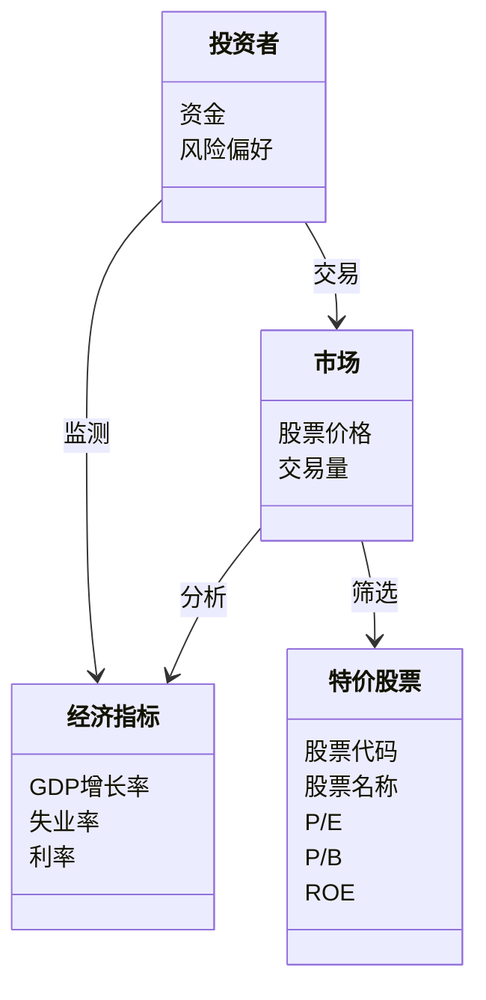
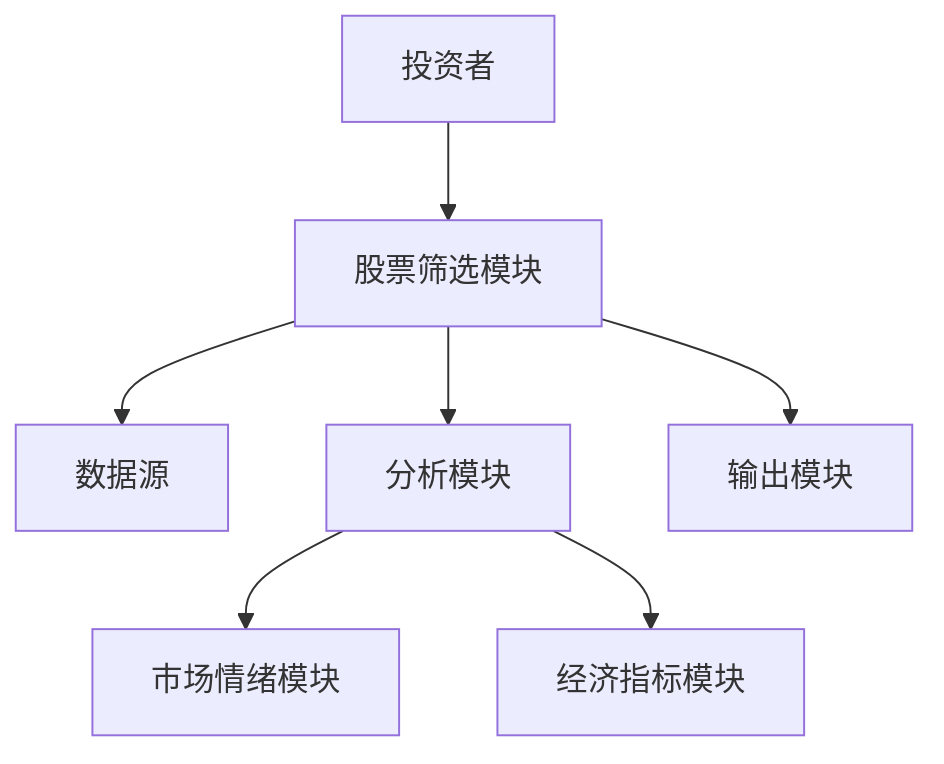
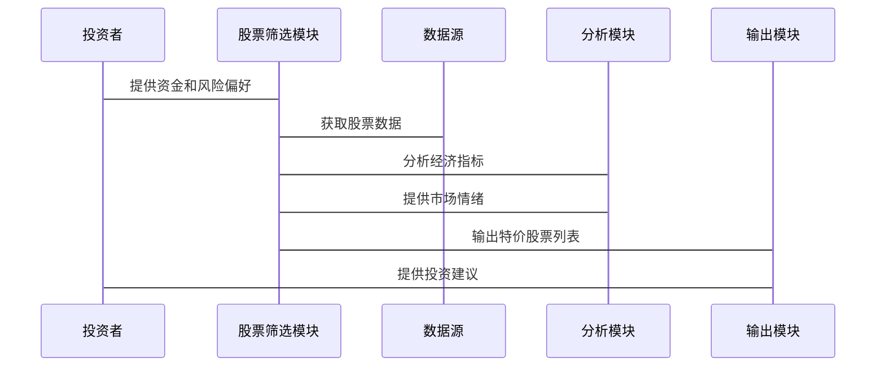

                 


# 如何利用特价股票策略应对经济衰退

> 关键词：特价股票策略，经济衰退，股票投资，风险管理，价值投资

> 摘要：经济衰退期间，股市通常会经历剧烈波动，投资者可以通过特价股票策略来寻找被低估的股票，从而在经济衰退中抓住投资机会。本文将详细分析特价股票策略的核心概念、算法原理、系统架构、项目实战及最佳实践，帮助投资者在经济衰退中有效应对市场波动，实现稳健投资。

---

## 第一部分：特价股票策略与经济衰退概述

### 第1章：特价股票策略的背景与概念

#### 1.1 经济衰退与股市的关系

经济衰退是指经济活动的显著下降，通常伴随着GDP增长放缓、失业率上升和消费者信心下降。在经济衰退期间，股市往往会出现大幅波动，许多股票价格会大幅下跌。然而，这种波动也为投资者提供了寻找廉价股票的机会。

##### 1.1.1 经济衰退的定义与特征

- **定义**：经济衰退是指国内生产总值（GDP）连续数个季度负增长，通常伴随着失业率上升和企业盈利下降。
- **特征**：
  - 经济增长放缓或停滞。
  - 失业率上升。
  - 消费者和企业信心下降。
  - 金融机构可能出现危机。

##### 1.1.2 经济衰退对股市的影响

- **股市表现**：
  - 股票价格大幅波动，可能出现大幅下跌。
  - 市场流动性下降，交易量减少。
  - 投资者情绪低落，市场恐慌加剧。

##### 1.1.3 特价股票在经济衰退中的机会

- **定义**：特价股票是指那些市场价格低于其内在价值的股票。
- **机会**：
  - 股价被市场过度抛售，提供了低价买入的机会。
  - 一些优质公司可能因为市场恐慌而被低估，长期来看具有较高的潜在回报。

#### 1.2 特价股票策略的定义与特点

##### 1.2.1 特价股票的定义

- **定义**：特价股票是指市场价格低于其内在价值的股票，通常表现为低市盈率（P/E）或低市净率（P/B）。

##### 1.2.2 特价股票的核心特点

| 特点 | 描述 |
|------|------|
| 低估值 | 市盈率和市净率低于行业平均水平。 |
| 高分红 | 部分特价股票公司会派发较高的股息。 |
| 强大的财务状况 | 公司财务健康，债务低，现金流稳定。 |

##### 1.2.3 特价股票与传统投资策略的区别

| 战略 | 描述 |
|------|------|
| 长期投资 | 投资者长期持有优质股票，不关注短期波动。 |
| 指数投资 | 投资者通过购买指数基金，分散投资风险。 |
| 特价股票策略 | 投资者寻找被低估的股票，利用市场恐慌进行投资。 |

#### 1.3 特价股票策略的适用场景

##### 1.3.1 经济衰退中的投资机会

- **市场恐慌**：投资者因经济衰退而恐慌抛售股票，导致股价被低估。
- **价值回归**：被低估的股票在经济复苏时可能迅速反弹，带来丰厚收益。

##### 1.3.2 特价股票策略的优势

- **低买高卖**：在经济衰退期间以低价买入，经济复苏时高价卖出。
- **风险分散**：选择多个行业的特价股票，降低行业风险。

##### 1.3.3 特价股票策略的潜在风险

- **市场进一步下跌**：经济衰退可能加深，股价可能继续下跌。
- **公司基本面恶化**：部分特价股票可能因公司业绩不佳而无法复苏。

---

## 第二部分：特价股票策略的核心概念与联系

### 第2章：特价股票策略的核心概念与联系

#### 2.1 特价股票策略的原理

##### 2.1.1 特价股票的识别方法

- **市盈率分析**：选择市盈率低于行业平均水平的股票。
- **市净率分析**：选择市净率低于行业平均水平的股票。
- **股息率分析**：选择股息率较高的股票。

##### 2.1.2 市场情绪与股票价格的关系

- **市场情绪**：投资者情绪波动会影响股票价格，市场恐慌时股价可能被低估。
- **情绪指标**：通过新闻、社交媒体和交易量分析市场情绪。

##### 2.1.3 经济指标对股票价格的影响

- **GDP增长率**：经济增长放缓可能导致股市下跌。
- **失业率**：失业率上升可能影响企业盈利和股价。
- **利率**：央行降息可能刺激股市上涨。

#### 2.2 特价股票策略的核心要素

##### 2.2.1 市盈率（P/E）分析

- **定义**：市盈率是股价与每股收益的比率，衡量股票的估值水平。
- **公式**：$$ P/E = \frac{\text{股价}}{\text{每股收益}} $$
- **应用**：选择P/E低于行业平均水平的股票。

##### 2.2.2 市净率（P/B）分析

- **定义**：市净率是股价与每股净资产的比率，衡量股票的资产价值。
- **公式**：$$ P/B = \frac{\text{股价}}{\text{每股净资产}} $$
- **应用**：选择P/B低于行业平均水平的股票。

##### 2.2.3 股东权益收益率（ROE）分析

- **定义**：ROE是净利润与股东权益的比率，衡量公司的盈利能力。
- **公式**：$$ ROE = \frac{\text{净利润}}{\text{股东权益}} $$
- **应用**：选择ROE高于行业平均水平的公司。

#### 2.3 特价股票策略的实体关系图


---

## 第三部分：特价股票策略的算法原理

### 第3章：特价股票策略的算法原理

#### 3.1 特价股票识别算法

##### 3.1.1 数据收集与预处理

- **数据来源**：股票价格、财务报表、经济指标。
- **数据预处理**：清洗数据，处理缺失值，标准化数据。

##### 3.1.2 市盈率与市净率计算

- **市盈率计算**：$$ P/E = \frac{\text{股价}}{\text{每股收益}} $$
- **市净率计算**：$$ P/B = \frac{\text{股价}}{\text{每股净资产}} $$

##### 3.1.3 特价股票筛选逻辑

- **筛选条件**：
  - P/E < 行业平均水平。
  - P/B < 行业平均水平。
  - ROE > 行业平均水平。

#### 3.2 市场情绪分析算法

##### 3.2.1 基于新闻的情感分析

- **工具**：使用自然语言处理（NLP）技术分析新闻情绪。
- **指标**：计算市场情绪指数（MSI）。

##### 3.2.2 基于社交媒体的情绪指标

- **数据来源**：社交媒体平台（如Twitter、Reddit）。
- **分析方法**：统计积极和消极情绪的比例。

##### 3.2.3 基于市场交易量的情绪判断

- **交易量分析**：高交易量可能表明市场情绪高涨或恐慌。

#### 3.3 经济指标预测算法

##### 3.3.1 经济指标数据收集

- **指标**：GDP增长率、失业率、利率等。

##### 3.3.2 经济指标趋势分析

- **方法**：使用时间序列分析预测未来趋势。

##### 3.3.3 经济衰退概率预测

- **模型**：基于经济指标构建衰退概率模型。

#### 3.4 特价股票策略的数学模型与公式

##### 3.4.1 经济衰退预测模型

$$ P(\text{经济衰退}) = f(\text{GDP增长率}, \text{失业率}, \text{利率}) $$

##### 3.4.2 特价股票筛选模型

$$ \text{筛选条件} = (P/E < \text{行业平均}) \land (P/B < \text{行业平均}) \land (ROE > \text{行业平均}) $$

---

## 第四部分：系统分析与架构设计方案

### 第4章：系统分析与架构设计方案

#### 4.1 问题场景介绍

- **场景描述**：经济衰退期间，投资者希望利用特价股票策略进行投资。
- **目标**：构建一个系统，帮助投资者识别特价股票，制定投资计划。

#### 4.2 系统功能设计

##### 4.2.1 领域模型



##### 4.2.2 系统架构设计



#### 4.3 系统接口设计

- **输入接口**：投资者资金、风险偏好、经济指标数据。
- **输出接口**：特价股票列表、投资建议、风险提示。

#### 4.4 系统交互流程图



---

## 第五部分：项目实战

### 第5章：项目实战

#### 5.1 环境安装

- **工具安装**：安装Python、Pandas、Matplotlib、Scikit-learn。
- **数据源**：获取股票数据、经济指标数据。

#### 5.2 核心代码实现

##### 5.2.1 数据收集与预处理

```python
import pandas as pd

# 获取股票数据
def get_stock_data(tickers):
    data = {}
    for ticker in tickers:
        df = pd.read_csv(f'data/{ticker}.csv')
        data[ticker] = df
    return data

# 数据清洗
def preprocess_data(data):
    processed_data = {}
    for ticker, df in data.items():
        df.dropna()
        processed_data[ticker] = df
    return processed_data
```

##### 5.2.2 特价股票筛选

```python
def screen_penny_stocks(data, threshold_pe=15, threshold_pb=2):
    screened_stocks = []
    for ticker, df in data.items():
        pe = df['PE'].mean()
        pb = df['PB'].mean()
        if pe < threshold_pe and pb < threshold_pb:
            screened_stocks.append(ticker)
    return screened_stocks
```

##### 5.2.3 经济指标预测

```python
from sklearn.linear_model import LinearRegression

def predict_recession_probability(economic_indicators):
    model = LinearRegression()
    model.fit(economic_indicators[['GDP增长率', '失业率']], economic_indicators['衰退概率'])
    return model.predict(economic_indicators[['GDP增长率', '失业率']])
```

#### 5.3 实际案例分析

##### 5.3.1 案例背景

假设在2008年全球金融危机期间，投资者希望通过特价股票策略进行投资。

##### 5.3.2 数据分析

- **股票数据**：选取金融、能源、科技行业的股票。
- **经济指标**：GDP增长率下降，失业率上升。

##### 5.3.3 特价股票筛选

- 筛选出市盈率和市净率低于行业平均水平的股票。
- 例如，某银行股票市盈率8，市净率1.5，ROE 12%。

##### 5.3.4 投资计划

- 买入该银行股票，持有至经济复苏。

#### 5.4 项目小结

- **成功经验**：及时识别特价股票，抓住市场反弹机会。
- **教训**：注意公司基本面，避免选择财务状况不佳的公司。

---

## 第六部分：最佳实践与总结

### 第6章：最佳实践

#### 6.1 最佳实践 tips

##### 6.1.1 风险管理

- **分散投资**：不要将所有资金投入到一只股票。
- **止损策略**：设定止损点，避免重大损失。

##### 6.1.2 长期投资

- **耐心持有**：经济复苏需要时间，避免频繁交易。
- **定期复投**：利用分红再投资，复利增长。

#### 6.2 小结

- **核心总结**：经济衰退期间，特价股票策略可以帮助投资者抓住市场低估机会。
- **注意事项**：注意市场风险，避免盲目跟风。

#### 6.3 注意事项

- **市场风险**：经济衰退可能加深，股价可能继续下跌。
- **公司风险**：部分特价股票公司可能因业绩不佳而无法复苏。

#### 6.4 拓展阅读

- **书籍**：《投资学精要》、《价值投资实战》。
- **网站**：金融数据分析平台、经济指标发布机构。

---

## 作者

作者：AI天才研究院/AI Genius Institute & 禅与计算机程序设计艺术/Zen And The Art of Computer Programming

---

以上是《如何利用特价股票策略应对经济衰退》的完整目录和内容框架，您可以根据需要进一步扩展每个部分的具体内容。

